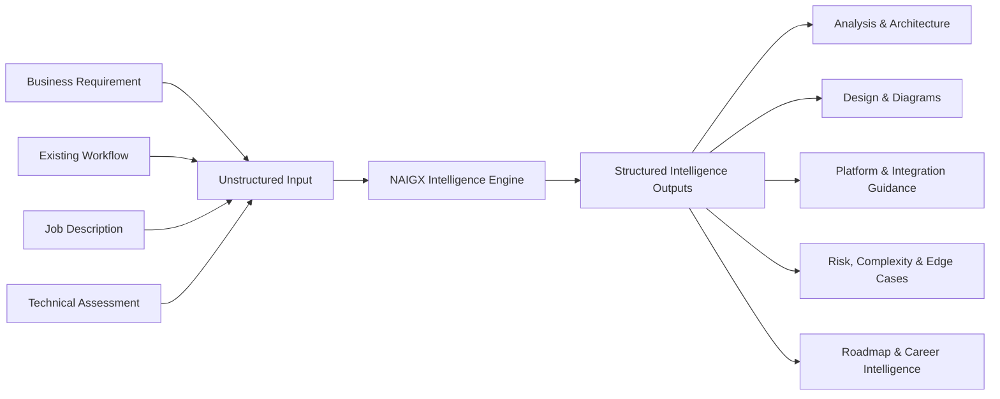

# NAIGX — Executive Summary

> **From Business Problem to Production-Ready Automation.**
> *Architect Smarter. Automate Better.*

| Field | Value |
|---|---|
| Product | NAIGX |
| Category | Automation Intelligence Platform, powered by artificial intelligence |
| Core engine | NAIGX Intelligence Engine (NIE) |
| Document type | Canonical Executive Summary |
| Status | Foundational — governs downstream product, engineering, AI, UX, and business decisions |
| Stage | Pre-launch, solo-built |
| Version | 1.1 |
| Last updated | 2026-08-11 |

---

## 1. Executive Summary

The automation tooling market solved execution. It did not solve reasoning.

Zapier, Make, n8n, and Power Automate have made it trivially cheap to *run* a workflow. They have made it no easier to *decide* what workflow should exist, which platform should host it, where it will break under load, what it costs to own, and how to defend the design to a stakeholder who is signing for it. That decision layer still lives in the heads of a small number of experienced automation architects, and it is the bottleneck: the expensive, slow, unevenly distributed part of every automation project.

NAIGX is an Automation Intelligence Platform that operates in that layer. It takes the unstructured artifacts practitioners actually receive — a business requirement, an inherited workflow export, a job description, a take-home assessment — and returns the structured architectural reasoning a senior practitioner would produce before touching a builder canvas: business analysis, an automation architecture, platform and integration recommendations, a risk register, a complexity score, edge cases, and an implementation roadmap.

Artificial intelligence is how this is delivered, not what is being sold. Models are an enabling technology inside the product, chosen and replaced on merit. The product is the intelligence itself — the discipline, the framework, and the reasoning quality that persist regardless of which model is running underneath.

NAIGX is not a workflow builder and does not intend to become one. It sits upstream of the builders and makes their output better. That positioning is deliberate: it converts every incumbent execution platform from a competitor into a distribution surface and an integration target.

The wedge is the individual practitioner. Automation engineers, consultants, and freelancers are the most under-tooled participants in this market — they are evaluated on architectural judgment they have no systematic way to practice, document, or prove. NAIGX serves them first with a workflow that also produces portfolio and interview artifacts, then follows those practitioners into the teams and organizations where automation governance becomes the buying trigger.

**Bottom line:** the value in automation is migrating from *building the workflow* to *knowing which workflow to build*. NAIGX is a direct claim on that layer.

---

## 2. Why the Name NAIGX

**NAIGX is a brand, not an acronym.** The letters do not stand for anything, and no expansion should be invented for them.

This is a deliberate choice. Descriptive names — the kind assembled from category words — anchor a company to the market it launched into. They read as explanatory in year one and as constraining in year five, when the product has grown past the phrase that named it. Stripe is not an acronym for payments infrastructure. Notion, Linear, Vercel, and Cursor carry no expansion either. In each case the name became a container that the product filled with meaning, and none of them had to be renamed when the product outgrew its original description.

NAIGX was created to work the same way: distinctive enough to be ownable, short enough to be memorable, and semantically empty enough to remain accurate as the product evolves from individual reasoning to team governance to estate-level analysis. A name that described today's feature set would need replacing at each of those transitions.

The objective is straightforward: **NAIGX should become synonymous with Automation Intelligence** — the term a practitioner reaches for when describing the discipline of reasoning about automation before building it. Brand value here accrues from what the name comes to represent, not from what its letters could be made to mean.

---

## 3. Product Vision

### The world NAIGX is building toward

**A world where the quality of an automation solution is determined by the clarity of the thinking behind it — not by who happened to be in the room.**

Architectural judgment in automation is currently apprenticed, not taught. It is acquired through years of failed integrations, misjudged rate limits, and workflows that worked in demo and collapsed in production. That transfer mechanism is slow, expensive, and does not scale to the number of people now being asked to automate things.

NAIGX exists to make that judgment legible, portable, and available on demand — so that a first-year consultant in Manila and a principal architect in Berlin produce work grounded in the same reasoning discipline, and so that the reasoning behind every automation is written down, reviewable, and defensible rather than trapped in someone's working memory.

---

## 4. Mission

**Turn ambiguous business inputs into rigorous, production-ready automation architecture — and make the reasoning behind every recommendation explicit.**

Three operating commitments follow from that mission and constrain how the product is built:

| Commitment | What it means in practice |
|---|---|
| **Reason before recommend** | Every output states the problem understood, the constraints assumed, and the trade-offs accepted. No unexplained recommendations. |
| **Intent over interface** | The system infers what the user needs from the input provided. Users are never asked to select a module, mode, or template as a precondition to getting value. |
| **Complement, never replace** | NAIGX produces designs that are implemented on existing platforms. It has no interest in owning execution, and never recommends a platform on the basis of self-interest. |

---

## 5. Problem Statement

### 5.1 The structural gap

Automation platforms are execution engines. They assume a solved design and are excellent at running it. The market has invested a decade of tooling into the last mile and almost nothing into the first one.

The result is a predictable failure pattern: automations that work in isolation, don't survive contact with real data volume, duplicate logic already running elsewhere, hard-code credentials, silently swallow errors, and cost more to maintain than the manual process they replaced. These are not implementation failures. They are design failures that surfaced during implementation.

### 5.2 Who feels it

| Constituency | The problem as they experience it |
|---|---|
| **Automation & AI engineers** | Requirements arrive ambiguous. Design happens ad hoc in the builder canvas. Rework is discovered late, when it is most expensive. |
| **Consultants & freelancers** | Scoping is guesswork, so pricing is guesswork. Discovery and architecture documentation are unbillable overhead that consume margin. |
| **Solution architects & technical leads** | No consistent standard for reviewing automation designs. Quality tracks the individual, not the team. Governance is retroactive. |
| **Businesses** | Requests are made in business language and received in technical language. Cost, risk, and maintenance burden are invisible until the invoice arrives. |
| **Job seekers** | Hiring for automation roles tests architectural judgment. Nothing available teaches or demonstrates it — portfolios show workflows that run, not decisions that were reasoned. |

### 5.3 Why the gap persists

- **Execution monetizes cleanly; reasoning does not — yet.** Task-based pricing is easy to meter, so vendor investment concentrated there.
- **Incumbents are structurally conflicted.** A platform cannot credibly advise that a workflow belongs on a competitor, or that it should not be built at all.
- **Design knowledge is unstructured.** It lives in blog posts, Discord threads, and individual experience, in a form no tool has been able to operationalize.
- **General-purpose AI is undisciplined here.** A generic model will produce a plausible-sounding architecture with no consistent framework, no risk register, no complexity assessment, and no memory of what it recommended last time. Plausible is not defensible.

---

## 6. Solution

### 6.1 What NAIGX does

NAIGX accepts an unstructured input and returns structured automation intelligence. The system classifies the input, infers intent, selects an appropriate reasoning path, and generates the outputs that path warrants — without asking the user to configure anything first.

### 6.2 The NAIGX Intelligence Engine (NIE)

The **NAIGX Intelligence Engine** is the product's reasoning core — the system responsible for everything that happens between an unstructured input and a defensible output.

| Responsibility | What it determines |
|---|---|
| **Input classification** | What kind of artifact was provided, and what it contains |
| **Intent detection** | What the user is actually trying to accomplish, including what they did not state |
| **Context understanding** | Constraints, environment, scale, and the boundary between stated fact and inference |
| **Architectural reasoning** | The design itself: structure, trade-offs, failure modes, cost of ownership |
| **Recommendation generation** | Platform, integration, and implementation guidance, with the criteria behind each |
| **Response orchestration** | Which outputs the input warrants, at what depth, in what form |

**The NIE is model-agnostic by design.** It is a reasoning framework — classification logic, architectural discipline, evaluation criteria, and output structure — not a wrapper around a specific vendor's model. Language models are a substrate the engine runs on and are selected, combined, and replaced on capability and economics alone. This matters commercially as well as technically: a product whose differentiation is inherited from a single model provider has no differentiation of its own, and no protection when that provider's pricing, availability, or terms change. What NAIGX owns is the discipline applied on top.

### 6.3 Input → intelligence mapping

| Input | Primary question answered | Representative outputs |
|---|---|---|
| **Business requirement** | What should be built, on what, and at what cost of ownership? | Business analysis, automation architecture, workflow design, platform recommendation, complexity score, implementation roadmap |
| **Existing workflow** | Is this design sound, and where will it fail? | Architecture review, risk analysis, edge cases, optimization recommendations, best-practice gaps |
| **Job description** | What does this role actually require, and what am I missing? | Skill gap analysis, portfolio recommendations, interview guidance, required-tooling breakdown |
| **Technical assessment** | How would a senior architect approach this, and why? | Solution architecture, reasoned trade-off analysis, Mermaid diagram, implementation notes |

### 6.4 Output catalogue

Executive summary · business analysis · automation architecture · workflow design · Mermaid diagram · platform recommendation · API recommendations · required integrations · risk analysis · complexity score · best practices · edge cases · implementation roadmap · skill gap analysis · portfolio recommendations · interview guidance.

Outputs are generated selectively, based on what the input and inferred intent justify. A three-step notification workflow does not warrant a fifteen-section architecture document, and producing one would be a defect, not thoroughness.

### 6.5 The design principle that governs everything

**The user brings a problem. The system determines the method.**

Module pickers, mode toggles, and template galleries all push classification work onto the user — work the user is paying the product to do, and frequently work the user cannot do correctly because getting it right requires the expertise they came for. Every interface decision in NAIGX is measured against this: does it ask the user to think like the system, or does the system think like the user?

---

## 7. Target Users

| Segment | Job to be done | Why NAIGX wins them |
|---|---|---|
| **Automation engineers** | Design correctly before building | Catches architectural error at the cheapest possible moment |
| **AI engineers** | Ground AI features in workflow reality | Integration, orchestration, and failure-mode reasoning around AI components |
| **Automation consultants** | Scope, price, and justify engagements | Turns unbillable discovery into fast, defensible client-ready deliverables |
| **Freelancers** | Compete above their apparent seniority | Senior-grade architectural output without senior-grade experience |
| **Businesses** | Understand what they are commissioning | Cost, risk, and complexity translated into business language |
| **Solution architects** | Enforce consistent design standards | A shared, reviewable reasoning framework across a team |
| **Job seekers** | Prove architectural judgment | Skill gap analysis, portfolio direction, and interview preparation from real postings |
| **Technical leads** | Govern automation sprawl | Structured review of designs before they enter production |

**Sequencing.** Individual practitioners — engineers, consultants, freelancers, job seekers — are the entry wedge: they feel the pain daily, buy without procurement, and produce visible artifacts that market the product. Teams and organizations are the expansion motion, triggered by the governance problem that emerges once automation footprint outgrows individual oversight.

---

## 8. Value Proposition

**NAIGX gives every practitioner the architectural judgment of a senior automation architect — before a single node is built.**

| Dimension | Without NAIGX | With NAIGX |
|---|---|---|
| **Design** | Improvised inside the builder | Reasoned, documented, reviewable up front |
| **Platform choice** | Habit, familiarity, or vendor influence | Assessed against actual requirements and constraints |
| **Risk** | Discovered in production | Surfaced and registered before build |
| **Scoping** | Estimated by feel | Complexity-scored with an explicit basis |
| **Documentation** | Written afterward, if ever | A by-product of the design process |
| **Expertise** | Bottlenecked on individuals | Available on demand, applied consistently |
| **Career proof** | Workflows that run | Reasoning that can be defended in an interview |

### Value by constituency

- **For practitioners:** compress design time from days to minutes and ship architecture you can defend under review.
- **For consultants:** convert discovery overhead into billable, client-ready deliverables and price from complexity rather than instinct.
- **For businesses:** see cost, risk, and maintenance burden before committing budget.
- **For teams:** replace individual habit with a consistent, auditable design standard.
- **For job seekers:** turn public job postings into a targeted skill and portfolio plan.

---

## 9. Competitive Positioning

### 9.1 The core distinction

Execution platforms answer **"how do I run this?"** NAIGX answers **"what should exist, why this way, on what, and what breaks?"**

These are different products serving different moments in the same lifecycle. NAIGX is upstream. The output of NAIGX is the input to n8n, Make, Zapier, Power Automate, or Node-RED.

### 9.2 Landscape

| Category | Examples | Their job | NAIGX's relationship |
|---|---|---|---|
| **Workflow execution platforms** | n8n, Make, Zapier, Power Automate, Node-RED | Run automations reliably | **Complementary.** NAIGX recommends and designs *for* them; they execute what it designs. |
| **In-platform AI builders** | Native copilots and prompt-to-workflow features | Accelerate building on their own canvas | **Structurally conflicted.** Cannot recommend a competitor, cannot recommend not building, cannot reason across a multi-platform estate. |
| **iPaaS / enterprise integration** | Workato, Tray, MuleSoft | Enterprise-grade integration delivery | **Different buyer, different price point.** NAIGX serves practitioners and mid-market teams the enterprise motion does not reach. |
| **General-purpose AI assistants** | Undifferentiated chat models | Answer anything | **The real substitute today.** Beaten on consistency, framework discipline, structured output, and domain rigor — not on raw model capability. |
| **Consultants & agencies** | Human expertise | Deliver bespoke architecture | **Augmented, not displaced.** NAIGX compresses their discovery and documentation cost. |

### 9.3 Defensibility

Platform neutrality is the structural moat. NAIGX can say *"this belongs on n8n, not Zapier"* — or *"this should not be automated at all"* — and no incumbent copilot can ever make that statement credibly. That is not a feature to be copied; it is a consequence of business model, and it is durable for exactly as long as NAIGX stays out of the execution business.

Reinforcing this over time: the NIE's accumulating corpus of architectural patterns, failure modes, and platform-specific constraints derived from real inputs; a reasoning framework applied consistently rather than improvised per query; and reference designs that hold their shape as platform APIs and pricing shift underneath them. Because the engine is model-agnostic, each advance in underlying model capability compounds the product rather than obsoleting it.

### 9.4 Honest risks

| Risk | Assessment |
|---|---|
| Incumbents extend upstream into design intelligence | Likely in narrow, single-platform form. Neutrality remains uncopyable while they sell execution. |
| General-purpose AI closes the quality gap | The durable differentiator is framework discipline, structured output, and domain depth — not model capability. |
| Buyers undervalue design relative to execution | Real. Mitigated by attaching intelligence to outcomes that are already paid for: scoping, pricing, review, hiring. |
| Model vendor dependency | Mitigated by design: the NIE is a reasoning framework, not a model wrapper, and models are substitutable. |
| Single-operator execution capacity | Real and acknowledged. Scope discipline is a survival constraint, not a preference. |

---

## 10. Long-Term Vision

**To become the reasoning layer of the automation industry** — the system organizations rely on to design, review, and explain automation, independent of where it ultimately runs.

| Horizon | Objective |
|---|---|
| **Near** | Establish credibility with individual practitioners. Prove that generated architecture survives contact with production. |
| **Mid** | Extend from individual reasoning to team governance: shared standards, design review, portfolio-level visibility across an automation estate. |
| **Long** | Become the neutral intelligence layer above all execution platforms — the place where automation decisions are made, recorded, and defended, whatever runs them. |

The strategic bet: execution is commoditizing. Platforms converge on features, undercut each other on price, and become interchangeable. Judgment does not commoditize. The layer that decides *what to build and why* accrues value as the layer below it becomes cheap — and staying out of the execution business is what makes NAIGX credible in the layer that matters.

---

## 11. Why NAIGX Exists

Because the hard part was never the building.

Anyone can connect two applications. The difficulty has always been knowing which connection matters, which platform will still be appropriate at ten times the volume, which failure mode will surface at 3 a.m., which requirement the stakeholder stated and which one they actually meant, and when the correct architectural answer is *don't automate this*.

That knowledge exists. It is held by a small number of people, transferred slowly through apprenticeship, and distributed by accident of employment. Meanwhile the number of people expected to automate things grows every quarter, and the tools they are handed assume a competence nobody offered to teach them.

NAIGX exists to close that distance — to make architectural reasoning something a practitioner can access, apply, and learn from on the first project rather than the hundredth. Every recommendation the system produces states its reasoning, so that using NAIGX makes the user better, not merely faster.

**The industry automated the work. NAIGX automates the thinking that should have preceded it.**

---

## Appendix A — Document Provenance & Scope

This document is aspirational and directional. It describes intended positioning, architecture, and strategy for a product currently in pre-launch development, built by a single operator.

Deliberately absent, because they do not yet exist: customers, revenue, funding, traction metrics, team, and production operations. Any future version of this document that introduces such claims must cite verifiable sources.

Two open items to resolve before this document is treated as final and circulated externally:

1. **Positioning continuity.** This framing narrows NAIGX from a broader "AI operating system for business" concept to a focused automation intelligence layer. The narrowing is strategically correct for a solo build, but earlier project documentation should be reconciled to it rather than left contradictory.
2. **Evidence linkage.** Under the project's own evidence standard, the demand claims in §5 should be traced to sourced market signals — with validation status marked — before this document is shared with hiring managers or prospective contributors.

---

## Appendix B — Version History

| Version | Date | Changes |
|---|---|---|
| 1.0 | 2026-08-11 | Initial canonical Executive Summary |
| 1.1 | 2026-08-11 | NAIGX established as a standalone brand; all acronym expansion removed and §2 "Why the Name NAIGX" added. Category restated as *Automation Intelligence Platform, powered by artificial intelligence*, placing AI as enabling technology rather than product. Reasoning core formally named the **NAIGX Intelligence Engine (NIE)** with defined responsibilities and an explicit model-agnostic commitment; model vendor dependency added to §9.4 risks. Node-RED added to the competitive landscape. All other positioning, structure, and content preserved from v1.0. |
