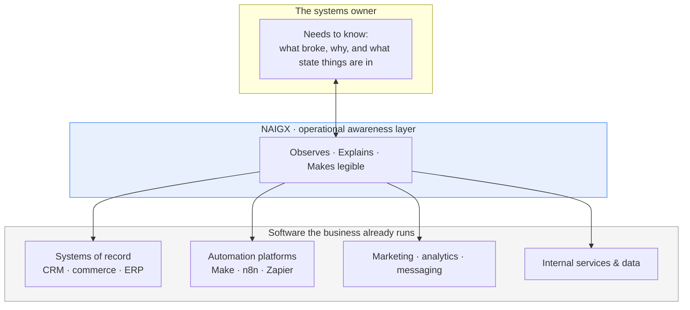
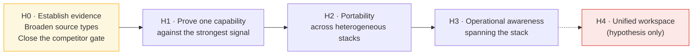

# Product Vision

**File:** `docs/Product-Vision.md`
**Status:** Living Document — Vision, not specification
**Evidence Base:** `research/00-Market-Discovery.md` · `research/01-Job-Description-Matrix.md` (`JD-001`→`JD-005`) · `research/06-Market-Insights.md`
**Last Updated:** 2026-08-09

> This document defines what NAIGX is for and where it is going. It deliberately contains no features, no architecture, and no implementation detail. Those belong in design documents downstream.
>
> Every claim below is traceable to the research corpus. Where the vision runs ahead of the evidence, that is stated rather than concealed.

---

## ⚠️ Stage and Evidence Honesty

NAIGX is a **market-driven portfolio project built by a solo developer**. It has no customers, no investors, no teams, and no production deployment. Nothing in this document should be read as describing a company that exists.

The evidence base is likewise early. Per `06-Market-Insights.md`, the corpus is **five job postings from a single source type**, which caps every finding at 🟡 *Emerging Signal* under the project's own validation threshold. No insight informing this vision is yet 🟢 *Validated*.

This vision is therefore **a direction argued from early evidence, not a plan justified by proven demand.** It is expected to change. The parts most likely to change are marked.

---

## What Is NAIGX?

**NAIGX is an AI operating system for business: a layer that observes the software a company already runs, explains what is happening across it, and supports the people responsible for keeping it working.**

The word *operating system* is used in its original sense — not an application, but the layer beneath applications that manages resources, surfaces state, and coordinates work. NAIGX does not aim to be another place where work happens. It aims to be the layer that makes the work already happening across many tools legible and reliable.

Three clarifications, each grounded in the research:

| NAIGX is | NAIGX is not | Evidence |
|---|---|---|
| A layer **over** existing business software | A replacement for it | Every corpus record centers a system of record the company intends to keep (`JD-001` HubSpot, `JD-003` HubSpot, `JD-004` event infrastructure, `JD-005` Shopify) |
| An **explanatory** intelligence | An autonomous actor | Zero of five records request autonomous AI decision-making; every stated AI use case terminates in human review (`06-Market-Insights.md`, Trend 2) |
| **Portable** across heterogeneous stacks | A deep single-vendor product | 30+ distinct products across five postings; only one appears in a majority (`06-Market-Insights.md`, Software section) |

---

## Why Does NAIGX Exist?

There are two honest answers, and both belong here.

### The market reason

The research corpus describes a specific, repeated failure in how companies run their software.

Five postings across five industries — B2B SaaS, aviation logistics, a fitness/wellness agency, fintech, and e-commerce — describe five different job titles with almost no overlapping tools. They describe the same job: **one person, made responsible for the connections between systems that were never designed to work together, and then for keeping those connections alive.**

Three findings drive the existence of this product:

1. **Integration ownership is what companies are actually buying** (5/5 records). The work is moving data correctly between systems, not building software.
2. **The expensive part is operating integrations, not building them** (4/5 records). Two postings promote failure handling out of the responsibilities list and into *hiring selection criteria* — `JD-001` names "can debug a broken automation without panicking" as a qualification; `JD-005` makes "how they handled API errors or scaling issues" an evaluation criterion. Companies believe this specific capability is the scarce one.
3. **This discipline is unowned in every organization observed** (5/5 records). The language is uniformly foundational — "build the backbone," "primary point of contact," "lead and scale," "can they both design and implement?" None of these companies is replacing someone.

The gap NAIGX addresses is the space between *connected* and *reliable*. These companies already connected their tools. What they cannot do is tell when those connections break, why, or what state their operations are actually in.

### The project reason

NAIGX is also a demonstration. It exists to show, in public and end-to-end, that a product can be designed from documented market evidence rather than from intuition — that a feature can be traced backward through a hypothesis, an automation opportunity, a business problem, and finally to a specific line in a specific job posting.

That discipline is the point as much as the product. A reader should be able to pick any capability NAIGX eventually builds and follow it back to the evidence that justified it. Where the trail is missing, the capability should not exist.

---

## Who Is It Built For?

### Primary user — the systems owner

The person present in all five corpus records: solely accountable for how an organization's software fits together, working without a team, in an organization that has never had this role before.

Their defining characteristics, drawn from the evidence:

| Characteristic | Evidence |
|---|---|
| Technically literate but **not primarily a programmer** | Scripting is *preferred* while API/webhook/JSON literacy is *required* in `JD-002`, `JD-003`, `JD-005` |
| Works across many unfamiliar systems | 30+ distinct tools across the corpus; `JD-003` and `JD-005` face a rotating set of client CRMs |
| Diagnoses more than they build | 5/5 records require troubleshooting; 4/5 pair "build" with "maintain" |
| Operates autonomously and remotely | 4/5 require independent ownership; 5/5 are remote |
| Is the only person who understands the system | Documentation named as standing work in `JD-001`, `JD-002`, `JD-005` — key-person dependency is explicit |

**Design consequence:** a capability that requires writing code to use would exclude the majority of this corpus. NAIGX is built for someone who reads payloads and reasons about system behavior, not someone who ships software.

### Secondary user — the operations leader

Present in 4/5 records as the person waiting on information. `JD-001` states that reporting requires waiting on a data team; `JD-003` requires regular project updates; `JD-005` requires closed-loop reporting that currently does not exist. This user does not operate NAIGX daily; they consume what it makes visible.

### Observed but not targeted

| Group | Records | Why not primary |
|---|---|---|
| Software engineers | `JD-004` only (1/5) | Well-served by existing engineering tooling; `JD-004` already names Cursor and MCP for this |
| Agencies managing many client stacks | `JD-003` `JD-005` (2/5) | 🔴 at current sample. A promising candidate segment, not yet a supported one — see *Open Questions* |

---

## What Business Problem Does It Solve?

**Companies cannot see the operational state of the systems they depend on, and cannot explain those systems' failures without the one person who built them.**

Decomposed into the problems the corpus actually documents, ranked by frequency:

| Problem | Frequency | Level |
|---|---|---|
| Systems fail without the failure being detected, diagnosed, or explained quickly | 5/5 broad · 4/5 for workflow-specific failures | 🟡 |
| Data does not move correctly between systems, and the work is unowned | 5/5 | 🟡 |
| Operational visibility requires manual assembly | 4/5 | 🟡 |
| Systems are undocumented, creating key-person dependency | 3/5 | 🟡 |
| Data quality degrades at the point of entry | 3/5 | 🟡 |

The unifying description: **these organizations have operational systems they cannot read.** NAIGX exists to make them readable — and, because reading them is currently a scarce human skill, to make that reading available without the scarce human.

---

## What Problems Will NAIGX *Not* Solve?

Scope discipline is a product decision, and each exclusion below is argued from evidence rather than preference.

| Excluded | Why | Evidence |
|---|---|---|
| **Replacing systems of record** (CRM, e-commerce, ERP) | Every record intends to keep its core systems. Displacement contradicts the mission and the market. | 5/5 records center a retained system of record |
| **Becoming another automation platform** | 2/5 records already run Make, n8n, or Zapier and are hiring to *maintain* them, not replace them. Competing here enters a crowded category against incumbents named throughout the corpus. | `JD-003`, `JD-005` |
| **Acting autonomously on production systems** | No record in the corpus asks for it. Every AI use case ends in human review. Autonomy would be ahead of 100% of current evidence. | 0/5 records |
| **Authoring code / IDE assistance** | Requested by one record only, which already names dedicated tooling for it. | `JD-004` (1/5) |
| **Attribution and identity resolution as a core product** | Appears in 2/5 records (🔴) and is genuinely hard. `06-Market-Insights.md` Pattern D flags it as error-prone. Not a foundation to build on at this evidence level. | `JD-001`, `JD-005` |
| **Deep feature parity with any single vendor** | Stack fragmentation makes vendor depth low-leverage: a HubSpot-specific capability serves at most 3/5 of the corpus; a portable one serves 5/5. | `06-Market-Insights.md`, Recommendation 2 |
| **Judgment work** — architecture decisions, platform selection, defining quality standards or segmentation strategy | The matrix classifies these as *not automatable* wherever they appear. They are what the human is for. | `JD-004`, `JD-005` automation opportunity tables |
| **Consulting, staffing, or managed services** | The corpus documents a hiring demand. Meeting it with labor rather than product is a different business. | Structural |

---

## Product Mission

> **Make the operational systems a business already runs legible, reliable, and explainable — without requiring the person who built them.**

### How the mission maps to current evidence

The canonical mission statement for NAIGX is to unify business software, AI, and automation into a single intelligent workspace. Assessed honestly against the corpus, its components are not equally supported:

| Mission component | Evidence support | Status |
|---|---|---|
| Operational visibility | Strong — failure diagnosis 5/5, reporting 4/5 | 🟡 Supported |
| AI-powered insight | Strong **as explanation**; zero support as autonomous decision | 🟡 Supported, scope-constrained |
| Decision support (human retains authority) | Strong — every AI use case terminates in human review | 🟡 Supported |
| Workflow automation | Partial — 4/5 already own automation platforms and want them *operated*, not replaced | 🟡 Supported only as operation, not construction |
| **A single intelligent workspace** | **None — no record in the corpus asks for a unified workspace** | 🔴 Ahead of evidence |

That last row is the most important line in this document. The "single workspace" framing is currently an assumption, not a finding. It is retained as a long-term hypothesis and explicitly marked as untested. If corpus growth continues to produce no demand for consolidation, this part of the mission should be revised rather than defended.

---

## Product Vision

> **A business should be able to ask what is happening across its software and receive a true, complete, and comprehensible answer — regardless of how many systems that answer spans, and without depending on the one person who knows.**

Today, that answer exists only inside a single person's head. The corpus shows five organizations paying salaries to keep it there, and three of them naming documentation as standing work precisely because they know how fragile that is.

The long-term vision is that operational understanding becomes a property of the organization rather than of an individual — durable, queryable, and available to the people who need to act on it.

---

## Core Principles

These govern how NAIGX is built and what it refuses to become.

**1. Evidence before capability.**
No capability exists without a documented trail to a market problem. A capability that cannot be traced is an assumption, and assumptions are not built. *(Inherited from `00-Market-Discovery.md`.)*

**2. Claims must be falsifiable.**
Every hypothesis is stated so it can be shown wrong. A claim that cannot fail is not a claim.

**3. Connect, never replace.**
NAIGX adds a layer; it does not displace systems of record or automation platforms. Displacement is both off-mission and unsupported by the corpus.

**4. Explain before acting.**
Explanation is the deliverable. Action, where it eventually appears, is a separate capability requiring separate evidence — of which there is currently none.

**5. The human retains authority.**
NAIGX informs decisions; the operator makes them. This is not caution for its own sake — it is what 5/5 records describe.

**6. Portability over vendor depth.**
Capabilities should work across heterogeneous stacks. Vendor-specific depth requires explicit justification against the fragmentation evidence.

**7. Legibility is the product.**
A system that works but cannot be understood is only temporarily working. The corpus is full of organizations discovering this.

**8. State limitations plainly.**
Confidence levels, evidence gaps, and known failure modes belong in the product and its documentation, not only in research files. A tool that explains systems must be honest about its own.

---

## Design Philosophy

Philosophy, not interface. These shape decisions without specifying solutions.

**Design for the person who is the only one who knows.**
The primary user is unsupported by definition — no team, no predecessor, often no documentation. Assume no institutional knowledge is available to them.

**Optimize for time-to-understanding, not time-to-build.**
The corpus values diagnosis over construction (4/5 pair "maintain" with "build"; 2/5 make failure handling a hiring criterion). The metric that matters is how quickly someone understands what happened.

**Treat failure as the primary event worth designing around.**
Most tools design for the working case and treat failure as an exception. The evidence inverts this: failure handling is what companies are hiring for. Failure is the normal case in a heterogeneous stack.

**Assume the stack is fragmented, partially undocumented, and unfamiliar.**
This is the normal condition across all five records, not a degraded one. NAIGX should be useful on first contact with a system it has never seen.

**Be useful with partial access.**
Real environments grant incomplete permissions and expose incomplete data. Usefulness should degrade gracefully rather than requiring complete access to function at all.

**Documentation is a by-product, not a task.**
Three records name documentation as standing work; none hires *for* it. It is a burden attached to another job, and should be produced as a consequence of understanding rather than as separate labor.

**Trust is earned through correctness of explanation.**
For a product whose output is an explanation, a confident wrong answer is worse than no answer. This is sharpest in high-consequence domains — `JD-004` operates on financial systems where a missed defect moves money incorrectly.

---

## Target Users

| Tier | User | Presence in corpus | Relationship to NAIGX |
|---|---|---|---|
| **Primary** | The systems owner — sole accountable operator of an organization's integrated software | 5/5 | Daily operator; the person NAIGX is designed around |
| **Secondary** | The operations or engineering leader who needs visibility | 4/5 | Consumes what NAIGX makes visible; does not operate it |
| **Candidate** | Agencies and intermediaries maintaining many client stacks | 2/5 (🔴) | Highest-multiplier user if validated; unconfirmed |
| **Non-target** | Software engineers seeking development tooling | 1/5 | Adjacent and well-served elsewhere |

Roles observed carrying the primary user's work, all describing the same underlying job: Marketing Automation Lead (`JD-001`), AI Automation Engineer (`JD-002`), Senior Digital & Automations Developer (`JD-003`), Senior QA Automation Engineer (`JD-004`), Automation & Systems Integration Specialist (`JD-005`).

---

## Product Positioning

**NAIGX is not another place to build integrations. It is the layer that tells you what your integrations are doing.**

*Conceptual positioning only — not an architecture.*

Positioned relative to adjacent categories:

| Category | Their focus | NAIGX's distinction |
|---|---|---|
| Automation platforms (Make, n8n, Zapier) | Building and running workflows | NAIGX explains what those workflows are doing. Complementary — the corpus shows companies keeping these tools. |
| Engineering observability | Application and infrastructure health, for engineers | NAIGX is operator-facing, for the technically-literate non-programmer that 3/5 records describe |
| Business intelligence | Reporting on business data | NAIGX reports on the operational systems themselves — the plumbing, not the output |
| Systems of record | Owning the data | NAIGX owns none of it and does not seek to |

---

## Competitive Advantage

> ⚠️ **This section is a statement of intended differentiation, not a validated claim.**
> `research/05-Competitor-Research.md` is currently empty. Under the gates defined in `00-Market-Discovery.md`, no opportunity may advance until the competitive map confirms the problem is not already well-solved. **That gate is open.** Existing automation platforms ship execution history and error-handling primitives; the corpus proves companies pay salaries for this work, but not that existing tooling fails at it.

Four intended advantages, each with its dependency stated:

**1. Evidence traceability as a product discipline.**
Every capability traces to a specific record in the corpus. This is the one advantage that is *verifiable today* — it is a property of how the project is run rather than a claim about the market. It is also the hardest for a conventionally-built competitor to retrofit.

**2. Portability across fragmented stacks.**
Grounded in the corpus's clearest structural fact: 30+ products, one majority tool. *Depends on:* portable capability proving as useful as vendor-deep capability, which is untested.

**3. Operator-facing rather than engineer-facing.**
Grounded in 3/5 records requiring API literacy while listing scripting as merely preferred. *Depends on:* that ratio holding as the corpus grows past n=5.

**4. Explanation over action.**
Grounded in 0/5 records requesting autonomy. *Depends on:* this remaining true. If demand for autonomous action appears in future records, this is a limitation rather than an advantage — and should be reclassified without defensiveness.

---

## Long-Term Direction

Direction is expressed as evidence-gated horizons, not a roadmap. Each horizon has an entry condition; a horizon is not entered because the previous one finished, but because its evidence exists.

| Horizon | Direction | Entry condition |
|---|---|---|
| **H0 — Establish the evidence** | Broaden beyond a single source type; close the competitive gate | Current position. Blocking everything downstream |
| **H1 — Prove one capability** | Demonstrate operational explanation against the corpus's strongest signal (system failure diagnosis, 4–5/5) | An insight reaching 🟢 Validated, and competitor research confirming the problem is not well-solved |
| **H2 — Portability** | Prove the same capability holds across unrelated stacks rather than one vendor | H1 capability demonstrably working on a second, structurally different platform |
| **H3 — Operational awareness** | Extend from explaining failures to describing operational state across the stack | Evidence that visibility demand (currently 4/5, 🟡) survives at larger sample sizes |
| **H4 — Unified workspace** | The consolidated intelligent workspace named in the canonical mission | ⚠️ **No supporting evidence exists.** Requires demand for consolidation to appear in the corpus. Until then this remains a hypothesis, and the mission statement should be revised if it never appears |

**On sequencing:** the research proposes candidate deliverables and a build order in `06-Market-Insights.md`. Those belong to research and design, not to this document. What belongs here is the constraint: **no horizon is entered on schedule; each is entered on evidence.**

---

## Success Metrics

NAIGX has no customers, no revenue, and no production usage. Metrics that presuppose them are excluded — measuring them would require inventing them.

### Evidence quality — is the foundation sound?

| Metric | Current | Target |
|---|---|---|
| Corpus size | 5 records | 20+ (the matrix's own threshold for ranking to exceed noise) |
| Source types represented | 1 | 2+ (required for any 🟢 Validated Insight) |
| Insights at 🟢 Validated | 0 | ≥1 before any build commitment |
| Records with a verifiable employer | 1/5 | Majority — currently blocks the independence principle entirely |
| Competitive map coverage for active opportunities | 0% | 100% before H1 |

### Product discipline — is the philosophy being honored?

| Metric | Definition |
|---|---|
| Feature traceability | % of capabilities linking to a validated insight. Target: 100% |
| Backward legibility | Can an unfamiliar reader trace any capability to the market problem it solves? |
| **Rejection rate** | Number of candidate capabilities *stopped* by competitor research or missing evidence. A rate of zero means the gates are decorative |
| Revision honesty | Instances where a vision claim was revised because evidence contradicted it — including this document |

### Capability quality — does it work, measured without users?

| Metric | Definition |
|---|---|
| Explanation correctness | Accuracy of diagnosis against deliberately seeded failures. The primary quality bar, since a confident wrong explanation is worse than none |
| Portability | Whether a capability holds on a second, unrelated stack without redesign |
| Graceful degradation | Whether usefulness survives partial access and incomplete data |

### Explicitly not measured at this stage

Revenue, user counts, retention, engagement, NPS, market share. No customers exist; reporting these would be fabrication.

---

## Guiding Principles for Future Features

Every proposed capability must answer these before work begins. A proposal that cannot is not ready — regardless of how good the idea is.

**1. What evidence does this trace to?**
Name the records. If none, it is not built.

**2. What validation level is the originating insight?**
Below 🟢, it may be prototyped, but it may not be committed to as product direction.

**3. Has the competitive map been checked?**
If the problem is already well-solved by tools the user runs, the correct decision is not to build. `00-Market-Discovery.md` treats this gate preventing builds as evidence the process is honest.

**4. Does it require the user to write code?**
If yes, justify it against the evidence that 3/5 records treat scripting as optional.

**5. Does it act autonomously?**
If yes, it is ahead of 100% of current evidence and needs its own justification.

**6. Is it portable, or vendor-locked?**
Vendor-locked capabilities serve at most a minority of the observed market and require explicit argument.

**7. Does it replace something the user already runs?**
If yes, it contradicts both the mission and the corpus.

**8. Is it falsifiable?**
State the hypothesis so it can fail. Then state what failure would look like.

**9. What happens when the data is partial or wrong?**
In a fragmented stack this is the normal case. A capability without an answer here is unfinished.

---

## Open Questions

Recorded so they are tested rather than assumed. Each would change this vision if answered unfavorably.

| # | Question | Why it matters |
|---|---|---|
| 1 | Is the "single intelligent workspace" framing supported by anything? | Currently 0/5. If it never appears, the canonical mission statement needs revision |
| 2 | Is operational failure diagnosis already well-solved by existing platforms? | Would invalidate the leading opportunity. Cheapest and most urgent test available |
| 3 | Is the agency/intermediary segment real, or an artifact of two similar postings? | Would be the highest-multiplier user segment if confirmed (`JD-003`, `JD-005`) |
| 4 | Does the operator-not-programmer ratio hold beyond n=5? | Design philosophy and target user both depend on it |
| 5 | Does demand for autonomous action appear as the corpus grows? | Would reclassify "explanation over action" from advantage to limitation |
| 6 | Are the corpus's five employers genuinely independent? | Four of five are anonymous; undetected overlap would inflate every frequency in this document |

---

## Guiding Principle

NAIGX is not built to showcase technology.

It is built because five organizations, in five unrelated industries, independently described the same unmet need: someone who can tell them what their systems are doing and why they stopped.

If a capability cannot be connected back to that kind of evidence, it should not be built — however interesting it would be to build.

---

*This is a living document. It will be revised as the corpus grows, as source types broaden, and as claims here are contradicted. Revisions driven by contrary evidence are a success condition of this project, not a failure of it.*
