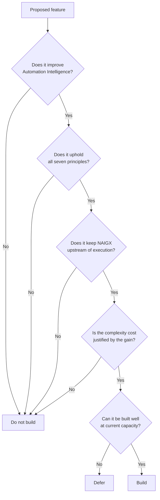

# NAIGX — Product Vision

**The constitutional document of the product.**

| Field | Value |
|---|---|
| Product | NAIGX |
| Category | Automation Intelligence Platform, powered by artificial intelligence |
| Core engine | NAIGX Intelligence Engine (NIE) |
| Document type | Product Vision (canonical) |
| Source of truth | NAIGX Executive Summary v1.1 (approved) |
| Governs | All product, engineering, AI, UX, design, and business decisions |
| Version | 1.1 |
| Last updated | 2026-08-11 |

---

## How to read this document

The Executive Summary establishes *what NAIGX is, what market it serves, and why that market exists*. It is the external argument.

This document answers a different question: **why is NAIGX built the way it is?** It is the internal argument — the reasoning behind the constraints, the boundaries drawn deliberately, and the commitments that must survive contact with growth pressure, competitor moves, and revenue temptation.

Three rules govern it:

1. **It is binding.** A feature that violates a principle here does not ship, regardless of demand, competitive parity, or demo quality.
2. **It is amendable, not ignorable.** If a principle proves wrong, amend it in writing, with the evidence, in Appendix A. Silently routing around a principle is the specific failure this document exists to prevent.
3. **It settles disputes.** When a decision is contested, the argument is resolved by reference to these principles — not by seniority, recency, or volume.

A note on durability: this document is written to be read in five years by someone who joined last week. It contains no roadmap, no metrics, no feature commitments, and no implementation. Those change. What follows should not.

---

## 1. The Belief System

Six beliefs sit beneath everything else. Every principle in §3 derives from one or more of them.

**Automation should begin with understanding.**
The industry's default sequence is inverted. Practitioners open a builder, connect two applications, and discover the requirement by building against it. This produces automations that technically function while solving a problem nobody correctly stated. Understanding is not a preliminary phase to be compressed; it is where the outcome is actually determined.

**Architecture should come before implementation.**
The cost of an architectural error rises sharply with how late it is found. Caught in design, it costs a conversation. Caught in build, a rewrite. Caught in production, an incident and a loss of trust that no rewrite repairs. Every hour spent on structure before construction is bought at a steep discount.

**Reasoning should come before recommendations.**
A recommendation is a conclusion. A conclusion produced without visible reasoning is indistinguishable — to the person receiving it — from a guess that happens to be well-formatted. The reasoning is not support material for the answer. It *is* the answer; the recommendation is what falls out of it.

**Technology should adapt to people, not the other way around.**
Most tools require the user to learn the system's model of the world: its vocabulary, its modes, its categories, its idea of how work is organized. That burden is real and it is regressive — it falls hardest on the practitioners with the least experience, who are exactly the people the tool should help most. The system does the adapting.

**Every recommendation should be explainable.**
Users of NAIGX are accountable to clients, managers, and production systems. They present what they receive and defend it under questioning. Output that cannot be independently understood and defended is not a deliverable — it is a risk transferred to someone who trusted the product.

**Every recommendation should have a clear architectural rationale.**
Explainability and rationale are not the same thing. A system can explain fluently and still be reasoning from nothing. "Because it fits the pattern" is an explanation; "because the throughput requirement exceeds this platform's sustained rate limit, and the alternative introduces a state dependency the requirement does not tolerate" is a rationale. NAIGX owes the second.

---

## 2. Identity

### 2.1 What NAIGX Is

**NAIGX is the layer where automation decisions are made, reasoned, and recorded.**

Not where automations run. Not where they are assembled. Where it is determined what should exist, why in that shape, on what foundation, and what it will cost to live with.

| NAIGX is… | Meaning |
|---|---|
| **A reasoning layer** | It operates on decisions, not executions. Its output is judgment rendered in reviewable form. |
| **A senior architect available on demand** | It behaves like an experienced practitioner: asks the right questions, surfaces what the user did not know to ask, states its reasoning plainly, and is candid when the answer is unwelcome. |
| **An intent-driven system** | It infers what is needed from what was provided. Classification is the product's work, never the user's. |
| **A neutral advisor** | It holds no stake in the outcome beyond the outcome being correct. |
| **A teaching instrument** | Every interaction transfers judgment, not merely an answer. |
| **A producer of professional deliverables** | Output is meant to be shown to clients, managers, and reviewers — and to hold up when it is. |

### 2.2 What NAIGX strives to become

The ambition is not scale or feature breadth. It is a change in what practitioners consider normal.

Today, "I'll figure it out as I build" is an accepted way to approach an automation problem. NAIGX succeeds when that reads the way "I'll figure out the schema as I write queries" reads to a competent engineer — as an admission, not a method. The end state is a professional norm: **that automation is designed before it is built, and that the design is written down and defensible.**

The brand carries this. NAIGX is a standalone name with no expansion; its meaning accrues entirely from what the product comes to represent. The objective is for *NAIGX* and *Automation Intelligence* to become interchangeable in a practitioner's vocabulary — the way a category is named after the product that defined it.

### 2.3 What NAIGX Is Not

Each boundary below closes off a real, adjacent, revenue-plausible market. Each would fund itself for a period. Each would dissolve something the product cannot replace.

| NAIGX is not… | Why the boundary exists | What crossing it would cost |
|---|---|---|
| **A workflow builder** | Execution is solved, crowded, and commoditizing. There is no unmet need there and no defensible position to take. | Neutrality. The moment NAIGX runs workflows, every platform recommendation it makes becomes self-interested and therefore worthless. |
| **A chatbot** | Conversation is an interface choice, not a value proposition. Framing the product as chat sets the expectation of open-ended talk. | Rigor. Chat framing rewards responsiveness over structure and dissolves the professional deliverable into a transcript. |
| **A low-code platform** | Assembly was never the bottleneck. Making assembly easier addresses a constraint that is not binding. | Focus, and entry into a capital-intensive race against funded incumbents that a reasoning product cannot win. |
| **An integration marketplace** | Connector breadth is a moat NAIGX will never own, and marketplaces monetize by favoring what is listed. | The entire thesis. A marketplace has a financial stake in which platform is chosen. That is precisely the conflict NAIGX exists to be free of. |
| **An AI agent that executes autonomously** | Execution without judgment is the industry's existing failure, accelerated. An agent that acts on an unexamined design produces the same broken automations, faster and with less human review. | The user's authority over their own systems — and the accountability structure that makes the output defensible. Elaborated in Principle 6. |
| **A code generator** | The deliverable is architecture, not implementation. | Positioning. It would move evaluation from reasoning quality to syntax correctness — a different product, judged on a different axis. |
| **A monitoring or observability tool** | That is a runtime concern, downstream of the decision layer and well served already. | Scope discipline, for a market NAIGX would enter last and weakest. |
| **A general-purpose assistant** | Breadth is the direct enemy of the depth that distinguishes NAIGX from an undifferentiated model. | Its only durable advantage over general-purpose AI. |

**The pattern to recognize:** every item on this list will look attractive at some point, usually when growth is slow and one of these markets is visibly larger. Adjacency is not strategy. A product that expands into all of its adjacent markets ends up with a position in none of them.

---

## 3. Product Principles

Seven principles in three tiers. **Tier order is priority order.** When two principles conflict, the higher tier wins; within a tier, the lower number wins.

- **Tier I — Positional.** Where NAIGX stands in the lifecycle. These are structural; violating them changes what the product is.
- **Tier II — Epistemic.** How NAIGX reasons and what it owes the user in return for their trust.
- **Tier III — Relational.** How NAIGX treats the person using it.

---

### Tier I — Positional

#### Principle 1 — Intelligence Before Execution

**NAIGX earns its position by being upstream of the build, and it holds that position only by staying there.**

This is the first principle because it is the one that determines whether the others are even possible. Neutrality, candor, and the freedom to recommend against building at all are downstream of having no stake in execution. Cross this line and the rest of this document becomes decorative.

The pressure to cross it will be constant and will always arrive reasonably: users will ask for one-click deployment, partners will propose execution integrations, and the gap between "here is the design" and "here is the running workflow" will look like an obvious, user-requested convenience. It is not a convenience. It is the boundary that makes the advice worth anything.

**In practice**
- The product's output is a design. What happens to that design belongs to the user.
- Features that reduce friction in *handing off* to an execution platform are welcome. Features that absorb execution are not.
- "The user asked for it" does not override this. Users routinely ask for the thing that would compromise what they came for.

**Drift signals:** any feature that runs, deploys, schedules, or monitors an automation; any revenue that scales with executions.

---

#### Principle 2 — Architecture Before Automation

**The most expensive automation error is discovered after it is built. The cheapest is discovered before.**

NAIGX exists to relocate error detection to the cheapest possible moment. This means the product is judged on whether its designs survive implementation — not on whether they read impressively, and not on how quickly they were produced.

It also means the product must be capable of unwelcome conclusions. *"This should not be automated"* and *"this design is wrong"* are legitimate outputs. A system structurally incapable of reaching them is a sales tool wearing an advisor's clothing.

**In practice**
- Failure modes, edge cases, and cost of ownership are first-class outputs, not appendices.
- Depth scales to problem complexity. A three-step workflow that receives a fifteen-section architecture has been failed, not served — over-engineering is a violation of this principle, not an expression of it.
- Recommending inaction is a success state.

**Drift signals:** output length used as a proxy for value; an inability to produce a negative recommendation; designs that read well and implement badly.

---

#### Principle 3 — Platform Neutrality

**NAIGX's advice is worth exactly as much as its freedom to give bad news about any platform — including a partner's.**

Recommendations follow from fit to requirement and constraint. Never from relationship, revenue, or familiarity. This is the product's structural moat, and it is fragile in exactly one direction: it survives only while NAIGX has no financial interest in which platform wins.

**In practice**
- Platform recommendations state the criteria applied and the trade-offs of the alternatives rejected.
- Multi-platform and no-platform outcomes are legitimate results, not failures to converge.
- Platform-specific constraints — rate limits, pricing behavior, operational quirks — are reported as observed, favorably or otherwise.
- Neutrality means *unbiased*, not *non-committal*. Refusing to take a position is its own failure; the user came for a decision.

**Business model constraint:** NAIGX does not accept placement fees, referral revenue, or preferential terms that could influence recommendations. If such an arrangement is proposed, the answer is no. This is load-bearing structure, not a preference to be revisited under revenue pressure.

**Drift signals:** revenue tied to which platform is recommended; systematic reluctance to criticize a specific vendor; a default platform chosen from familiarity.

---

### Tier II — Epistemic

#### Principle 4 — Reason Before Recommend

**A recommendation without visible reasoning is a guess with good posture.**

The system must establish understanding before producing output: what problem is being solved, under what constraints, what was stated versus inferred, and what remains genuinely unknown. This ordering is not stylistic. A system that produces the conclusion first and assembles justification afterward will produce confident output on invented premises, and neither the system nor the user will be able to tell.

**In practice**
- Every substantive output states the problem as understood before proposing a solution.
- Inferences are labelled as inferences. Assumptions are surfaced, not buried.
- When input is genuinely insufficient, NAIGX says so and states what would resolve it — rather than inventing the missing context and proceeding.
- Confidence is expressed proportionally to actual certainty. **False confidence is a defect of the same severity as a wrong answer**, and a more dangerous one, because it is harder to detect.

**Drift signals:** conclusions arriving before context; recommendations untraceable to a stated constraint; uniform confidence across claims of unequal certainty.

---

#### Principle 5 — Explain Every Decision

**Output the user cannot evaluate is output the user must accept on faith. Faith is not a professional standard.**

Where Principle 4 governs how the system reasons, this governs what it owes the user afterward. The test is not whether an explanation exists. It is whether the user can answer, unaided: *"Why this, and not the obvious alternative?"*

**In practice**
- Rejected alternatives are named when the rejection is informative. What was considered and dismissed is often more valuable than what was chosen.
- Explanations are calibrated to what is needed to *act and defend* — not padded to appear thorough. Verbosity is not rigor; it is frequently its absence.
- Transparency has a resolution. Exposing all reasoning is as unhelpful as exposing none: both push filtering onto the user. Depth is layered and available on request, never dumped.

**Drift signals:** unsourced assertions; recommendations that cannot be interrogated; explanations that restate the conclusion rather than support it.

---

### Tier III — Relational

#### Principle 6 — Human-Centered Automation

**The system reasons. The human decides. This division is permanent.**

NAIGX augments expertise; it does not substitute for it. This is not caution about AI capability — it is a position about where accountability lives. The practitioner is answerable to their client, their manager, and their production systems. Accountability cannot be delegated to a system, so neither can the decision.

This is why NAIGX is not an autonomous agent. An agent that executes on an unexamined design does not solve the industry's problem; it industrializes it. It produces the same architecturally unsound automations at greater speed and with less human review — the exact failure mode described in the Executive Summary's problem statement, accelerated.

There is a second reason, quieter and more important over time. A system that acts on the user's behalf removes the user from the reasoning, and a user removed from the reasoning stops developing judgment. The product would be manufacturing the dependency that Principle 7 exists to prevent.

**In practice**
- The user retains authority over every consequential decision. The system informs; it does not commit.
- Output is structured for human review, adaptation, and presentation — not for machine handoff.
- The system adapts to the user's vocabulary, context, and working style. The user is never asked to learn the system's internal model as a precondition to value.
- Ambiguity is resolved by asking, not by assuming and proceeding.

**Drift signals:** features that act without explicit human authorization; output optimized for automated consumption over human review; interfaces that require the user to understand the system before they can use it.

---

#### Principle 7 — Teach While Solving

**A user who has used NAIGX fifty times should be a better architect — not merely a faster one.**

This principle is stated last because it is the one most easily sacrificed, and stating it last means it is not forgotten first. Dependency is commercially convenient; capability-building is not directly monetizable. Every quarter there will be a defensible argument for withholding a little reasoning to preserve usage.

The argument is wrong on its own terms. **Retention built on dependency is fragile** — it collapses the moment a competitor becomes merely adequate, because the user has no basis for preferring one system they cannot evaluate over another. Retention built on reasoning quality is durable: users return because the reasoning is consistently better than their own on genuinely new problems, which is a standard a competitor must actually meet rather than merely approach.

**In practice**
- Reasoning is exposed in a form that transfers to the user's next problem, not only this one.
- Patterns and failure modes are named, so they become recognizable rather than merely handled.
- Teaching is embedded in the work. Never bolted on as separate educational content the user must opt into.
- The product does not withhold reasoning to drive repeat usage.

**Drift signals:** users who cannot explain the output they received; usage that grows while user capability does not; educational content separated from the working surface.

---

### Resolving conflicts

| Conflict | Resolution |
|---|---|
| Thorough explanation vs. concision | Explain what is needed to act and defend. Cut the rest. |
| Teaching vs. speed | Teach inside the work, never as a separate step. |
| Neutrality vs. a clear answer | Take a position; show the criteria. Neutrality is unbiased, not undecided. |
| Architectural depth vs. a simple input | Scale to the problem. Over-engineering violates Principle 2. |
| Human authority vs. convenience | Authority wins. Convenience that removes the human is not convenience. |
| A principle vs. a user request | The principle. Users ask for the thing that would compromise what they came for. |

**Breaking a principle** requires this sequence, in public: name the principle, state the evidence that made it wrong, amend Appendix A, then build. A principle worked around in silence has been abandoned, and everything downstream of it becomes negotiable.

---

## 4. Product Philosophy

Four ideas govern how the product behaves, distinct from what it believes.

**The system thinks before it acts.**
Every capability is subject to the same ordering the product asks of its users: understand, then reason, then conclude. A product that recommends architectural discipline while behaving impulsively is arguing against itself, and users will notice before the team does.

**Good automation is a consequence of good architecture, never a substitute for it.**
No amount of execution polish rescues a design that misunderstood the problem. This is why NAIGX invests where it does — the leverage is upstream, and it does not exist downstream at any price.

**The product is measured by what the user can do afterward.**
Not by what the product produced. A session that generates an impressive artifact and leaves the user unable to explain or defend it has failed, whatever it looked like at the time.

**Augmentation, not replacement.**
The goal is not to remove the practitioner from automation work. It is to remove the accident from it — the arbitrary dependence of quality on whether this particular person happened to have encountered this particular failure before.

---

## 5. User Experience Philosophy

The intended experience is **working with a senior colleague who is unusually generous with their reasoning.**

Not a tool being operated. Not an oracle being consulted. A collaborator who understands the problem, has seen it before, explains their thinking without being asked, and tells you when you are wrong.

### The six states

| State | What produces it | What destroys it |
|---|---|---|
| **Confident** | Output the user can defend under questioning | Reasoning they cannot reconstruct |
| **Guided** | Being shown what they did not know to ask | Options presented without a basis for choosing |
| **In control** | Every consequential decision remaining theirs | The system committing on their behalf |
| **Professionally supported** | Output ready to present without embarrassment | Casual register, hedging, padding, defensive caveats |
| **Educated** | Recognizing the pattern next time, unaided | Answers that solve today and teach nothing |
| **Never overwhelmed** | Structure that makes the next action obvious | Undifferentiated volume; buried conclusions |

### The governing test

**Every interaction should reduce uncertainty.**

This is the sharpest available test of an interaction's quality, and it disqualifies several things that otherwise look like value. Output that impresses without clarifying increases uncertainty — the user now holds something they cannot assess. Comprehensive coverage that does not indicate what matters increases uncertainty. Confident output on an ambiguous input increases uncertainty most of all, because it conceals the ambiguity rather than resolving it.

A user should always leave an interaction knowing more precisely what they are dealing with than when they arrived — including, sometimes, a precise understanding that the problem is harder than they thought.

### The moments that define the product

- **First contact.** A messy, incomplete input, understood without a configuration step. This is where the intent-driven promise is kept or broken.
- **The unwelcome answer.** The design is flawed, the platform is wrong, or automation is unwarranted — delivered directly, with reasoning, without hedging or apology.
- **The insufficient input.** The system states what it cannot determine and what would resolve it, rather than inventing context and proceeding confidently.
- **The handoff.** The user presents the output to a client or manager and it holds up. This is where the product is actually evaluated.

### The failure to avoid above all

**Being impressed but unable to verify.** A user who receives sophisticated output they cannot evaluate has not been helped; they have been handed a liability with good production values. Every design decision moves the user toward *understanding* rather than *awe*.

---

## 6. Design Philosophy

### The language

**Professional. Minimal. Focused. Modern. Fast. Transparent.**

These are not aesthetic preferences. Each is a functional requirement of a reasoning product:

| Quality | Why it is functional |
|---|---|
| **Professional** | Output is presented to clients and managers. Visual register is part of whether it is taken seriously. |
| **Minimal** | Every element competes for attention with the reasoning. Decoration is a tax on comprehension. |
| **Focused** | A reasoning product with a crowded surface signals that it has not decided what matters — the exact failure it exists to correct. |
| **Modern** | Credibility is assessed within seconds, and dated interfaces read as unmaintained. |
| **Fast** | Latency breaks reasoning flow. A user waiting is a user context-switching. |
| **Transparent** | The interface must never obscure what the system concluded or on what basis. |

### How simplicity supports reasoning

**Simplicity is subtraction, not minimalism.** An interface that looks clean while pushing classification onto the user is not simple — it has relocated complexity onto the person least equipped to carry it. Correct simplicity means the system absorbs difficulty and presents a small number of consequential choices.

Measure it by *how much the user must understand to succeed*, not by how few elements are on screen.

The connection to reasoning is direct: reasoning requires working memory, and every interface decision the user must make consumes some of it. A user spending attention on where to click has less available for evaluating whether the recommendation is right — which is the only thing they are actually there to do.

### Trust is designed in the failure cases

Any system appears trustworthy when it is correct. Trust is established by what happens when input is ambiguous, confidence is low, or the honest answer is unwelcome. **Those paths are designed first and deliberately** — they are where the product's character is decided, and treating them as edge cases is how products end up with none.

### Anti-patterns, explicitly rejected

- **Configuration as a precondition to value.** Module pickers, mode toggles, and template galleries all demand the classification work the user came to have done.
- **Confidence as an aesthetic.** Certainty that does not track actual certainty is a defect.
- **Volume as evidence of effort.** Length is not rigor.
- **Engagement mechanics.** Streaks, gamification, and manufactured return triggers are inappropriate in a professional instrument and corrode the trust the product runs on.
- **Feature parity chasing.** Matching competitors on their axes is the standard mechanism by which a differentiated product becomes an undifferentiated one.

---

## 7. Decision Framework

### The gate

### The questions, in order

| # | Question | A failing answer means |
|---|---|---|
| 1 | Does this improve Automation Intelligence? | No strategic contribution. Do not build. |
| 2 | Does it strengthen reasoning — quality or access? | The feature is adjacent, not core. Do not build. |
| 3 | Does it improve architectural quality of what users produce? | It optimizes an activity other than the one that matters. |
| 4 | Does it help users make better decisions? | It may produce output without producing judgment. |
| 5 | Does it reinforce trust? | Trust is the product's operating capital. Features that spend it are net-negative regardless of their utility. |
| 6 | Does it uphold all seven principles? | A principle violation is disqualifying, not a trade-off to be weighed. |
| 7 | Is the added complexity justified? | Complexity compounds, and features are rarely removed once shipped. |
| 8 | Can it be built well now? | Defer. A poorly executed correct feature damages trust more than its absence. |

### Standing tie-breakers

- **Depth over breadth.** One reasoning path executed excellently beats five executed adequately.
- **Correctness over speed.** Wrong output delivered fast is worse than no output.
- **Explanation over automation.** When forced to choose, keep the explanation.
- **Human authority over convenience.** Always.
- **Neutrality over revenue.** Without exception. This is what makes the rest possible.
- **Subtraction over accumulation.** Removing a weak feature is usually higher-leverage than adding a plausible one.

---

## 8. Long-Term Product Direction

Direction, not roadmap. Each stage widens *what NAIGX reasons about*. The principles do not change across any of them.

### Stage 1 — Reasoning credibility

The only question that matters: **does NAIGX's reasoning survive contact with production?** Not adoption, not input breadth, not feature count. A product trusted on a narrow domain can expand. A product distrusted on a broad one cannot recover, because trust is not regained by adding capability.

### Stage 2 — From isolated decisions to accumulated judgment

Reasoning improves with context. NAIGX moves from evaluating each input in isolation toward understanding a user's environment, constraints, and history — so recommendations account for what already exists rather than treating every problem as unprecedented.

*The constraint:* context must improve reasoning quality and must never become lock-in. The moment accumulated context makes output less portable, it has stopped serving the user and started retaining them.

### Stage 3 — From individual practice to shared standards

The natural expansion trigger is governance. Once an organization's automation footprint outgrows individual oversight, teams need a consistent basis for reviewing designs — and NAIGX becomes the shared standard where automation decisions are reviewed, recorded, and defended.

*The constraint:* collaboration must not dilute reasoning into consensus-seeking. A design review that converges on the least objectionable answer has reproduced the problem it was meant to solve.

### Stage 4 — From workflows to estates

At sufficient scale, the interesting questions stop being about individual automations: what is duplicated, what is fragile, what depends on what, and where the whole thing breaks. NAIGX extends from designing single solutions to reasoning about entire automation estates.

*The constraint:* this remains analysis. Never operation. Observing an estate is upstream work; managing one is not, and Principle 1 does not relax at scale.

### The horizon

Over a decade, the specific platforms in this document will change. Some will not exist. Models will improve by margins that make today's capabilities look primitive. New execution paradigms will emerge that nobody currently anticipates.

**None of that touches the thesis.** The gap between *what should be built* and *the ability to build it* does not close as building gets easier — it widens, because the cost of building the wrong thing falls while the cost of having chosen wrong stays exactly where it was. Cheaper execution makes reasoning more valuable, not less. NAIGX is positioned to become more necessary as the tools beneath it improve.

### Signals of drift

If any of these appear, the vision is being abandoned regardless of what the metrics say:

- Features justified by competitor parity rather than reasoning gain.
- Revenue that depends on which platform is recommended.
- Output growing longer without growing more useful.
- Users unable to explain the recommendations they received.
- Retention that depends on lock-in rather than reasoning quality.
- The system acting where it should have advised.
- "Just this once" applied to any principle in this document.

---

## North Star

> **Before building anything, ask: does this help someone make a better automation decision — and understand why it is better?**
>
> If yes, it belongs in NAIGX.
> If it only makes them faster, it belongs somewhere else.

---

## Appendix A — Amendment Record

| Version | Date | Change | Evidence |
|---|---|---|---|
| 1.0 | 2026-08-11 | Initial constitution established | Derived from NAIGX Executive Summary v1.0 |
| 1.1 | 2026-08-11 | Aligned to Executive Summary v1.1: acronym expansion removed and NAIGX established as a standalone brand; category restated with AI as enabling technology; NAIGX Intelligence Engine (NIE) adopted as the canonical name for the reasoning core. Principles expanded from five to seven with the addition of **Intelligence Before Execution** (Tier I) and **Human-Centered Automation** (Tier III), and restructured into positional, epistemic, and relational tiers to make conflict resolution deterministic. Autonomous agent execution added as an explicit boundary in §2.3. §1 Belief System, §4 Product Philosophy, and the North Star statement added. | Executive Summary v1.1 |

Amendments require: the principle affected, the evidence that made it wrong, the revised wording, and the date. Principles are not silently deprecated.

---

## Appendix B — Scope & Provenance

This document describes intended philosophy and direction for a pre-launch product built by a single operator. It contains no claims of customers, revenue, traction, or team, and no commitments regarding timing or feature delivery.

**Relationship to the Executive Summary.** Where the two documents cover related ground, the Executive Summary governs external communication and this document governs product decisions. The Executive Summary states positioning for a reader deciding whether NAIGX is worth attention; this document develops that positioning into operative constraints on how it gets built. Material divergence between them should be reconciled rather than left standing.

**Superseded.** This version replaces Product Vision v1.0, which referenced NAIGX as an acronym and predates the NIE naming. v1.0 should be archived, not maintained in parallel.
