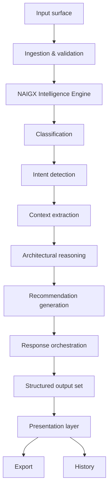
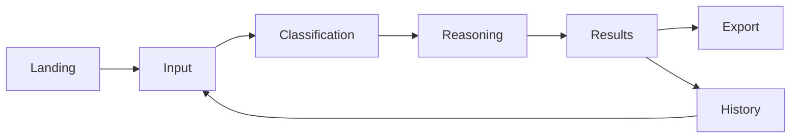

# NAIGX — Product Requirements Document

**MVP functional specification.**

| Field | Value |
|---|---|
| Product | NAIGX |
| Category | Automation Intelligence Platform |
| Core engine | NAIGX Intelligence Engine (NIE) |
| Document type | Product Requirements Document (canonical) |
| Sources of truth | Executive Summary v1.1 · Product Vision v1.1 |
| Scope | MVP → v1.0 |
| Version | 1.0 |
| Last updated | 2026-08-11 |

---

## How to read this document

The Executive Summary defines **what NAIGX is**. The Product Vision defines **why it exists and what constrains it**. This document defines **what must be built**, in terms specific enough to implement and test against.

Nothing here restates strategy. Where a requirement exists because a principle demands it, the principle is cited (`PV §3.4`) rather than re-argued. Where the Product Vision and this document conflict, the Product Vision governs and this document is defective.

**Requirement conventions**

| Term | Meaning |
|---|---|
| **P0** | MVP-blocking. v1.0 cannot ship without it. |
| **P1** | MVP-expected. Ships with v1.0 unless capacity forces deferral, which must be recorded. |
| **P2** | Post-MVP. Specified here to prevent architectural decisions that foreclose it. |
| **Must** | Binding requirement. Testable. |
| **Should** | Strong default. Deviation requires a recorded reason. |

**Capacity note.** NAIGX is built by a single operator. Scope discipline is a survival constraint, not a preference (`PV §7`, tie-breaker: subtraction over accumulation). P2 items are documented specifically so they can be *excluded* with confidence rather than half-built.

---

## 1. Product Overview

### 1.1 What is being built, in engineering terms

NAIGX v1.0 is a stateless request-response reasoning system with a web interface. A user submits an unstructured text artifact. The system classifies it, infers intent, applies a reasoning path, and returns a structured, explained set of automation intelligence outputs which the user can review, export, and revisit.

The system performs no execution, holds no persistent connection to any external platform, and takes no action on the user's behalf. Every operation terminates in a document.

### 1.2 The engineering shape of the problem

Three properties distinguish this from a conventional generative application and drive most of the requirements below.

**Output is structured, not free-form.** The system produces a defined set of artifact types with known schemas. Generation is constrained and validated. Unstructured prose is a failure mode, not an output format.

**Reasoning provenance is a product surface.** Every recommendation carries its rationale, its confidence, and the distinction between stated and inferred inputs. This must be modelled in the data structures from the first commit; it cannot be retrofitted onto output that was generated without tracking it.

**Depth is variable and system-determined.** The set of artifacts produced is decided by the engine based on input and inferred intent. Over-production is a defect (`PV §3.2`). This means orchestration is a first-class component, not a template selector.

### 1.3 Purpose of the MVP

The MVP exists to answer one question: **does NAIGX's reasoning survive contact with production?** (`PV §8`, Stage 1).

It is therefore scoped for *depth on a narrow surface*, not breadth. Four input types, one output pipeline, one user, no collaboration, no persistence beyond the user's own history. A v1.0 that handles four input types excellently is a valid product. A v1.0 that handles twelve adequately is not, because the thesis it was built to test is untestable through mediocre output.

**The MVP is invalidated if:** users cannot explain the recommendations they received, or generated architectures fail on implementation. Neither is detectable through usage volume, which is why §3 defines the metrics it does.

---

## 2. Product Goals

### 2.1 Business goals

| # | Goal | Rationale |
|---|---|---|
| BG-1 | Prove that architectural reasoning is a product people will use repeatedly | The core commercial hypothesis; everything else is contingent on it |
| BG-2 | Establish credibility with individual practitioners before pursuing teams | The wedge defined in `ES §7`; teams buy after practitioners advocate |
| BG-3 | Produce output good enough to be shown to a third party | The handoff moment is where the product is actually evaluated (`PV §5`) |
| BG-4 | Preserve structural neutrality through v1.0 | No integration, partnership, or revenue path may compromise `PV §3.3` |
| BG-5 | Ship within single-operator capacity without quality compromise | A poorly executed correct feature damages trust more than its absence |

### 2.2 User goals

| # | Goal | Observable when |
|---|---|---|
| UG-1 | Get a defensible automation design from an unstructured input | User submits raw text and receives a reviewable architecture |
| UG-2 | Understand *why* each recommendation was made | User can answer "why this, not the alternative?" unaided |
| UG-3 | Identify risk before building rather than after | Risk register and edge cases returned pre-implementation |
| UG-4 | Choose a platform on evidence rather than habit | Platform recommendation states criteria and rejected alternatives |
| UG-5 | Produce something presentable to a client or manager | Export is professional without manual reformatting |
| UG-6 | Leave more capable than they arrived | Reasoning transfers to the next problem (`PV §3.7`) |

### 2.3 Engineering goals

| # | Goal | Constraint it imposes |
|---|---|---|
| EG-1 | Model-agnostic reasoning core | No provider-specific logic outside a single adapter boundary (`FR-016`) |
| EG-2 | Structured, schema-validated outputs | Generation is validated before presentation; invalid output never reaches the user |
| EG-3 | Stateless reasoning | A request carries its full context; no hidden server-side session state |
| EG-4 | Deterministic orchestration | Which artifacts are produced follows explicit rules, not model discretion alone |
| EG-5 | Graceful degradation | Partial failure yields partial results with honest labelling, never silent gaps |
| EG-6 | Observability from day one | Every reasoning run is traceable end-to-end without re-running it |

### 2.4 Success goals

v1.0 is successful if, within the first operating period:

- Users complete analyses and **return with new problems** — the retention signal that distinguishes reasoning quality from novelty.
- Users **export and use** output externally, evidenced by export rate against completed analyses.
- Output quality is **defensible under scrutiny**, evidenced by qualitative review and the low-quality flag rate in `FR-101`.

---

## 3. Success Metrics

### 3.1 Instrumentation principle

All targets below are **provisional and unvalidated**. No baseline exists pre-launch, and targets set without a baseline are guesses. Their function in v1.0 is to force instrumentation to exist from the first release and to make the first real numbers interpretable. They are to be revised against observed data, not defended.

### 3.2 Primary metrics

| ID | Metric | Definition | Provisional target | Instrumented by |
|---|---|---|---|---|
| M-1 | **Analysis completion rate** | Analyses reaching a presented result ÷ analyses started | ≥ 95% | `FR-102` |
| M-2 | **Time to first recommendation** | Submission → first substantive artifact visible | ≤ 15s p50, ≤ 40s p95 | `FR-041`, `FR-102` |
| M-3 | **Full analysis latency** | Submission → all artifacts complete | ≤ 60s p50, ≤ 120s p95 | `FR-102` |
| M-4 | **Export rate** | Analyses exported ÷ analyses completed | ≥ 30% | `FR-102` |
| M-5 | **Return rate** | Users submitting a second distinct analysis within 30 days | ≥ 40% | `FR-102` |
| M-6 | **Classification accuracy** | Correct input-type classification, manually sampled | ≥ 95% | `FR-101`, manual review |
| M-7 | **Low-quality flag rate** | Analyses flagged unhelpful by the user | ≤ 5% | `FR-101` |
| M-8 | **Recommendation explicability** | Sampled outputs where rationale is traceable to a stated or inferred constraint | 100% | Manual review protocol |
| M-9 | **Platform recommendation defensibility** | Sampled platform recommendations where criteria and rejected alternatives are stated | 100% | Manual review protocol |
| M-10 | **Schema validity** | Outputs passing schema validation before presentation | 100% | `FR-039` |

### 3.3 Metrics deliberately not tracked

| Not tracked | Why |
|---|---|
| Session duration | Longer sessions may indicate confusion, not engagement. Uninterpretable. |
| Output length | Length is not rigor (`PV §6`). Tracking it creates pressure to inflate. |
| Daily active use | NAIGX is a project-cadence tool. Daily use would indicate misuse or misfit. |
| Feature usage breadth | Depth over breadth. Unused paths are candidates for removal, not promotion. |

### 3.4 The metrics problem this document does not solve

M-8 and M-9 depend on manual review, and no operational definition of "reasoning quality" yet exists that two reviewers would apply identically. **This is a known gap.** Until a rubric exists, quality assessment is single-reviewer judgment and should be reported as such. Establishing that rubric is the highest-priority documentation work after v1.0 ships.

---

## 4. Target Users

| Segment | Primary job-to-be-done | Enters via | Primary artifacts |
|---|---|---|---|
| **Automation engineers** | Design correctly before opening a builder | Business requirement | Architecture, risk analysis, edge cases, platform recommendation |
| **AI engineers** | Ground AI components in workflow reality | Business requirement, existing workflow | Architecture, integration requirements, failure modes |
| **Consultants** | Scope and price an engagement defensibly | Business requirement | Complexity score, roadmap, executive summary, export |
| **Freelancers** | Deliver above apparent seniority | Business requirement, technical assessment | Architecture, diagram, export |
| **Businesses** | Understand what they are commissioning | Business requirement | Executive summary, complexity score, risk analysis |
| **Technical leads** | Review designs before production | Existing workflow | Architecture review, risk register, best-practice gaps |
| **Job seekers** | Prove and build architectural judgment | Job description, technical assessment | Skill gap analysis, portfolio recommendations, interview guidance |

**MVP prioritization.** All seven are served by the four input paths, but the two highest-signal segments for v1.0 are **consultants** (highest willingness to pay, clearest deliverable value) and **job seekers** (lowest acquisition friction, produces public artifacts). Where a design trade-off must be resolved, resolve toward these two.

---

## 5. User Personas

### Persona 1 — Marco, Automation Consultant

| | |
|---|---|
| **Context** | Independent, 6 years' experience, 3–5 concurrent clients, bills project-based |
| **Goals** | Scope engagements accurately; convert unbillable discovery into client-facing value; price from complexity rather than instinct |
| **Pain points** | Discovery consumes 10–15 unbillable hours per engagement. Underscoping is his primary margin leak. Architecture documentation is written after delivery, if ever. |
| **Expected outcome** | A client-presentable architecture and complexity assessment within an hour of the first call |
| **Typical workflow** | Discovery call → pastes notes and requirement into NAIGX → reviews architecture and complexity score → adjusts against his own judgment → exports → attaches to proposal |
| **Fails him if** | Output requires more editing than writing it himself would have; complexity score has no stated basis he can defend when a client challenges the price |

---

### Persona 2 — Priya, Automation Engineer (in-house)

| | |
|---|---|
| **Context** | Mid-size company, sole automation owner, ~40 workflows in production, inherited most of them |
| **Goals** | Stop discovering design flaws in production; review inherited workflows systematically; justify architectural decisions to a non-technical manager |
| **Pain points** | No one to review her designs. Rework discovered late. Inherited workflows are undocumented and she cannot tell which are fragile until they break. |
| **Expected outcome** | A second opinion with the rigor of a senior colleague, on demand |
| **Typical workflow** | Pastes a workflow export or describes a requirement → reads risk analysis and edge cases first → uses architecture to validate or correct her own approach |
| **Fails her if** | Analysis is generic and misses the failure modes she already knows about — confirming it would also miss the ones she does not |

---

### Persona 3 — Daniel, Job Seeker

| | |
|---|---|
| **Context** | 2 years' general engineering, transitioning into automation, actively interviewing |
| **Goals** | Understand what roles actually require; build portfolio work that demonstrates judgment; answer architectural interview questions credibly |
| **Pain points** | Job descriptions list tools without indicating depth expected. His portfolio shows workflows that run, not decisions that were reasoned. Architectural questions expose the gap. |
| **Expected outcome** | A specific, prioritized list of what to learn and what to build |
| **Typical workflow** | Pastes a job description → reviews skill gap analysis → uses portfolio recommendations to select a project → later submits the take-home assessment for architectural reasoning |
| **Fails him if** | Skill gap output is generic advice rather than specific to the posting; portfolio recommendations are unbuildable at his level |

---

### Persona 4 — Sofia, Technical Lead

| | |
|---|---|
| **Context** | Leads 5 engineers; automation is one of several responsibilities; growing footprint she does not fully see |
| **Goals** | A consistent basis for reviewing automation designs; catch fragile designs before production; raise team floor without personally reviewing everything |
| **Pain points** | Design quality tracks the individual engineer. Review is ad hoc and depends on her availability. Governance is retroactive — she learns about problems from incidents. |
| **Expected outcome** | A reviewable standard she can point her team at |
| **Typical workflow** | Submits a design her team proposes → compares its risk register against her own read → uses the output as the basis for a review conversation |
| **Fails her if** | Output is not consistent between similar inputs — an inconsistent standard is not a standard |

---

## 6. User Journey

### 6.1 The critical path

### 6.2 Stage requirements

| Stage | User state entering | System obligation | Exit condition | Failure mode to prevent |
|---|---|---|---|---|
| **Landing** | Unfamiliar or returning | Communicate what to provide and what will be returned, without requiring a tutorial | User understands what to paste | Configuration or onboarding before value |
| **Input** | Holds a messy artifact | Accept it as-is; no formatting requirement; no type selection | Input submitted | Asking the user to classify their own input (`PV §3.6`) |
| **Classification** | Submitted, waiting | Determine type and intent; state the determination visibly; allow correction | Type determined and shown | Silent misclassification |
| **Reasoning** | Waiting, uncertain of duration | Show meaningful progress; stream results as available | First artifact visible | Opaque wait with no indication of progress or scope |
| **Results** | Reviewing output they must evaluate | Present with clear hierarchy, visible rationale, explicit confidence | User can act or export | Impressive output the user cannot verify (`PV §5`) |
| **Export** | Ready to present to a third party | Produce a professional document without manual reformatting | File obtained | Export requiring cleanup before it is presentable |
| **History** | Returning to prior work | Retrieve prior analyses intact | Prior analysis reopened | Loss of prior work |

### 6.3 Journey requirements

- **No account is required to complete a first analysis** (`FR-004`). The value must be demonstrable before commitment.
- **The classification determination is always visible and always correctable** (`FR-014`). The system does the classifying; the user retains authority to override (`PV §3.6`).
- **Results stream progressively** (`FR-041`). A 60-second opaque wait is a worse experience than a 60-second visible one.
- **No stage requires configuration to proceed.** Every setting has a working default.

---

## 7. Core Features

Feature-level descriptions. Testable requirements are in §8.

| # | Feature | Purpose | Priority |
|---|---|---|---|
| F-01 | **Home / Input Surface** | Single entry point accepting any supported artifact as raw text or file. No type selector. | P0 |
| F-02 | **Input Classification** | Determines artifact type; displays the determination with confidence; accepts user override. | P0 |
| F-03 | **NAIGX Intelligence Engine** | The reasoning core: classification, intent, context, reasoning, recommendation, orchestration. | P0 |
| F-04 | **Business Requirement Analysis** | Path for requirement inputs. Produces the full architecture set. | P0 |
| F-05 | **Workflow Analysis** | Path for existing-workflow inputs. Produces review, risk, and optimization output. | P0 |
| F-06 | **Job Description Analysis** | Path for posting inputs. Produces skill gap, portfolio, and interview output. | P0 |
| F-07 | **Technical Assessment Analysis** | Path for assessment inputs. Produces reasoned solution architecture with trade-offs. | P1 |
| F-08 | **Architecture Generator** | Structured automation architecture: components, boundaries, data flow, integration points. | P0 |
| F-09 | **Mermaid Diagram Generator** | Renderable diagram of the generated architecture. | P0 |
| F-10 | **Risk Analysis** | Risk register with severity, likelihood, and mitigation. | P0 |
| F-11 | **Complexity Scoring** | Complexity assessment with an explicit, itemized basis. | P0 |
| F-12 | **Platform Recommendation** | Platform guidance with criteria applied and alternatives rejected. | P0 |
| F-13 | **Implementation Roadmap** | Sequenced implementation phases with dependencies. | P1 |
| F-14 | **Edge Cases & Best Practices** | Failure modes and applicable practices for the specific design. | P1 |
| F-15 | **Export Report** | Professional document export of a complete analysis. | P0 |
| F-16 | **History** | Retrieval of prior analyses. | P0 |
| F-17 | **Settings** | Minimal preferences. Every setting optional with a working default. | P1 |
| F-18 | **Feedback Capture** | Per-analysis quality signal feeding M-6 and M-7. | P1 |

---

## 8. Functional Requirements

### 8.1 Input & Ingestion

#### FR-001 — Unified input surface
**Priority:** P0 · **Depends on:** —
**Description:** The system must present a single input surface accepting all supported artifact types without requiring the user to declare the type.
**Acceptance criteria**
- A single text area accepts free-form input on the primary surface.
- No control asks the user to select an input type, mode, module, or template before submission.
- Placeholder guidance states what may be pasted without prescribing a format.

#### FR-002 — Text input acceptance
**Priority:** P0 · **Depends on:** FR-001
**Description:** The system must accept raw text input of between 50 and 50,000 characters.
**Acceptance criteria**
- Input below 50 characters is rejected with a message stating the minimum and why.
- Input above 50,000 characters is rejected with the actual and maximum counts shown.
- Line breaks, markdown, JSON, and mixed formatting are accepted without preprocessing by the user.
- Character count is visible when input exceeds 80% of the maximum.

#### FR-003 — File input acceptance
**Priority:** P1 · **Depends on:** FR-002
**Description:** The system must accept file upload for `.txt`, `.md`, `.json`, and `.pdf`, extracting text for analysis.
**Acceptance criteria**
- Supported extensions are accepted; unsupported are rejected naming the accepted list.
- File size limit is 5 MB; exceeding it produces a clear error.
- Extracted text is subject to FR-002 limits and shown to the user before analysis begins.
- Extraction failure produces an explicit error, never a silent empty analysis.

#### FR-004 — Anonymous first analysis
**Priority:** P0 · **Depends on:** FR-002
**Description:** A user must be able to complete one full analysis without authentication.
**Acceptance criteria**
- Analysis completes and results display with no account.
- Export and history require authentication; the prompt appears only at the point of use.
- An anonymous analysis is claimable into history if the user authenticates within the same session.

#### FR-005 — Input validation feedback
**Priority:** P0 · **Depends on:** FR-002
**Description:** Validation failures must state what is wrong and what would resolve it.
**Acceptance criteria**
- Every validation message names the constraint violated and the corrective action.
- No message uses generic phrasing such as "invalid input."
- Validation occurs before any engine invocation.

#### FR-006 — Input persistence across failure
**Priority:** P0 · **Depends on:** FR-002
**Description:** User input must survive a failed submission.
**Acceptance criteria**
- On any error, the submitted text remains in the input surface unmodified.
- Retry is available without re-entry.
- Browser refresh during an in-flight analysis does not lose the input.

---

### 8.2 NAIGX Intelligence Engine — Core

#### FR-010 — Reasoning pipeline sequence
**Priority:** P0 · **Depends on:** FR-002
**Description:** The NIE must execute in the fixed order: classification → intent detection → context extraction → architectural reasoning → recommendation generation → response orchestration. (`PV §3.4`)
**Acceptance criteria**
- Each stage receives the prior stage's structured output; no stage is bypassed.
- Recommendation generation cannot execute before architectural reasoning completes.
- Stage sequence and per-stage duration are recorded in the run trace (`FR-103`).
- A stage failure halts the sequence and triggers degradation handling (`FR-091`).

#### FR-011 — Input classification
**Priority:** P0 · **Depends on:** FR-010
**Description:** The NIE must classify every input as `business_requirement`, `existing_workflow`, `job_description`, `technical_assessment`, or `unsupported`, with a confidence value.
**Acceptance criteria**
- Exactly one classification is returned per input, with confidence in `[0,1]`.
- Confidence below 0.6 triggers FR-015.
- `unsupported` triggers FR-092 and does not proceed to reasoning.
- Classification is derived from content only; no user-supplied type hint is required.

#### FR-012 — Intent detection
**Priority:** P0 · **Depends on:** FR-011
**Description:** The NIE must infer what the user is trying to accomplish, including objectives not explicitly stated.
**Acceptance criteria**
- A structured intent record is produced containing primary objective, secondary objectives, and inferred scope.
- Each intent element is labelled `stated` or `inferred`.
- Intent influences orchestration (`FR-017`); an intent record that does not alter output for differing inputs is a defect.

#### FR-013 — Context extraction with provenance
**Priority:** P0 · **Depends on:** FR-012
**Description:** The NIE must extract constraints, environment, scale, and dependencies, distinguishing what was stated from what was inferred and what is unknown. (`PV §3.4`)
**Acceptance criteria**
- Every extracted context element carries provenance: `stated`, `inferred`, or `unknown`.
- `stated` elements are traceable to a span of the source input.
- Material unknowns are enumerated and surfaced to the user (`FR-044`).
- Provenance is retained through to output and export; it is not a transient internal field.

#### FR-014 — Classification visibility and override
**Priority:** P0 · **Depends on:** FR-011
**Description:** The determined classification must be displayed to the user and be correctable. (`PV §3.6`)
**Acceptance criteria**
- Classification is displayed before or alongside the first artifact.
- A control allows reclassification to any supported type.
- Reclassification re-runs the pipeline from FR-011 with the user's type fixed.
- Override events are recorded for M-6.

#### FR-015 — Low-confidence classification handling
**Priority:** P0 · **Depends on:** FR-011
**Description:** Classification confidence below 0.6 must be surfaced, not concealed. (`PV §3.4` — false confidence is a defect)
**Acceptance criteria**
- The user is shown that classification is uncertain and which types were candidates.
- The user may confirm or select before reasoning proceeds, or allow the best guess to proceed.
- The final output records that classification was low-confidence.

#### FR-016 — Model-agnostic provider boundary
**Priority:** P0 · **Depends on:** FR-010
**Description:** All model interaction must occur through a single provider abstraction. No provider-specific logic may exist elsewhere. (`PV §3` — Tier I; `ES §6.2`)
**Acceptance criteria**
- Reasoning logic contains no provider names, provider-specific parameters, or provider-specific response handling.
- Substituting a provider requires changes only within the adapter layer.
- Provider identity and model version are recorded per run in the trace.
- A second provider is configurable, even if only one is used in production, and this is verified by test.

#### FR-017 — Response orchestration
**Priority:** P0 · **Depends on:** FR-013
**Description:** The NIE must determine which artifacts to generate and at what depth, based on classification, intent, and assessed complexity. Over-production is a defect. (`PV §3.2`)
**Acceptance criteria**
- Orchestration rules are explicit and inspectable, not left entirely to model discretion.
- A minimal input produces a proportionally minimal artifact set.
- The artifact set produced is recorded with the reason each artifact was included or omitted.
- Omitted artifacts are indicated to the user as deliberately omitted, distinct from failed.

#### FR-018 — Confidence propagation
**Priority:** P0 · **Depends on:** FR-010
**Description:** Every generated recommendation must carry a confidence value proportional to the certainty of its basis.
**Acceptance criteria**
- Recommendations expose confidence as `high`, `medium`, or `low`, with a stated reason for anything below `high`.
- Confidence is not uniform across a single output set when the underlying certainty differs.
- Low-confidence recommendations are visually distinguished in presentation.

#### FR-019 — Prompt and reasoning-template versioning
**Priority:** P0 · **Depends on:** FR-010
**Description:** All reasoning templates must be versioned, externalized from application code, and recorded per run.
**Acceptance criteria**
- Templates are stored as versioned assets, not inline strings in business logic.
- Each run records the template version used at each stage.
- A prior run can be identified as having used a superseded template version.
- Template changes are reviewable as discrete diffs.

---

### 8.3 Analysis Paths

#### FR-020 — Business requirement path
**Priority:** P0 · **Depends on:** FR-017
**Description:** Inputs classified as `business_requirement` must produce business analysis, architecture, platform recommendation, risk analysis, complexity score, and roadmap, subject to orchestration.
**Acceptance criteria**
- The problem as understood is stated before any solution artifact (`PV §3.4`).
- Architecture (FR-030), risk (FR-032), complexity (FR-033), and platform (FR-034) are produced for any non-trivial requirement.
- Where the correct conclusion is that automation is unwarranted, the system states this rather than producing a design (`PV §3.2`).

#### FR-021 — Existing workflow path
**Priority:** P0 · **Depends on:** FR-017
**Description:** Inputs classified as `existing_workflow` must produce an architecture review, risk analysis, edge cases, and optimization recommendations.
**Acceptance criteria**
- Output identifies the workflow's current structure before evaluating it.
- Identified issues are specific to the submitted workflow, not generic best-practice statements.
- Each issue carries severity and a concrete remediation.
- A sound workflow yields an explicit statement that no material issues were found, not manufactured criticism.

#### FR-022 — Job description path
**Priority:** P0 · **Depends on:** FR-017
**Description:** Inputs classified as `job_description` must produce required-skill extraction, skill gap analysis, portfolio recommendations, and interview guidance.
**Acceptance criteria**
- Requirements are extracted with `must-have` / `nice-to-have` classification, labelled `stated` or `inferred`.
- Portfolio recommendations are specific and buildable, not generic project categories.
- Interview guidance addresses the architectural competencies the posting implies.
- Where the posting is vague, the output says so rather than inventing specificity.

#### FR-023 — Technical assessment path
**Priority:** P1 · **Depends on:** FR-017
**Description:** Inputs classified as `technical_assessment` must produce a solution architecture with explicit trade-off reasoning and a diagram.
**Acceptance criteria**
- At least one rejected alternative approach is named with the reason for rejection (`PV §3.5`).
- Trade-offs accepted by the proposed approach are stated.
- Output is structured for the user to understand and defend, not to submit verbatim.

#### FR-024 — Cross-path consistency
**Priority:** P0 · **Depends on:** FR-020, FR-021, FR-022, FR-023
**Description:** Substantively similar inputs must produce substantively consistent outputs. (Persona 4: an inconsistent standard is not a standard.)
**Acceptance criteria**
- A regression suite of fixed inputs produces stable classification and stable artifact sets across runs.
- Material variation between runs on identical input is treated as a defect and investigated.
- Consistency is verified before any reasoning-template change is released.

---

### 8.4 Output Artifacts

#### FR-030 — Architecture generation
**Priority:** P0 · **Depends on:** FR-017
**Description:** The system must generate a structured automation architecture: components, responsibilities, boundaries, data flow, integration points, and failure handling.
**Acceptance criteria**
- Every component has a stated responsibility and its inputs and outputs.
- Integration points name the systems involved and the direction of data flow.
- Failure handling is specified per component, not as a general statement.
- The architecture is traceable to the extracted context (FR-013); components addressing no stated or inferred requirement are a defect.

#### FR-031 — Mermaid diagram generation
**Priority:** P0 · **Depends on:** FR-030
**Description:** The system must generate a syntactically valid Mermaid diagram representing the generated architecture.
**Acceptance criteria**
- Output parses as valid Mermaid without manual correction.
- Diagram nodes correspond to architecture components; no component appears only in one and not the other.
- Diagram source is viewable and copyable.
- Parse failure triggers regeneration once, then degrades to the textual architecture with the failure disclosed (`FR-091`).

#### FR-032 — Risk analysis
**Priority:** P0 · **Depends on:** FR-030
**Description:** The system must produce a risk register with severity, likelihood, affected component, and mitigation.
**Acceptance criteria**
- Each risk names the specific component or integration it affects.
- Severity and likelihood use a defined, consistent scale.
- Every risk carries at least one concrete mitigation.
- Generic risks not specific to the submitted design are a defect.

#### FR-033 — Complexity scoring
**Priority:** P0 · **Depends on:** FR-030
**Description:** The system must produce a complexity score with an itemized, inspectable basis.
**Acceptance criteria**
- The score is accompanied by the factors contributing to it and their individual weight.
- A user can reconstruct how the score was reached from what is displayed.
- Identical inputs produce identical scores.
- A score presented without its basis is a defect, regardless of accuracy.

#### FR-034 — Platform recommendation
**Priority:** P0 · **Depends on:** FR-030
**Description:** The system must recommend an execution platform, stating the criteria applied and the alternatives rejected with reasons. (`PV §3.3`)
**Acceptance criteria**
- At least one rejected alternative is named with its reason.
- The criteria applied are stated explicitly.
- Multi-platform and "no platform — do not automate" are permitted outcomes.
- No platform is favored by default; a fixed-input regression suite verifies recommendation varies with requirement.
- No promotional or partnership language appears in any recommendation.

#### FR-035 — Integration and API requirements
**Priority:** P1 · **Depends on:** FR-030
**Description:** The system must identify required integrations and the API capabilities each demands.
**Acceptance criteria**
- Each integration names the system, purpose, and direction.
- Known constraints (rate limits, auth model, pagination behavior) are stated where applicable, labelled by provenance.
- Uncertainty about a platform's current capability is disclosed rather than asserted.

#### FR-036 — Implementation roadmap
**Priority:** P1 · **Depends on:** FR-030
**Description:** The system must produce sequenced implementation phases with dependencies and per-phase outcomes.
**Acceptance criteria**
- Phases are ordered with explicit dependencies.
- Each phase states what exists at its completion.
- Phases reference components defined in the architecture.
- No calendar estimates are given unless the input supplied a basis for them.

#### FR-037 — Edge cases and best practices
**Priority:** P1 · **Depends on:** FR-030
**Description:** The system must identify edge cases and applicable practices specific to the generated design.
**Acceptance criteria**
- Each edge case describes a concrete scenario and its consequence.
- Practices reference the specific component or decision they apply to.
- Generic advice not tied to the submitted design is a defect.

#### FR-038 — Executive summary artifact
**Priority:** P1 · **Depends on:** FR-030
**Description:** The system must produce a non-technical summary suitable for a business stakeholder.
**Acceptance criteria**
- Written without unexplained technical vocabulary.
- States the problem, the proposed approach, principal risks, and complexity.
- Consistent with the detailed artifacts; contradiction between them is a defect.

#### FR-039 — Output schema validation
**Priority:** P0 · **Depends on:** all FR-03x
**Description:** Every artifact must validate against its schema before presentation.
**Acceptance criteria**
- Schemas are defined for all artifact types.
- Validation failure triggers one regeneration attempt, then degradation (`FR-091`).
- Invalid output is never presented to the user.
- Validation outcomes are recorded per run.

---

### 8.5 Results Presentation

#### FR-040 — Results hierarchy
**Priority:** P0 · **Depends on:** FR-039
**Description:** Results must be presented with a clear hierarchy leading with the problem as understood, then conclusions, then supporting detail.
**Acceptance criteria**
- The problem as understood is visible without scrolling on a standard viewport.
- Artifacts are individually collapsible and independently navigable.
- No artifact requires reading another to be comprehensible.

#### FR-041 — Progressive result streaming
**Priority:** P0 · **Depends on:** FR-017
**Description:** Artifacts must appear as they complete rather than after the full set completes.
**Acceptance criteria**
- The first substantive artifact is visible within the M-2 target.
- Pending artifacts are indicated as pending, with the expected set shown.
- A failure in one artifact does not block presentation of completed ones.

#### FR-042 — Rationale visibility
**Priority:** P0 · **Depends on:** FR-040
**Description:** Every substantive recommendation must display its rationale within the interface. (`PV §3.5`)
**Acceptance criteria**
- Each recommendation exposes the reasoning that produced it, without navigation to a separate view.
- Rationale references specific extracted context, not general principles.
- Detail is layered: summary rationale by default, full reasoning on expansion.

#### FR-043 — Provenance display
**Priority:** P0 · **Depends on:** FR-013
**Description:** Stated and inferred context must be visually distinguished wherever displayed.
**Acceptance criteria**
- A consistent visual treatment distinguishes `stated` from `inferred` across all artifacts.
- The distinction survives export (`FR-050`).
- A legend or equivalent explains the treatment without requiring a tutorial.

#### FR-044 — Unknowns and insufficiency disclosure
**Priority:** P0 · **Depends on:** FR-013
**Description:** Material unknowns must be surfaced with what would resolve them. (`PV §5` — the insufficient-input moment)
**Acceptance criteria**
- Unknowns affecting the recommendation are listed prominently, not footnoted.
- Each unknown states what information would resolve it.
- Where input is insufficient for a reliable analysis, the system says so rather than proceeding confidently.

#### FR-045 — Confidence display
**Priority:** P0 · **Depends on:** FR-018
**Description:** Recommendation confidence must be visible and visually distinct.
**Acceptance criteria**
- Confidence is shown per recommendation.
- `low` confidence is visually distinguished and accompanied by its reason.
- Uniform confidence display across genuinely non-uniform certainty is a defect.

---

### 8.6 Export

#### FR-050 — Analysis export
**Priority:** P0 · **Depends on:** FR-039
**Description:** A completed analysis must be exportable as a self-contained document.
**Acceptance criteria**
- Markdown and PDF are supported.
- Export contains all presented artifacts, rationale, provenance, and confidence.
- Diagrams render in the export; Mermaid source is included in the Markdown export.
- Export is presentable to a third party without manual reformatting.

#### FR-051 — Export attribution and metadata
**Priority:** P1 · **Depends on:** FR-050
**Description:** Exports must carry generation metadata.
**Acceptance criteria**
- Generation date, input classification, and analysis identifier are included.
- Exports state that output is generated intelligence requiring professional review.
- No marketing content appears in exported documents.

#### FR-052 — Partial export
**Priority:** P1 · **Depends on:** FR-050
**Description:** A user must be able to export a selected subset of artifacts.
**Acceptance criteria**
- Individual artifacts are selectable for export.
- Partial exports state which artifacts were omitted.

#### FR-053 — Copy to clipboard
**Priority:** P1 · **Depends on:** FR-040
**Description:** Individual artifacts must be copyable as formatted Markdown.
**Acceptance criteria**
- Every artifact has a copy control.
- Copied content preserves structure and is valid Markdown.
- Copy of a Mermaid diagram yields valid diagram source.

---

### 8.7 History

#### FR-060 — Analysis persistence
**Priority:** P0 · **Depends on:** FR-004
**Description:** Authenticated users' completed analyses must persist and be retrievable.
**Acceptance criteria**
- Every completed analysis is stored with input, classification, artifacts, and timestamp.
- Retrieval reproduces the original result exactly; analyses are never regenerated on view.
- Storage failure is surfaced to the user, not silent.

#### FR-061 — History listing
**Priority:** P0 · **Depends on:** FR-060
**Description:** Prior analyses must be listed in reverse-chronological order with enough context to identify them.
**Acceptance criteria**
- Each entry shows date, classification, and a derived title.
- Selecting an entry opens the full stored result.
- Empty state explains what will appear here.

#### FR-062 — History search
**Priority:** P1 · **Depends on:** FR-061
**Description:** History must be searchable by text and filterable by classification.
**Acceptance criteria**
- Search matches input text and artifact content.
- Filtering by input type is available.
- No-results state distinguishes "no matches" from "no history."

#### FR-063 — Analysis deletion
**Priority:** P0 · **Depends on:** FR-060
**Description:** Users must be able to delete stored analyses.
**Acceptance criteria**
- Deletion requires explicit confirmation stating it is permanent.
- Deleted analyses are unrecoverable through the interface and removed from storage.
- Bulk deletion of all history is available.

#### FR-064 — Re-analysis
**Priority:** P2 · **Depends on:** FR-060
**Description:** A stored input may be re-analyzed under current reasoning templates.
**Acceptance criteria**
- Re-analysis creates a new record; the original is preserved.
- The result indicates it is a re-analysis and names the prior record.

---

### 8.8 Settings & Account

#### FR-070 — Authentication
**Priority:** P0 · **Depends on:** —
**Description:** The system must support account creation and authentication for persistence and export.
**Acceptance criteria**
- Email-based authentication is supported.
- Authentication is required only at the point of use, never before a first analysis.
- Session expiry does not lose in-progress work (`FR-006`).

#### FR-071 — Settings surface
**Priority:** P1 · **Depends on:** FR-070
**Description:** Settings must be minimal, with every option defaulted to a working value.
**Acceptance criteria**
- No setting must be configured for the product to function fully.
- Settings are limited to account, export defaults, and data controls.
- No setting alters reasoning behavior in a way that could degrade output quality.

#### FR-072 — Data export (user data)
**Priority:** P1 · **Depends on:** FR-060
**Description:** Users must be able to export all their stored data.
**Acceptance criteria**
- Export includes all analyses in a machine-readable format.
- Export is self-service and completes without operator intervention.

#### FR-073 — Account deletion
**Priority:** P0 · **Depends on:** FR-070
**Description:** Users must be able to delete their account and all associated data.
**Acceptance criteria**
- Deletion is self-service and requires explicit confirmation.
- All analyses and personal data are removed within a stated period.
- Confirmation of completion is provided.

---

### 8.9 Errors & Degradation

#### FR-090 — Error message standard
**Priority:** P0 · **Depends on:** —
**Description:** Every user-facing error must state what happened, what it affects, and what the user can do.
**Acceptance criteria**
- No error surfaces a stack trace, provider name, or internal identifier.
- Every error offers a next action where one exists.
- Errors are visually distinguished from system-determined omissions (`FR-017`).

#### FR-091 — Graceful degradation
**Priority:** P0 · **Depends on:** FR-041
**Description:** Partial pipeline failure must yield partial results with honest labelling. (`EG-5`)
**Acceptance criteria**
- Successfully generated artifacts are presented despite failure of others.
- Failed artifacts are labelled as failed, distinct from omitted.
- Retry of a failed artifact is available without re-running the full analysis.
- Silent omission of a failed artifact is a defect.

#### FR-092 — Unsupported input handling
**Priority:** P0 · **Depends on:** FR-011
**Description:** Input classified `unsupported` must be declined with an explanation.
**Acceptance criteria**
- The user is told the input type is outside scope and which types are supported.
- No analysis is generated for unsupported input.
- The input is retained for the user to revise (`FR-006`).

#### FR-093 — Provider failure handling
**Priority:** P0 · **Depends on:** FR-016
**Description:** Model provider failures must be handled without exposing provider detail.
**Acceptance criteria**
- Transient failures are retried with backoff, bounded by a maximum attempt count.
- Persistent failure produces a user-facing message with no provider identification.
- Provider failure is recorded in the trace with full detail.

#### FR-094 — Timeout handling
**Priority:** P0 · **Depends on:** FR-041
**Description:** Analyses exceeding the maximum duration must terminate with partial results preserved.
**Acceptance criteria**
- A maximum analysis duration is enforced.
- On timeout, completed artifacts are presented and incomplete ones labelled.
- The user is told the analysis timed out and may retry.

---

### 8.10 Feedback & Observability

#### FR-100 — Run trace
**Priority:** P0 · **Depends on:** FR-010
**Description:** Every analysis must produce an end-to-end trace sufficient to diagnose it without re-running.
**Acceptance criteria**
- The trace records per-stage input, output, duration, template version, provider, and model version.
- Traces are retrievable by analysis identifier.
- Trace retention period is defined and enforced.

#### FR-101 — User feedback capture
**Priority:** P1 · **Depends on:** FR-040
**Description:** Users must be able to signal analysis quality.
**Acceptance criteria**
- A binary helpful/unhelpful signal is available per analysis.
- Negative signals accept optional free-text detail.
- Feedback is associated with the analysis and its trace.
- Feedback is never required to proceed.

#### FR-102 — Product metrics instrumentation
**Priority:** P0 · **Depends on:** FR-010
**Description:** All metrics in §3.2 must be instrumented at release.
**Acceptance criteria**
- Events exist for analysis started, completed, failed, exported, and flagged.
- Latency is recorded at both first-artifact and full-completion points.
- Metrics are queryable without code changes.

#### FR-103 — Reasoning auditability
**Priority:** P0 · **Depends on:** FR-100
**Description:** Any presented recommendation must be traceable to the reasoning that produced it.
**Acceptance criteria**
- Each artifact records the context elements it derived from.
- A given recommendation can be traced to its stage outputs and template version.
- Untraceable output is a defect regardless of quality.

---

## 9. Non-Functional Requirements

### 9.1 Performance

| ID | Requirement | Target |
|---|---|---|
| NFR-001 | First artifact visible after submission | ≤ 15s p50, ≤ 40s p95 |
| NFR-002 | Full analysis completion | ≤ 60s p50, ≤ 120s p95 |
| NFR-003 | Interface interaction response (non-reasoning) | ≤ 200ms p95 |
| NFR-004 | History listing load | ≤ 1s p95 |
| NFR-005 | Export generation | ≤ 10s p95 |
| NFR-006 | Initial page load, cold | ≤ 3s p95 on a mid-tier connection |

### 9.2 Reliability

| ID | Requirement |
|---|---|
| NFR-010 | Analysis completion rate ≥ 95% excluding user-caused validation failures |
| NFR-011 | No single artifact failure may prevent presentation of others (`FR-091`) |
| NFR-012 | Stored analyses must be durable; loss of a completed analysis is a severity-1 defect |
| NFR-013 | Transient provider failures must be retried with bounded exponential backoff |
| NFR-014 | The system must degrade to partial results rather than fail wholesale |

### 9.3 Security

| ID | Requirement |
|---|---|
| NFR-020 | All transport encrypted (TLS 1.2+) |
| NFR-021 | Stored analysis content encrypted at rest |
| NFR-022 | Credentials stored using a current password-hashing standard; never in plaintext |
| NFR-023 | Provider API keys held server-side only; never transmitted to the client |
| NFR-024 | All input treated as untrusted; sanitized before storage, rendering, and export |
| NFR-025 | Rate limiting per account and per IP on analysis submission |
| NFR-026 | Authorization enforced server-side on every history and export operation |
| NFR-027 | No user input echoed into a rendering context without escaping |

### 9.4 Privacy

| ID | Requirement |
|---|---|
| NFR-030 | Submitted content is user data. It must not be used to train or tune any model without explicit, separately obtained, opt-in consent. |
| NFR-031 | The data handling policy must be accessible before first submission |
| NFR-032 | Users may delete individual analyses (`FR-063`) and their entire account (`FR-073`) |
| NFR-033 | Retention periods for analyses, traces, and logs must be defined and enforced |
| NFR-034 | Traces must not retain full input content beyond the defined trace retention period |
| NFR-035 | No third-party analytics may receive submitted analysis content |

### 9.5 Maintainability

| ID | Requirement |
|---|---|
| NFR-040 | Provider-specific code confined to the adapter boundary (`FR-016`) |
| NFR-041 | Reasoning templates versioned and externalized (`FR-019`) |
| NFR-042 | Output schemas defined declaratively and shared between generation and validation |
| NFR-043 | A regression suite of fixed inputs exists and runs before any template change ships (`FR-024`) |
| NFR-044 | Adding a new input type must not require modification of existing analysis paths |

### 9.6 Scalability

| ID | Requirement |
|---|---|
| NFR-050 | Reasoning is stateless; no request depends on server-held session state (`EG-3`) |
| NFR-051 | Application tier horizontally scalable without code change |
| NFR-052 | Analysis execution must not block the request thread; long-running work is asynchronous |
| NFR-053 | Storage design must accommodate growth in analyses per user without schema change |

### 9.7 Accessibility

| ID | Requirement |
|---|---|
| NFR-060 | WCAG 2.1 Level AA conformance for all primary flows |
| NFR-061 | All functionality operable by keyboard alone |
| NFR-062 | Contrast ratios meet AA minimums, including provenance and confidence treatments |
| NFR-063 | Provenance and confidence must not be conveyed by color alone (`FR-043`, `FR-045`) |
| NFR-064 | Diagrams accompanied by a textual equivalent |
| NFR-065 | Semantic structure and correct landmarks throughout; screen-reader navigable |

### 9.8 Usability

| ID | Requirement |
|---|---|
| NFR-070 | A first-time user must complete a full analysis without documentation or onboarding |
| NFR-071 | No configuration may be required before value is delivered (`PV §6`) |
| NFR-072 | Every error states a corrective action (`FR-090`) |
| NFR-073 | Primary flows usable at 1280×720 and above; results readable on tablet viewports |
| NFR-074 | No engagement mechanics of any kind (`PV §6`) |

### 9.9 Logging & Monitoring

| ID | Requirement |
|---|---|
| NFR-080 | Structured logging with a correlation identifier spanning a full analysis |
| NFR-081 | Logs must never contain credentials, API keys, or full submitted content |
| NFR-082 | Error rate, latency percentiles, and completion rate monitored with alerting thresholds |
| NFR-083 | Provider failures, latency, and cost per run recorded |
| NFR-084 | Schema validation failure rate monitored as a leading quality indicator |
| NFR-085 | Alerting on completion-rate drop below NFR-010 threshold |

---

## 10. AI Requirements

Requirements governing the NAIGX Intelligence Engine as an AI system. Functional behavior is specified in §8.2; this section governs its properties.

### 10.1 Responsibilities

| Responsibility | Requirement | Verified by |
|---|---|---|
| **Input classification** | Content-derived type determination with confidence | FR-011, FR-015 |
| **Intent detection** | Objective inference including unstated goals, labelled by provenance | FR-012 |
| **Context understanding** | Constraint extraction with `stated` / `inferred` / `unknown` provenance | FR-013 |
| **Architectural reasoning** | Design derivation traceable to extracted context | FR-030, FR-103 |
| **Recommendation generation** | Conclusions with stated criteria and rejected alternatives | FR-034, FR-042 |
| **Response orchestration** | Artifact set and depth determined by input and intent | FR-017 |

### 10.2 Model-agnostic design

| ID | Requirement |
|---|---|
| AI-001 | No component outside the provider adapter may contain provider-specific logic (`FR-016`) |
| AI-002 | Provider and model must be configurable without code deployment |
| AI-003 | The system must support routing different pipeline stages to different models |
| AI-004 | Provider and model version must be recorded per run (`FR-100`) |
| AI-005 | Provider substitution must be verified by an automated test that exercises a second provider |
| AI-006 | No user-facing surface, output, or export may name the underlying provider |

### 10.3 Prompt and template management

| ID | Requirement |
|---|---|
| AI-010 | Reasoning templates are versioned assets external to application code (`FR-019`) |
| AI-011 | Template changes must pass the regression suite before release (`NFR-043`) |
| AI-012 | Templates must be composable per stage; no single monolithic template covers the full pipeline |
| AI-013 | Template version used at each stage is recorded per run |
| AI-014 | Rollback to a prior template version must be possible without code deployment |

### 10.4 Confidence handling

| ID | Requirement |
|---|---|
| AI-020 | Confidence must be produced at classification and at recommendation level (`FR-011`, `FR-018`) |
| AI-021 | Confidence must vary with actual certainty; uniform confidence across non-uniform certainty is a defect |
| AI-022 | Low confidence must be surfaced to the user, never suppressed (`FR-015`, `FR-045`) |
| AI-023 | Where the engine cannot reach a defensible conclusion, it must say so rather than produce one |
| AI-024 | Confidence calibration must be reviewable against sampled outcomes |

### 10.5 Explainability

| ID | Requirement |
|---|---|
| AI-030 | Every recommendation carries rationale referencing specific extracted context (`FR-042`) |
| AI-031 | Rejected alternatives are named where the rejection is informative (`FR-034`, `FR-023`) |
| AI-032 | Rationale is layered — summary by default, full reasoning on request (`PV §3.5`) |
| AI-033 | Explanation must support the conclusion, not restate it; restatement is a defect |
| AI-034 | Every artifact is traceable to the pipeline stages that produced it (`FR-103`) |

### 10.6 Behavioral constraints

| ID | Requirement | Source |
|---|---|---|
| AI-040 | The engine must be capable of concluding that automation is unwarranted | `PV §3.2` |
| AI-041 | The engine must not favor any platform absent a requirement-derived reason | `PV §3.3` |
| AI-042 | The engine must not fabricate context; unknowns are disclosed (`FR-044`) | `PV §3.4` |
| AI-043 | The engine must not take action outside generating analysis; no external calls on the user's behalf | `PV §3.6` |
| AI-044 | Output depth must be proportional to problem complexity; over-production is a defect | `PV §3.2` |
| AI-045 | The engine must not withhold reasoning to encourage repeat usage | `PV §3.7` |

---

## 11. UX Requirements

| ID | Requirement | Acceptance |
|---|---|---|
| UX-001 | **Zero configuration to value.** No selection, mode, or setup precedes a first analysis. | A new user completes an analysis with one paste and one click. |
| UX-002 | **The system classifies, not the user.** Input type is never requested up front. | No type control exists on the input surface (`FR-001`). |
| UX-003 | **Visible progress during reasoning.** Waits are never opaque. | Progress indicates current stage and expected artifact set (`FR-041`). |
| UX-004 | **Conclusions before supporting detail.** Hierarchy leads with what was understood and concluded. | Problem statement and headline conclusions visible without scrolling (`FR-040`). |
| UX-005 | **Rationale is in-place, not buried.** | Rationale is reachable without leaving the artifact (`FR-042`). |
| UX-006 | **Layered depth.** Summary by default; full detail on expansion. | Every artifact supports collapsed and expanded states. |
| UX-007 | **Provenance is visually unambiguous.** | Stated and inferred are distinguishable without color dependence (`FR-043`, `NFR-063`). |
| UX-008 | **Professional register throughout.** | No casual copy, no exclamation marks, no encouragement language, no emoji in product surfaces. |
| UX-009 | **Fast non-reasoning interactions.** | All interface interactions meet NFR-003. |
| UX-010 | **Errors state a next action.** | Every error message names a corrective step (`FR-090`). |
| UX-011 | **Nothing decorative.** No element that does not carry information. | Design review confirms every element serves comprehension. |
| UX-012 | **No engagement mechanics.** | No streaks, badges, gamification, or artificial return prompts (`PV §6`). |
| UX-013 | **Output is presentation-ready.** | Exported documents require no reformatting before third-party use (`FR-050`). |
| UX-014 | **The user's authority is preserved.** | No irreversible action occurs without explicit confirmation (`FR-063`, `FR-073`). |

---

## 12. Technical Constraints

| ID | Constraint | Implication |
|---|---|---|
| TC-001 | **Model-agnostic architecture.** No provider dependency outside the adapter. | Provider substitution is a configuration change, not a rewrite. |
| TC-002 | **Vendor neutrality.** No integration, partnership, or revenue arrangement may influence recommendations. | No affiliate links, no promoted platforms, no partner-weighted logic. Binding on business decisions, not only code. |
| TC-003 | **API-first design.** All product capability exposed through an internal API consumed by the web client. | The interface is a client, not the system. Enables future surfaces without re-architecture. |
| TC-004 | **Stateless reasoning.** A reasoning request carries its full context. | Horizontal scalability; reproducibility; no hidden session dependency. |
| TC-005 | **Structured, schema-validated output.** All artifacts conform to declared schemas. | Free-form prose output is a defect. Validation precedes presentation. |
| TC-006 | **Deterministic orchestration.** Artifact selection follows explicit rules. | Which artifacts appear is reproducible and explainable. |
| TC-007 | **Extensibility by addition.** New input types and artifacts added without modifying existing paths. | Stage 2–4 evolution (`PV §8`) does not require re-architecture. |
| TC-008 | **No execution surface.** The system holds no credentials to and makes no calls against user platforms. | Enforces `PV §3.1`. Architecturally forecloses drift toward execution. |
| TC-009 | **Single-operator maintainability.** Operational burden must be sustainable by one person. | Managed services preferred over self-operated infrastructure. |

---

## 13. Out of Scope

Excluded from MVP. Each exclusion is a decision, not an omission.

| Excluded | Reason | Revisitable? |
|---|---|---|
| **Workflow execution** | Violates `PV §3.1`. Not deferred — permanently excluded. | **No** |
| **Workflow deployment** | Same. Crossing into execution forfeits neutrality. | **No** |
| **Scheduling** | Runtime concern. Downstream of the decision layer. | **No** |
| **Monitoring / observability of user workflows** | Runtime concern, well served elsewhere. | Analysis-only form at Stage 4 |
| **Autonomous agent execution** | Violates `PV §3.6`. Industrializes the failure NAIGX exists to correct. | **No** |
| **Marketplace** | Marketplaces monetize by favoring listed platforms. Structural conflict with `PV §3.3`. | **No** |
| **Plugin ecosystem** | Premature; introduces surface area and quality variance before core quality is proven. | Post-v1.0 |
| **Multi-user collaboration** | Stage 3 (`PV §8`). Requires a proven single-user product first. | Post-v1.0 |
| **Enterprise governance** | Stage 3. Requires team collaboration as a prerequisite. | Post-v1.0 |
| **Voice interface** | No evidence of demand; architectural reasoning is a reading-and-review activity. | Unlikely |
| **Native mobile application** | Primary use is desktop, at a workstation, alongside other tools. | Post-v1.0 |
| **Real-time platform data integration** | Requires credential handling; conflicts with TC-008. | Post-v1.0, read-only forms only |
| **Custom reasoning templates by users** | Users modifying reasoning undermines consistency (`FR-024`) and quality accountability. | Unlikely |
| **Localization** | Single-language MVP; adds surface area without testing the core hypothesis. | Post-v1.0 |

---

## 14. MVP Definition

### 14.1 Completion criteria

v1.0 is complete when **all** of the following hold:

**Functional**
- All P0 requirements in §8 implemented and passing acceptance criteria.
- All four analysis paths operational (FR-020 through FR-023), with FR-023 permitted to ship at P1 quality if capacity requires — recorded as a deviation.
- Full journey traversable end to end: landing → input → classification → reasoning → results → export → history.
- Anonymous first analysis functional (FR-004).

**Quality**
- All P0 non-functional requirements met, verified by measurement rather than assertion.
- WCAG 2.1 AA conformance verified on primary flows.
- Regression suite (NFR-043) exists, passes, and covers all four input types.
- No known severity-1 or severity-2 defects open.

**Operational**
- All §3.2 metrics instrumented and reporting (FR-102).
- Run tracing operational (FR-100).
- Alerting configured per NFR-082 and NFR-085.
- Data handling policy published and accessible pre-submission (NFR-031).

**Evidential**
- At least 20 analyses per input type reviewed manually against M-8 and M-9, with results recorded.
- At least 5 generated architectures reviewed by someone other than the author for implementation viability.

### 14.2 What v1.0 deliberately excludes

The MVP does **not** include: multi-user features, team functionality, platform integrations, agentic behavior, mobile applications, or a plugin surface. Excluding these is what makes the included scope achievable at the required quality by a single operator.

### 14.3 The release gate

Beyond the checklist, one qualitative gate governs release:

> **Would a competent automation practitioner, shown a generated analysis without knowing its origin, consider it professional work?**

If the honest answer is no, v1.0 does not ship regardless of checklist completion. Shipping output that fails this gate does not gather useful evidence — it gathers evidence about a product that was not the one being tested, and it spends credibility that cannot be re-earned by a later release.

---

## 15. Acceptance Criteria

### 15.1 Functional acceptance

| ID | Criterion |
|---|---|
| AC-001 | Each of the four input types classifies correctly across the full regression suite |
| AC-002 | Each analysis path produces its full specified artifact set for a representative input |
| AC-003 | Classification is displayed and correctable in every analysis (FR-014) |
| AC-004 | Every generated Mermaid diagram parses without manual correction (FR-031) |
| AC-005 | Every recommendation displays rationale traceable to extracted context (FR-042, FR-103) |
| AC-006 | Provenance labelling is present, correct, and survives export (FR-043, FR-050) |
| AC-007 | Confidence varies appropriately across a single output set (AI-021) |
| AC-008 | Export produces a presentation-ready document in both formats (FR-050) |
| AC-009 | History persists, retrieves exactly, and deletes permanently (FR-060, FR-063) |
| AC-010 | Partial failure yields labelled partial results, never silent omission (FR-091) |
| AC-011 | Anonymous users complete a first analysis without authentication (FR-004) |
| AC-012 | Unsupported input is declined with an explanation and input retained (FR-092) |
| AC-013 | The engine produces a "do not automate" conclusion on at least one regression case (AI-040) |
| AC-014 | Platform recommendations vary with requirement across the regression suite (FR-034) |

### 15.2 Quality acceptance

| ID | Criterion |
|---|---|
| AC-020 | Latency targets NFR-001 and NFR-002 met under representative load |
| AC-021 | Completion rate ≥ 95% over a sustained measurement period (NFR-010) |
| AC-022 | 100% of presented artifacts pass schema validation (FR-039) |
| AC-023 | WCAG 2.1 AA verified across primary flows; no color-only encoding (NFR-060, NFR-063) |
| AC-024 | Provider substitution verified by automated test (AI-005) |
| AC-025 | No provider name appears in any user-facing surface or export (AI-006) |
| AC-026 | Security review completed against §9.3 with no unresolved high-severity findings |
| AC-027 | No submitted content reaches third-party analytics (NFR-035) |
| AC-028 | Regression suite produces stable output across repeated runs (FR-024) |

### 15.3 Vision-conformance acceptance

These verify the product against its constitution, not its specification.

| ID | Criterion | Principle |
|---|---|---|
| AC-030 | No feature executes, deploys, schedules, or monitors an automation | `PV §3.1` |
| AC-031 | The system produces negative and "no automation" conclusions where warranted | `PV §3.2` |
| AC-032 | No platform is favored absent a requirement-derived reason; no partnership influences output | `PV §3.3` |
| AC-033 | No conclusion is presented without visible reasoning | `PV §3.4`, `§3.5` |
| AC-034 | No consequential action occurs without explicit user authorization | `PV §3.6` |
| AC-035 | No reasoning is withheld to drive repeat usage | `PV §3.7` |
| AC-036 | No engagement mechanics exist in any surface | `PV §6` |
| AC-037 | Output depth is proportional to input complexity across the regression suite | `PV §3.2` |

---

## 16. Risks

### 16.1 Product risks

| ID | Risk | Impact | Likelihood | Mitigation |
|---|---|---|---|---|
| R-01 | Output is plausible but architecturally unsound | Critical | Medium | Manual review protocol pre-launch (§14.1); regression suite; §14.3 release gate |
| R-02 | Users cannot evaluate output and accept it uncritically | High | Medium | Mandatory rationale (FR-042), provenance (FR-043), confidence (FR-045), unknowns (FR-044) |
| R-03 | Over-production produces volume rather than value | Medium | High | Orchestration rules (FR-017); AC-037; over-production classified as a defect |
| R-04 | Classification errors route inputs to the wrong path | High | Medium | Visible classification with override (FR-014); low-confidence handling (FR-015); M-6 tracking |
| R-05 | Output is inconsistent across similar inputs, undermining the standard use case | High | Medium | Cross-path consistency requirement (FR-024); regression suite gate on template changes |

### 16.2 Technical risks

| ID | Risk | Impact | Likelihood | Mitigation |
|---|---|---|---|---|
| R-10 | Provider dependency creates cost, availability, or terms exposure | High | Medium | Adapter boundary (FR-016); verified substitution (AI-005); per-stage routing (AI-003) |
| R-11 | Latency exceeds tolerance and users abandon | High | Medium | Progressive streaming (FR-041); first-artifact target as a distinct metric (M-2) |
| R-12 | Structured generation fails at an unacceptable rate | High | Medium | Schema validation with regeneration (FR-039); validation failure rate monitored (NFR-084) |
| R-13 | Per-analysis cost is economically unviable | High | Medium | Cost per run recorded (NFR-083); orchestration limits unnecessary generation (FR-017) |
| R-14 | Template changes cause silent quality regression | High | High | Versioned templates (FR-019); mandatory regression gate (NFR-043); rollback (AI-014) |

### 16.3 Market risks

| ID | Risk | Impact | Likelihood | Mitigation |
|---|---|---|---|---|
| R-20 | Buyers undervalue design relative to execution | High | Medium | Attach to already-funded outcomes: scoping, pricing, review, hiring (`ES §9.4`) |
| R-21 | General-purpose AI is judged good enough | High | High | Differentiate on consistency, structure, provenance, and rigor — not raw capability |
| R-22 | Incumbents extend upstream into design | Medium | Medium | Neutrality is uncopyable while they sell execution (`ES §9.3`) |
| R-23 | The individual-practitioner wedge does not convert to willingness to pay | High | Medium | Consultant and job-seeker segments prioritized (§4) as highest-signal for value validation |

### 16.4 Operational risks

| ID | Risk | Impact | Likelihood | Mitigation |
|---|---|---|---|---|
| R-30 | Single-operator capacity is exceeded and quality degrades | Critical | High | Strict P0/P1/P2 discipline; managed services (TC-009); explicit deferral recording |
| R-31 | Scope expands into excluded territory under user pressure | Critical | Medium | §13 exclusions with permanence marked; AC-030 through AC-037 as release gates |
| R-32 | A partnership or revenue opportunity compromises neutrality | Critical | Low | TC-002 binding on business decisions; `PV §3.3` business model constraint |
| R-33 | Handling of user business data creates a confidentiality incident | Critical | Low | §9.3 and §9.4 requirements; no training use without opt-in (NFR-030); trace content retention limited (NFR-034) |
| R-34 | No operational definition of reasoning quality exists, so quality cannot be governed | High | High | Acknowledged gap (§3.4). Rubric development is the first post-v1.0 documentation priority. |

---

## 17. Future Expansion

Direction only. **Nothing in this section is committed to MVP or to any release.** It exists so that architectural decisions in v1.0 do not foreclose these paths — and equally, so they are not partially built in v1.0.

| Direction | Description | Prerequisite | Constraint that governs it |
|---|---|---|---|
| **Learning system** | Reasoning improves from accumulated outcomes and feedback | Sufficient volume of feedback and verified outcomes | Improvements must remain explainable; a system that reasons better but less transparently is a regression (`PV §3.5`) |
| **Knowledge graph** | Structured representation of platforms, patterns, constraints, and failure modes as a reasoning substrate | Stable output schemas; a corpus of analyses | Must be neutral; platform representation may not be shaped by commercial relationship (`PV §3.3`) |
| **Team collaboration** | Shared analyses, design review, comment, and approval | A proven single-user product (Stage 1 complete) | Collaboration must not dilute reasoning into consensus (`PV §8`, Stage 3) |
| **Enterprise governance** | Organizational standards, policy conformance, audit trails | Team collaboration in place | Governance is review, never enforcement of execution (`PV §3.1`) |
| **Automation estate analysis** | Reasoning across an organization's full automation footprint: duplication, fragility, dependency | Read-only platform data access; team features | Analysis only. Never operation. Principle 1 does not relax at scale (`PV §8`, Stage 4) |
| **Agentic capabilities** | Multi-step reasoning agents that decompose problems and pursue sub-analyses | Proven reasoning quality at single-step | **Bounded strictly to reasoning.** Agentic *analysis* is permissible; agentic *execution* is permanently excluded (`PV §3.6`, `§2.3`) |

**The load-bearing distinction in this table:** every item extends what NAIGX *reasons about*. None extends what NAIGX *does*. An expansion that adds action rather than analysis is not a future version of this product — it is a different product, and the wrong one.

---

## Appendix A — Requirement Index

| Group | Range | Count | Section |
|---|---|---|---|
| Input & Ingestion | FR-001 – FR-006 | 6 | §8.1 |
| NIE Core | FR-010 – FR-019 | 10 | §8.2 |
| Analysis Paths | FR-020 – FR-024 | 5 | §8.3 |
| Output Artifacts | FR-030 – FR-039 | 10 | §8.4 |
| Results Presentation | FR-040 – FR-045 | 6 | §8.5 |
| Export | FR-050 – FR-053 | 4 | §8.6 |
| History | FR-060 – FR-064 | 5 | §8.7 |
| Settings & Account | FR-070 – FR-073 | 4 | §8.8 |
| Errors & Degradation | FR-090 – FR-094 | 5 | §8.9 |
| Feedback & Observability | FR-100 – FR-103 | 4 | §8.10 |
| **Total functional** | | **59** | |
| Non-functional | NFR-001 – NFR-085 | 45 | §9 |
| AI | AI-001 – AI-045 | 25 | §10 |
| UX | UX-001 – UX-014 | 14 | §11 |
| Technical constraints | TC-001 – TC-009 | 9 | §12 |

---

## Appendix B — Open Items

Items requiring resolution before or during implementation. Recorded rather than concealed.

| # | Item | Blocks | Owner action | Status |
|---|---|---|---|---|
| O-1 | **No operational definition of reasoning quality.** M-8, M-9, and the §14.3 release gate all depend on single-reviewer judgment. | Quality governance, not implementation | Develop a review rubric specific enough for two reviewers to agree. First post-v1.0 documentation priority. | ✅ **Resolved 2026-08-12** — `docs/10-Reasoning-Quality-Rubric.md`. Operationalizes the `AI §7.5` criteria as seven pass/fail criteria with recorded evidence (§2–§3), an independent human reviewer requirement (§4.3), and per-criterion agreement measurement with a disagreement log (§5). Residual: the independent reviewer is not yet named (`docs/10` A-1). |
| O-2 | **Complexity scoring scale undefined.** FR-033 requires an itemized basis but does not define the factors or their weights. | FR-033 implementation | Define the factor set and weighting before FR-033 is built. | ✅ **Resolved 2026-08-12** — `docs/09-Scoring-Scales.md` §1. Five factors scored 1–5, weights 25/20/20/20/15, weighted score ×20 to a 0–100 scale. Unblocks `DBQ-4` / `COMPLEXITY_ASSESSMENT`. |
| O-3 | **Risk severity and likelihood scales undefined.** FR-032 requires a consistent scale; the scale does not yet exist. | FR-032 implementation | Define before FR-032 is built. | ✅ **Resolved 2026-08-12** — `docs/09-Scoring-Scales.md` §2. Severity and likelihood 1–5, Risk Score = S × L, five bands. Unblocks `DBQ-3` / `RISK_ITEM`. |
| O-4 | **Platform knowledge currency.** FR-035 requires stating platform constraints, which change. No update mechanism is specified. | FR-035 quality | Decide between disclosure-of-uncertainty only (MVP-appropriate) and a maintained knowledge source (post-MVP). | ⏳ **Open** — Sprint 3 (`AIQ-8`). Not a Sprint 0 item. |
| O-5 | **Trace retention period unset.** NFR-034 requires a defined period; the value is not set. | NFR-033, NFR-034 | Set before launch; must appear in the published data policy. | ✅ **Resolved 2026-08-12** — `docs/06-Database-Design.md` §8.3. StageTrace 7 days; ProviderInvocation 30 days; ValidationEvent 30 days, as v1 policy values subject to revision. Still to do: publish in the data policy (`NFR-031`). |
| O-6 | **Evidence linkage to market research.** Personas and segment prioritization in §4 and §5 are not yet traced to sourced job-market evidence under the project's own validation standard. | External credibility | Trace §4 and §5 claims through the JD Matrix before this document circulates externally. | ⏳ **Open** — not a Sprint 0 item. |

---

## Appendix C — Provenance

This document specifies a product in pre-implementation development, built by a single operator. It contains no claims of customers, revenue, traction, or team, and no delivery dates.

**Document hierarchy.** Product Vision governs this document. This document governs implementation. Where a requirement here conflicts with a principle in the Product Vision, the requirement is defective and must be corrected — not the principle.

| Version | Date | Change |
|---|---|---|
| 1.0 | 2026-08-11 | Initial PRD. Derived from Executive Summary v1.1 and Product Vision v1.1. |
