# NAIGX — System Architecture

**Authoritative engineering blueprint for Version 1.0.**

| Field | Value |
|---|---|
| Product | NAIGX — Automation Intelligence Platform |
| Core engine | NAIGX Intelligence Engine (NIE) |
| Document type | System Architecture (canonical) |
| Sources of truth | Executive Summary v1.1 · Product Vision v1.1 · PRD v1.0 · MVP Scope v1.0 |
| Function | Defines how the system is structured to satisfy the PRD |
| Version | 1.0 |
| Last updated | 2026-08-11 |

---

## How this document is used

The PRD defines *what* the system must do. This document defines *how it is structured* to do it. It introduces no requirements. Where behavior is referenced, its definition lives in a PRD requirement ID.

**Three rules govern architectural change:**

1. **Boundaries are binding.** §5.4 and §7 define what each component must never do. Violating a negative constraint is an architectural defect regardless of whether tests pass.
2. **Decisions are recorded.** §16 is the decision register. Reversing a decision requires an entry stating what changed, not a silent refactor.
3. **The Product Vision governs.** Where an architectural choice would make a principle harder to uphold, the choice is wrong. `TC-008` (no execution surface) is enforced architecturally precisely so that `PV §3.1` cannot erode by increment.

---

## 1. Architecture Overview

### 1.1 What the system is, structurally

NAIGX v1.0 is a **modular monolith** with a **stateless reasoning core**, an **asynchronous analysis pipeline**, and a **streaming result channel**.

In plain terms: a React client talks to a Fastify API. The API accepts an analysis request, enqueues it, and streams artifacts to the client as each completes. All reasoning happens inside the NIE — an in-process module with a hard interface, not a network service. Model providers sit behind a single adapter. Nothing in the system holds credentials to, or makes calls against, any user-owned platform.

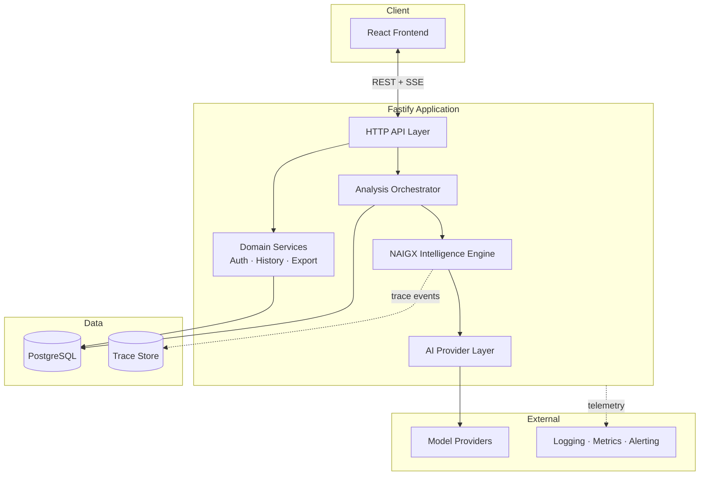

### 1.2 Why this shape

Four forces determined the architecture. Each is traceable to a source document.

**Force 1 — The reasoning core must be substitutable and testable in isolation.**
The NIE is the system under test (`MVP §3`). It must be exercisable against the regression corpus without HTTP, without a database, and without a live provider. This drives it to be a pure module with an explicit interface and injected dependencies — not a service, and not code scattered through route handlers.

**Force 2 — Provider independence is a business requirement, not a preference.**
`PV §3.3` and `PRD AI-001`–`AI-006` require that no provider-specific logic exist outside a single adapter. This is a commercial concern (dependency risk, `PRD R-10`) expressed architecturally: exactly one module knows a provider's name.

**Force 3 — Analyses are long-running and partially failable.**
A full analysis takes 15–120 seconds and produces 4–10 independent artifacts, any of which may fail (`FR-091`). This forecloses synchronous request-response: it demands an asynchronous job with a streaming channel, and artifact-level rather than analysis-level failure granularity.

**Force 4 — One operator maintains this.**
`TC-009` and `MVP §1.4`. Microservices would multiply deployment, monitoring, and failure surface for no benefit at v1.0 scale. The architecture is therefore a **modular monolith**: strict internal boundaries, single deployment unit. Module boundaries are drawn where services would eventually split, so that extraction later is mechanical rather than architectural.

### 1.3 Major subsystems

| Subsystem | Responsibility | Depends on | Extractable later? |
|---|---|---|---|
| **Frontend** | Presentation, input capture, streaming consumption | API contract only | Already separate |
| **API layer** | HTTP, validation, authn/authz, serialization | Orchestrator, domain services | — |
| **Analysis Orchestrator** | Job lifecycle, stage sequencing, artifact assembly, persistence | NIE, repositories | Yes — natural service boundary |
| **NIE** | All reasoning. Classification through orchestration decisions | Provider layer, template store | Yes — natural service boundary |
| **AI Provider Layer** | Model invocation, retry, normalization, cost accounting | External providers | Yes |
| **Domain services** | Auth, History, Export — each independent | Repositories | Yes, individually |
| **Persistence** | Analysis and account storage; trace storage | — | — |
| **Observability** | Logging, metrics, tracing, alerting | All components emit | External already |

### 1.4 What the architecture deliberately does not include

| Absent | Why |
|---|---|
| Message broker / distributed queue | v1.0 volume does not justify it. In-process job queue with database-backed state is sufficient and observable. Interface designed so a broker can replace it (§13.1). |
| Microservices | See Force 4. Boundaries exist; deployment separation does not. |
| Caching layer | No evidence it is needed (`MVP §4.6` — build what is expensive to add later, nothing else early). |
| Any outbound integration to user platforms | `TC-008`. Architecturally foreclosed, not merely unimplemented. |
| Multi-tenancy constructs | `MVP §4.5` — single user first, including in the data model. |

---

## 2. Architectural Principles

Seven principles. Each states what it forbids, because a principle that forbids nothing constrains nothing.

### AP-1 — Separation of Concerns

Reasoning, orchestration, transport, and persistence are distinct layers with no leakage between them.

The specific failure this prevents: reasoning logic accumulating inside route handlers, where it cannot be tested against the regression corpus and cannot be extracted. **Forbids:** any reasoning in the API layer; any HTTP or database awareness inside the NIE.

### AP-2 — Single Responsibility at Module Granularity

Every module has one reason to change. The NIE changes when reasoning changes. The provider layer changes when providers change. The orchestrator changes when job lifecycle changes.

**Forbids:** modules that would change for two unrelated reasons — for example, a module that both invokes a model and decides which artifacts to generate.

### AP-3 — Stateless Reasoning

A reasoning request carries its full context (`TC-004`). The NIE holds no state between invocations and no memory of prior analyses.

Consequences: horizontal scalability without session affinity; reproducibility, since a run can be replayed from its trace; and testability, since the NIE requires no environment to exercise.

**Forbids:** in-memory conversation state, cross-request context accumulation, and any NIE behavior dependent on invocation order.

### AP-4 — Model Agnostic Design

Exactly one module knows a provider exists. Reasoning logic addresses an abstract capability interface (`PRD FR-016`, `AI-001`).

**Forbids:** provider names, provider-specific parameters, provider-specific error handling, or provider-specific response parsing anywhere outside `provider/adapters/`. Enforced by a static check in CI, not by convention.

### AP-5 — API-First Design

All product capability is exposed through the internal HTTP API (`TC-003`). The React client is one consumer of that API, not a privileged one.

**Forbids:** capability reachable only through the web client; server-rendered behavior that bypasses the API contract. This is what makes future surfaces — CLI, IDE extension, programmatic access — additive rather than architectural.

### AP-6 — Composition over Coupling

Pipeline stages, artifact generators, and analysis paths are composed from independent units registered against an interface, not hard-wired into a control flow.

This is what satisfies `PRD NFR-044`: adding an input type or artifact type is registration, not modification. **Forbids:** conditional branching on input type inside shared code paths; any generator that reaches into another generator's internals.

### AP-7 — Fail Gracefully

Partial failure yields partial results with honest labelling (`FR-091`). Failure granularity is the artifact, never the analysis.

**Forbids:** an exception in one artifact generator aborting the analysis; silent omission of a failed artifact; any failure path that discards successfully generated work.

### AP-8 — Observability by Default

Every reasoning run emits a trace sufficient to diagnose it without reproduction (`FR-100`). Instrumentation is part of the component, not added around it.

**Forbids:** any pipeline stage that can execute without emitting a trace event; any provider call not recorded with latency, token usage, and cost.

---

## 3. High-Level System Architecture

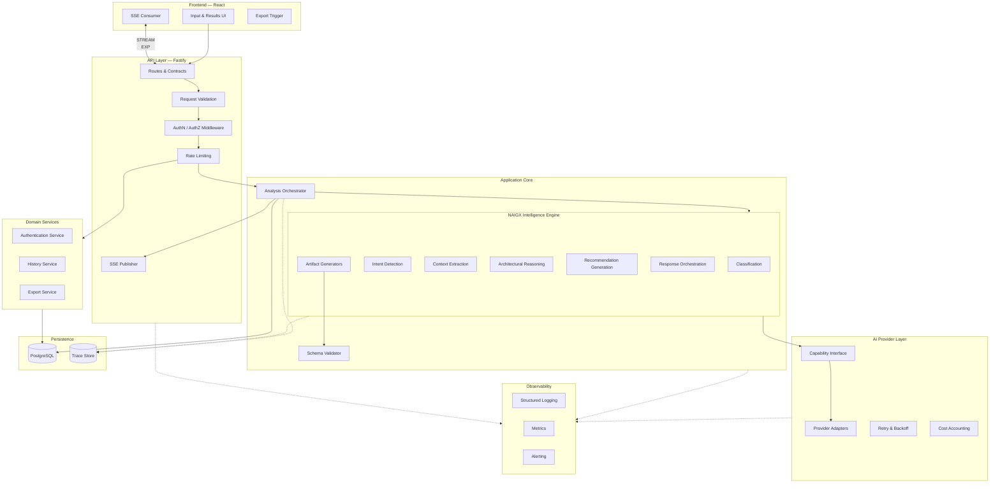

### 3.1 Frontend — React

**Owns:** presentation, input capture, client-side validation feedback, streaming consumption, local view state.

| Responsibility | Detail |
|---|---|
| Input capture | Single unified surface (`FR-001`); character limits surfaced (`FR-002`); input retained across failure (`FR-006`) |
| Streaming consumption | Subscribes to the analysis event stream; renders artifacts as they arrive (`FR-041`) |
| Result presentation | Hierarchy, layered depth, provenance and confidence treatment (`FR-040`, `FR-042`–`FR-045`) |
| Accessibility | WCAG 2.1 AA conformance is a frontend responsibility (`NFR-060`–`NFR-065`) |

**Never:** performs reasoning, calls a model provider, holds provider credentials, decides which artifacts should exist, or treats client-side validation as authoritative.

### 3.2 API Layer — Fastify

**Owns:** the HTTP contract, request validation, authentication and authorization enforcement, rate limiting, serialization, and the SSE publication channel.

| Responsibility | Detail |
|---|---|
| Contract enforcement | Schema-validated request and response bodies at the boundary |
| Authorization | Enforced server-side on every history and export operation (`NFR-026`) |
| Rate limiting | Per-account and per-IP on analysis submission (`NFR-025`) |
| Streaming | Publishes orchestrator events to subscribed clients |

**Never:** generates architecture, invokes a model provider, contains reasoning logic, or makes decisions about artifact composition. The API layer is transport and policy — nothing else.

### 3.3 Analysis Orchestrator

**Owns:** the lifecycle of an analysis job.

| Responsibility | Detail |
|---|---|
| Job lifecycle | Accept, enqueue, execute, complete, fail, time out (`FR-094`) |
| Stage sequencing | Invokes NIE stages in the fixed order (`FR-010`); enforces that no stage is bypassed |
| Artifact assembly | Collects artifacts as generated; applies degradation policy (`FR-091`) |
| Event publication | Emits artifact-completed events to the streaming channel |
| Persistence | Writes the completed analysis record |
| Trace emission | Records stage boundaries, durations, and outcomes (`FR-100`) |

**Never:** reasons about content, calls a provider directly, or decides *which* artifacts to generate — that decision is the NIE's response-orchestration stage (`FR-017`). The orchestrator executes the plan; it does not author it.

**Why this is separate from the NIE:** job lifecycle changes for operational reasons (timeouts, queuing, retry policy). Reasoning changes for quality reasons. Fusing them would make every operational change a risk to reasoning quality and vice versa (`AP-2`).

### 3.4 NAIGX Intelligence Engine

**Owns:** all reasoning. This is the system's core asset and its most protected boundary.

| Stage | Input | Output | PRD |
|---|---|---|---|
| Classification | Raw input text | Type + confidence | `FR-011` |
| Intent detection | Input + classification | Intent record, provenance-labelled | `FR-012` |
| Context extraction | Input + intent | Context elements with `stated`/`inferred`/`unknown` | `FR-013` |
| Architectural reasoning | Context | Architecture model | `FR-030` |
| Recommendation generation | Architecture + context | Recommendations with rationale and confidence | `FR-018`, `FR-034` |
| Response orchestration | All prior | Artifact plan: which artifacts, at what depth, with inclusion reasons | `FR-017` |
| Artifact generation | Plan + reasoning output | Schema-conforming artifacts | `FR-030`–`FR-038` |

**Structural properties:**
- **Pure module.** No HTTP awareness, no database awareness, no framework dependency. Dependencies (provider interface, template store, clock) are injected.
- **Deterministic control flow.** Which stages run, and which artifacts are planned, follows explicit rules — not model discretion (`TC-006`).
- **Independently testable.** Exercisable against the regression corpus with a stubbed provider, no infrastructure required. This is what makes `MVP` Sprint 2's quality gate executable.

**Never:** handles authentication, touches the database, knows a provider's identity, performs I/O other than through injected interfaces, or persists anything.

### 3.5 AI Provider Layer

**Owns:** every interaction with an external model provider.

| Responsibility | Detail |
|---|---|
| Capability interface | An abstract contract the NIE addresses; expressed in domain terms, not provider terms |
| Adapters | One per provider; translates the capability contract to a provider's API and normalizes responses |
| Retry & backoff | Bounded exponential retry on transient failure (`FR-093`, `NFR-013`) |
| Normalization | Uniform error taxonomy; provider errors never surface upward in provider-specific form |
| Cost & usage accounting | Token usage, latency, and cost recorded per call (`NFR-083`) |
| Routing | Stage-to-model routing configuration (`AI-003`) |

**Never:** contains reasoning logic, decides what to ask, interprets meaning in a response beyond structural normalization, or exposes provider identity upward (`AI-006`).

**The enforcement mechanism:** a CI check fails the build if any provider name or provider SDK import appears outside `provider/adapters/`. Convention is insufficient for a boundary this commercially important.

### 3.6 Authentication Service

**Owns:** identity, credentials, sessions.

| Responsibility | Detail |
|---|---|
| Registration & authentication | Email-based (`FR-070`) |
| Credential storage | Current password-hashing standard; never plaintext (`NFR-022`) |
| Session management | Issue, validate, expire |
| Anonymous session bridging | Claim an anonymous analysis into an account on signup (`FR-004`) |
| Account deletion | Cascade deletion of all user data (`FR-073`) |

**Never:** knows anything about analyses beyond ownership; participates in reasoning; makes authorization decisions about non-identity resources (that is the API layer, using identity this service supplies).

### 3.7 History Service

**Owns:** the lifecycle of stored analyses.

| Responsibility | Detail |
|---|---|
| Persistence | Store input, classification, artifacts, provenance, confidence, timestamps (`FR-060`) |
| Retrieval | Reproduce the stored result exactly. **Never regenerates.** |
| Listing | Reverse-chronological with derived titles (`FR-061`) |
| Deletion | Permanent, confirmed, cascading (`FR-063`) |

**Never:** re-runs an analysis on retrieval, mutates a stored artifact, or applies current templates to historical records. A stored analysis is an immutable record of what was produced at a point in time — this is what makes `FR-064` (re-analysis) a *new record* rather than an update.

### 3.8 Export Service

**Owns:** rendering a completed analysis into a distributable document.

| Responsibility | Detail |
|---|---|
| Markdown export | Structural fidelity; Mermaid source included (`FR-050`) |
| PDF export | Rendered diagrams; presentation-ready without reformatting |
| Fidelity guarantees | Provenance and confidence survive export (`FR-043`, `FR-050`) |
| Metadata | Generation date, classification, identifier, review disclaimer (`FR-051`) |

**Never:** generates content, invokes the NIE, or alters analysis substance. Export is a pure transformation of stored artifacts. If an export requires content the artifacts do not contain, the defect is in artifact generation.

### 3.9 Persistence

Two stores with different characteristics and different retention.

| Store | Contents | Retention | Why separate |
|---|---|---|---|
| **PostgreSQL** | Accounts, analyses, artifacts, feedback | User-controlled (`FR-063`, `FR-073`) | Relational, transactional, user-facing |
| **Trace store** | Stage-level reasoning traces, prompts, raw responses | Fixed period (`NFR-034`, `PRD O-5`) | High volume, write-heavy, operational not user-facing; must expire independently of user data |

The separation is a privacy requirement as much as a performance one: traces contain full input content and must expire on a defined schedule regardless of whether the user retains the analysis.

### 3.10 Observability

**Owns:** structured logging, metrics, alerting, health.

| Concern | Detail |
|---|---|
| Logging | Structured, correlation-ID-scoped across a full analysis (`NFR-080`); never contains credentials or full input (`NFR-081`) |
| Metrics | All `PRD §3.2` product metrics plus system metrics (`FR-102`) |
| Alerting | Completion rate, error rate, latency percentiles, schema validation failure rate (`NFR-082`, `NFR-084`, `NFR-085`) |
| Health | Liveness and readiness endpoints including provider reachability |

**Never:** blocks a request path. Telemetry failure must degrade silently rather than affect the user.

---

## 4. Request Lifecycle

### 4.1 Analysis submission flow

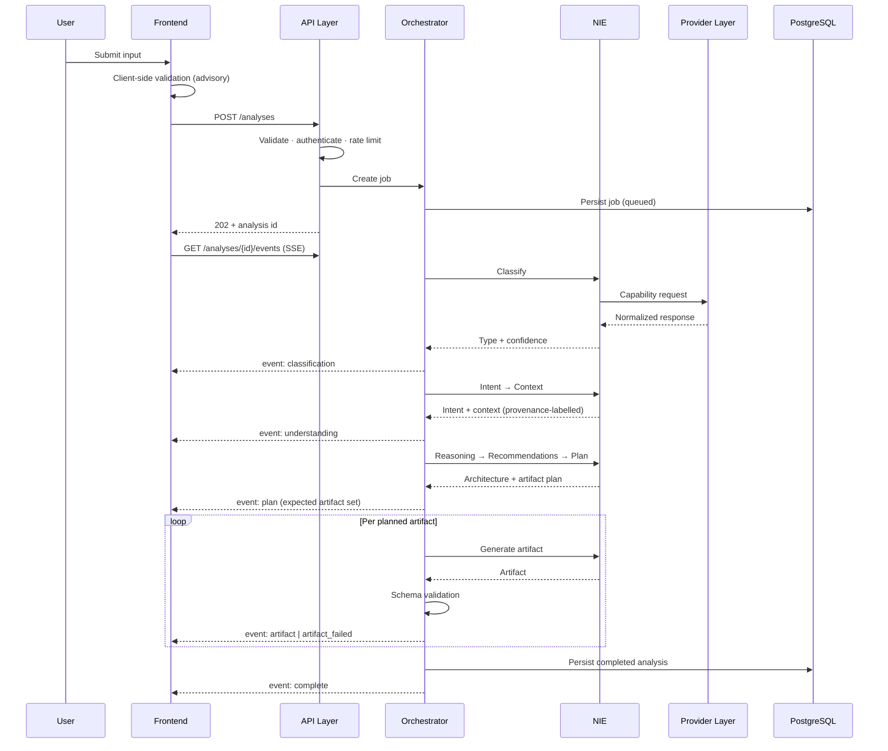

### 4.2 Stage specification

| # | Stage | Purpose | Input | Output | Owner | Failure behavior |
|---|---|---|---|---|---|---|
| 1 | **Client validation** | Immediate feedback; not authoritative | Raw text | Advisory result | Frontend | Blocks submission; input retained |
| 2 | **API validation** | Authoritative gate before any cost is incurred | Request body | Accepted or rejected | API layer | 4xx with corrective action (`FR-005`, `FR-090`) |
| 3 | **AuthN / AuthZ / rate limit** | Identity and abuse control | Session, IP | Authorized request | API layer | 401 / 429 |
| 4 | **Job creation** | Durable record before work starts | Validated input | Job id, status `queued` | Orchestrator | 5xx; nothing enqueued |
| 5 | **Classification** | Determine artifact type | Input text | Type + confidence | NIE | Low confidence → `FR-015`; unsupported → `FR-092` |
| 6 | **Intent detection** | Infer objective including unstated | Input + type | Intent record | NIE | Stage failure halts pipeline (`FR-010`) |
| 7 | **Context extraction** | Establish constraints with provenance | Input + intent | Context set, labelled | NIE | Halts pipeline; partial results none yet |
| 8 | **Architectural reasoning** | Derive the design | Context | Architecture model | NIE | Halts pipeline; degradation reported |
| 9 | **Recommendation generation** | Produce conclusions with rationale | Architecture + context | Recommendations + confidence | NIE | Halts pipeline |
| 10 | **Response orchestration** | Decide artifact set and depth | All prior | Artifact plan with inclusion reasons | NIE | Halts pipeline |
| 11 | **Artifact generation** | Produce each planned artifact | Plan + reasoning state | Artifacts | NIE generators | **Per-artifact.** Failure labelled; others continue (`FR-091`) |
| 12 | **Schema validation** | Guarantee no invalid output reaches a user | Artifact | Valid artifact or failure | Orchestrator | One regeneration attempt, then labelled failed (`FR-039`) |
| 13 | **Event publication** | Progressive delivery | Artifact events | SSE frames | Orchestrator | Stream failure does not fail the job; client can poll |
| 14 | **Persistence** | Durable record | Completed artifact set | Stored analysis | Orchestrator | Surfaced to user, never silent (`FR-060`) |
| 15 | **Rendering** | Presentation | Events + final record | Presented results | Frontend | Degraded render with failure labels |

**The pipeline boundary that matters:** stages 5–10 are sequential and halting — a failure stops the analysis, because every downstream stage depends on the output. Stage 11 is parallel and independently failable. This asymmetry is why failure granularity differs by stage and why `FR-091` is implementable at all.

---

## 5. Component Interaction

### 5.1 Interaction map

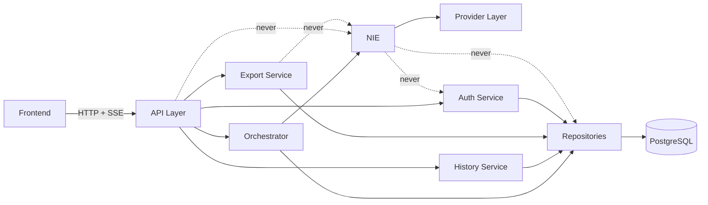

*Dotted lines are prohibited paths, shown to make them explicit.*

### 5.2 Interface contracts

| Interface | Between | Shape | Stability |
|---|---|---|---|
| **HTTP + SSE contract** | Frontend ↔ API | Versioned REST resources; server-sent events for analysis progress | Public within the system; breaking changes are versioned |
| **Orchestration interface** | API → Orchestrator | Job submission, status query, cancellation | Internal, stable |
| **Reasoning interface** | Orchestrator → NIE | Per-stage invocation with explicit input and output types | **Most stable interface in the system.** Changes require regression suite verification. |
| **Capability interface** | NIE → Provider layer | Domain-expressed capability request; normalized response envelope | Stable; adapters absorb provider change |
| **Repository interface** | Services → Persistence | Aggregate-oriented; no query construction leaks upward | Internal |
| **Template interface** | NIE → Template store | Versioned retrieval by stage and version (`AI-010`) | Internal |

### 5.3 Dependency direction

Dependencies point inward toward the domain. The NIE depends on nothing concrete.

```
Frontend → API → Orchestrator → NIE → Provider Interface
                      ↓                      ↑
                 Repositories          Adapters (concrete)
```

The provider interface is *defined by* the NIE and *implemented by* the adapter layer — dependency inversion at the boundary that matters most (`AP-4`). This is what makes provider substitution a configuration change.

### 5.4 Prohibited interactions

Binding constraints. Each has a rationale; violation is an architectural defect independent of test outcomes.

| Prohibition | Rationale |
|---|---|
| **Frontend never performs reasoning** | Reasoning must be testable, traceable, and consistent across clients. Client-side reasoning would be untraceable (`FR-103`) and inconsistent. |
| **Frontend never holds provider credentials** | `NFR-023`. Credentials are server-side only. |
| **Frontend validation is never authoritative** | `NFR-024`. All input is untrusted; server-side validation is the gate. |
| **API layer never generates architecture** | `AP-1`. Reasoning in the transport layer is untestable in isolation and accumulates by increment. |
| **API layer never invokes a provider** | Every provider call must be attributed to a reasoning stage for cost accounting and tracing. |
| **NIE never handles authentication** | `AP-2`. Identity is orthogonal to reasoning. Coupling them would make the NIE unexercisable without an auth context. |
| **NIE never touches the database** | Statelessness (`AP-3`) and testability. The NIE receives context and returns results; persistence is the orchestrator's concern. |
| **NIE never knows provider identity** | `AI-006`. Provider knowledge inside reasoning defeats substitutability. |
| **Orchestrator never decides artifact composition** | `FR-017` assigns this to the NIE's response orchestration stage. An orchestrator that chose artifacts would be reasoning. |
| **Export service never invokes the NIE** | Export must be a pure transformation. Generation at export time would produce documents inconsistent with what the user reviewed. |
| **History service never regenerates on retrieval** | `FR-060`. A stored analysis is an immutable record; regeneration would silently change history. |
| **No component makes outbound calls to user-owned platforms** | `TC-008`, enforcing `PV §3.1`. There is no HTTP client available to any component for this purpose. |
| **No component treats submitted content as instruction** | §10.5. Submitted artifacts are untrusted data throughout. |

---

## 6. Data Flow

### 6.1 End-to-end flow

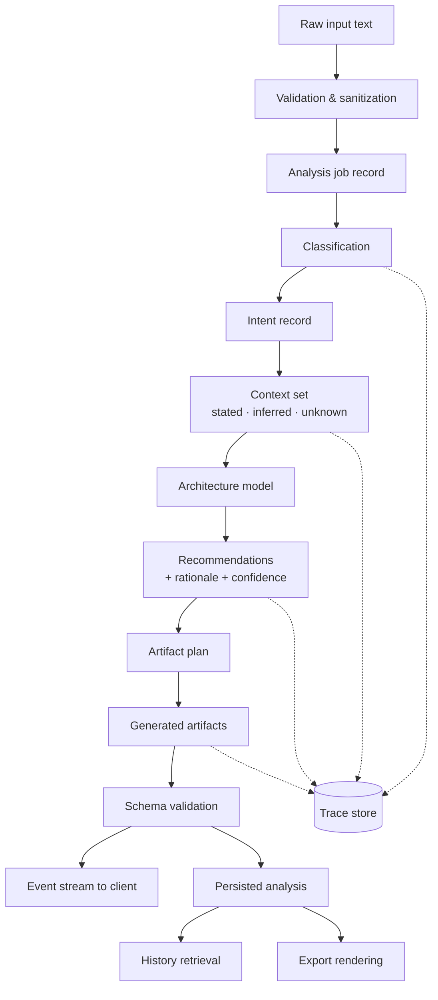

### 6.2 The provenance chain

The single most important data-flow property in the system.

Every context element carries `stated | inferred | unknown` (`FR-013`). Every downstream artifact records which context elements it derived from (`FR-103`). This chain must be unbroken from extraction through presentation to export.

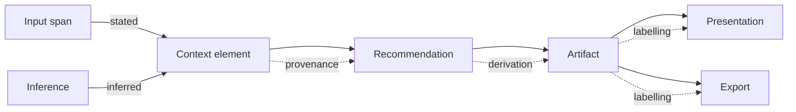

**Architectural consequence:** provenance is a property of the domain model, not a presentation concern. It must exist in the types the NIE produces, be persisted with the artifact, and be reconstructible from storage. An artifact stored without its provenance is unusable for quality review and cannot be exported correctly — which is why `MVP §5.2` places this in Sprint 1 rather than deferring it.

### 6.3 Flow by concern

| Concern | Path | Key property |
|---|---|---|
| **Inbound** | Client → API → validation → sanitization → job record | Sanitized before storage, rendering, and export (`NFR-024`) |
| **Context generation** | Input → classification → intent → context | Provenance assigned at extraction, never later |
| **Reasoning** | Context → architecture → recommendations | Each step records its inputs for traceability |
| **Output generation** | Plan → generators → schema validation | Invalid output never leaves this boundary (`FR-039`) |
| **Persistence** | Validated artifacts → repository → PostgreSQL | Written once on completion; immutable thereafter |
| **Retrieval** | Request → authorization → repository → response | Exact reproduction; no regeneration |
| **Export** | Stored artifacts → renderer → document | Pure transformation; no new content |
| **Trace** | Every stage → trace store (async) | Non-blocking; independent retention |

### 6.4 Data classification

| Class | Examples | Handling |
|---|---|---|
| **User business content** | Submitted requirements, workflows | Encrypted at rest (`NFR-021`); never in logs (`NFR-081`); never to third-party analytics (`NFR-035`); never used for training without opt-in (`NFR-030`) |
| **Generated artifacts** | Architecture, risks, recommendations | Same as above; user-deletable |
| **Trace data** | Prompts, raw responses, stage timings | Separate store; fixed retention (`NFR-034`); operator access only |
| **Identity** | Email, credential hash, sessions | Standard credential handling (`NFR-022`) |
| **Telemetry** | Latency, counts, cost | No content; safe for external observability tooling |

---

## 7. Service Boundaries

### 7.1 Boundary map

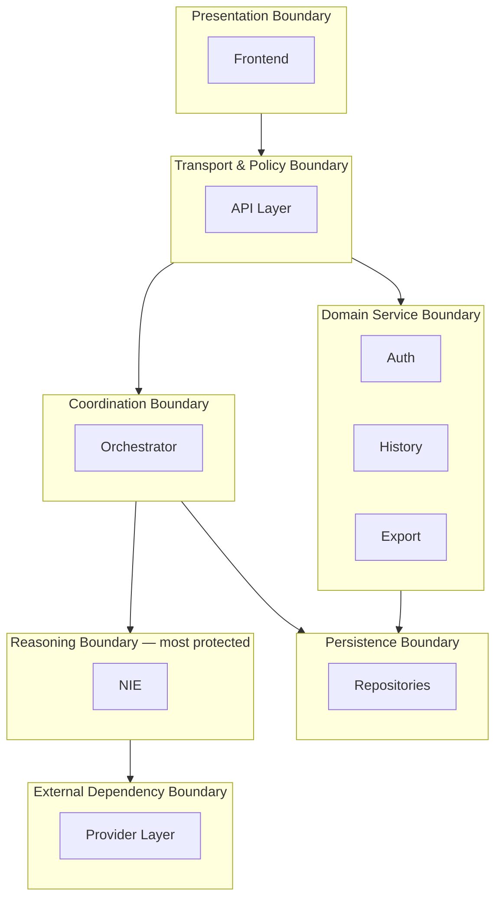

### 7.2 Why each boundary exists

| Boundary | Separated from | Reason | What drift would look like |
|---|---|---|---|
| **Presentation** | Everything | Multiple future surfaces (`AP-5`); the client is one consumer | Business rules encoded in components; client-side artifact decisions |
| **Transport & policy** | Coordination | HTTP concerns change independently of business flow | Route handlers accumulating orchestration logic |
| **Coordination** | Reasoning | Operational change (timeouts, queuing) must not risk reasoning quality | Orchestrator interpreting content; NIE managing job state |
| **Reasoning** | All infrastructure | Testability against the regression corpus; substitutability; it is the asset | Database access inside the NIE; framework types in reasoning signatures |
| **External dependency** | Reasoning | Provider independence is commercial, not stylistic (`R-10`) | Provider names in reasoning; prompts shaped around one provider's quirks |
| **Domain services** | Each other | Auth, history, and export change for unrelated reasons | Export reaching into auth; history triggering regeneration |
| **Persistence** | Domain | Schema change without domain change | Query construction in service logic; ORM types crossing into the NIE |

### 7.3 Anti-drift enforcement

Boundaries stated in a document erode. These are enforced mechanically:

| Boundary | Mechanism |
|---|---|
| No provider leakage | CI check: provider names and SDK imports fail the build outside `provider/adapters/` |
| NIE purity | CI check: no database, HTTP, or framework imports within the NIE module |
| No execution surface | CI check: no outbound HTTP client available outside the provider adapter (`TC-008`) |
| Layer direction | Dependency-direction lint; inward-only imports |
| Schema conformance | Runtime validation before presentation (`FR-039`); failures monitored (`NFR-084`) |
| Reasoning consistency | Regression suite gates all template changes (`NFR-043`) |

**Rationale for mechanical enforcement:** a single operator has no code review partner. Boundaries that depend on discipline will erode under time pressure, and the two most commercially consequential boundaries — provider independence and the execution prohibition — are exactly the ones that erode invisibly.

---

## 8. Integration Architecture

### 8.1 External dependencies

| Integration | Purpose | Coupling | Substitutable? |
|---|---|---|---|
| **Model providers** | Reasoning capability | Behind capability interface | Yes — configuration change (`AI-002`) |
| **PostgreSQL** | Primary persistence | Behind repository interface | Yes, with migration effort |
| **PDF rendering** | Export (`FR-050`) | Behind an export renderer interface | Yes |
| **Email delivery** | Authentication flows | Behind a notification interface | Yes |
| **Observability platform** | Logs, metrics, alerting | Standard protocols (OpenTelemetry-compatible) | Yes |
| **Hosting platform** | Compute, networking | Deliberately minimal proprietary surface | Yes, with effort |

**Absent by design:** every automation platform (n8n, Make, Zapier, Power Automate, Node-RED). NAIGX reasons *about* these platforms and never *connects to* them. This is `TC-008`, enforced by §7.3.

### 8.2 Provider integration model

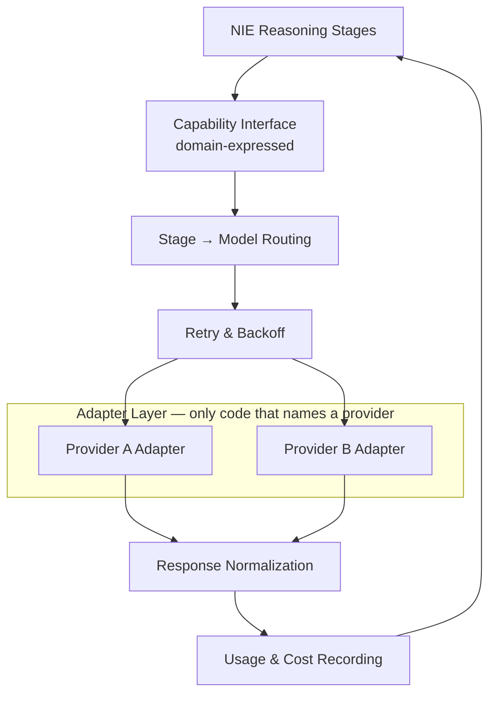

**Properties:**

| Property | Requirement | Mechanism |
|---|---|---|
| Substitutability | `AI-001`, `AI-005` | Adapters implement a single interface; a second adapter is exercised in CI |
| Per-stage routing | `AI-003` | Routing configuration maps stage → model; different stages may use different models |
| Configuration without deploy | `AI-002` | Provider and model resolved from configuration at runtime |
| Failure isolation | `FR-093` | Provider errors normalized to a uniform taxonomy before crossing the boundary |
| Cost visibility | `NFR-083`, `R-13` | Usage recorded per call, aggregated per analysis |
| Version recording | `AI-004` | Provider and model version written to the run trace |

**The verification that matters:** a second adapter is not aspirational. `AI-005` requires an automated test that exercises it, because an untested abstraction is an assumption, and `R-10` is a business risk this abstraction exists to hedge.

### 8.3 Future integration posture

| Future integration | Permitted? | Constraint |
|---|---|---|
| Read-only platform data (v2.0) | Yes, with review | Credential handling requires security review; read-only enforced at the adapter |
| Knowledge sources for platform constraints (`O-4`) | Yes | Must be neutral; no commercial relationship may shape representation (`PV §3.3`) |
| Identity providers / SSO (v3.0) | Yes | Behind the existing auth interface |
| **Any write or execution capability** | **No** | `TC-008`, `PV §3.1`. Permanently excluded. |

---

## 9. Deployment Architecture

### 9.1 Topology

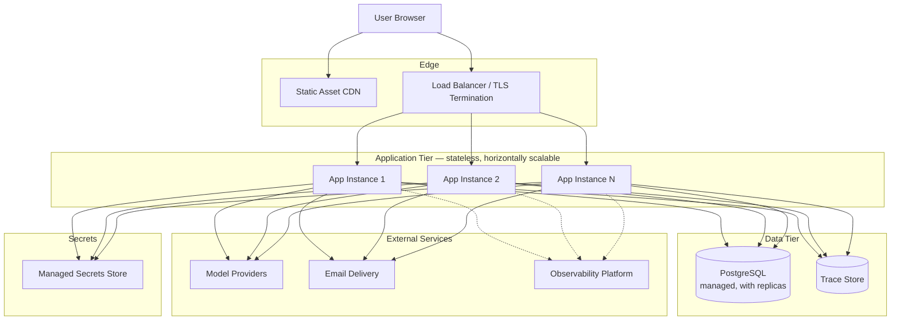

### 9.2 Environments

| Environment | Purpose | Data | Providers | Notes |
|---|---|---|---|---|
| **Development** | Local iteration | Local database, seeded | Stubbed by default; live provider opt-in | NIE exercisable with a stub provider — no network required |
| **Staging** | Pre-release verification | Isolated; synthetic and regression corpus only | Live providers, separate keys | Production-equivalent topology; **no production data, ever** |
| **Production** | Live service | User data, encrypted | Live providers, production keys | Managed services preferred (`TC-009`) |

### 9.3 Deployment properties

| Property | Approach | Rationale |
|---|---|---|
| **Stateless application tier** | No session affinity; no local state (`AP-3`) | Enables horizontal scaling without coordination |
| **Single deployable unit** | Frontend assets + API in one pipeline | One operator; minimal deployment surface (`TC-009`) |
| **Managed data services** | Managed PostgreSQL with automated backup | Operational burden must be sustainable by one person |
| **Rollback** | Previous release redeployable; migrations backward-compatible within one version | `TM-17` requires verified rollback |
| **Template rollback independent of code** | Templates are versioned assets resolved at runtime (`AI-014`) | Reasoning quality regressions must be reversible without a deploy |
| **Secrets** | Managed secrets store; injected at runtime; never in source or images (`NFR-023`) | Provider keys are the highest-value secret in the system |
| **Health checks** | Liveness and readiness including provider reachability | Prevents routing traffic to instances that cannot reason |

### 9.4 Job execution in v1.0

Analysis jobs execute **in-process on the receiving instance**, with job state persisted to PostgreSQL.

| Consequence | Handling |
|---|---|
| An instance restart mid-analysis loses in-flight work | Job marked failed; user sees a clear failure and may retry (`FR-090`). Acceptable at v1.0 volume. |
| SSE requires the client to reach the executing instance | Load balancer session affinity for the event stream only; polling fallback if the stream drops |
| No cross-instance work distribution | Not required at v1.0 volume |

**Migration path:** the orchestrator's job interface is defined so that an external queue and dedicated workers can replace in-process execution without changing the NIE or the API contract (§13.1). This is deliberately *not* built now (`MVP §4.6`).

---

## 10. Security Architecture

### 10.1 Trust boundaries

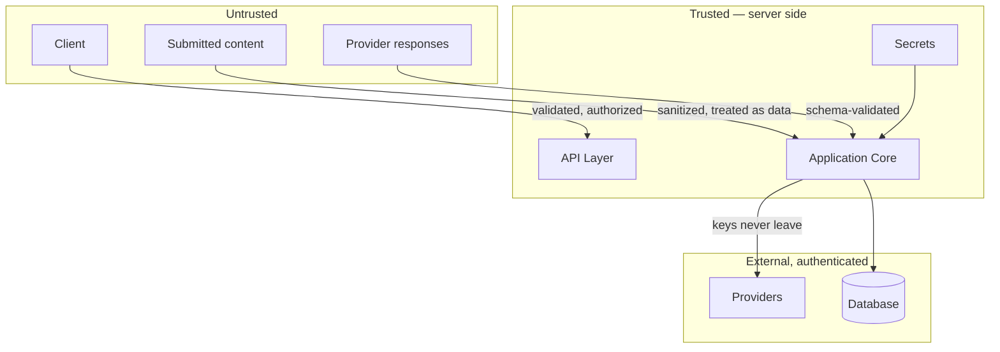

**Three sources are untrusted, including one that is easy to overlook:** the client, submitted content, and *model provider responses*. Provider output is schema-validated before use (`FR-039`) and never executed, rendered unescaped, or treated as instruction.

### 10.2 Authentication and authorization

| Concern | Approach |
|---|---|
| Authentication | Email-based; credentials hashed with a current standard (`NFR-022`) |
| Session handling | Server-validated tokens; expiry enforced server-side |
| Authorization | Enforced at the API layer on every history and export operation (`NFR-026`); ownership checked against the authenticated identity, never against a client-supplied identifier |
| Anonymous access | One analysis without account (`FR-004`); anonymous analyses are unaddressable by other sessions |
| Privilege model | Single role in v1.0 (`MVP §4.5`). No admin surface in the application. |

### 10.3 API security

| Control | Detail |
|---|---|
| Transport | TLS 1.2+ enforced; HSTS (`NFR-020`) |
| Input validation | Schema validation at the boundary; server-side authoritative (`NFR-024`) |
| Rate limiting | Per-account and per-IP on analysis submission (`NFR-025`); stricter limits on anonymous |
| Output encoding | No user or model content rendered without escaping (`NFR-027`) |
| Error responses | No stack traces, provider names, or internal identifiers (`FR-090`) |
| CORS | Restricted to known origins |

### 10.4 Secrets management

| Rule | Rationale |
|---|---|
| Provider keys server-side only, never transmitted to a client (`NFR-023`) | A leaked provider key is both a cost and a reputational event |
| Secrets injected at runtime from a managed store; never in source, images, or configuration files | Prevents accidental commit and image-layer exposure |
| Separate credentials per environment | Limits blast radius of a staging compromise |
| Secrets never logged (`NFR-081`) | Log aggregation is a common exfiltration path |
| Rotation possible without code change | Rotation that requires a deploy does not happen |

### 10.5 Prompt injection protection

**The threat is structural, not incidental.** NAIGX ingests untrusted artifacts — job descriptions from public boards, workflow exports from unknown sources, business requirements from third parties. Any of these may contain text directed at the system.

| Control | Detail |
|---|---|
| **Content is data, never instruction** | Submitted content is passed as delimited data with explicit framing. Instructions embedded in it are treated as content to be analyzed, not directives to follow. |
| **Structural isolation** | Reasoning templates and user content occupy distinct roles in every provider request. Content is never concatenated into an instruction position. |
| **Output schema constraint** | Every artifact is schema-validated (`FR-039`). Injection that succeeds in altering generation still produces output that must conform, sharply limiting achievable effect. |
| **No capability to abuse** | The strongest control: the system has no tools, no outbound calls to user platforms, and no execution surface (`TC-008`). A successful injection can, at most, degrade the quality of a document shown to the user who submitted it. |
| **No cross-user context** | Statelessness (`AP-3`) means no analysis can influence another user's results. |
| **Anomaly monitoring** | Schema validation failures and classification anomalies are monitored (`NFR-084`) as a detection signal. |

**Architectural note:** the absence of an execution surface is a security property as much as a product principle. `PV §3.1` and `TC-008` are the reason prompt injection is a quality risk here rather than a compromise risk. This is worth stating explicitly, because any future proposal to add execution capability changes the threat model fundamentally — not incrementally.

### 10.6 Data privacy

| Requirement | Implementation |
|---|---|
| Encryption in transit and at rest | `NFR-020`, `NFR-021` |
| No training use without explicit opt-in | `NFR-030`; enforced at the provider adapter through provider configuration, and verified as part of provider onboarding |
| No submitted content to third-party analytics | `NFR-035`; telemetry carries no content (§6.4) |
| Trace content expiry independent of user data | `NFR-034`; separate store with its own retention |
| User-initiated deletion | `FR-063`, `FR-073`; cascading and permanent |
| Data export | `FR-072`; self-service |

### 10.7 Audit logging

| Logged | Not logged |
|---|---|
| Authentication events, authorization failures | Credentials, tokens, provider keys |
| Analysis creation, retrieval, deletion | Full submitted content (`NFR-081`) |
| Export generation | Personal content in telemetry |
| Account deletion | — |
| Rate limit and abuse events | — |

Audit records carry the correlation identifier spanning a full analysis (`NFR-080`), enabling reconstruction of a sequence of actions without exposing content.

---

## 11. Error Handling Strategy

### 11.1 Failure taxonomy

| Class | Examples | Recovery | User-visible outcome |
|---|---|---|---|
| **Validation** | Input too short, unsupported file | None — user action required | Corrective message; input retained (`FR-005`, `FR-006`) |
| **Classification** | Low confidence, unsupported type | User confirmation or decline | Confirmation prompt (`FR-015`) or explained decline (`FR-092`) |
| **Provider transient** | Rate limit, timeout, 5xx | Bounded exponential retry (`NFR-013`) | Invisible if retry succeeds |
| **Provider persistent** | Outage, auth failure, quota exhausted | Fail the stage; no provider detail exposed (`FR-093`) | Generic failure with retry option |
| **Schema validation** | Malformed artifact | One regeneration attempt (`FR-039`) | Artifact labelled failed if regeneration fails |
| **Artifact generation** | Single generator failure | Isolated; other artifacts continue (`FR-091`) | Partial results, failure labelled |
| **Pipeline stage** | Failure in stages 5–10 | Halt; no downstream stages (`FR-010`) | Analysis failed with stage indication |
| **Timeout** | Analysis exceeds maximum | Terminate; preserve completed artifacts (`FR-094`) | Partial results plus timeout notice |
| **Persistence** | Write failure | Surfaced, never silent (`FR-060`) | Explicit warning that the analysis was not saved |
| **Streaming** | SSE connection drop | Client polls for status | Results still retrievable; no data loss |

### 11.2 Degradation model

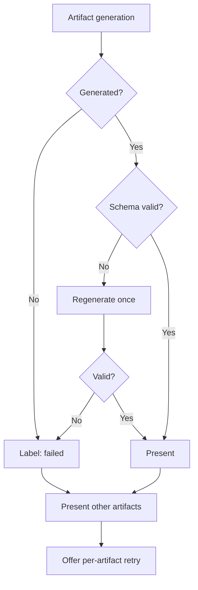

**Three invariants:**

1. **Never silently omit.** A failed artifact is labelled failed, and is visually distinct from an artifact the system deliberately chose not to generate (`FR-017`, `FR-091`). Conflating "failed" with "not applicable" would misrepresent the system's reasoning.
2. **Never discard completed work.** Any failure preserves and presents what succeeded.
3. **Never expose internals.** No stack trace, provider name, or internal identifier reaches a user (`FR-090`, `AI-006`). Full detail goes to the trace.

### 11.3 Retry policy

| Scope | Policy |
|---|---|
| Provider transient errors | Exponential backoff, jittered, bounded attempt count |
| Schema validation failure | Exactly one regeneration attempt per artifact |
| Pipeline stages 5–10 | No automatic retry — a stage failure indicates a systematic issue, and retrying multiplies cost without changing the outcome |
| User-initiated | Per-artifact retry from results; full re-analysis from input |

**Why stages 5–10 do not auto-retry:** these stages are deterministic in structure. If classification or context extraction fails, the same input will produce the same failure. Retrying spends provider cost to reproduce a fault. The right response is to fail visibly and record the trace.

---

## 12. Observability

### 12.1 The three signals

| Signal | Purpose | Retention |
|---|---|---|
| **Logs** | Discrete events; debugging | Short, operational |
| **Metrics** | Aggregate behavior; alerting | Long, low cardinality |
| **Traces** | Per-analysis reasoning reconstruction (`FR-100`) | Fixed period (`NFR-034`) |

### 12.2 Logging

| Property | Requirement |
|---|---|
| Structure | Machine-parseable; correlation ID spans a full analysis (`NFR-080`) |
| Exclusions | No credentials, no keys, no full submitted content (`NFR-081`) |
| Levels | Error for actionable failures only; warnings must be actionable or they are noise |
| Correlation | Analysis ID, user ID (where applicable), request ID present on every related entry |

### 12.3 Metrics

| Category | Metrics | Source |
|---|---|---|
| **Product** | Completion rate, time to first artifact, full latency, export rate, return rate, flag rate | `PRD §3.2`, `FR-102` |
| **Reasoning quality** | Classification override rate, schema validation failure rate, regeneration rate | `M-6`, `NFR-084` |
| **Provider** | Latency, error rate by class, token usage, cost per analysis | `NFR-083` |
| **System** | Request rate, error rate, instance health, database latency | Standard |

**Schema validation failure rate is the leading quality indicator.** It rises before user-visible quality degrades, making it the most valuable single metric for detecting a bad template release.

### 12.4 Tracing

Every analysis produces a trace recording, per stage: input, output, duration, template version, provider, model version, token usage, and outcome (`FR-100`, `AI-004`, `AI-013`).

**Requirement:** any analysis must be diagnosable from its trace without re-running it (`EV-3`). This is what makes the manual quality review protocol in `PRD §14.1` executable, and what allows a quality regression to be attributed to a specific template version.

### 12.5 Alerting

| Alert | Threshold | Severity |
|---|---|---|
| Completion rate drop | Below 95% (`NFR-010`, `NFR-085`) | High |
| Latency breach | p95 above `NFR-001` / `NFR-002` | Medium |
| Schema validation failure spike | Deviation from baseline (`NFR-084`) | High |
| Provider error rate | Sustained elevation | High |
| Cost per analysis breach | Above the defined ceiling (`TV-4`) | Medium |
| Persistence failure | Any occurrence | Critical |

**Alerting discipline for a single operator:** every alert must be actionable and must correspond to a documented response. An alert nobody acts on trains the operator to ignore the channel, which is worse than having no alert.

### 12.6 Health checks

| Check | Verifies |
|---|---|
| Liveness | Process responsive |
| Readiness | Database reachable; provider reachable; templates loadable |

Readiness includes provider reachability so that traffic is not routed to an instance that would accept an analysis it cannot perform.

---

## 13. Scalability Strategy

### 13.1 Horizontal scaling

The application tier is stateless (`AP-3`, `NFR-050`). Scaling is instance count.

**The one v1.0 constraint:** in-process job execution (§9.4) ties an analysis to the instance that accepted it. The migration path is defined and deliberately unbuilt:

| Step | Change | What is unaffected |
|---|---|---|
| 1 | Replace in-process queue with an external broker behind the existing job interface | NIE, API contract, frontend |
| 2 | Extract job execution into dedicated worker processes | NIE, API contract, frontend |
| 3 | Replace SSE with a broker-backed pub/sub channel | NIE, orchestration logic |

Each step is mechanical because the orchestrator's job interface was defined to permit it. Building it now would violate `MVP §4.6` — this is expensive-to-add-later *interface* work done early, with the *implementation* deferred.

### 13.2 Adding AI providers

Add an adapter implementing the capability interface; register it; configure routing (`AI-002`, `AI-003`). No change to reasoning logic, orchestration, or the API. Verified continuously by the second-provider test (`AI-005`).

### 13.3 Adding input types

`AP-6` and `NFR-044`. A new input type requires: a classification category, a path definition registering which artifacts it plans, and its reasoning templates. **No existing path is modified.**

This is the specific extensibility that matters, because it is how the product grows without destabilizing the paths already validated.

### 13.4 Adding output artifacts

A new artifact requires: a schema, a generator implementing the generator interface, and registration in the relevant paths' plans. Existing generators are untouched — this is why generators must never reach into one another (`AP-6`).

### 13.5 Enterprise features (v3.0)

| Capability | Architectural requirement | Foreclosed by v1.0? |
|---|---|---|
| Multi-user | Ownership model extends from user to organization | No — ownership is already an explicit concept, not an implicit one |
| Permissions | Authorization layer extends at the API boundary | No — authorization is already centralized there |
| Audit | Audit logging already exists (§10.7) | No |
| Shared workspaces | New domain service | No |

**The deliberate omission:** v1.0 does not build multi-tenancy (`MVP §4.5`). It avoids *precluding* it by keeping ownership explicit at the persistence boundary rather than assuming a single implicit owner throughout.

### 13.6 Scaling limits acknowledged

| Limit | When it binds | Response |
|---|---|---|
| In-process job execution | Sustained concurrent analyses exceed single-instance capacity | §13.1 migration |
| Single primary database | Write volume or trace volume | Read replicas; trace store already separate |
| Provider rate limits | Concurrency exceeds provider quota | Multi-provider routing (`AI-003`) already supported |
| Single-operator response capacity | Incident volume | Managed services (`TC-009`); actionable-only alerting |

---

## 14. Architectural Risks

### 14.1 Technical

| ID | Risk | Impact | Likelihood | Mitigation |
|---|---|---|---|---|
| AR-01 | Reasoning logic leaks into orchestration or routes, making the NIE untestable | High | Medium | CI purity checks (§7.3); regression suite operates on the NIE directly |
| AR-02 | Structured generation fails at an unacceptable rate | High | Medium | Schema validation with bounded regeneration (`FR-039`); failure rate as leading indicator (§12.3) |
| AR-03 | Provenance chain breaks between generation and export | High | Medium | Provenance in the domain model, not presentation (§6.2); verified by `AC-006` |
| AR-04 | Template change causes silent quality regression | High | High | Versioned templates; mandatory regression gate (`NFR-043`); runtime rollback (`AI-014`) |
| AR-05 | Latency exceeds tolerance | High | Medium | Progressive streaming (`FR-041`); first-artifact latency as a distinct target |
| AR-06 | SSE proves unreliable across proxies and networks | Medium | Medium | Polling fallback; results retrievable independent of the stream |

### 14.2 Operational

| ID | Risk | Impact | Likelihood | Mitigation |
|---|---|---|---|---|
| AR-10 | Instance restart loses in-flight analyses | Medium | Medium | Job state persisted; clear failure and retry (§9.4). Accepted at v1.0 volume. |
| AR-11 | Alert fatigue causes real incidents to be missed | High | Medium | Actionable-only alerting (§12.5); every alert has a documented response |
| AR-12 | Operational burden exceeds single-operator capacity | Critical | Medium | Managed services (`TC-009`); no self-operated infrastructure in v1.0 |
| AR-13 | Trace volume outgrows storage or budget | Medium | Medium | Separate store with enforced retention (`NFR-034`) |

### 14.3 Scaling

| ID | Risk | Impact | Likelihood | Mitigation |
|---|---|---|---|---|
| AR-20 | In-process execution becomes the bottleneck | Medium | Low at v1.0 | Migration path defined and interface-ready (§13.1) |
| AR-21 | Provider rate limits cap concurrency | Medium | Medium | Per-stage routing across providers (`AI-003`) |
| AR-22 | Per-analysis cost makes scale uneconomic | High | Medium | Cost recorded per analysis; orchestration limits unnecessary generation (`FR-017`) |

### 14.4 Security

| ID | Risk | Impact | Likelihood | Mitigation |
|---|---|---|---|---|
| AR-30 | Prompt injection via submitted content | Medium | High | §10.5. Impact bounded by the absence of an execution surface. |
| AR-31 | Provider key compromise | Critical | Low | Managed secrets; runtime injection; rotation without deploy; never logged |
| AR-32 | Unauthorized access to another user's analyses | Critical | Low | Server-side ownership checks on every operation (`NFR-026`); never trust client-supplied identifiers |
| AR-33 | Confidential business content exposed via logs or telemetry | Critical | Low | Content excluded from logs (`NFR-081`) and telemetry (`NFR-035`); trace store access-restricted |
| AR-34 | Model output rendered unescaped | High | Low | Provider responses treated as untrusted (§10.1); output encoding enforced (`NFR-027`) |

### 14.5 Dependency

| ID | Risk | Impact | Likelihood | Mitigation |
|---|---|---|---|---|
| AR-40 | Provider pricing, terms, or availability change adversely | High | Medium | Adapter boundary; verified second provider (`AI-005`); per-stage routing |
| AR-41 | Provider model behavior changes, degrading quality silently | High | High | Model version recorded per run (`AI-004`); regression suite detects drift; pinned versions where supported |
| AR-42 | Managed service lock-in | Medium | Medium | Standard protocols; minimal proprietary surface (§8.1) |
| AR-43 | An abstraction assumed to work is never exercised | High | Medium | `AI-005` requires the second provider be tested, not merely possible |

---

## 15. Future Architecture Evolution

The architectural philosophy does not change across versions. What changes is what sits inside the boundaries already drawn.

### 15.1 Version 1.0 — Modular monolith, stateless reasoning

Single deployment unit. Strict internal boundaries. In-process job execution. One primary database plus a trace store.

**Philosophy established here:** reasoning isolated and pure; providers behind an adapter; no execution surface; observability by default; boundaries mechanically enforced.

### 15.2 Version 2.0 — Contextual reasoning, distributed execution

`PV §8` Stage 2. The NIE gains access to a user's accumulated context.

| Change | Boundary impact |
|---|---|
| Context store introduced as a retrieval dependency injected into the NIE | **None.** The NIE remains stateless per invocation — context is supplied as input, not held. This is the property that makes the extension non-architectural. |
| External queue and dedicated workers (§13.1) | Orchestrator implementation only; NIE and API contract unchanged |
| Knowledge substrate for platform constraints | New injected dependency behind an interface; must be neutral (`PV §3.3`) |
| Read-only platform integrations | New adapter category; **read-only enforced architecturally**, never write |

**The principle that must survive:** context improves reasoning; it must never become lock-in (`MVP §11`). Architecturally, this means accumulated context must be exportable and must not be required for output to be portable.

### 15.3 Version 3.0 — Multi-tenancy, service extraction

`PV §8` Stage 3–4. Teams, organizations, governance, and estate-level analysis.

| Change | Boundary impact |
|---|---|
| Ownership extends from user to organization | Persistence and authorization layers; ownership is already explicit |
| Permission model | API authorization layer, already centralized |
| NIE extracted as a service | Interface already exists; extraction becomes transport substitution |
| Estate analysis | New reasoning paths over a wider input scope — **analysis only, never operation** (`PV §3.1`) |

### 15.4 Invariants across all versions

| Invariant | Never changes |
|---|---|
| Reasoning is isolated and infrastructure-free | The NIE never gains database, HTTP, or auth awareness |
| Providers are substitutable | No provider knowledge outside the adapter |
| No execution surface | No outbound capability to user platforms, at any version (`PV §3.1`) |
| Provenance is unbroken | Every recommendation traceable to its context |
| Stateless per invocation | Context is input, never retained state |
| Observability is built in, not added | Every stage traces |

---

## 16. Architecture Decision Summary

| # | Decision | Reason | Benefits | Trade-offs | Future impact |
|---|---|---|---|---|---|
| AD-01 | **Modular monolith, not microservices** | Single operator (`TC-009`); v1.0 volume | Minimal deployment and failure surface; fast iteration | Cannot scale components independently | Boundaries drawn at future service seams; extraction is mechanical |
| AD-02 | **NIE as an in-process pure module** | Testability against the regression corpus; it is the asset under test | No infrastructure needed to exercise reasoning; deterministic tests | Shares process resources with the API | Extractable as a service in v3.0 without interface change |
| AD-03 | **Provider adapter with CI-enforced boundary** | `AI-001`; hedges `R-10` | Provider substitution is configuration; commercial risk bounded | Abstraction cost; lowest common denominator across providers | Enables multi-provider routing and pricing arbitrage |
| AD-04 | **Asynchronous jobs with SSE streaming** | 15–120s analyses; `FR-041` first-artifact target | Progressive results; artifact-level failure isolation | More complex than request-response; SSE reliability varies | Migrates to broker-backed pub/sub without contract change |
| AD-05 | **In-process job execution in v1.0** | `MVP §4.6` — no evidence a broker is needed | No broker to operate; simpler failure modes | Instance restart loses in-flight work | Interface permits external queue substitution |
| AD-06 | **Provenance in the domain model** | `FR-013`; cannot be retrofitted | Quality review possible; export fidelity; explainability | Every artifact type carries the cost | Foundation for v2.0 contextual reasoning |
| AD-07 | **Separate trace store** | Different volume, access, and retention than user data | Independent expiry (`NFR-034`); privacy separation | Two stores to operate | Trace volume scales independently |
| AD-08 | **Schema-validated structured output** | `TC-005`, `FR-039` | Invalid output never reaches a user; bounds injection impact | Regeneration cost; constrains output shape | Leading quality indicator (§12.3) |
| AD-09 | **No outbound capability to user platforms** | `TC-008` enforcing `PV §3.1` | Neutrality preserved; threat model bounded | Cannot offer platform-connected convenience | Permanent. Reversal changes the product and the threat model |
| AD-10 | **Stateless reasoning** | `AP-3`, `TC-004` | Horizontal scalability; reproducibility; testability | Full context per request; larger payloads | v2.0 context is supplied as input, preserving the property |
| AD-11 | **API-first with the client as one consumer** | `TC-003`, `AP-5` | Future surfaces are additive | Some indirection for a single client | CLI, IDE, programmatic access without re-architecture |
| AD-12 | **Composition-based paths and generators** | `AP-6`, `NFR-044` | New input types and artifacts by registration | Registration indirection | Product growth without destabilizing validated paths |
| AD-13 | **Mechanical boundary enforcement in CI** | No code review partner; the two costliest boundaries erode invisibly | Drift caught at build time | Build configuration to maintain | Survives team growth; becomes onboarding documentation |
| AD-14 | **Templates as versioned runtime assets** | `AI-010`–`AI-014`; `R-14` | Reasoning rollback without deploy; per-run attribution | Asset management outside the code lifecycle | Enables safe reasoning iteration at any scale |
| AD-15 | **Managed services throughout** | `TC-009` | Operational burden sustainable by one person | Cost; some vendor coupling | Reduces as team grows; standard protocols limit lock-in |
| AD-16 | **Immutable stored analyses** | `FR-060`; history must not silently change | Reproducible records; auditable | Storage grows; re-analysis creates new records | Basis for v2.0 longitudinal context |

---

## Appendix A — Boundary Enforcement Checklist

Verified in CI on every build. A failure blocks the build.

| # | Check | Enforces |
|---|---|---|
| 1 | No provider name or SDK import outside `provider/adapters/` | `AI-001`, AD-03 |
| 2 | No database, HTTP, or framework import inside the NIE module | AD-02, `AP-3` |
| 3 | No outbound HTTP client available outside the provider adapter | `TC-008`, AD-09 |
| 4 | Dependency direction inward only | `AP-1` |
| 5 | Every artifact type has a registered schema | `FR-039`, AD-08 |
| 6 | Every pipeline stage emits a trace event | `AP-8`, `FR-100` |
| 7 | Regression suite passes before any template change merges | `NFR-043`, AD-14 |
| 8 | Second-provider test passes | `AI-005`, AR-43 |

---

## Appendix B — Open Architectural Questions

Recorded rather than resolved prematurely. Each has a decision point.

| # | Question | Decide by | Constraint on the answer |
|---|---|---|---|
| AQ-1 | Trace store technology — relational, document, or object storage | Sprint 1 | Must support independent retention (`NFR-034`) and operator query without production data access |
| AQ-2 | SSE versus polling as the primary result channel | Sprint 3 | Must meet the `FR-041` first-artifact target; polling fallback required regardless |
| AQ-3 | PDF rendering approach — server-side headless render versus document library | Sprint 4 | Must render Mermaid diagrams and preserve provenance treatment (`FR-050`) |
| AQ-4 | Whether stage-to-model routing is exposed as configuration in v1.0 or fixed | Sprint 2 | Must not become user-facing configurability (`MVP §10`, non-goal) |
| AQ-5 | Template storage — repository assets versus a runtime store | Sprint 1 | Must permit rollback without code deploy (`AI-014`) |
| AQ-6 | Whether the regression suite runs against live providers or recorded responses | Sprint 2 | Must detect model drift (`AR-41`) while remaining affordable to run on every change |

---

## Appendix C — Provenance

This document specifies the architecture of a pre-implementation product built by a single operator. It contains no requirements, no delivery dates, and no claims of customers, revenue, or team.

**Document hierarchy.** Product Vision governs the PRD. The PRD governs requirements. MVP Scope governs sequence. This document governs structure. Where this document appears to define behavior, it is defective — behavior belongs in the PRD.

| Version | Date | Change |
|---|---|---|
| 1.0 | 2026-08-11 | Initial System Architecture. Derived from Executive Summary v1.1, Product Vision v1.1, PRD v1.0, MVP Scope v1.0. |
