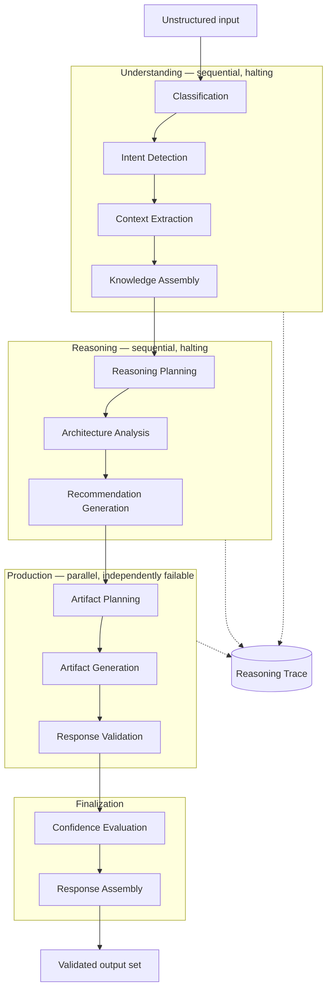
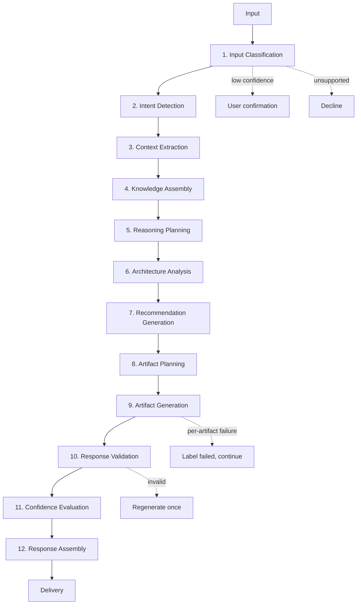
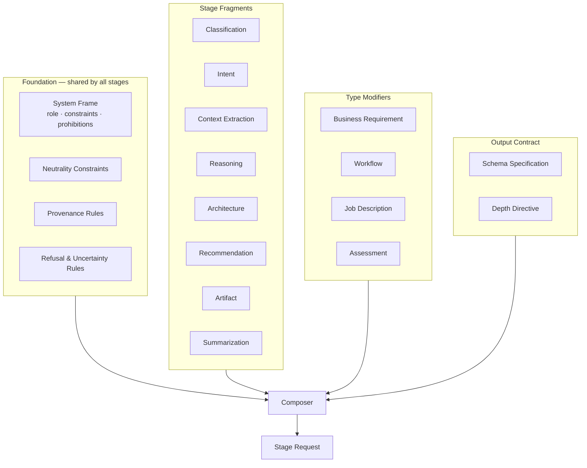
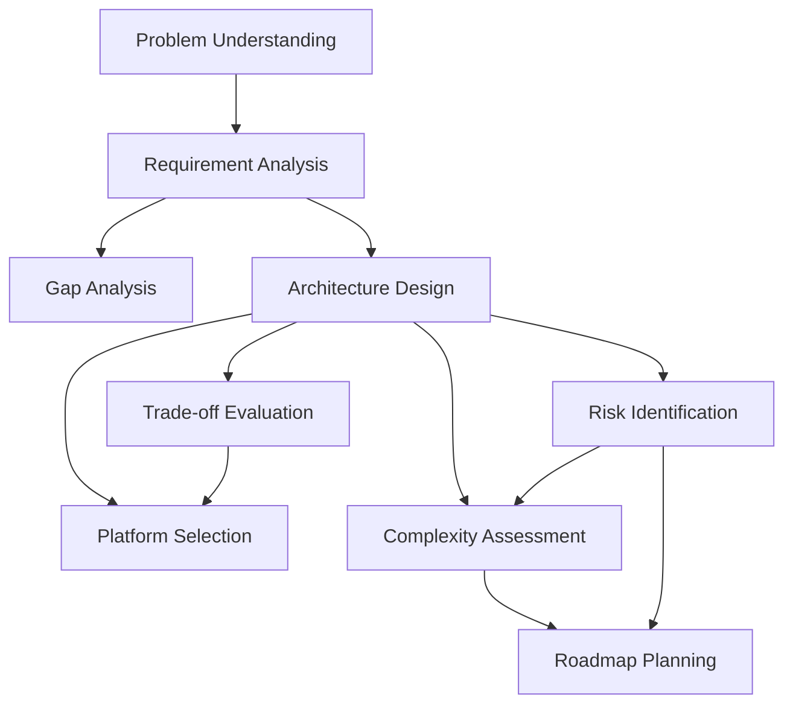
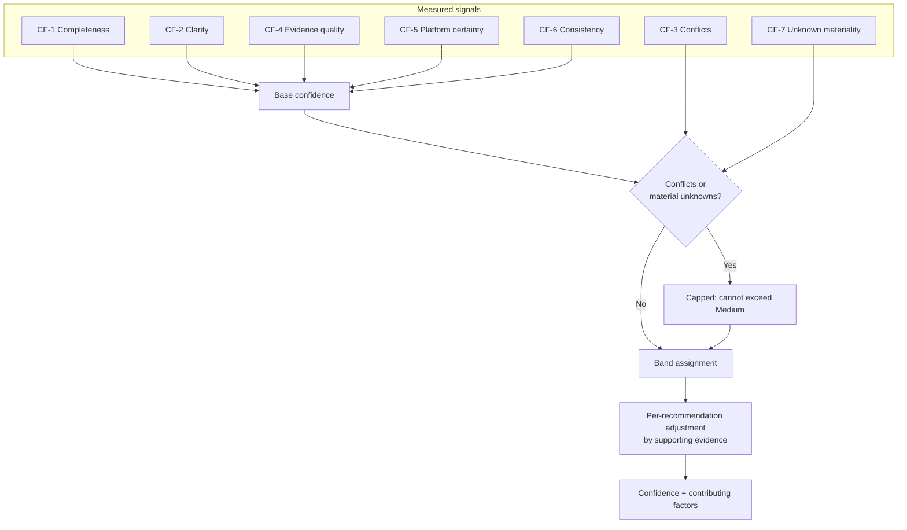
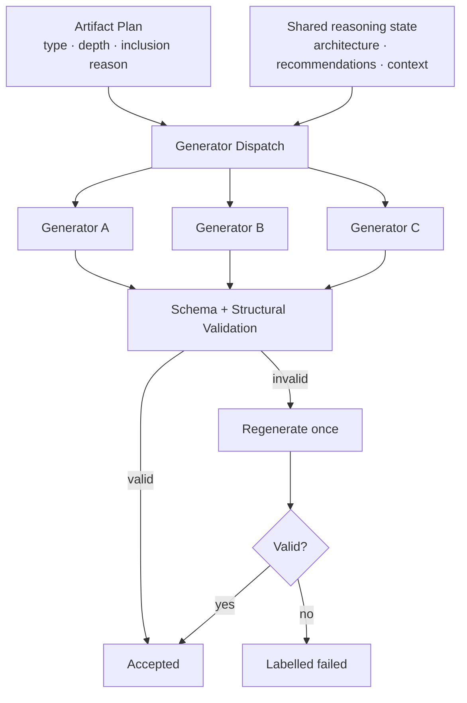
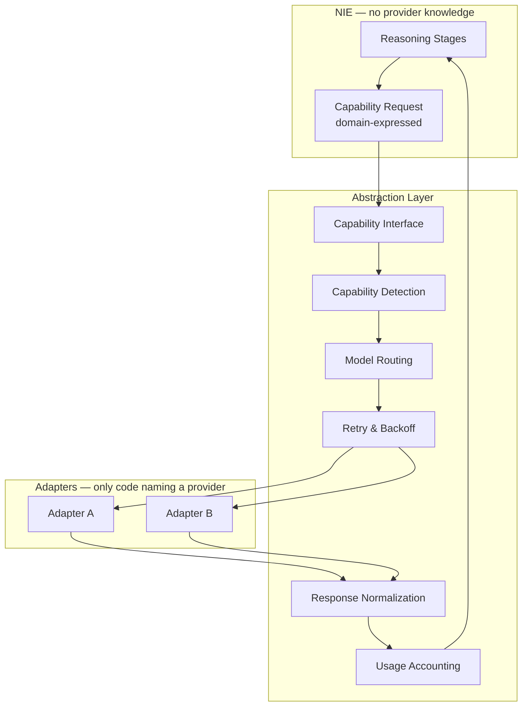
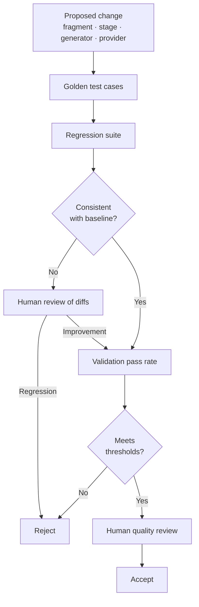

# NAIGX — AI Architecture

**Authoritative specification for the NAIGX Intelligence Engine (NIE).**

| Field | Value |
|---|---|
| Product | NAIGX — Automation Intelligence Platform |
| Subject | NAIGX Intelligence Engine (NIE) |
| Document type | AI Architecture (canonical) |
| Sources of truth | Executive Summary v1.1 · Product Vision v1.1 · PRD v1.0 · MVP Scope v1.0 · System Architecture v1.0 |
| Function | Defines how the intelligence layer reasons, orchestrates, validates, and produces output |
| Version | 1.0 |
| Last updated | 2026-08-11 |

---

## How this document is used

The System Architecture (`SA`) defines how the *platform* is structured. This document defines how the *intelligence* works: the reasoning pipeline, the prompt architecture, the confidence model, the artifact system, and the quality apparatus that governs all of it.

It introduces no product requirements. Behavior is defined by PRD requirement IDs; this document specifies the internal design that satisfies them.

**Three standing constraints:**

1. **No provider assumptions.** Nothing here may depend on a specific model's capabilities, quirks, or interface. Where a design accommodates model variability, it does so generically (§10).
2. **No implementation.** Prompt text, schemas, and code belong in the repository. This document specifies their structure, ownership, and lifecycle.
3. **The Product Vision governs.** `PV §3.4` (Reason Before Recommend) and `PV §3.5` (Explain Every Decision) are architectural requirements here, not aspirations. A design that makes them harder to satisfy is wrong.

---

## 1. AI Architecture Overview

### 1.1 What the NIE is

The NIE is a **staged reasoning system**: a deterministic pipeline of discrete stages, each with typed input and output, that transforms an unstructured artifact into a set of validated, explained, confidence-annotated outputs.

It is not a prompt wrapper. The distinction is load-bearing. A prompt wrapper sends a request and returns what comes back; its quality is entirely inherited from the model. The NIE imposes structure the model does not supply on its own: a fixed reasoning sequence, provenance tracking, deterministic artifact planning, schema validation, and confidence derived from evidence rather than asserted by the model. **That structure is the product** (`ES §6.2`), and it is what persists when the underlying model is replaced.

### 1.2 Why reasoning is separated from application logic

Four reasons, in order of weight.

**It is the system under test.** `MVP §3` makes the entire v1.0 an experiment on reasoning quality. An experiment requires that the thing under test be isolatable. The NIE must be exercisable against the regression corpus with no HTTP, no database, and a stubbed provider — otherwise the Sprint 2 quality gate cannot run, and quality regressions cannot be attributed.

**It changes for different reasons than everything else.** Reasoning changes when quality improves. Application logic changes when operational needs change. `SA AP-2` requires these be separable; fusing them makes every operational change a quality risk.

**It must be replaceable in parts.** Stages, prompt fragments, artifact generators, and providers each evolve on independent schedules. A monolithic reasoning implementation forces them to change together.

**It carries the durable value.** Models improve and are replaced. What does not transfer to a competitor is the accumulated reasoning discipline: what to ask, in what order, what to check, what to refuse to assert. That asset must live somewhere identifiable, versionable, and testable.

### 1.3 Position in the platform

Per `SA §3.4`, the NIE is a pure in-process module: no HTTP awareness, no database access, no framework dependency, no authentication concern. Its dependencies — the provider capability interface, the template store, the knowledge source, a clock — are injected.

| The NIE receives | The NIE returns | The NIE never |
|---|---|---|
| Raw input text | Classification with confidence | Persists anything |
| Injected dependencies | Intent and context records with provenance | Knows a provider's identity |
| Configuration | An artifact plan with inclusion reasons | Manages job lifecycle |
| — | Validated artifacts with rationale and confidence | Handles identity or authorization |
| — | A complete reasoning trace | Performs I/O outside injected interfaces |

The Analysis Orchestrator (`SA §3.3`) executes the plan the NIE authors. The NIE decides *what* should be produced; the orchestrator decides *when and how* the work runs. That division is why operational changes never touch reasoning.

---

## 2. AI Design Principles

Eight principles. Each states what it forbids, because a principle that forbids nothing constrains nothing.

---

### AIP-1 — Reason Before Recommend

**Understanding is a prerequisite stage, not a preamble generated alongside the answer.**

The pipeline enforces this structurally: recommendation generation cannot execute until architecture analysis has completed, which cannot execute until context extraction has completed (`FR-010`). This is sequencing enforced by the pipeline, not a request made of the model.

The failure this prevents is specific and invisible without it. A model asked for a recommendation and a rationale in one request produces the recommendation first and constructs the rationale to fit — post-hoc justification presented as reasoning. Neither the system nor the user can distinguish it from actual derivation.

**Forbids:** any stage that produces a conclusion and its justification in the same generation step; any pipeline shortcut that skips understanding for simple inputs.

---

### AIP-2 — Evidence Before Confidence

**Confidence is derived from measurable properties of the input and the reasoning, never asserted by the model.**

A model asked "how confident are you?" produces a number correlated with fluency rather than correctness. The NIE computes confidence from factors it can inspect: input completeness, ratio of stated to inferred context, presence of contradictions, cross-stage consistency (§8).

**Forbids:** model-self-reported confidence used as the confidence value; uniform confidence across a set whose underlying certainty differs (`AI-021`).

---

### AIP-3 — Facts Before Assumptions

**Every context element is labelled `stated`, `inferred`, or `unknown` at the moment of extraction, and that label survives to presentation and export.**

Provenance assigned later is provenance invented later. The label must be produced by the stage that establishes the element (`FR-013`), because only that stage has access to the source span.

**Forbids:** context elements without provenance; inference silently promoted to fact downstream; unknowns filled with plausible defaults (`AI-042`).

---

### AIP-4 — Explain Every Recommendation

**A recommendation is emitted as a structure that includes its rationale, its supporting context references, and its rejected alternatives where informative.**

This is a data-model constraint, not a prompting instruction. A recommendation type that permits an empty rationale will eventually carry one. Making rationale structurally mandatory means an unexplained recommendation cannot be represented.

**Forbids:** recommendation structures where rationale is optional; explanations that restate the conclusion rather than support it (`AI-033`); rationale that cannot be traced to specific context elements (`FR-103`).

---

### AIP-5 — Composable Prompt Architecture

**Prompts are composed from independently versioned fragments assembled per stage — never monolithic per-path templates.**

`AI-012` forbids a single template covering the full pipeline. The reason is maintenance arithmetic: with four input paths and ten artifact types, monolithic templates produce forty artifacts to maintain, in which a shared improvement must be applied forty times and will be applied inconsistently. Composition means a shared fragment is fixed once.

**Forbids:** duplicated instruction text across templates; path-specific copies of shared reasoning guidance; templates that cannot be composed or tested in isolation.

---

### AIP-6 — Model Independence

**The NIE addresses an abstract capability, never a provider.**

`AI-001`, enforced by CI (`SA §7.3`). This extends beyond avoiding provider names: prompts must not be shaped around one provider's known quirks, and the pipeline must not depend on a capability only one provider offers. Where a capability varies, the NIE degrades to the common denominator (§10.2).

**Forbids:** provider names or SDK types in reasoning code; prompt phrasing tuned to a single model's idiosyncrasies; pipeline logic conditional on which provider is active.

---

### AIP-7 — Deterministic Where Possible

**Everything that can be decided by rule is decided by rule. The model is used only where judgment is genuinely required.**

Artifact planning, stage sequencing, validation, confidence computation, and depth selection are deterministic (`TC-006`). Classification, extraction, reasoning, and generation involve the model.

This is not conservatism. Every decision delegated to the model is a decision that varies between runs, cannot be tested deterministically, and cannot be explained by reference to a rule. `FR-024` requires consistency across similar inputs — achievable only if the varying surface is minimized.

**Forbids:** model discretion over which artifacts are produced; model-determined pipeline flow; validation performed by asking a model whether output is valid.

---

### AIP-8 — Graceful Failure

**Failure granularity matches dependency structure. Partial results are honest results.**

Understanding and reasoning stages halt on failure — everything downstream depends on them. Artifact generation fails per artifact (`FR-091`). A failed artifact is labelled failed and is visually distinct from one deliberately omitted (`FR-017`).

**Forbids:** silent omission; discarding completed work on later failure; substituting a generic artifact for a failed one; presenting degraded output without disclosure.

---

## 3. Intelligence Pipeline

### 3.1 Structure

### 3.2 Stage specifications

---

#### Stage 1 — Input Classification

| | |
|---|---|
| **Purpose** | Determine what kind of artifact was submitted, so downstream reasoning applies the correct frame |
| **Input** | Raw input text |
| **Output** | Type ∈ {business_requirement, existing_workflow, job_description, technical_assessment, mixed, unsupported}, confidence ∈ [0,1], candidate alternatives |
| **Responsibilities** | Content-derived determination only (`FR-011`); no user hint required; emit candidates when close |
| **Determinism** | Model-assisted; output constrained to the enumerated set |
| **Failure behavior** | Confidence < 0.6 → surface candidates for user confirmation (`FR-015`). `unsupported` → decline with explanation, no reasoning performed (`FR-092`). Stage failure → analysis fails; nothing downstream runs. |

---

#### Stage 2 — Intent Detection

| | |
|---|---|
| **Purpose** | Establish what the user is trying to accomplish, including objectives they did not state |
| **Input** | Input text + classification |
| **Output** | Intent record: primary objective, secondary objectives, inferred scope — each labelled `stated` or `inferred` |
| **Responsibilities** | Distinguish the literal request from the underlying goal; identify the decision the user faces |
| **Determinism** | Model-assisted; structured output |
| **Failure behavior** | Halting. Downstream reasoning without intent would produce output unanchored to any purpose. |

**Why this is a distinct stage:** the same artifact submitted by different users needs different treatment. A workflow export submitted for review requires different output than the same export submitted as a template to adapt. Classification identifies the artifact; intent identifies the question.

---

#### Stage 3 — Context Extraction

| | |
|---|---|
| **Purpose** | Establish the constraint set the design must satisfy, with honest provenance |
| **Input** | Input text + intent |
| **Output** | Context set: constraints, environment, scale, dependencies, systems — each with provenance `stated` (with source span) / `inferred` (with basis) / `unknown` (with what would resolve it) |
| **Responsibilities** | Extract without embellishment; assign provenance at extraction (`AIP-3`); enumerate material unknowns |
| **Determinism** | Model-assisted extraction; provenance assignment rule-checked — `stated` elements must be traceable to a span, verified structurally |
| **Failure behavior** | Halting. Also produces the insufficiency signal: if too few elements are `stated`, the analysis is flagged as operating on thin evidence, which propagates to confidence (§8) and to user-facing disclosure (`FR-044`). |

**This is the most consequential stage in the pipeline.** Everything downstream is derived from it, and provenance cannot be reconstructed after the fact.

---

#### Stage 4 — Knowledge Assembly

| | |
|---|---|
| **Purpose** | Assemble the reference knowledge the reasoning stages require |
| **Input** | Context set + classification |
| **Output** | Assembled knowledge set: relevant platform characteristics, applicable patterns, known failure modes, applicable rules |
| **Responsibilities** | Select only relevant knowledge; label knowledge currency; apply neutrality constraints (`PV §3.3`) |
| **Determinism** | **Deterministic in v1.0.** Selection is rule-based over a curated set. |
| **Failure behavior** | Non-halting. Missing knowledge degrades to reasoning without it, with affected recommendations receiving reduced confidence and explicit uncertainty disclosure. |

**v1.0 scope note.** Platform knowledge in v1.0 is a small curated set with an explicit currency caveat (`PRD O-4`). Where a platform characteristic is uncertain or may have changed, the engine discloses uncertainty rather than asserting (`AI-042`). This stage is the designed insertion point for the v2.0 knowledge substrate (§14.2) — it exists in v1.0 primarily so that the later addition is not architectural.

---

#### Stage 5 — Reasoning Planning

| | |
|---|---|
| **Purpose** | Determine which reasoning is required and at what depth, before performing it |
| **Input** | Intent + context + knowledge |
| **Output** | Reasoning plan: required analyses, depth level, complexity pre-assessment |
| **Responsibilities** | Match effort to problem; identify which reasoning modules apply |
| **Determinism** | **Deterministic.** Rules over classification, intent, and context signals (`AIP-7`). |
| **Failure behavior** | Cannot fail independently — a rule evaluation. A plan producing no analyses indicates upstream failure and halts. |

**Why plan before reasoning:** this is where `PV §3.2` depth-proportionality becomes mechanical. A three-step notification requirement produces a shallow plan; a multi-system orchestration produces a deep one. Deciding this by rule, before generation, is what prevents over-production (`AI-044`) rather than trying to suppress it afterward.

---

#### Stage 6 — Architecture Analysis

| | |
|---|---|
| **Purpose** | Derive the design: components, boundaries, data flow, integration points, failure handling |
| **Input** | Context + knowledge + reasoning plan |
| **Output** | Architecture model: components with responsibilities and I/O, integrations with direction, failure handling per component, each traceable to context elements |
| **Responsibilities** | Every component justified by a context element; no component addressing nothing (`FR-030`) |
| **Determinism** | Model-assisted; schema-constrained; traceability structurally verified |
| **Failure behavior** | Halting for architecture-producing paths. Traceability verification failure triggers one regeneration; persistent failure fails the stage rather than emitting an unjustifiable design. |

---

#### Stage 7 — Recommendation Generation

| | |
|---|---|
| **Purpose** | Produce conclusions the user can act on and defend |
| **Input** | Architecture model + context + knowledge |
| **Output** | Recommendations, each with: the conclusion, the criteria applied, referenced context elements, rejected alternatives with reasons, per-recommendation confidence input signals |
| **Responsibilities** | Take a position (`PV §3.3` — neutrality is unbiased, not non-committal); name what was rejected and why (`AI-031`); permit negative conclusions (`AI-040`) |
| **Determinism** | Model-assisted; structure mandatory (`AIP-4`) |
| **Failure behavior** | Halting. A recommendation missing rationale or context references fails validation and is regenerated once, then fails. |

**The negative-conclusion requirement is structural.** "Do not automate this" and "this design is unsound" must be representable outcomes of this stage, not exceptions handled elsewhere. A stage that can only emit positive recommendations will emit one regardless of whether it is warranted.

---

#### Stage 8 — Artifact Planning

| | |
|---|---|
| **Purpose** | Decide which artifacts to produce, at what depth, with recorded reasons for inclusion and omission |
| **Input** | Classification + intent + complexity assessment + reasoning plan |
| **Output** | Artifact plan: artifact types with depth level, inclusion reason per artifact, omission reason per omitted artifact |
| **Responsibilities** | `FR-017`. Proportionality (`AI-044`). Distinguish omission from failure. |
| **Determinism** | **Deterministic.** Rule-based, inspectable (`TC-006`). |
| **Failure behavior** | Cannot fail independently. An empty plan for a supported classification indicates upstream failure. |

**Why the model does not choose:** artifact selection asked of a model produces an inconsistent, unexplainable, untestable set that varies between runs on identical input — directly violating `FR-024`. Rules are inspectable, testable, and explainable to the user.

---

#### Stage 9 — Artifact Generation

| | |
|---|---|
| **Purpose** | Produce each planned artifact |
| **Input** | Artifact plan + architecture model + recommendations + context |
| **Output** | Generated artifacts conforming to their schemas |
| **Responsibilities** | One generator per artifact type; generators are independent (`SA AP-6`); each carries provenance and confidence through |
| **Determinism** | Model-assisted per artifact; schema-constrained |
| **Failure behavior** | **Per-artifact and isolated** (`FR-091`). One generator failing does not affect others. A failed artifact is labelled failed and offered for retry. |

**Generator independence is a hard constraint.** No generator may read another generator's output. All shared inputs come from the reasoning stages. This is what makes adding an artifact type a registration rather than a modification (`SA §13.4`), and what keeps failures isolated.

---

#### Stage 10 — Response Validation

| | |
|---|---|
| **Purpose** | Guarantee that no invalid or unsupported output reaches a user |
| **Input** | Generated artifacts |
| **Output** | Validated artifacts, or per-artifact validation failure |
| **Responsibilities** | Schema conformance (`FR-039`); structural checks: rationale present, context references resolve, provenance present, no assertion beyond the context set |
| **Determinism** | **Fully deterministic.** No model involvement (`AIP-7`). |
| **Failure behavior** | One regeneration attempt per artifact; persistent failure → artifact labelled failed. Invalid output is never presented. |

**Validation is deterministic by design.** Asking a model to validate model output introduces a second unreliable judgment to check the first, produces no auditable pass/fail record, and doubles cost. Everything checked here is checkable structurally.

Validation classes:

| Class | Check |
|---|---|
| Schema | Conforms to the artifact's declared schema |
| Rationale completeness | Every recommendation carries non-empty rationale (`AIP-4`) |
| Reference integrity | Every context reference resolves to a real extracted element |
| Provenance integrity | Every context-derived claim carries its provenance label |
| Unsupported-claim detection | No assertion of a constraint absent from the context set (§11.3) |
| Internal consistency | Diagram nodes match architecture components (`FR-031`); executive summary does not contradict detail (`FR-038`) |

---

#### Stage 11 — Confidence Evaluation

| | |
|---|---|
| **Purpose** | Assign evidence-derived confidence to each recommendation and to the analysis overall |
| **Input** | Context set, validation results, cross-stage consistency signals |
| **Output** | Confidence bands per recommendation and per analysis, each with contributing factors |
| **Responsibilities** | §8. Never model-self-reported (`AIP-2`) |
| **Determinism** | **Fully deterministic.** Computed from measured factors. |
| **Failure behavior** | Cannot fail independently. Missing factors default to the conservative value — absent evidence lowers confidence, never raises it. |

---

#### Stage 12 — Response Assembly

| | |
|---|---|
| **Purpose** | Compose the final output set for delivery |
| **Input** | Validated artifacts + confidence + provenance + plan metadata |
| **Output** | Complete response: artifacts, confidence, provenance, unknowns, omission reasons, failure labels |
| **Responsibilities** | Ensure disclosure completeness — unknowns surfaced (`FR-044`), omissions distinguished from failures, degradation disclosed |
| **Determinism** | **Fully deterministic.** |
| **Failure behavior** | Assembly failure fails the analysis; partial assembly is not permitted, since an incompletely assembled response cannot guarantee disclosure. |

### 3.3 Pipeline properties

| Property | Stages | Consequence |
|---|---|---|
| **Halting** | 1–8 | Failure stops the analysis; downstream depends on output |
| **Isolated** | 9 | Per-artifact failure; others proceed |
| **Deterministic** | 5, 8, 10, 11, 12 | Testable without a provider; explainable by rule |
| **Model-assisted** | 1, 2, 3, 6, 7, 9 | Requires regression testing; subject to drift |
| **Traced** | All | Every stage emits input, output, duration, fragment versions, model version (`FR-100`) |

**Five of twelve stages require no model.** This is deliberate: it bounds cost, bounds variability, and means a substantial share of pipeline behavior is unit-testable with no provider at all.

---

## 4. Input Classification

### 4.1 Classification taxonomy

| Type | Definition | Downstream effect |
|---|---|---|
| **business_requirement** | A description of a business need or process to be automated, without an existing implementation | Full generative path: architecture, platform, risk, complexity, roadmap |
| **existing_workflow** | A description or export of an implemented automation | Review path: current-structure identification precedes evaluation; optimization and risk emphasis |
| **job_description** | A role posting for an automation or adjacent position | Career path: requirement extraction, gap analysis, portfolio, interview guidance. No architecture generated. |
| **technical_assessment** | A challenge, exercise, or take-home problem | Assessment path: solution architecture with explicit trade-off reasoning and named rejected alternatives |
| **mixed** | Contains two or more types in material proportion | Handled per §4.3 |
| **unsupported** | Outside the domain of automation intelligence | Declined with explanation; no reasoning performed (`FR-092`) |

### 4.2 How classification shapes downstream reasoning

Classification is not a routing label. It changes the reasoning frame at four points:

| Point | Effect |
|---|---|
| **Intent priors** | A job description implies a career objective; a workflow export implies review or adaptation. Stage 2 reasons within the frame classification establishes. |
| **Context schema** | What counts as a constraint differs. For a requirement: volume, systems, latency. For a posting: seniority, must-have versus nice-to-have, tooling. Stage 3 extracts against a type-appropriate schema. |
| **Reasoning modules** | Stage 5 selects modules by type. Architecture design applies to requirements and assessments; gap analysis applies to postings. |
| **Artifact plan** | Stage 8 rules are type-scoped. A posting never produces an architecture; a requirement never produces interview guidance. |

**A misclassification is therefore not a mislabel — it is an analysis conducted under the wrong frame.** This is why classification is displayed and correctable (`FR-014`) and why override rate is tracked as a quality signal (`M-6`).

### 4.3 Ambiguous and mixed inputs

| Situation | Handling |
|---|---|
| **Confidence below threshold** | Candidates surfaced; user confirms or allows the best guess to proceed (`FR-015`). Low-confidence classification is recorded on the output. |
| **Genuinely mixed** | Dominant type determines the primary frame; the secondary is disclosed. **v1.0 does not run parallel paths** — proportional depth on two frames from one input exceeds MVP scope. The user may resubmit the secondary content separately, and the system says so. |
| **Domain-adjacent but unsupported** | Declined with an explanation of what is supported. Adjacency is not accepted as sufficient — a plausible-looking analysis of an out-of-scope artifact is worse than a decline. |
| **Unsupported** | Declined; input retained for revision (`FR-006`, `FR-092`) |

**The v1.0 mixed-input decision is a deliberate scope choice, recorded as such.** Handling mixed inputs well requires either parallel paths or a merged frame; both are meaningful work with no bearing on the core hypothesis (`MVP §3`).

### 4.4 Classification quality

| Control | Mechanism |
|---|---|
| Accuracy target | ≥95% on the regression corpus (`M-6`) |
| Correction | User override re-runs the pipeline with type fixed (`FR-014`) |
| Signal | Override rate tracked as the inverse accuracy measure |
| Constrained output | Classification is a closed enumeration; free-form type output is structurally impossible |
| Regression coverage | ≥10 fixed inputs per type, including deliberate near-boundary cases (`MVP` Sprint 0) |

---

## 5. Context Assembly

### 5.1 Context sources and precedence

Context is assembled from ordered sources. **Precedence resolves conflicts; it is not a mixing weight.**

| Rank | Source | Authority | v1.0 |
|---|---|---|---|
| 1 | **User input** | Highest. What the user stated is authoritative about their own situation. | Yes |
| 2 | **User correction** | Overrides system inference (`FR-014`). The user's authority over their own context is absolute (`PV §3.6`). | Yes (classification only) |
| 3 | **Internal rules** | Domain invariants and reasoning constraints. Cannot be overridden by inference. | Yes |
| 4 | **Platform knowledge** | Curated platform characteristics, currency-labelled | Yes, minimal |
| 5 | **Prompt fragments** | Reasoning framing and structure | Yes |
| 6 | **Configuration** | Depth defaults, routing, thresholds | Yes |
| 7 | **Historical analysis** | Prior analyses by the same user | **No — v2.0** (`PV §8` Stage 2) |

### 5.2 Precedence rules

| Conflict | Resolution |
|---|---|
| Stated input vs. inferred context | Stated wins, always |
| Stated input vs. platform knowledge | Input wins for the user's situation; knowledge wins for platform facts. Disagreement is disclosed rather than silently resolved. |
| Inferred context vs. platform knowledge | Knowledge wins; the inference is dropped and recorded |
| Internal rule vs. anything | Rule wins. Rules encode invariants (e.g. neutrality) that must not be overridable. |
| Two stated elements conflicting | **Neither wins.** The contradiction is surfaced as an unknown with the conflict described. This lowers confidence (§8) and appears in disclosure (`FR-044`). |

**The contradiction rule matters most.** A model asked to reason over contradictory requirements will silently choose one and proceed, producing confident output on a resolved-by-guess premise. Detecting and surfacing the contradiction is more valuable than resolving it — the user knows which side is correct and the system does not.

### 5.3 Context record structure

Every element carries:

| Field | Purpose |
|---|---|
| Content | The constraint, environment fact, or dependency |
| Category | Constraint, environment, scale, dependency, system, objective |
| Provenance | `stated` \| `inferred` \| `unknown` |
| Source reference | For `stated`: the input span. For `inferred`: the basis. For `unknown`: what would resolve it. |
| Confidence input | Contribution to §8 evaluation |
| Conflict flag | Set when contradicting another element |

### 5.4 Context sufficiency

Stage 3 produces a sufficiency assessment:

| Level | Condition | Effect |
|---|---|---|
| **Sufficient** | Enough stated context to derive a defensible design | Normal analysis |
| **Thin** | Analysis possible but inference-heavy | Analysis proceeds; confidence reduced; unknowns prominent (`FR-044`) |
| **Insufficient** | Any design would be substantially invented | **Analysis does not proceed to reasoning.** The system states what is missing and what would resolve it. |

**The insufficient case is a designed outcome, not an error.** `PV §5` names the insufficient-input moment as one of four that define the product. A system that always produces an analysis produces fiction when input does not support one.

---

## 6. Prompt Architecture

### 6.1 Composition model

Prompts are assembled from versioned fragments. No monolithic per-path template exists (`AI-012`, `AIP-5`).

### 6.2 Fragment catalogue

| Fragment | Responsibility | Changes when |
|---|---|---|
| **System frame** | Role, standing constraints, absolute prohibitions | Product principles change — rarely |
| **Neutrality constraints** | Platform impartiality rules (`PV §3.3`) | Effectively never |
| **Provenance rules** | Stated/inferred/unknown discipline | Effectively never |
| **Refusal & uncertainty rules** | When to decline, when to disclose limits (`AI-023`) | Rarely |
| **Classification** | Type determination guidance | Taxonomy changes |
| **Intent** | Objective inference guidance | Reasoning improvements |
| **Context extraction** | Extraction discipline and provenance assignment | Reasoning improvements |
| **Reasoning** | Analytical framework application (§7) | Reasoning improvements — most frequently |
| **Architecture** | Design derivation guidance | Reasoning improvements |
| **Recommendation** | Conclusion structure, alternatives, criteria | Reasoning improvements |
| **Artifact** | One per artifact type; output-specific guidance | Artifact changes |
| **Summarization** | Non-technical rendering (`FR-038`) | Rarely |
| **Type modifiers** | Path-specific framing | Path changes |
| **Output contract** | Schema specification and depth directive | Schema changes |

### 6.3 Versioning and lifecycle

| Property | Rule |
|---|---|
| **Independent versioning** | Each fragment versions separately (`AI-010`). A reasoning improvement does not bump unrelated fragments. |
| **Composition recorded** | Every run records the exact fragment version set used (`AI-013`) — the composition, not just a template name |
| **Externalized** | Stored as versioned assets outside application code; resolved at runtime |
| **Rollback without deploy** | Any fragment revertible independently (`AI-014`) |
| **Regression-gated** | No fragment change merges without a passing regression run (`NFR-043`) |
| **Reviewable as diffs** | Changes are discrete and inspectable (`FR-019`) |

**Lifecycle:** propose → compose against the regression corpus → compare output against the prior version → human review of diffs → merge on pass → deploy as an asset → monitor for quality signal shifts → roll back independently if degraded.

### 6.4 Ownership

| Fragment class | Owner | Change bar |
|---|---|---|
| Foundation | Product + AI engineering jointly | **Highest.** These encode Product Vision principles. Changing neutrality or provenance rules is a Vision-level decision. |
| Stage | AI engineering | Regression suite + review |
| Type modifiers | AI engineering | Regression suite + review |
| Artifact | AI engineering | Schema compatibility + regression |
| Output contract | Engineering | Schema-driven; mechanically derived where possible |

### 6.5 Constraints

| Constraint | Rationale |
|---|---|
| No provider-specific phrasing | `AIP-6`. Tuning to one model's quirks silently creates provider dependence. |
| No duplicated instruction text | `AIP-5`. Duplication guarantees divergence. |
| Fragments independently testable | Each must be exercisable in isolation |
| Output contract always schema-derived | Prompt and validator must never disagree about output shape |
| No user-authored fragments | `MVP §6.2`. Users modifying reasoning destroys consistency and quality accountability. |

---

## 7. Reasoning Framework

### 7.1 Reasoning modules

Nine modules, applied selectively per the Stage 5 plan. Each has defined inputs, a defined output contribution, and a defined justification obligation.

| # | Module | Question answered | Applies to | Justification obligation |
|---|---|---|---|---|
| RM-1 | **Problem Understanding** | What is actually being solved? | All | State the problem before any solution (`FR-020`) |
| RM-2 | **Requirement Analysis** | What must be true of a valid solution? | All | Classify must-have vs. nice-to-have with provenance |
| RM-3 | **Gap Analysis** | What is missing between current and required? | Workflow, job description | Name each gap and its consequence |
| RM-4 | **Architecture Design** | What structure satisfies the requirements? | Requirement, assessment | Every component traced to a requirement |
| RM-5 | **Trade-off Evaluation** | What does this approach cost? | Requirement, assessment | State what is accepted and what is given up |
| RM-6 | **Platform Selection** | Where should this run? | Requirement, workflow | Criteria applied + rejected alternatives (`FR-034`) |
| RM-7 | **Risk Identification** | What fails, how badly, how likely? | Requirement, workflow | Each risk tied to a component with a mitigation |
| RM-8 | **Complexity Assessment** | How hard is this? | Requirement, workflow | Itemized factors and weights (`FR-033`) |
| RM-9 | **Roadmap Planning** | In what order should this be built? | Requirement | Dependencies explicit; phase outcomes stated |

### 7.2 Module dependencies

Dependencies are enforced by the Stage 5 plan: a module never executes before its inputs exist. Platform selection follows trade-off evaluation, not the reverse, because platform fit depends on which trade-offs the design has already accepted.

### 7.3 The universal justification obligation

Every module output must carry:

| Element | Requirement |
|---|---|
| **Conclusion** | What was determined |
| **Basis** | Which context elements support it, by reference |
| **Criteria** | What standard was applied |
| **Alternatives** | What was considered and rejected, where informative (`AI-031`) |
| **Limits** | What the conclusion does not cover |

Enforced structurally at Stage 10, not requested in a prompt. A module output missing basis or criteria fails validation.

### 7.4 Negative conclusions

Each module must be able to produce a negative result:

| Module | Negative conclusion |
|---|---|
| RM-2 | Requirements are contradictory and cannot all be satisfied |
| RM-4 | **This should not be automated** (`AI-040`) |
| RM-6 | No platform in scope is a good fit |
| RM-7 | Risk exceeds the value of automating |
| RM-3 | The gap is too large for the stated approach |

**These are first-class outputs, not error states.** `PV §3.2` requires that the engine be capable of unwelcome conclusions; a framework where negative results are exceptional will produce them rarely regardless of whether they are warranted. At least one regression case must exercise a "do not automate" conclusion (`AC-013`).

### 7.5 Reasoning quality criteria

Applied by the review rubric (`PRD O-1`, `MVP` Sprint 0). **Operationalized in `docs/10-Reasoning-Quality-Rubric.md`**, which reproduces the table below verbatim and adds scoring, evidence, and review procedure. This section remains the owner of the criteria; a change here is a change to the rubric.

| Criterion | Failing looks like |
|---|---|
| **Grounded** | Claims not traceable to context |
| **Specific** | Generic advice applicable to any input |
| **Proportional** | Depth mismatched to problem complexity |
| **Complete** | Material consideration omitted silently |
| **Honest** | Uncertainty concealed; unknowns filled with plausible defaults |
| **Defensible** | The user cannot answer "why this, not the alternative?" |
| **Consistent** | Similar inputs yielding materially different treatment |

---

## 8. Confidence Framework

### 8.1 The design position

**Confidence is computed from measured factors, never reported by the model** (`AIP-2`).

The reason is empirical: model-reported confidence correlates with output fluency, not with correctness. A well-formed wrong answer receives high self-reported confidence. Since `AI-021` requires that confidence track actual certainty, and `PV §3.4` classifies false confidence as a defect of the same severity as a wrong answer, self-report is unusable.

### 8.2 Factors

| # | Factor | Measured from | Direction |
|---|---|---|---|
| CF-1 | **Input completeness** | Proportion of the type's expected context schema populated | More complete → higher |
| CF-2 | **Requirement clarity** | Ratio of `stated` to `inferred` context elements | More stated → higher |
| CF-3 | **Conflicting information** | Count and severity of contradiction flags (§5.2) | Any conflict → sharply lower |
| CF-4 | **Evidence quality** | Specificity of stated elements — concrete values versus vague description | More specific → higher |
| CF-5 | **Platform certainty** | Currency and completeness of the platform knowledge used | Uncertain or stale → lower |
| CF-6 | **Reasoning consistency** | Agreement across stages; regeneration count; validation retries | Inconsistency → lower |
| CF-7 | **Unknown materiality** | How central the unresolved unknowns are to the conclusion | Material unknowns → sharply lower |

### 8.3 Evaluation flow

### 8.4 Design rules

| Rule | Rationale |
|---|---|
| **Bands, not scores** | `high` / `medium` / `low`. A numeric score implies a precision the underlying measurement does not have, and invites false comparison between analyses. |
| **Per-recommendation, not per-analysis alone** | `AI-021`. Different recommendations in one analysis rest on different evidence. |
| **Conflicts and material unknowns cap confidence** | These are disqualifying conditions, not weighted contributions. No amount of other evidence compensates for a contradiction the system could not resolve. |
| **Absence lowers, never raises** | A missing factor defaults conservatively. |
| **Factors are always exposed** | Anything below `high` states its reason (`FR-018`, `FR-045`). Confidence without its basis is as unusable as a recommendation without rationale. |
| **Deterministic** | Identical inputs produce identical confidence. Testable, explainable, auditable. |

### 8.5 Calibration

`AI-024` requires calibration reviewability. The mechanism:

| Step | Method |
|---|---|
| Sample | Stratified sample of analyses across confidence bands |
| Assess | Human review against the quality rubric |
| Compare | Assessed quality versus assigned band |
| Detect | `high` confidence on poor output = over-confidence (severe). `low` on good output = under-confidence (a usability cost, not a trust cost). |
| Adjust | Tune factor weights, not individual outputs |

**Asymmetry is deliberate.** Over-confidence damages trust irrecoverably; under-confidence merely annoys. Calibration errs toward the second.

---

## 9. Artifact Generation

### 9.1 Artifact catalogue

| Artifact | Content | Paths | Schema-critical property |
|---|---|---|---|
| **Executive Summary** | Non-technical rendering of problem, approach, risk, complexity | Requirement | Must not contradict detailed artifacts |
| **Business Analysis** | Problem as understood, objectives, constraints | Requirement | Precedes all solution artifacts |
| **Architecture Recommendation** | Components, boundaries, data flow, integrations, failure handling | Requirement, assessment | Every component traced to context |
| **Workflow Recommendation** | Review findings, structural issues, optimizations | Workflow | Specific to the submitted workflow |
| **Platform Comparison** | Recommendation with criteria and rejected alternatives | Requirement, workflow | Criteria + ≥1 rejected alternative mandatory |
| **Mermaid Diagram** | Renderable architecture diagram | Requirement, assessment | Nodes match architecture components |
| **Risk Assessment** | Risk register with severity, likelihood, component, mitigation | Requirement, workflow | Every risk names a component and a mitigation |
| **Complexity Score** | Score with itemized factors and weights | Requirement, workflow | Reconstructible from displayed basis |
| **Implementation Roadmap** | Sequenced phases with dependencies and outcomes | Requirement | Phases reference architecture components |
| **Edge Cases & Practices** | Failure scenarios and applicable practices | Requirement, workflow | Tied to specific components |
| **Integration Requirements** | Systems, direction, API constraints | Requirement | Constraints provenance-labelled |
| **Skill Gap Analysis** | Required skills, gaps, priority | Job description | Requirements classified must/nice-have |
| **Portfolio Suggestions** | Specific buildable projects addressing gaps | Job description | Specific and buildable, not categories |
| **Interview Guidance** | Architectural competencies the posting implies | Job description | Derived from the posting, not generic |
| **Assessment Feedback** | Solution architecture with trade-off reasoning | Assessment | ≥1 rejected alternative named |

### 9.2 Generation model

### 9.3 Generator contract

| Rule | Rationale |
|---|---|
| **One generator per artifact type** | `SA AP-6`. Independent evolution and failure isolation. |
| **Generators never read each other's output** | Coupling would break isolation and make ordering significant. All shared input comes from reasoning stages. |
| **All inputs from shared reasoning state** | Guarantees consistency across artifacts derived from the same reasoning |
| **Schema-declared output** | The same schema drives generation guidance and validation — they cannot disagree |
| **Provenance and confidence carried through** | An artifact that loses provenance breaks the `SA §6.2` chain |
| **Depth honored from the plan** | Proportionality is planned, not improvised (`AI-044`) |

### 9.4 Consistency across artifacts

Multiple artifacts describe the same analysis and must not contradict one another. Consistency is achieved structurally, not by cross-checking outputs:

| Mechanism | Effect |
|---|---|
| **Single reasoning source** | All artifacts derive from one architecture model and one recommendation set. Contradiction would require the same source producing conflicting renderings. |
| **Structural cross-checks** | Diagram nodes verified against architecture components; roadmap phases verified against components; executive summary verified against the recommendation set |
| **Shared vocabulary** | Component and system names come from the architecture model, never re-derived per artifact |
| **Determinism where possible** | Scores and counts computed once and referenced, never regenerated per artifact |

---

## 10. Provider Abstraction

### 10.1 Structure

### 10.2 Capability interface

The NIE expresses requests in domain terms — reasoning task, input, output contract, determinism preference — never in provider terms.

| Capability | Handling when unavailable |
|---|---|
| **Structured output conformance** | Degrade to schema-instructed generation plus stricter validation and a second regeneration allowance |
| **Extended context** | Degrade to a context-reduction strategy preserving stated elements over inferred |
| **Low-variance sampling** | Degrade to the closest available; record that determinism is reduced |
| **Cost/latency tier** | Route to the closest available tier |

**Detection is explicit, not assumed.** Adapters declare capabilities; the abstraction layer selects strategy from declarations. Adding a provider with different capabilities therefore requires no reasoning change — the degradation path already exists.

### 10.3 Routing

| Dimension | Basis |
|---|---|
| **Stage** | `AI-003`. Classification and extraction have different requirements than architectural reasoning; each may route differently. |
| **Capability requirement** | A stage requiring structured output routes to a provider declaring it |
| **Cost tier** | Deterministic and mechanical stages need no premium capability |
| **Availability** | Failover on persistent provider failure |

Routing is configuration, changeable without deploy (`AI-002`), and recorded per run (`AI-004`).

### 10.4 Fallback

| Failure | Response |
|---|---|
| Transient (rate limit, timeout, 5xx) | Bounded exponential backoff with jitter (`NFR-013`) |
| Persistent, one provider | Failover to an alternate for that stage if configured |
| Persistent, all providers | Stage fails; analysis degrades per `AIP-8`; no provider detail exposed (`FR-093`) |
| Capability mismatch | Degrade per §10.2, recording that a fallback strategy was used |
| Malformed response | Normalization failure → treated as a transient error, one retry, then stage failure |

### 10.5 Adding a provider

| Step | Requirement |
|---|---|
| 1 | Implement the adapter interface |
| 2 | Declare capabilities |
| 3 | Register and configure routing |
| 4 | Run the full regression suite against it |
| 5 | Verify no provider identifier appears in output (`AI-006`) |

**No reasoning code changes.** The continuously-passing second-provider test (`AI-005`) is what makes this claim verifiable rather than assumed — `SA AR-43` names the untested-abstraction risk explicitly.

### 10.6 Prohibitions

| Prohibited | Enforcement |
|---|---|
| Provider names or SDK imports in the NIE | CI check (`SA` Appendix A, check 1) |
| Prompt phrasing tuned to one provider | Review; regression across providers |
| Pipeline logic conditional on provider | CI check + review |
| Provider identity in user-facing output or export | `AI-006`; verified by `AC-025` |
| Capability assumptions without declaration | Interface requires explicit declaration |

---

## 11. AI Safety

### 11.1 Threat and failure model

| Concern | Nature | Bounded by |
|---|---|---|
| Hallucination | Quality failure | Validation, provenance, confidence |
| Prompt injection | Adversarial input | No execution surface (`TC-008`) |
| Unsupported claims | Quality failure | Structural validation |
| Undisclosed assumption | Trust failure | Provenance discipline |
| Sensitive content exposure | Privacy failure | Handling rules (§11.5) |
| Inappropriate confidence | Trust failure | Evidence-derived confidence (§8) |

### 11.2 Hallucination reduction

Layered, since no single control is sufficient:

| Layer | Mechanism |
|---|---|
| **Structural** | Staged pipeline — each stage has narrow scope, reducing the space in which fabrication can occur |
| **Grounding** | Architecture components must trace to context elements (`FR-030`); untraceable components fail validation |
| **Provenance** | Every claim labelled; unlabelled assertions fail validation |
| **Schema constraint** | Output shape constrained; free-form elaboration is structurally limited |
| **Reference integrity** | Context references must resolve to real extracted elements |
| **Cross-artifact consistency** | Fabrication in one artifact tends to produce inconsistency with another (§9.4) |
| **Confidence** | Inference-heavy analyses receive lower confidence (CF-2), signalling caution |

### 11.3 Unsupported claim prevention

A dedicated validation class (Stage 10): **no artifact may assert a constraint, system, or requirement absent from the context set.**

| Violation | Example | Handling |
|---|---|---|
| Invented constraint | Asserting a volume requirement the input never stated | Fails validation |
| Invented system | Referencing a system not mentioned or inferable | Fails validation |
| Invented platform capability | Asserting a feature not in the knowledge set | Fails validation |
| Inference stated as fact | An `inferred` element rendered without its label | Fails validation |

This is checkable structurally because every claim must reference a context element, and the context set is a closed, inspectable structure.

### 11.4 Assumption detection and disclosure

| Requirement | Mechanism |
|---|---|
| Assumptions labelled at creation | Stage 3 provenance assignment (`AIP-3`) |
| Assumptions surfaced, not buried | Inferred elements visually distinguished (`FR-043`) |
| Material unknowns disclosed prominently | `FR-044`; not footnoted |
| Assumption density affects confidence | CF-2 |
| Insufficient context refuses to proceed | §5.4 |

### 11.5 Sensitive information handling

Submitted content is frequently confidential business material — internal processes, system names, commercial constraints.

| Rule | Source |
|---|---|
| Content is user data; no training use without explicit opt-in | `NFR-030` |
| Never in application logs | `NFR-081` |
| Never to third-party analytics | `NFR-035` |
| Trace content expires independently on a fixed schedule | `NFR-034` |
| No cross-user influence — stateless per invocation | `SA AP-3` |
| Encrypted at rest and in transit | `NFR-020`, `NFR-021` |

### 11.6 Prompt injection protection

Submitted artifacts arrive from public job boards, unknown workflow exports, and third-party requirement documents. Any may contain text addressed to the system.

| Control | Detail |
|---|---|
| **Content is data, never instruction** | Submitted content occupies a data position in every composed request, explicitly delimited and framed. Instructions within it are content to be analyzed. |
| **Structural isolation** | Foundation fragments and user content never occupy the same position; content is never concatenated into an instruction slot |
| **Output schema constraint** | Successful injection still yields output that must validate (`FR-039`), sharply bounding achievable effect |
| **Reference integrity** | Injected claims that do not trace to extracted context fail validation (§11.3) |
| **No capability to abuse** | The decisive control: no tools, no outbound calls, no execution surface (`TC-008`, `SA §10.5`) |
| **No cross-user reach** | Statelessness precludes influence on other users' analyses |
| **Detection signal** | Validation-failure and classification anomalies monitored (`NFR-084`) |

**The bounding argument:** because the NIE has no capability beyond producing a document for the person who submitted the input, the worst achievable outcome of a successful injection is a degraded document shown to the attacker. This is a property of `PV §3.1`, not of input filtering — and it is why any future execution capability would change the threat model fundamentally rather than incrementally.

### 11.7 Graceful refusal

The engine must decline rather than produce inadequate output when:

| Situation | Response |
|---|---|
| Input is unsupported | Decline; state what is supported (`FR-092`) |
| Context is insufficient | Decline to reason; state what is missing (§5.4) |
| Requirements are irreconcilably contradictory | Surface the contradiction rather than resolving by guess |
| No defensible conclusion is reachable | Say so (`AI-023`) |
| The correct answer is "do not automate" | State it (`AI-040`) |

**Refusal is a quality behavior, not a failure.** `PV §3.4` classifies false confidence as a defect equal to a wrong answer — a system that always produces output produces fiction when input does not support one.

---

## 12. Quality Assurance

### 12.1 The apparatus

### 12.2 Golden test cases

The foundation. Established in `MVP` Sprint 0.

| Property | Requirement |
|---|---|
| Coverage | ≥10 per input type, including near-boundary and deliberately ambiguous cases |
| Negative cases | At least one requiring a "do not automate" conclusion (`AC-013`) |
| Insufficient cases | At least one where the correct behavior is refusal (§5.4) |
| Contradiction cases | At least one with irreconcilable stated requirements |
| Expectations | Expected classification, expected artifact set, expected confidence band |
| Stability | Frozen. Changing a golden case is a deliberate, recorded decision — a suite that drifts to match output measures nothing. |

### 12.3 Regression suite

| Aspect | Approach |
|---|---|
| **Trigger** | Every fragment change, stage change, generator change, provider change, model version change |
| **Gate** | Mandatory pass before merge (`NFR-043`) |
| **Deterministic assertions** | Classification, artifact set, confidence band, schema validity, reference integrity — hard pass/fail |
| **Non-deterministic content** | Compared to baseline; material divergence flagged for human review, not auto-failed |
| **Consistency** | Repeated runs on identical input must produce materially consistent output (`FR-024`) |

**Open question `SA AQ-6` applies here:** whether the suite runs against live providers or recorded responses. Recorded is affordable on every change but blind to model drift (`SA AR-41`); live catches drift but costs on every commit. The likely resolution is a split — recorded on every change, live on a schedule — but this is a decision, not a default.

#### Execution policy — resolved

✅ **Decided 2026-08-12.** Resolves `SA AQ-6` and `AIQ-5`. The split anticipated above is adopted.

| Mode | Trigger | Provider | Purpose |
|---|---|---|---|
| **Recorded** | **Every code change.** Mandatory pass before merge (`NFR-043`) | Frozen/recorded expected results; no live provider call | Fast, affordable, deterministic. Detects regressions introduced by code |
| **Live** | **Scheduled**, not per-change | Live provider | Detects provider and model drift (`SA AR-41`) |

**Live-provider regression is not required for any individual code change.** A change may merge on a passing recorded run alone.

| Property | Detail |
|---|---|
| What recorded mode detects | Regressions caused by fragment, stage, generator, or code changes — measured against frozen expectations from the golden corpus (`docs/11`) |
| What recorded mode cannot detect | Provider-side model drift. Nothing changed locally, so a recorded run cannot observe it |
| What live mode adds | Drift detection — the failure mode `SA AR-41` names, which is invisible to recorded runs by construction |
| Divergence handling | Unchanged from the table above: deterministic assertions are hard pass/fail; non-deterministic content is compared to baseline and flagged for human review, not auto-failed |

**Why the asymmetry is correct.** Code changes are frequent and locally caused, so their check must be cheap enough to run every time. Drift is infrequent and externally caused, so its check must run on a clock rather than on a commit — a commit is not the event that causes drift, and gating merges on it would spend provider cost to detect something no merge introduced.

**Open sub-question.** The live schedule interval is not set here, and baseline capture and refresh under recorded mode remain unspecified (`docs/11` A-4). Both belong with the Sprint 2 regression implementation.

### 12.4 Prompt version testing

| Test | Purpose |
|---|---|
| Fragment isolation | Each fragment exercisable independently |
| Composition | Assembled requests are well-formed across all path and stage combinations |
| Version comparison | New fragment version compared against prior on the golden set |
| Cross-provider | Fragments produce acceptable output across configured providers (`AIP-6`) |
| Rollback | Reverting a fragment restores prior behavior |

### 12.5 Acceptance thresholds

| Metric | Threshold | Source |
|---|---|---|
| Classification accuracy | ≥95% on golden set | `M-6` |
| Schema validity at presentation | 100% | `M-10` |
| Reference integrity | 100% | §11.3 |
| Rationale completeness | 100% | `AIP-4` |
| Output consistency across runs | Materially consistent | `FR-024` |
| Confidence calibration | No `high` on rubric-failing output | §8.5 |
| Human quality review | Passes the rubric | `PRD O-1` |

### 12.6 Human review

Mechanical checks verify structure. They cannot verify whether reasoning is *good*.

| Aspect | Approach |
|---|---|
| Cadence | Sampled continuously; comprehensive before any release |
| Rubric | The §7.5 criteria, operationalized in Sprint 0 |
| Blind review | Reviewers assess without knowing fragment version, to avoid anchoring |
| Volume | ≥20 analyses per input type before v1.0 (`PRD §14.1`) |
| Independent viability check | ≥5 architectures reviewed by someone other than the author |

~~**The known limitation, restated:** `PRD O-1` remains open. Until the rubric exists and is validated for inter-reviewer agreement, quality assessment is single-reviewer judgment and must be reported as such. This is the largest methodological weakness in the v1.0 quality apparatus, and it is a documentation gap, not an engineering one.~~

✅ **Updated 2026-08-12.** `PRD O-1` is resolved by **`docs/10-Reasoning-Quality-Rubric.md`**, which operationalizes the §7.5 criteria as seven pass/fail criteria with mandatory recorded evidence, requires at least one independent human reviewer who did not create the original assessment, and defines percentage agreement per criterion plus a disagreement log.

**The limitation is reduced, not eliminated.** Two residuals stand:

- The independent reviewer is **not yet named** (`docs/10` A-1). Until one is, reviews remain single-reviewer and must still be reported as such.
- **No agreement target is set** (`docs/10` A-2). Agreement is measured but has no pass threshold.

`docs/10` §4.3 records one hard constraint: an AI reviewer may not be counted as the independent reviewer, for any criterion.

### 12.7 Benchmarking

| Comparison | Purpose |
|---|---|
| Against prior fragment versions | Detect regression — the primary use |
| Across providers | Verify no hidden provider dependence |
| Across model versions | Detect drift (`SA AR-41`) |
| Against an unstructured baseline | Quantify what the pipeline adds over a single-prompt approach — the evidence that the architecture earns its complexity |

---

## 13. Observability

### 13.1 The reasoning trace

Every analysis produces a trace sufficient to reconstruct the reasoning without re-running it (`FR-100`, `FR-103`).

| Recorded per stage | Purpose |
|---|---|
| Stage identifier and sequence position | Reconstruct flow |
| Structured input and output | Reconstruct reasoning |
| Composed fragment version set | Attribute quality to a specific composition (`AI-013`) |
| Provider and model version | Attribute quality to a model (`AI-004`) |
| Duration | Latency attribution |
| Token usage and cost | Economics (`NFR-083`) |
| Outcome and failure reason | Diagnosis |
| Retry and regeneration count | Reliability, and a confidence input (CF-6) |

### 13.2 Metric families

| Family | Metrics |
|---|---|
| **Reasoning quality** | Classification accuracy and override rate; validation failure rate by class; regeneration rate; reference integrity failures |
| **Confidence** | Band distribution; distribution shift over time; calibration sample results |
| **Prompt** | Version in use; output divergence after a version change; per-fragment failure attribution |
| **Provider** | Latency by stage; error rate by class; token usage; cost per analysis; fallback frequency |
| **Failure** | Reasons by stage; artifact failure by type; refusal rate by cause |
| **Pipeline** | Per-stage duration; total latency; depth distribution; artifact-set size distribution |

**Two leading indicators deserve particular attention:**

- **Schema validation failure rate** (`NFR-084`) rises before user-visible quality degrades. It is the earliest warning of a bad fragment release.
- **Confidence band distribution shift** indicates either changing input characteristics or drifting reasoning. Either warrants investigation.

### 13.3 Prompt logging

| Rule | Rationale |
|---|---|
| Composed requests recorded in the trace store, never application logs | Content confidentiality (`NFR-081`) |
| Trace retention independent and fixed | `NFR-034`; expires regardless of whether the user retains the analysis |
| Fragment version set recorded, not just an identifier | A version identifier without its composition cannot reproduce the request |
| Operator access restricted | Traces contain full user business content |

### 13.4 Auditability

Any presented recommendation must be traceable backward through: artifact → generator → recommendation → architecture → context elements → input spans, with the fragment versions and model version at each step.

**Untraceable output is a defect regardless of quality** (`FR-103`). Without this chain, a quality problem cannot be attributed to a stage, a fragment, or a model — and the entire quality apparatus in §12 becomes guesswork.

---

## 14. Future Evolution

The architectural philosophy is constant. What changes is what sits inside boundaries already drawn.

### 14.1 Version 1 — Staged deterministic reasoning

Twelve-stage pipeline, five stages fully deterministic. Composable versioned prompts. Evidence-derived confidence. Structural validation. Provider abstraction with a verified second adapter. Curated platform knowledge with disclosed currency limits. No memory, no learning, no cross-analysis context.

**Established here:** reasoning precedes recommendation; provenance from extraction to export; determinism wherever rules suffice; confidence from evidence; validation without model involvement.

### 14.2 Version 2 — Contextual reasoning and knowledge substrate

`PV §8` Stage 2.

| Addition | Where it fits | Philosophy preserved |
|---|---|---|
| **User context / memory** | Stage 4 Knowledge Assembly gains a retrieval source; historical analysis enters the §5.1 precedence table at rank 7 | **The NIE remains stateless per invocation.** Context is supplied as input, never held between calls (`SA AP-3`). This is why memory is not an architectural change. |
| **Knowledge graph** | Replaces the curated knowledge set behind the same Stage 4 interface | Must be neutral (`PV §3.3`); no commercial relationship may shape platform representation |
| **Learning feedback** | Informs fragment iteration; feedback signals become quality inputs | Improvements must remain explainable. A system that reasons better but less transparently is a regression (`MVP §11`). |

**The governing constraint:** accumulated context must improve reasoning quality and must never become lock-in. Architecturally, context must be exportable and output must remain portable without it.

### 14.3 Version 3 — Multi-agent reasoning and organizational knowledge

`PV §8` Stage 3–4.

| Addition | Where it fits | Philosophy preserved |
|---|---|---|
| **Multi-agent collaboration** | Reasoning stages decompose into cooperating specialist reasoners behind the same stage interfaces | **Agentic analysis only.** Agentic execution is permanently excluded (`PV §3.6`, `MVP §6.2`). Every agent produces reasoning; none acts. |
| **Enterprise knowledge** | Organizational standards enter the §5.1 precedence table | Neutrality preserved; organizational preference is context, not a commercial override |
| **Estate-level reasoning** | New reasoning modules over a wider input scope | Analysis, never operation (`PV §3.1`) |

### 14.4 Invariants

| Invariant | Never changes |
|---|---|
| Reasoning precedes recommendation | Pipeline ordering is structural |
| Confidence is evidence-derived | Never model-self-reported |
| Provenance is unbroken | Extraction through export |
| Determinism wherever rules suffice | Model use is minimized, not maximized |
| No provider knowledge in the NIE | The adapter boundary holds at every version |
| Validation is deterministic | Never model-checked |
| Stateless per invocation | Context is input, never retained state |
| No execution capability | At any version (`PV §3.1`) |
| Every stage traces | Auditability is not optional |

---

## 15. AI Architecture Decision Summary

| # | Decision | Reason | Benefits | Trade-offs | Future impact |
|---|---|---|---|---|---|
| AID-01 | **Staged pipeline, not single-prompt generation** | `AIP-1`; reasoning must precede recommendation structurally | Prevents post-hoc justification; each stage testable; failures attributable | Higher latency; more provider calls; more cost | Stages decompose into multi-agent reasoners in v3 without changing the pipeline |
| AID-02 | **Five of twelve stages fully deterministic** | `AIP-7`; minimize the varying surface | Testable without a provider; explainable by rule; bounded cost | Rules require maintenance; less adaptive than model discretion | Deterministic stages remain deterministic as models improve |
| AID-03 | **Artifact planning by rule, not model** | `FR-017`, `FR-024`; consistency and proportionality | Reproducible artifact sets; over-production preventable; omissions explainable | Rules must be updated as artifacts are added | Foundation for depth control at any scale |
| AID-04 | **Confidence computed, never self-reported** | `AIP-2`; self-report tracks fluency, not correctness | Calibratable; auditable; deterministic; factors exposable | Factor weights require calibration effort | Calibration improves with outcome data in v2 |
| AID-05 | **Provenance assigned at extraction** | `AIP-3`; cannot be reconstructed later | Explainability; export fidelity; hallucination detection; confidence input | Every downstream type carries the cost | Foundation for v2 contextual reasoning |
| AID-06 | **Composable versioned prompt fragments** | `AIP-5`; monolithic templates diverge | Shared improvements applied once; independent rollback; per-fragment attribution | Composition complexity; fragment interactions need testing | Scales as paths and artifacts multiply |
| AID-07 | **Deterministic validation, no model checking** | Model-checking model output adds a second unreliable judgment | Auditable pass/fail; no extra cost; reliable gate | Only structurally checkable properties are covered | Validation classes extend without architectural change |
| AID-08 | **Independent generators, no cross-reading** | `SA AP-6`; isolation and extensibility | Per-artifact failure isolation; artifacts added by registration | Consistency must come from shared reasoning state | New artifacts never destabilize existing ones |
| AID-09 | **Capability interface with explicit degradation** | `AIP-6`; providers differ in capability | Provider substitution without reasoning change; new providers need no new degradation paths | Lowest-common-denominator constraints | Absorbs future providers and capabilities |
| AID-10 | **Refusal as a first-class outcome** | `PV §3.4`; false confidence equals a wrong answer | Honest limits; trust preserved; insufficiency surfaced | Some users receive no analysis | Refusal quality becomes a differentiator as competitors over-produce |
| AID-11 | **Negative conclusions structurally representable** | `PV §3.2`, `AI-040` | "Do not automate" is reachable; advisory credibility | Requires deliberate regression coverage | Distinguishes NAIGX from vendor-aligned tooling permanently |
| AID-12 | **Injection bounded by absent capability, not filtering** | `TC-008`; no tools, no execution | Worst case is a degraded document for the attacker | Depends on the execution prohibition holding | Any execution capability would change the threat model fundamentally |
| AID-13 | **Frozen golden test cases** | `MVP` Sprint 0; a drifting suite measures nothing | Regression detectable; changes attributable | Cases must be deliberately maintained | Baseline for every future reasoning change |
| AID-14 | **Full reasoning trace on every run** | `FR-103`; quality is ungovernable without attribution | Diagnosis without reproduction; quality attributable to fragment and model version | Storage volume; content-sensitive retention | Enables v2 learning feedback |
| AID-15 | **Mixed inputs handled by dominant type in v1.0** | `MVP §3`; parallel paths are scope without hypothesis value | Simpler; predictable; disclosed to the user | Mixed inputs receive partial treatment | Parallel path handling is an additive v2 change |
| AID-16 | **Platform knowledge curated with disclosed currency** | `PRD O-4`; platform facts change and staleness is dishonest | Uncertainty disclosed rather than asserted | Limited knowledge depth in v1.0 | Replaced by the v2 knowledge substrate behind the same interface |

---

## Appendix A — Stage Reference

| # | Stage | Determinism | Failure mode | Primary PRD |
|---|---|---|---|---|
| 1 | Input Classification | Model-assisted, constrained | Halting; low-confidence path | `FR-011`, `FR-015` |
| 2 | Intent Detection | Model-assisted | Halting | `FR-012` |
| 3 | Context Extraction | Model-assisted, rule-checked | Halting; insufficiency path | `FR-013` |
| 4 | Knowledge Assembly | Deterministic | Non-halting; degrades | — |
| 5 | Reasoning Planning | Deterministic | Cannot fail independently | `FR-017` |
| 6 | Architecture Analysis | Model-assisted, constrained | Halting | `FR-030` |
| 7 | Recommendation Generation | Model-assisted, constrained | Halting | `FR-034`, `AI-031` |
| 8 | Artifact Planning | Deterministic | Cannot fail independently | `FR-017` |
| 9 | Artifact Generation | Model-assisted, constrained | Per-artifact isolated | `FR-030`–`FR-038` |
| 10 | Response Validation | Deterministic | Per-artifact; one regeneration | `FR-039` |
| 11 | Confidence Evaluation | Deterministic | Conservative defaults | `FR-018` |
| 12 | Response Assembly | Deterministic | Halting | `FR-040` |

---

## Appendix B — Open AI Engineering Questions

| # | Question | Decide by | Constraint on the answer | Status |
|---|---|---|---|---|
| AIQ-1 | Reasoning quality rubric definition | `MVP` Sprint 0 | Must achieve inter-reviewer agreement; blocks `M-8`, `M-9`, and the `PRD §14.3` release gate (`PRD O-1`) | ✅ **Resolved 2026-08-12** — `docs/10-Reasoning-Quality-Rubric.md`, operationalizing the §7.5 criteria |
| AIQ-2 | Complexity factor set and weights | Sprint 0 | Must be itemized and reconstructible by the user (`FR-033`, `PRD O-2`) | ✅ **Resolved 2026-08-12** — `docs/09-Scoring-Scales.md` §1 |
| AIQ-3 | Risk severity and likelihood scales | Sprint 0 | Consistent and applicable across paths (`FR-032`, `PRD O-3`) | ✅ **Resolved 2026-08-12** — `docs/09-Scoring-Scales.md` §2 |
| AIQ-4 | Confidence factor weights | Sprint 2 | Must be calibratable; conflicts and material unknowns must cap, not merely reduce | ⏳ Open — Sprint 2 |
| AIQ-5 | Regression against live providers vs. recorded responses | Sprint 2 | Must detect model drift (`SA AR-41`) while remaining affordable per change (`SA AQ-6`) | ✅ **Resolved 2026-08-12** — §12.3 "Execution policy". Recorded every change; live on a schedule |
| AIQ-6 | Whether stage-level model routing is exposed as configuration in v1.0 | Sprint 2 | Must not become user-facing configurability (`MVP §10`) | ⏳ Open — Sprint 2 |
| AIQ-7 | Depth-level granularity — how many levels, defined how | Sprint 2 | Must make `AC-037` proportionality testable | ⏳ Open — Sprint 2 |
| AIQ-8 | Platform knowledge source and update cadence | Sprint 3 | Must be neutral (`PV §3.3`); staleness disclosed, never concealed (`PRD O-4`) | ⏳ Open — Sprint 3 (`PRD O-4`) |

---

## Appendix C — Provenance

This document specifies the intelligence architecture of a pre-implementation product built by a single operator. It contains no requirements, no delivery dates, and no claims of customers, revenue, or team.

**Document hierarchy.** Product Vision governs the PRD. The PRD governs requirements. MVP Scope governs sequence. System Architecture governs platform structure. This document governs the intelligence layer's internal design. Where this document appears to define product behavior, it is defective — behavior belongs in the PRD.

| Version | Date | Change |
|---|---|---|
| 1.0 | 2026-08-11 | Initial AI Architecture. Derived from Executive Summary v1.1, Product Vision v1.1, PRD v1.0, MVP Scope v1.0, System Architecture v1.0. |
