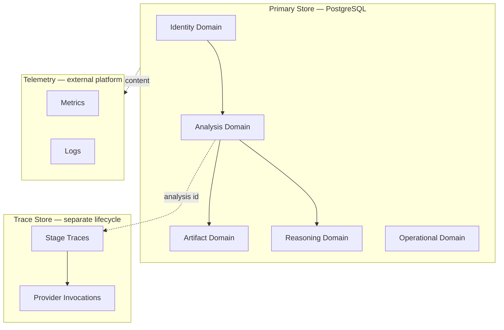
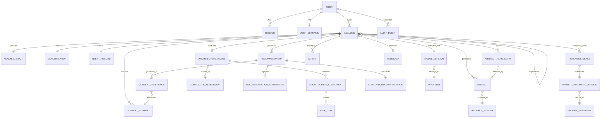
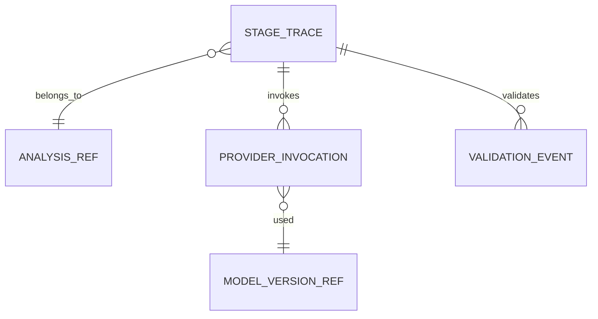
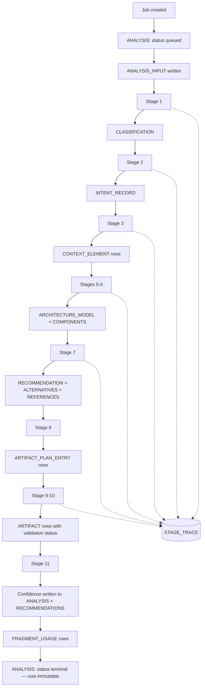
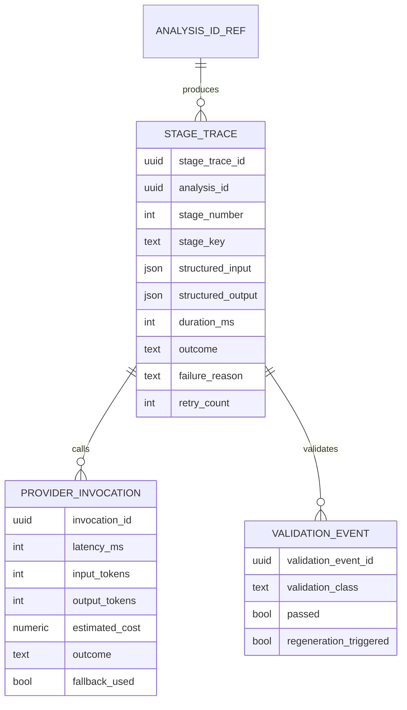
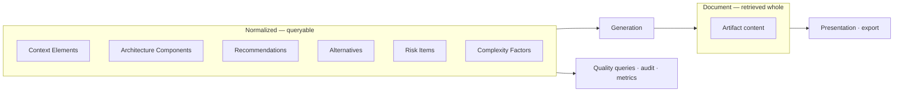
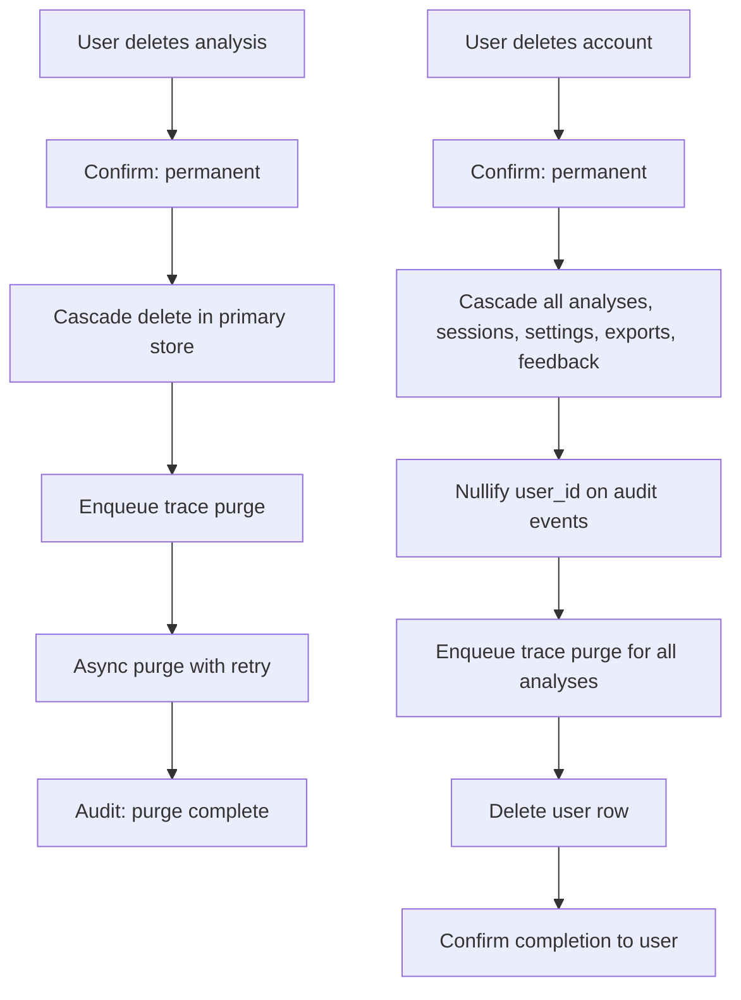

# NAIGX — Database Design

**Authoritative data architecture specification for Version 1.0.**

| Field | Value |
|---|---|
| Product | NAIGX — Automation Intelligence Platform |
| Core engine | NAIGX Intelligence Engine (NIE) |
| Document type | Database Design (canonical) |
| Sources of truth | Executive Summary v1.1 · Product Vision v1.1 · PRD v1.0 · MVP Scope v1.0 · System Architecture v1.0 · AI Architecture v1.0 |
| Function | Defines how data is organized, persisted, validated, versioned, and evolved |
| Version | 1.0 |
| Last updated | 2026-08-11 |

---

## How this document is used

This is the logical and physical data specification. It contains no SQL, no ORM configuration, and no migration scripts — those are implementation artifacts derived from this document, not substitutes for it.

**Three rules govern schema change:**

1. **Every stored field must have a stated reason.** Data stored "because we might need it" is a privacy liability with no offsetting benefit. If §4 does not justify a field, it does not exist.
2. **Immutability is binding.** Entities marked immutable in §2.4 are never updated after creation. A schema change that adds an update path to an immutable entity is a defect.
3. **The Product Vision governs.** Provenance, traceability, and user data control are not features of the schema — they are constraints the schema exists to satisfy.

---

## 1. Database Overview

### 1.1 What the database is for

The database serves three distinct purposes with different characteristics, and conflating them is the primary design error this schema avoids.

| Purpose | Characteristics | Consumer |
|---|---|---|
| **Product data** | User-owned, deletable, moderate volume, read-heavy after write | The user |
| **Reasoning traceability** | Operator-owned, fixed retention, high volume, write-heavy, rarely read | The operator, for quality governance |
| **Operational telemetry** | Aggregate, no content, long retention, low cardinality | Monitoring and alerting |

`SA §3.9` established the first structural consequence: traces live in a separate store from user data. The reason is retention, not performance. Traces contain full input content and must expire on a fixed schedule (`NFR-034`) regardless of whether the user chooses to keep the analysis indefinitely.

### 1.2 Why this schema exists

Four product commitments impose data-model requirements that could not be retrofitted:

**Provenance must survive to export** (`AIP-3`, `FR-013`). Every context element carries `stated | inferred | unknown` plus its source reference. This is a persisted domain property, not a rendering concern. An artifact stored without provenance is unusable for quality review and cannot be exported correctly.

**Recommendations must be traceable to their basis** (`FR-103`). The chain from artifact back through recommendation, architecture, context element, and input span must be reconstructible from storage alone. This requires explicit relational modelling of reasoning outputs, not opaque blobs.

**Analyses must be immutable** (`FR-060`). Retrieval reproduces exactly what was produced, never regenerates. A stored analysis is a record of what the system concluded at a point in time under a specific fragment and model version.

**Users must be able to delete everything** (`FR-063`, `FR-073`). Deletion must be complete and verifiable, which requires ownership to be explicit at every level rather than inferred through joins.

### 1.3 How it supports the Product Vision

| Vision principle | Data-model expression |
|---|---|
| `PV §3.4` Reason Before Recommend | Reasoning stages persisted as distinct records in execution order |
| `PV §3.5` Explain Every Decision | Rationale and context references are non-nullable on recommendations |
| `PV §3.3` Platform Neutrality | Platform recommendations store criteria and rejected alternatives as first-class relations, not prose |
| `PV §3.6` Human-Centered | User overrides recorded as distinct events; user data deletion is complete and self-service |
| `PV §3.1` No execution | No entity stores a credential to, or connection state with, any user-owned platform |

### 1.4 Physical topology

**Why the trace store is separate:**

| Reason | Detail |
|---|---|
| Independent retention | Traces expire on a fixed schedule; analyses persist at the user's discretion |
| Different access pattern | Write-once, read-rarely, operator-only |
| Volume asymmetry | A single analysis produces one analysis record and 12+ trace records with full prompt content |
| Blast radius | Trace access is operator-restricted; separation makes that boundary enforceable rather than a policy claim |

**Linkage is by identifier only.** No foreign key crosses the store boundary — the analysis record does not depend on trace existence, and trace expiry never affects a stored analysis.

---

## 2. Database Design Principles

### DP-1 — Normalize the domain, denormalize the rendering

Reasoning entities — context elements, recommendations, architecture components, risks — are normalized. Each is queryable, countable, and independently referenceable, because the traceability chain (`FR-103`) requires it.

Artifact *presentation content* is stored as structured documents. Decomposing a rendered artifact into relational fragments would buy nothing: it is never queried by internal structure, only retrieved whole.

**The rule:** normalize what is reasoned over; store as a document what is rendered.

### DP-2 — Explicit relationships

Every relationship is a declared foreign key with defined cascade behavior (§5). No implied relationships through naming convention, no polymorphic associations without a discriminator, no arrays of identifiers standing in for a join.

**Rationale:** the traceability chain is only as reliable as its weakest link. A relationship the database does not enforce is a relationship that will eventually be violated, and an unenforced traceability chain cannot support the quality apparatus in `AI §12`.

### DP-3 — Immutable analysis records

Once an analysis reaches a terminal state, it and all its child records are never updated (`FR-060`).

| Consequence | Detail |
|---|---|
| Re-analysis creates a new record | `FR-064`; the original is preserved with a reference |
| Fragment improvements do not alter history | A stored analysis reflects the reasoning that produced it |
| Quality review is reliable | A reviewed analysis cannot have changed since review |
| Audit is meaningful | The record is what the user saw |

**Enforced by:** no update path in the repository interface for terminal-state analyses; a mutation attempt is an application defect.

### DP-4 — Append-only version history

Prompt fragment versions, model versions, and reasoning configuration are append-only reference data. A version is never edited or deleted, only superseded.

**Rationale:** `AI-013` requires that a run's exact fragment composition be reconstructible. If a fragment version record can be edited, every historical trace referencing it becomes unreliable, and quality attribution across versions becomes impossible.

### DP-5 — Minimal duplication, with one deliberate exception

Reference data is stored once and referenced. The exception: **an analysis stores the resolved fragment version identifiers and model version at execution time**, rather than relying on current configuration.

This is not duplication — it is a point-in-time capture. Configuration changes; what a specific run used does not.

### DP-6 — Provider independence

No table name, column name, or enumeration value names a specific provider (`AI-001`, `AI-006`). Providers are rows in a reference table, not schema.

**Consequence:** adding a provider is data, not migration. This is the schema-level expression of `SA AD-03`.

### DP-7 — Soft delete only where recovery has a purpose

| Entity class | Deletion | Rationale |
|---|---|---|
| **User-deleted analyses** | Hard delete | `FR-063` promises permanence. A soft-deleted analysis presented as deleted is a broken promise. |
| **Account deletion** | Hard delete, cascading | `FR-073`. Verifiable completeness. |
| **Sessions** | Hard delete on expiry | No recovery value |
| **Reference data** | Soft delete (deprecation flag) | Historical records reference it; removal would break traceability |
| **Audit events** | Never deleted before retention expiry | Their purpose is to survive the actions they record |

**The governing question:** would anyone legitimately need this back? For user content, the answer is no — the user asked for it to be gone.

### DP-8 — Explicit ownership at every level

Every user-owned record carries a direct owner reference, not an inherited one through joins.

**Rationale:** deletion completeness (`FR-073`) and authorization (`NFR-026`) both depend on ownership being answerable in one hop. It also positions the schema for organizational ownership in v3.0 without restructuring (§14.3).

### DP-9 — Content classification drives storage

Every field is classified (§13.2), and classification determines encryption, logging eligibility, retention, and export inclusion. A field cannot be added without a classification.

---

## 3. Entity Relationship Overview

### 3.1 Domain map

| Domain | Entities | Store |
|---|---|---|
| **Identity** | User, Session, UserSettings, ApiKey*, Role* | Primary |
| **Analysis** | Analysis, AnalysisInput, Classification, ContextElement, IntentRecord | Primary |
| **Reasoning** | ArchitectureModel, ArchitectureComponent, Recommendation, RecommendationAlternative, ContextReference, RiskItem, ComplexityAssessment, PlatformRecommendation | Primary |
| **Artifact** | Artifact, ArtifactPlanEntry, Export | Primary |
| **Configuration** | PromptFragment, PromptFragmentVersion, Provider, ModelVersion, ArtifactSchema | Primary |
| **Operational** | Feedback, AuditEvent | Primary |
| **Trace** | StageTrace, ProviderInvocation, ValidationEvent | Trace store |

*ApiKey and Role are v1.0 schema placeholders — see §10.4.

### 3.2 Entity relationship diagram

### 3.3 Trace store relationships

`ANALYSIS_REF` and `MODEL_VERSION_REF` are identifier-only references across the store boundary. No foreign key constraint spans stores (§1.4).

---

## 4. Entity Specifications

### 4.1 Identity Domain

---

#### USER

| | |
|---|---|
| **Purpose** | Identity and ownership anchor for all user data |
| **Primary key** | `user_id` (UUID) |
| **Attributes** | `email` (unique, classified PII), `credential_hash`, `email_verified_at`, `created_at`, `deleted_at`, `training_consent` (default false) |
| **Relationships** | 1:N Session · 1:1 UserSettings · 1:N Analysis · 1:N AuditEvent |
| **Constraints** | `email` unique among non-deleted; `credential_hash` never null for active accounts; `training_consent` defaults false and requires an explicit affirmative act to set (`NFR-030`) |
| **Indexes** | Unique on `email`; index on `deleted_at` for cleanup |
| **Retention** | Until account deletion; hard-deleted with full cascade (`FR-073`) |
| **Lifecycle** | Created on registration → active → deletion requested → cascade executed → row removed |

**Design note.** `training_consent` is stored on the user, defaults to false, and is checked at the provider adapter boundary. Storing it as an explicit field rather than an implicit policy makes `NFR-030` verifiable in the data rather than asserted in documentation.

---

#### SESSION

| | |
|---|---|
| **Purpose** | Authenticated session state |
| **Primary key** | `session_id` (UUID) |
| **Attributes** | `user_id` (FK), `token_hash`, `issued_at`, `expires_at`, `revoked_at`, `user_agent_class`, `ip_hash` |
| **Relationships** | N:1 User |
| **Constraints** | `expires_at` > `issued_at`; token stored hashed, never raw |
| **Indexes** | Index on `user_id`; index on `expires_at` for expiry sweeps |
| **Retention** | Hard-deleted on expiry or revocation; no historical session retention |
| **Lifecycle** | Issued → active → expired or revoked → deleted |

**Design note.** `ip_hash` and `user_agent_class` support abuse detection (`NFR-025`) without storing identifying network data. Raw IP is never persisted.

---

#### USER_SETTINGS

| | |
|---|---|
| **Purpose** | User preferences. Deliberately minimal (`FR-071`). |
| **Primary key** | `user_id` (also FK — 1:1) |
| **Attributes** | `default_export_format`, `updated_at` |
| **Relationships** | 1:1 User |
| **Constraints** | Every setting has a non-null default; **no setting may alter reasoning behavior** (`FR-071`) |
| **Indexes** | Primary key only |
| **Retention** | Deleted with the user |
| **Lifecycle** | Created with defaults on registration → updated |

**Design note.** The table is nearly empty by design. `MVP §10` names configurability as a non-goal; a settings table that grows is evidence of drift from `UX-001`.

---

### 4.2 Analysis Domain

---

#### ANALYSIS

| | |
|---|---|
| **Purpose** | The root record of one reasoning run. The unit of ownership, retrieval, deletion, and export. |
| **Primary key** | `analysis_id` (UUID) |
| **Attributes** | `user_id` (FK, nullable for anonymous), `anonymous_token_hash` (nullable), `status`, `created_at`, `completed_at`, `derived_title`, `model_version_id` (FK), `overall_confidence_band`, `sufficiency_level`, `degradation_flag`, `timeout_flag`, `supersedes_analysis_id` (nullable FK, self) |
| **Relationships** | N:1 User · 1:1 AnalysisInput · 1:1 Classification · 1:1 IntentRecord · 1:N ContextElement · 1:0..1 ArchitectureModel · 1:N Recommendation · 1:N ArtifactPlanEntry · 1:N Artifact · 1:N Export · 1:0..1 Feedback · 1:N FragmentUsage · self-reference for re-analysis |
| **Constraints** | Exactly one of `user_id` or `anonymous_token_hash` is set; `status` ∈ {queued, running, completed, failed, timed_out}; **no updates permitted once status is terminal** (DP-3) |
| **Indexes** | `(user_id, created_at DESC)` for history listing (`FR-061`); index on `status` for job recovery; index on `anonymous_token_hash`; full-text index on `derived_title` and input content for search (`FR-062`, P1) |
| **Retention** | Indefinite at user discretion; hard-deleted on user request or account deletion |
| **Lifecycle** | queued → running → completed \| failed \| timed_out → (immutable) → deleted |

**Design notes.**

- `sufficiency_level` (`AI §5.4`) is persisted because it explains why an analysis produced thin output or refused to proceed. Without it, a stored refusal looks like a failure.
- `degradation_flag` distinguishes a complete analysis from one presented with failed artifacts — necessary to interpret history and to compute completion rate correctly (`M-1`).
- `supersedes_analysis_id` supports `FR-064` re-analysis as a new record with a preserved original (DP-3).

---

#### ANALYSIS_INPUT

| | |
|---|---|
| **Purpose** | The exact submitted content, preserved verbatim |
| **Primary key** | `analysis_id` (also FK — 1:1) |
| **Attributes** | `raw_content` (classified: user business content), `content_hash`, `character_count`, `source_type` (paste \| file), `original_filename` (nullable) |
| **Relationships** | 1:1 Analysis |
| **Constraints** | Immutable; `character_count` within `FR-002` bounds |
| **Indexes** | Index on `content_hash` for duplicate detection and regression-corpus matching |
| **Retention** | With the parent analysis |
| **Lifecycle** | Written once at job creation; never modified |

**Design note.** Separated from ANALYSIS as a 1:1 because `raw_content` is large, is the most sensitive field in the schema, and is not needed by the common history-listing query. Separation keeps the hot path narrow and makes encryption and access control targetable.

---

#### CLASSIFICATION

| | |
|---|---|
| **Purpose** | Stage 1 output, including override history |
| **Primary key** | `analysis_id` (also FK — 1:1) |
| **Attributes** | `determined_type`, `confidence`, `candidate_types` (ordered set), `was_low_confidence`, `user_override_type` (nullable), `overridden_at` (nullable) |
| **Relationships** | 1:1 Analysis |
| **Constraints** | `determined_type` ∈ the closed enumeration (`AI §4.1`); `confidence` ∈ [0,1] |
| **Indexes** | Index on `determined_type` for filtering (`FR-062`); index on `user_override_type` where not null, for `M-6` |
| **Retention** | With the parent analysis |
| **Lifecycle** | Written at Stage 1; override recorded as an additional field, never by replacing `determined_type` |

**Design note.** The system's determination and the user's override are stored **separately**. Overwriting the original would destroy the `M-6` accuracy signal — the whole value of the override event is knowing what the system got wrong.

---

#### INTENT_RECORD

| | |
|---|---|
| **Purpose** | Stage 2 output |
| **Primary key** | `intent_id` (UUID) |
| **Attributes** | `analysis_id` (FK), `primary_objective`, `secondary_objectives`, `inferred_scope`, `objective_provenance` |
| **Relationships** | 1:1 Analysis |
| **Constraints** | Every objective element carries provenance ∈ {stated, inferred} |
| **Indexes** | Unique on `analysis_id` |
| **Retention** | With the parent analysis |
| **Lifecycle** | Written at Stage 2; immutable |

---

#### CONTEXT_ELEMENT

| | |
|---|---|
| **Purpose** | Stage 3 output. **The grounding layer for the entire traceability chain.** |
| **Primary key** | `context_element_id` (UUID) |
| **Attributes** | `analysis_id` (FK), `content`, `category`, `provenance`, `source_span_start` (nullable), `source_span_end` (nullable), `inference_basis` (nullable), `resolution_hint` (nullable), `specificity_score`, `conflicts_with_id` (nullable, self-reference) |
| **Relationships** | N:1 Analysis · 1:N ContextReference · self-reference for conflicts |
| **Constraints** | `provenance` ∈ {stated, inferred, unknown}. **Conditional requirements:** `stated` requires a source span; `inferred` requires an inference basis; `unknown` requires a resolution hint. A row violating these is invalid. |
| **Indexes** | Index on `(analysis_id, provenance)`; index on `conflicts_with_id` where not null |
| **Retention** | With the parent analysis |
| **Lifecycle** | Written at Stage 3; immutable |

**Design notes.**

- The conditional constraints are the schema-level enforcement of `AIP-3`. Provenance without its supporting reference is an unverifiable label, and the database refuses to store one.
- `specificity_score` feeds confidence factor CF-4 (`AI §8.2`); `conflicts_with_id` feeds CF-3. Storing these makes confidence recomputation auditable rather than opaque.

---

### 4.3 Reasoning Domain

---

#### ARCHITECTURE_MODEL

| | |
|---|---|
| **Purpose** | Stage 6 output — the design root |
| **Primary key** | `architecture_id` (UUID) |
| **Attributes** | `analysis_id` (FK), `summary`, `data_flow_description`, `created_at` |
| **Relationships** | 1:1 Analysis · 1:N ArchitectureComponent · 1:0..1 ComplexityAssessment |
| **Constraints** | Present only for architecture-producing paths (`AI §4.1`) |
| **Indexes** | Unique on `analysis_id` |
| **Retention** | With the parent analysis |
| **Lifecycle** | Written at Stage 6; immutable |

---

#### ARCHITECTURE_COMPONENT

| | |
|---|---|
| **Purpose** | An individual component with its justification |
| **Primary key** | `component_id` (UUID) |
| **Attributes** | `architecture_id` (FK), `name`, `responsibility`, `inputs`, `outputs`, `failure_handling`, `integration_direction` (nullable), `external_system` (nullable), `ordinal` |
| **Relationships** | N:1 ArchitectureModel · 1:N RiskItem · N:M ContextElement via ContextReference |
| **Constraints** | **Every component must have at least one context reference** (`FR-030` — no component addressing nothing). Enforced at validation; a component without grounding fails Stage 10. |
| **Indexes** | Index on `architecture_id`; unique on `(architecture_id, name)` |
| **Retention** | With the parent analysis |
| **Lifecycle** | Written at Stage 6; immutable |

**Design note.** `name` uniqueness within an architecture is what allows other artifacts — diagrams, roadmaps, risks — to reference components by name and remain consistent (`AI §9.4`).

---

#### RECOMMENDATION

| | |
|---|---|
| **Purpose** | Stage 7 output. The unit `PV §3.5` governs. |
| **Primary key** | `recommendation_id` (UUID) |
| **Attributes** | `analysis_id` (FK), `recommendation_type`, `conclusion`, `rationale` (**non-nullable**), `criteria_applied` (**non-nullable**), `limits`, `confidence_band`, `confidence_factors`, `is_negative_conclusion` |
| **Relationships** | N:1 Analysis · 1:N RecommendationAlternative · 1:N ContextReference · 1:0..1 PlatformRecommendation |
| **Constraints** | `rationale` and `criteria_applied` are non-nullable and non-empty. **At least one context reference required.** `confidence_band` ∈ {high, medium, low}; below `high` requires non-empty `confidence_factors`. |
| **Indexes** | Index on `analysis_id`; index on `is_negative_conclusion` for `AC-013` verification |
| **Retention** | With the parent analysis |
| **Lifecycle** | Written at Stage 7; immutable |

**Design note — the most important constraint in the schema.** Making `rationale` and `criteria_applied` non-nullable means **an unexplained recommendation cannot be represented**. `AIP-4` states this as a data-model constraint precisely because a nullable field will eventually be null. The database is the enforcement point.

`is_negative_conclusion` is stored explicitly so that `AC-013` — the requirement that the engine can conclude "do not automate" — is verifiable by query rather than by manual review.

---

#### RECOMMENDATION_ALTERNATIVE

| | |
|---|---|
| **Purpose** | What was considered and rejected (`AI-031`) |
| **Primary key** | `alternative_id` (UUID) |
| **Attributes** | `recommendation_id` (FK), `alternative`, `rejection_reason` (non-nullable), `ordinal` |
| **Relationships** | N:1 Recommendation |
| **Constraints** | `rejection_reason` non-empty. Platform recommendations require **at least one** alternative (`FR-034`). |
| **Indexes** | Index on `recommendation_id` |
| **Retention** | With the parent analysis |
| **Lifecycle** | Written at Stage 7; immutable |

**Design note.** Modelled as a relation rather than embedded prose so that the `FR-034` requirement — at least one named rejected alternative — is a countable constraint, not a text-inspection exercise.

---

#### CONTEXT_REFERENCE

| | |
|---|---|
| **Purpose** | The traceability join. **Reference integrity depends entirely on this table.** |
| **Primary key** | `reference_id` (UUID) |
| **Attributes** | `context_element_id` (FK), `referencing_type`, `referencing_id`, `relevance` |
| **Relationships** | N:1 ContextElement · polymorphic to Recommendation or ArchitectureComponent via discriminator |
| **Constraints** | `context_element_id` must resolve; `referencing_type` from a closed set with the discriminator required (DP-2) |
| **Indexes** | Index on `context_element_id`; index on `(referencing_type, referencing_id)` |
| **Retention** | With the parent analysis |
| **Lifecycle** | Written during Stages 6–7; immutable |

**Design note.** This table is what makes `FR-103` auditability and `AI §11.3` unsupported-claim detection queryable rather than inferred. A recommendation whose references do not resolve fails validation — and because references are foreign keys, non-resolution is structurally impossible after write.

---

#### PLATFORM_RECOMMENDATION

| | |
|---|---|
| **Purpose** | Platform-selection specialization of a recommendation |
| **Primary key** | `platform_recommendation_id` (UUID) |
| **Attributes** | `recommendation_id` (FK), `recommended_platform` (nullable — null means no platform / do not automate), `selection_criteria`, `knowledge_currency_note` |
| **Relationships** | 1:1 Recommendation |
| **Constraints** | Nullable platform is valid and meaningful (`FR-034` permits "no platform"); **no field may store a commercial relationship, ranking weight, or partner status** (`PV §3.3`) |
| **Indexes** | Index on `recommended_platform` for neutrality auditing |
| **Retention** | With the parent analysis |
| **Lifecycle** | Written at Stage 7; immutable |

**Design note — neutrality is enforced by absence.** The schema has no place to store a platform preference, partner tier, or referral weight. `AC-032` (no platform favored without a requirement-derived reason) is auditable by querying recommendation distribution across the corpus; a systematic skew is detectable.

---

#### RISK_ITEM

| | |
|---|---|
| **Purpose** | Risk register entries (`FR-032`) |
| **Primary key** | `risk_id` (UUID) |
| **Attributes** | `analysis_id` (FK), `component_id` (FK, non-nullable), `description`, `severity`, `likelihood`, `mitigation` (non-nullable) |
| **Relationships** | N:1 ArchitectureComponent · N:1 Analysis |
| **Constraints** | `component_id` non-nullable — **every risk names a component** (`FR-032`). `mitigation` non-empty. `severity` and `likelihood` from the scales defined in `PRD O-3`. |
| **Indexes** | Index on `analysis_id`; index on `(severity, likelihood)` |
| **Retention** | With the parent analysis |
| **Lifecycle** | Written during artifact generation; immutable |

**Design note.** Non-nullable `component_id` is the schema enforcement of "no generic risks." A risk that cannot name what it affects cannot be stored.

**Blocked on `PRD O-3`:** the severity and likelihood scales are undefined. This entity cannot be implemented until Sprint 0 closes that item.

---

#### COMPLEXITY_ASSESSMENT

| | |
|---|---|
| **Purpose** | Complexity score with reconstructible basis (`FR-033`) |
| **Primary key** | `assessment_id` (UUID) |
| **Attributes** | `analysis_id` (FK), `score`, `factor_breakdown` (factor, value, weight, contribution), `scale_version` |
| **Relationships** | 1:1 Analysis |
| **Constraints** | `factor_breakdown` non-empty; contributions must reconstruct `score` — verified at validation |
| **Indexes** | Unique on `analysis_id` |
| **Retention** | With the parent analysis |
| **Lifecycle** | Written during artifact generation; immutable |

**Design notes.**

- Storing the factor breakdown, not just the score, is what makes `FR-033` ("a user can reconstruct how the score was reached") satisfiable from storage.
- `scale_version` matters because the factor set will evolve. Without it, scores from different scale versions would be silently compared.
- **Blocked on `PRD O-2`:** the factor set and weights are undefined.

---

### 4.4 Artifact Domain

---

#### ARTIFACT_PLAN_ENTRY

| | |
|---|---|
| **Purpose** | Stage 8 output — the record of what was planned and why, including omissions |
| **Primary key** | `plan_entry_id` (UUID) |
| **Attributes** | `analysis_id` (FK), `artifact_type`, `planned` (bool), `depth_level`, `inclusion_reason` (nullable), `omission_reason` (nullable), `outcome` |
| **Relationships** | N:1 Analysis · 1:0..1 Artifact |
| **Constraints** | `planned = true` requires `inclusion_reason`; `planned = false` requires `omission_reason`. `outcome` ∈ {generated, failed, omitted}. |
| **Indexes** | Index on `analysis_id`; index on `(artifact_type, outcome)` |
| **Retention** | With the parent analysis |
| **Lifecycle** | Written at Stage 8; `outcome` set at Stage 9–10 |

**Design note.** This entity exists specifically so that **omission and failure are distinguishable in storage** (`FR-091`, `AIP-8`). Without it, a missing artifact is ambiguous — the user cannot tell whether the system chose not to produce it or tried and failed, and those mean opposite things about the analysis.

It also makes `AC-037` proportionality testable by query: artifact-set size against complexity score across the corpus.

---

#### ARTIFACT

| | |
|---|---|
| **Purpose** | A generated output artifact |
| **Primary key** | `artifact_id` (UUID) |
| **Attributes** | `analysis_id` (FK), `plan_entry_id` (FK), `artifact_type`, `schema_id` (FK), `content` (structured document), `depth_level`, `generation_attempt_count`, `validation_status`, `created_at` |
| **Relationships** | N:1 Analysis · 1:1 ArtifactPlanEntry · N:1 ArtifactSchema |
| **Constraints** | `content` must validate against `schema_id` (`FR-039`); `validation_status` ∈ {valid, failed}; **only `valid` artifacts are presentable** |
| **Indexes** | Index on `(analysis_id, artifact_type)`; index on `validation_status` for `NFR-084` monitoring |
| **Retention** | With the parent analysis |
| **Lifecycle** | Generated at Stage 9 → validated at Stage 10 → immutable |

**Design notes.**

- Content is stored as a structured document (DP-1): it is retrieved whole, never queried by internal structure.
- `schema_id` is a reference, not a copy. Schemas are versioned reference data, so an artifact always knows which schema version it satisfied — necessary when schemas evolve.
- `generation_attempt_count` records regeneration and feeds confidence factor CF-6.
- **Failed artifacts are stored, not discarded.** Storing them is what allows the user to see a labelled failure rather than an unexplained gap, and allows failure-pattern analysis by type.

---

#### ARTIFACT_SCHEMA

| | |
|---|---|
| **Purpose** | Versioned artifact schema definitions |
| **Primary key** | `schema_id` (UUID) |
| **Attributes** | `artifact_type`, `version`, `definition`, `effective_from`, `deprecated_at` (nullable) |
| **Relationships** | 1:N Artifact |
| **Constraints** | Append-only (DP-4); unique on `(artifact_type, version)`; never hard-deleted while referenced |
| **Indexes** | Unique on `(artifact_type, version)` |
| **Retention** | Indefinite |
| **Lifecycle** | Created → effective → deprecated (soft, DP-7) |

---

#### EXPORT

| | |
|---|---|
| **Purpose** | Record of export generation (`FR-050`) |
| **Primary key** | `export_id` (UUID) |
| **Attributes** | `analysis_id` (FK), `user_id` (FK), `format`, `artifact_selection` (nullable — null means full), `generated_at`, `metadata_snapshot` |
| **Relationships** | N:1 Analysis · N:1 User |
| **Constraints** | `format` ∈ {markdown, pdf} |
| **Indexes** | Index on `analysis_id`; index on `(user_id, generated_at)` for `M-4` |
| **Retention** | Record retained with the analysis; **generated files are not stored** |
| **Lifecycle** | Created on export; immutable |

**Design note.** The export *record* is persisted; the export *file* is not. Regenerating from immutable artifacts is deterministic and cheap, while storing generated documents would duplicate the most sensitive content in the system for no benefit. The record exists solely to instrument `M-4` export rate — the primary behavioral trust signal (`MVP §3.2`).

---

### 4.5 Configuration Domain

---

#### PROMPT_FRAGMENT

| | |
|---|---|
| **Purpose** | Identity of a composable prompt fragment (`AI §6.2`) |
| **Primary key** | `fragment_id` (UUID) |
| **Attributes** | `fragment_key`, `fragment_class`, `owner_class`, `created_at` |
| **Relationships** | 1:N PromptFragmentVersion |
| **Constraints** | `fragment_key` unique; `fragment_class` ∈ {foundation, stage, type_modifier, artifact, output_contract} |
| **Indexes** | Unique on `fragment_key` |
| **Retention** | Indefinite |
| **Lifecycle** | Created once; never deleted |

---

#### PROMPT_FRAGMENT_VERSION

| | |
|---|---|
| **Purpose** | An immutable version of a fragment |
| **Primary key** | `fragment_version_id` (UUID) |
| **Attributes** | `fragment_id` (FK), `version`, `content_hash`, `created_at`, `activated_at`, `deprecated_at`, `regression_pass_reference` |
| **Relationships** | N:1 PromptFragment · 1:N FragmentUsage |
| **Constraints** | **Append-only, never updated** (DP-4); unique on `(fragment_id, version)`; `activated_at` requires a `regression_pass_reference` (`NFR-043`) |
| **Indexes** | Unique on `(fragment_id, version)`; index on `activated_at` |
| **Retention** | Indefinite — historical traces depend on it |
| **Lifecycle** | Created → regression-verified → activated → deprecated (soft) |

**Design notes.**

- `regression_pass_reference` makes the `NFR-043` gate a **data constraint**: a fragment version cannot become active without a recorded passing regression run. The quality gate is enforced by the schema, not by process discipline.
- `content_hash` allows detection of an unauthorized content change even though the row is append-only.
- Fragment *content* storage location is `AIQ-5`/`SA AQ-5`, open. This entity holds the version metadata regardless of where content lives.

---

#### FRAGMENT_USAGE

| | |
|---|---|
| **Purpose** | The exact fragment composition used by one analysis (`AI-013`) |
| **Primary key** | `usage_id` (UUID) |
| **Attributes** | `analysis_id` (FK), `fragment_version_id` (FK), `stage`, `ordinal` |
| **Relationships** | N:1 Analysis · N:1 PromptFragmentVersion |
| **Constraints** | Immutable; records the resolved composition, not current configuration (DP-5) |
| **Indexes** | Index on `analysis_id`; index on `fragment_version_id` for impact analysis |
| **Retention** | With the parent analysis |
| **Lifecycle** | Written at execution; immutable |

**Design note.** This is the join that makes quality attribution possible. When a quality regression appears, this table answers "which analyses used the suspect fragment version?" — and conversely, for any stored analysis, reconstructs the exact composition that produced it. `AI-013` requires the composition, not merely a template identifier, and this is why.

---

#### PROVIDER

| | |
|---|---|
| **Purpose** | Reference data for model providers |
| **Primary key** | `provider_id` (UUID) |
| **Attributes** | `provider_key`, `declared_capabilities`, `active`, `created_at` |
| **Relationships** | 1:N ModelVersion |
| **Constraints** | **Never exposed in user-facing output or export** (`AI-006`) |
| **Indexes** | Unique on `provider_key` |
| **Retention** | Indefinite |
| **Lifecycle** | Registered → active → deactivated (soft) |

**Design note.** Providers are rows, not schema (DP-6). Adding a provider is a data operation. `declared_capabilities` supports the `AI §10.2` capability-detection model — the abstraction layer reads declarations rather than assuming.

---

#### MODEL_VERSION

| | |
|---|---|
| **Purpose** | A specific model version, for drift attribution (`AI-004`) |
| **Primary key** | `model_version_id` (UUID) |
| **Attributes** | `provider_id` (FK), `model_key`, `version_label`, `first_seen_at`, `active` |
| **Relationships** | N:1 Provider · 1:N Analysis · 1:N ProviderInvocation (trace store) |
| **Constraints** | Append-only (DP-4); unique on `(provider_id, model_key, version_label)` |
| **Indexes** | Unique composite as above |
| **Retention** | Indefinite |
| **Lifecycle** | Recorded on first use → active → deactivated (soft) |

**Design note.** Existence of this entity is what makes `SA AR-41` (silent model drift) detectable. Quality metrics segmented by `model_version_id` reveal a provider-side model change that would otherwise appear as unexplained quality variance.

---

### 4.6 Operational Domain

---

#### FEEDBACK

| | |
|---|---|
| **Purpose** | User quality signal (`FR-101`), source of `M-7` |
| **Primary key** | `feedback_id` (UUID) |
| **Attributes** | `analysis_id` (FK), `user_id` (FK), `helpful` (bool), `detail` (nullable), `submitted_at` |
| **Relationships** | 1:1 Analysis · N:1 User |
| **Constraints** | One feedback record per analysis; never required (`FR-101`) |
| **Indexes** | Unique on `analysis_id`; index on `helpful` |
| **Retention** | With the parent analysis |
| **Lifecycle** | Created on submission; replaceable by the user |

**Design note — the one permitted exception to DP-3.** Feedback is user-authored, not system-generated, so a user revising their own assessment does not alter the analysis record. The analysis itself remains immutable.

---

#### AUDIT_EVENT

| | |
|---|---|
| **Purpose** | Security-relevant action record (`SA §10.7`) |
| **Primary key** | `audit_event_id` (UUID) |
| **Attributes** | `user_id` (nullable FK), `event_type`, `resource_type`, `resource_id`, `occurred_at`, `correlation_id`, `outcome`, `ip_hash` |
| **Relationships** | N:1 User (nullable — survives user deletion) |
| **Constraints** | **Never contains user business content** (`NFR-081`); append-only; user reference nullified rather than cascade-deleted on account deletion |
| **Indexes** | Index on `(user_id, occurred_at)`; index on `(resource_type, resource_id)`; index on `correlation_id` |
| **Retention** | Fixed period, independent of user data lifecycle |
| **Lifecycle** | Written on the event; never modified; expired on schedule |

**Design note — the deliberate tension.** Audit events must survive account deletion (their purpose is to record actions including deletion), but `FR-073` promises complete data removal. Resolution: on account deletion, `user_id` is **nullified** rather than the row cascade-deleted. The event that an action occurred survives; the identity attached to it does not. This preserves both the audit trail and the deletion promise, and it is the only place in the schema where a user reference is severed rather than cascaded.

---

### 4.7 Trace Store

---

#### STAGE_TRACE

| | |
|---|---|
| **Purpose** | Per-stage execution record (`FR-100`) |
| **Primary key** | `stage_trace_id` (UUID) |
| **Attributes** | `analysis_id` (identifier reference, no FK), `stage_number`, `stage_key`, `structured_input`, `structured_output`, `started_at`, `duration_ms`, `outcome`, `failure_reason`, `retry_count` |
| **Relationships** | 1:N ProviderInvocation · 1:N ValidationEvent |
| **Constraints** | Immutable; contains user business content — classified accordingly |
| **Indexes** | Index on `analysis_id`; index on `(stage_key, outcome)`; index on `started_at` for expiry |
| **Retention** | **Fixed period** (`NFR-034`, `PRD O-5`); expires independently of the analysis |
| **Lifecycle** | Written during execution → immutable → expired on schedule |

---

#### PROVIDER_INVOCATION

| | |
|---|---|
| **Purpose** | Per-call provider record — economics and reliability |
| **Primary key** | `invocation_id` (UUID) |
| **Attributes** | `stage_trace_id` (FK), `model_version_id` (reference), `latency_ms`, `input_tokens`, `output_tokens`, `estimated_cost`, `outcome`, `error_class`, `attempt_number`, `fallback_used` |
| **Relationships** | N:1 StageTrace |
| **Constraints** | Immutable; **never stores provider identity in a user-reachable form** (`AI-006`) |
| **Indexes** | Index on `stage_trace_id`; index on `(model_version_id, outcome)` |
| **Retention** | Longer than StageTrace permitted — contains no content, only metrics |
| **Lifecycle** | Written per call; immutable |

**Design note.** Because this entity holds no content, it may outlive stage traces. This matters: cost and reliability analysis over a long window is valuable, and it should not require retaining user business content to obtain (`TV-4`, `SA AR-22`).

---

#### VALIDATION_EVENT

| | |
|---|---|
| **Purpose** | Validation outcome record (`FR-039`), source of the `NFR-084` leading indicator |
| **Primary key** | `validation_event_id` (UUID) |
| **Attributes** | `stage_trace_id` (FK), `artifact_type`, `validation_class`, `passed`, `failure_detail`, `regeneration_triggered` |
| **Relationships** | N:1 StageTrace |
| **Constraints** | Immutable; `validation_class` from the `AI §3.2` Stage 10 set |
| **Indexes** | Index on `(validation_class, passed)`; index on `artifact_type` |
| **Retention** | Extended — contains no user content, only structural outcomes |
| **Lifecycle** | Written at validation; immutable |

**Design note.** Retaining these beyond trace expiry is deliberate. Schema validation failure rate is the earliest warning of a bad fragment release (`AI §13.2`), and detecting a slow trend requires a longer window than content retention permits.

---

## 5. Relationship Rules

### 5.1 Cardinality

| Relationship | Cardinality | Justification |
|---|---|---|
| User → Analysis | 1:N | Ownership |
| User → UserSettings | 1:1 | Settings have no independent existence |
| Analysis → AnalysisInput | 1:1 | Separated for size and sensitivity, not multiplicity |
| Analysis → Classification | 1:1 | One determination per analysis |
| Analysis → ContextElement | 1:N | Many elements per analysis |
| Analysis → ArchitectureModel | 1:0..1 | Absent for non-architecture paths |
| ArchitectureModel → ArchitectureComponent | 1:N | Composition |
| Recommendation → RecommendationAlternative | 1:N | Multiple rejections |
| ContextElement ↔ Recommendation | **N:M** via ContextReference | One element grounds several recommendations; one recommendation rests on several elements |
| ContextElement ↔ ArchitectureComponent | **N:M** via ContextReference | Same reasoning |
| ArtifactPlanEntry → Artifact | 1:0..1 | Planned but omitted or failed entries have no artifact |
| Analysis → FragmentUsage | 1:N | One composition record per fragment per stage |
| Analysis → Analysis | 1:0..1 self | Re-analysis lineage |

### 5.2 The two many-to-many relationships

Both flow through CONTEXT_REFERENCE, and both exist for the same reason: **the traceability chain is genuinely a graph, not a tree.** A single stated constraint typically justifies several architecture components and several recommendations. Modelling this as anything less than N:M would either duplicate context elements or lose the linkage — and losing it breaks `FR-103`.

### 5.3 Cascade and deletion behavior

| Parent | Children | On delete | Rationale |
|---|---|---|---|
| **User** | Sessions, Settings, Analyses (and all descendants), Exports, Feedback | **CASCADE, hard** | `FR-073` completeness |
| **User** | AuditEvent | **SET NULL** | Audit survives; identity does not (§4.6) |
| **Analysis** | Input, Classification, Intent, ContextElements, Architecture, Recommendations, Artifacts, PlanEntries, Exports, Feedback, FragmentUsage | **CASCADE, hard** | `FR-063` permanence |
| **Analysis** | StageTrace (cross-store) | **Asynchronous purge** | No FK across stores; deletion enqueues trace purge |
| **ArchitectureModel** | Components, ComplexityAssessment | CASCADE | Composition |
| **ArchitectureComponent** | RiskItems | CASCADE | Risks have no meaning without their component |
| **Recommendation** | Alternatives, ContextReferences, PlatformRecommendation | CASCADE | Composition |
| **PromptFragmentVersion** | FragmentUsage | **RESTRICT** | A version referenced by history is never deletable (DP-4) |
| **Provider / ModelVersion** | Analyses, Invocations | **RESTRICT** | Same — deactivate, never delete (DP-7) |

### 5.4 Cross-store deletion

Because no foreign key spans the store boundary, analysis deletion cannot cascade to traces directly. The contract:

| Step | Behavior |
|---|---|
| 1 | Analysis deletion commits in the primary store — the user's request is honored immediately |
| 2 | A purge instruction is enqueued for the trace store |
| 3 | Traces are purged asynchronously with retry until confirmed |
| 4 | Purge completion is recorded as an audit event |

**The user-facing guarantee is honored at step 1.** Trace purge is operator-side cleanup with a bounded completion window stated in the data policy — not an open-ended deferral.

### 5.5 Ownership rules

| Rule | Rationale |
|---|---|
| Every user-owned entity carries a direct owner reference (DP-8) | Authorization in one hop (`NFR-026`); deletion completeness verifiable |
| Anonymous analyses are owned by a hashed token, not a user | `FR-004` |
| Anonymous claim on signup rewrites ownership; the claim is audited | `FR-004` |
| Unclaimed anonymous analyses expire on a fixed schedule | No indefinite retention of unowned content |
| Ownership is never inferred through a chain of joins | An authorization check requiring three joins is an authorization check that will eventually be skipped |

---

## 6. Analysis Persistence Model

### 6.1 Write flow

### 6.2 Persistence timing

| Approach | Behavior |
|---|---|
| **Progressive** | Records are written as stages complete, not batched at the end |
| **Rationale** | A failed analysis retains everything up to the failure point, supporting diagnosis and partial presentation (`FR-091`) |
| **Terminal transition** | Only the final status transition makes the analysis immutable |
| **Trace independence** | Trace writes are asynchronous and non-blocking; trace failure never fails an analysis (`SA §3.10`) |

### 6.3 What is stored and why

| Component | Storage | Why it must persist |
|---|---|---|
| Original input | ANALYSIS_INPUT, verbatim | Exact reproduction (`FR-060`); regression corpus source |
| Classification | CLASSIFICATION, with override kept separate | `M-6` signal; explains the reasoning frame applied |
| Intent | INTENT_RECORD | Explains why this treatment rather than another |
| Context | CONTEXT_ELEMENT rows with provenance | The grounding layer; without it nothing downstream is explicable |
| Reasoning | Architecture + Recommendations + References | The traceability chain (`FR-103`) |
| Artifacts | ARTIFACT with schema reference | What the user saw |
| Plan | ARTIFACT_PLAN_ENTRY | Distinguishes omission from failure |
| Confidence | Bands + factors on Analysis and Recommendation | `FR-045`; calibration review (`AI §8.5`) |
| Export history | EXPORT records | `M-4`, the primary trust signal |
| Version references | FRAGMENT_USAGE + `model_version_id` | Quality attribution across versions |

### 6.4 Retrieval guarantee

**Retrieval reproduces the stored record exactly. It never regenerates** (`FR-060`, `SA §3.7`).

| Consequence | Detail |
|---|---|
| Fragment improvements do not alter history | A user revisiting an analysis sees what they saw |
| Re-analysis is a new record | `FR-064`; original preserved with `supersedes_analysis_id` |
| Quality review is stable | A reviewed analysis cannot have silently changed |
| No schema migration may alter stored content | Structure may evolve; recorded conclusions may not |

---

## 7. Prompt Traceability

### 7.1 What is recorded per analysis

| Element | Where | Purpose |
|---|---|---|
| Fragment composition | FRAGMENT_USAGE → PROMPT_FRAGMENT_VERSION | `AI-013`; the exact composition, not a template name |
| Fragment versions | PROMPT_FRAGMENT_VERSION | Append-only; never edited |
| Model version | `ANALYSIS.model_version_id`; per-call in PROVIDER_INVOCATION | `AI-004`; drift attribution |
| Provider | MODEL_VERSION → PROVIDER | Operator-side only; never user-facing (`AI-006`) |
| Timestamps | Analysis and stage trace | Sequence and latency |
| Reasoning configuration | Depth level, routing config version | Explains why this depth |

### 7.2 What is deliberately not stored in the primary store

| Not stored in primary | Where instead | Why |
|---|---|---|
| Composed prompt text | Trace store only | Contains user content; must expire on the trace schedule (`NFR-034`) |
| Raw provider responses | Trace store only | Same |
| Fragment content bodies | Fragment asset store; hash referenced | Content lives with the versioned assets; the database records identity and version |
| Provider credentials | **Never in any database** | Managed secrets store (`NFR-023`) |

**The principle:** the primary store records *which reasoning was applied*; the trace store records *what was actually said*. The first must persist as long as the analysis; the second must expire on a fixed schedule.

### 7.3 The attribution query

The design supports two directions, both required by `AI §12`:

| Direction | Question | Path |
|---|---|---|
| **Forward** | What produced this analysis? | Analysis → FragmentUsage → FragmentVersion; Analysis → ModelVersion |
| **Reverse** | Which analyses used this suspect version? | FragmentVersion → FragmentUsage → Analysis |

Reverse attribution is what makes a quality regression actionable. Without it, a bad fragment release is detectable in aggregate metrics but its blast radius is unknowable.

---

## 8. AI Trace Storage

### 8.1 Structure

### 8.2 Coverage

| Recorded | Entity | Supports |
|---|---|---|
| Stage execution and sequence | StageTrace | Reconstruct flow without re-running (`FR-100`) |
| Timing per stage | StageTrace | Latency attribution (`NFR-001`, `NFR-002`) |
| Structured input and output | StageTrace | Reasoning reconstruction |
| Failure reasons | StageTrace | Diagnosis by stage |
| Retry history | StageTrace, ProviderInvocation | Reliability; confidence factor CF-6 |
| Token usage and cost | ProviderInvocation | Unit economics (`TV-4`, `NFR-083`) |
| Validation outcomes | ValidationEvent | `NFR-084` leading indicator |
| Confidence inputs | Primary store, on Recommendation | Calibration review (`AI §8.5`) |

### 8.3 Tiered retention

The single most important design property of the trace store: **three different retention periods, because the entities have different sensitivity.**

| Entity | Content sensitivity | Retention |
|---|---|---|
| StageTrace | **High** — full user business content | Short, fixed (`NFR-034`) |
| ProviderInvocation | **None** — metrics only | Extended |
| ValidationEvent | **None** — structural outcomes only | Extended |

This is why the trace store is three entities rather than one document per analysis. A monolithic trace record would force the entire trace to expire on the most restrictive schedule, discarding the cost and quality history that carries no privacy cost and has long-term analytical value.

### 8.4 Access control

| Rule | Rationale |
|---|---|
| Operator access only; no user-facing surface | Traces contain full business content |
| Access is itself audited | Trace access is the highest-privilege read in the system |
| No trace content in application logs or telemetry | `NFR-081`, `NFR-035` |
| Purged on analysis deletion (§5.4) | Deletion completeness |

---

## 9. Artifact Storage

### 9.1 Storage model

| Aspect | Approach | Rationale |
|---|---|---|
| **Content** | Structured document in ARTIFACT | Retrieved whole, never queried internally (DP-1) |
| **Schema** | Referenced, versioned | An artifact records which schema version it satisfied |
| **Reasoning entities** | Normalized in the reasoning domain, referenced | Risks, recommendations, and components are queryable |
| **Diagrams** | Source stored in artifact content | Regenerating rendered images is cheap; storing them duplicates content |
| **Exports** | Record only, no file | §4.4 — regeneration is deterministic |
| **Failed artifacts** | Stored with `validation_status = failed` | Labelled failure requires the record to exist (`FR-091`) |

### 9.2 The normalized/document boundary

**Why both.** The normalized side answers questions the quality apparatus asks: how many recommendations lack alternatives, how many risks name no component, what is the artifact-set size distribution against complexity. The document side is what the user reads. Deriving one from the other at read time would be either slow (rendering on every view) or lossy (parsing prose back into entities).

### 9.3 Versioning strategy

**Artifacts are not versioned. Analyses are.**

| Situation | Behavior |
|---|---|
| Artifact regenerated during validation retry | `generation_attempt_count` increments; only the final artifact is stored |
| User requests re-analysis | New ANALYSIS record; original preserved via `supersedes_analysis_id` (`FR-064`) |
| Schema version changes | New artifacts use the new schema; existing artifacts retain their original `schema_id` |
| Fragment version changes | Existing analyses unaffected — they record their own composition |

**Rationale.** Artifact-level versioning would imply that a stored analysis can change, contradicting DP-3. The analysis is the unit of immutability; a new reasoning run is a new analysis, not a new version of an old one.

---

## 10. Authentication Data

### 10.1 v1.0 scope

| Entity | v1.0 | Note |
|---|---|---|
| USER | Yes | §4.1 |
| SESSION | Yes | §4.1 |
| API_KEY | **Schema placeholder only** | No v1.0 surface (`MVP §10`) |
| ROLE / PERMISSION | **Not implemented** | Single role; see §10.4 |

### 10.2 Credential handling

| Rule | Source |
|---|---|
| Credentials stored as a hash using a current standard | `NFR-022` |
| Session tokens stored hashed, never raw | §4.1 |
| No credential material in logs, traces, or telemetry | `NFR-081` |
| Provider API keys never in any database | `NFR-023` — managed secrets store |
| Password reset tokens single-use, short-lived, hashed | Standard |

### 10.3 Anonymous access

| Aspect | Design |
|---|---|
| Ownership | `anonymous_token_hash` on ANALYSIS; no user record created |
| Claim on signup | Ownership rewritten to `user_id`; token cleared; claim audited (`FR-004`) |
| Expiry | Unclaimed anonymous analyses purged on a fixed schedule |
| Isolation | An anonymous analysis is reachable only by its originating token |

### 10.4 Future RBAC

v1.0 has one role and no permission model (`MVP §4.5`). The schema avoids *precluding* RBAC without *implementing* it:

| Property | Enables v3.0 RBAC |
|---|---|
| Ownership explicit on every entity (DP-8) | An organization can replace a user as owner without restructuring |
| Authorization centralized at the API layer (`SA §10.2`) | A permission check inserts at one place |
| No permission logic embedded in queries | Adding permissions does not require rewriting data access |
| Audit events already resource-scoped | Permission-aware auditing needs no new event structure |

**What is deliberately not built:** role tables, permission tables, or organization entities. `MVP §4.5` — building for multi-user prematurely imposes cost on every feature and validates nothing.

---

## 11. Observability Data

### 11.1 Where each signal lives

| Signal | Location | Rationale |
|---|---|---|
| **Application logs** | External platform | Ephemeral, high volume, no content (`NFR-081`) |
| **Metrics** | External platform | Aggregate, low cardinality, long retention |
| **Reasoning traces** | Trace store | Content-bearing; needs relational structure and controlled retention |
| **Provider statistics** | Trace store (ProviderInvocation) | Needs joins to stage and model version |
| **Validation outcomes** | Trace store (ValidationEvent) | Needs artifact-type correlation |
| **Audit events** | Primary store | Security-relevant; needs durability and transactional consistency |
| **Health checks** | Not persisted | Point-in-time; monitoring platform concern |

### 11.2 Why provider statistics are in the database

Cost, latency, and error rate could go to the metrics platform. They live in the trace store because the questions require joins the metrics platform cannot answer:

- Cost per analysis segmented by classification and complexity (`TV-4`)
- Latency by stage and model version, to detect drift (`SA AR-41`)
- Fallback frequency correlated with quality outcomes
- Regeneration rate by artifact type and fragment version

These are relational questions about specific runs, not time-series aggregations.

### 11.3 What never enters observability storage

| Excluded | Rule |
|---|---|
| User business content in logs | `NFR-081` |
| Submitted content in third-party analytics | `NFR-035` |
| Credentials or provider keys anywhere | `NFR-023` |
| Raw IP addresses | Hashed only |
| Provider identity in user-reachable output | `AI-006` |

---

## 12. Data Lifecycle

### 12.1 Lifecycle by class

| Class | Creation | Update | Retention | Deletion |
|---|---|---|---|---|
| **Analysis and children** | Progressive during execution | **Never after terminal** (DP-3) | User discretion | Hard, cascading, on request |
| **Trace — content** | During execution, async | Never | Fixed period (`NFR-034`) | Automatic expiry + purge on analysis deletion |
| **Trace — metrics** | During execution, async | Never | Extended | Automatic expiry |
| **Identity** | On registration | Profile fields only | Until deletion | Hard, cascading |
| **Sessions** | On authentication | Revocation only | Until expiry | Hard |
| **Reference data** | On configuration | Append-only versions (DP-4) | Indefinite | Soft deprecation only |
| **Audit** | On event | Never | Fixed period | Automatic expiry; user reference nullified on account deletion |
| **Feedback** | On submission | User may revise | With analysis | Cascades |

### 12.2 Deletion flows

**Verification requirement.** Deletion completeness is verified by test, not asserted: a test creates a user with a full analysis set, deletes the account, and confirms no residual row references the identifier in either store.

### 12.3 Archiving

**v1.0 does no archiving.** Analyses remain in the primary store indefinitely at user discretion.

Archiving would add a storage tier, a retrieval path, and a consistency surface for a volume problem that does not yet exist — a violation of `MVP §4.6`. §14.2 defines the path if it becomes necessary.

### 12.4 Backup and recovery

| Aspect | Approach |
|---|---|
| Primary store | Managed automated backup with point-in-time recovery |
| Trace store | Backed up, but **treated as reconstructible-in-principle** — trace loss degrades diagnosis, not the product |
| Recovery objective | Primary store loss of a completed analysis is a severity-1 defect (`NFR-012`); trace loss is severity-3 |
| Backup encryption | Encrypted at rest with the same classification as source data |
| **Backup and deletion tension** | Deleted data persists in backups until backup rotation expires. The retention window must be stated in the data policy — an undisclosed backup window is a broken deletion promise. |
| Restore testing | Restore verified on a schedule; an untested backup is an assumption |

**The backup/deletion tension is the honest hard problem here.** It cannot be fully solved without per-record backup exclusion, which no managed backup provides. The correct response is disclosure with a bounded window, not silence.

---

## 13. Security

### 13.1 Encryption

| Layer | Approach |
|---|---|
| In transit | TLS to the database; no plaintext connections (`NFR-020`) |
| At rest | Full-volume encryption on both stores (`NFR-021`) |
| Application-level | Applied to the highest-sensitivity fields — `raw_content`, `structured_input`, `structured_output` — so that a storage-layer compromise does not yield plaintext business content |
| Keys | Managed key service; never in application configuration |

### 13.2 Field classification

Every field carries a classification; classification determines handling. **A field cannot be added without one** (DP-9).

| Class | Examples | Encryption | Logging | Telemetry | Export | Retention |
|---|---|---|---|---|---|---|
| **Confidential business** | `raw_content`, trace inputs/outputs, artifact content | App-level | Never | Never | Yes, to owner | Analysis or trace schedule |
| **Derived business** | Context elements, recommendations, risks | At rest | Never | Aggregate counts only | Yes, to owner | With analysis |
| **PII** | `email` | At rest | Never | Never | Yes, to owner | Until deletion |
| **Credential** | `credential_hash`, `token_hash` | Hashed, irreversible | Never | Never | **Never** | Until deletion |
| **Pseudonymous** | `ip_hash`, `user_agent_class` | At rest | Hash only | No | No | Session or audit period |
| **Operational** | Latency, tokens, cost, outcomes | At rest | Yes | Yes | No | Extended |
| **Reference** | Fragment versions, schemas, providers | At rest | Yes | Yes | No | Indefinite |

### 13.3 PII minimization

The schema collects **one** PII field: email, required for authentication. Deliberately absent: name, organization, role, phone, address, billing identity, and any profile enrichment.

**Rationale:** every PII field is a permanent liability with a recurring cost — encryption, deletion, disclosure, breach exposure. `MVP §10` names user growth as a non-goal, which removes the usual justification for profile enrichment.

### 13.4 Data isolation

| Boundary | Enforcement |
|---|---|
| User to user | Ownership checked server-side on every read (`NFR-026`); never from a client-supplied identifier |
| Anonymous isolation | Reachable only by originating token hash |
| Reasoning isolation | Statelessness (`SA AP-3`) — no analysis can influence another |
| Trace access | Operator-only, audited |
| Environment isolation | **Production data never in staging** (`SA §9.2`); staging uses synthetic and regression-corpus data only |

### 13.5 Audit requirements

| Requirement | Implementation |
|---|---|
| Security-relevant actions recorded | AUDIT_EVENT (§4.6) |
| Audit survives the actions it records | Append-only; user reference nullified, not cascaded |
| Correlation across an analysis | `correlation_id` spans all related entries (`NFR-080`) |
| Audit contains no business content | `NFR-081` |
| Trace access audited | Highest-privilege read in the system |

---

## 14. Scalability

### 14.1 Millions of analyses

| Concern | Approach |
|---|---|
| **Access pattern** | Overwhelmingly `(user_id, created_at DESC)`. The primary index directly serves the dominant query. |
| **Row growth** | ~15–40 rows per analysis in the primary store, 12+ in the trace store. At a million analyses, primary-store row counts are well within single-instance PostgreSQL capability. |
| **Time-based partitioning** | ANALYSIS and children partition by `created_at`; STAGE_TRACE partitions by `started_at`. Partitioning also makes trace expiry a partition drop rather than a mass delete. |
| **Read scaling** | Read replicas for history and analytics; writes remain primary-only |
| **Trace volume** | Separate store with independent scaling and shorter retention |
| **Content size** | Large fields isolated in ANALYSIS_INPUT and ARTIFACT, keeping listing queries narrow |

**The design property that matters:** history listing — the most frequent query — touches only ANALYSIS and CLASSIFICATION. Content-bearing tables are not joined. This is why ANALYSIS_INPUT is a 1:1 separate table rather than a column.

### 14.2 Archiving path (if needed)

Not built in v1.0 (§12.3). If required:

| Step | Change |
|---|---|
| 1 | Cold partitions moved to lower-cost storage |
| 2 | Retrieval path checks cold storage on miss |
| 3 | No schema change — partitioning already exists |

### 14.3 Organizations and enterprise (v3.0)

| Requirement | Foreclosed by v1.0? | Why not |
|---|---|---|
| Organization ownership | No | Ownership is an explicit column, not an implicit assumption. An `organization_id` sits alongside `user_id` without restructuring. |
| Shared analyses | No | Ownership and visibility are separable; visibility is additive |
| Roles and permissions | No | Authorization is centralized; no permission logic in queries (§10.4) |
| Org-scoped audit | No | Audit events are already resource-scoped |
| Org-scoped retention policy | No | Retention is policy applied to a scope, not a hard-coded schedule |

### 14.4 Memory system (v2.0)

`AI §14.2` establishes that context is supplied as *input*, never held as state. The data consequence:

| Property | Effect |
|---|---|
| A user context store is **additive** | New entities; no change to ANALYSIS or its children |
| Statelessness preserved | The NIE reads context as input; the database holds it, the engine does not |
| Analyses remain immutable | Accumulated context informs future runs, never alters past ones |
| Context must be exportable | `MVP §11` — context must not become lock-in |

### 14.5 Knowledge graph (v2.0)

| Property | Effect |
|---|---|
| Replaces the curated knowledge set behind the Stage 4 interface | Reference data domain only |
| No change to analysis storage | Analyses reference knowledge by identifier and version, as they already do for schemas and fragments |
| Neutrality constraint carries over | **No knowledge entity may store a commercial relationship** (`PV §3.3`) — the same absence-based enforcement as PLATFORM_RECOMMENDATION |
| May warrant a graph store | The interface boundary means substitution does not touch the primary schema |

---

## 15. Future Evolution

### 15.1 Version 2 additions

| Addition | Schema change | Breaks existing data? |
|---|---|---|
| User context / memory | New entities in a context domain | No — additive |
| Knowledge graph | Replaces curated knowledge behind the same interface | No — reference domain only |
| Learning feedback | Extends FEEDBACK; new outcome-tracking entities | No — additive |
| Read-only platform integration | New credential-reference entities (**references to a secrets store, never credentials**) | No — additive |
| Parallel path for mixed inputs | ANALYSIS gains a secondary classification relation | No — nullable addition |

### 15.2 Version 3 additions

| Addition | Schema change | Breaks existing data? |
|---|---|---|
| Organizations | New entity; `organization_id` added alongside `user_id` | No — existing rows retain user ownership |
| Roles and permissions | New entities; enforcement at the API layer | No — additive |
| Shared analyses | New visibility relation | No — ownership unchanged |
| Multi-agent traces | STAGE_TRACE gains an agent discriminator | No — nullable addition |
| Estate-level analysis | New aggregate entities referencing analyses | No — additive |

### 15.3 The compatibility rule

**Every future change must be additive.** No migration may alter or delete stored analysis content (DP-3).

| Permitted | Forbidden |
|---|---|
| New entities | Altering stored artifact content |
| Nullable columns on existing entities | Removing provenance from historical records |
| New reference data versions | Editing an append-only version record |
| New indexes and partitions | Backfilling inferred values into historical rows |

**The reason is not conservatism.** A stored analysis is a record of what the system concluded at a point in time. A migration that alters it destroys the audit trail, invalidates prior quality reviews, and breaks the promise that retrieval reproduces what the user saw.

---

## 16. Database Decision Summary

| # | Decision | Reason | Benefits | Trade-offs | Future impact |
|---|---|---|---|---|---|
| DD-01 | **Separate trace store from primary** | Different retention, sensitivity, volume, access | Independent expiry (`NFR-034`); privacy separation; volume isolation | Two stores; no cross-store FK; async purge | Trace scales independently; content retention tightens without touching user data |
| DD-02 | **Immutable analyses** | `FR-060`; retrieval reproduces exactly | Reproducible records; stable quality review; meaningful audit | Storage grows; re-analysis creates new records | Basis for v2 longitudinal context |
| DD-03 | **Normalize reasoning, document artifacts** | Reasoning is queried; artifacts are retrieved whole | Quality queries possible; presentation fast | Dual representation; consistency from a shared source | Quality apparatus scales without reshaping storage |
| DD-04 | **Non-nullable rationale and criteria on recommendations** | `AIP-4`; an optional field will eventually be empty | Unexplained recommendations are unrepresentable | Generation must always produce them | `PV §3.5` enforced by the database at every version |
| DD-05 | **Provenance with conditional constraints** | `AIP-3`; a label without its reference is unverifiable | Export fidelity; hallucination detection; confidence inputs | Every context element carries the cost | Foundation for v2 contextual reasoning |
| DD-06 | **CONTEXT_REFERENCE as an N:M join** | Traceability is a graph, not a tree | `FR-103` queryable; reference integrity enforced by FK | Join complexity; more rows | Supports estate-level reasoning in v3 |
| DD-07 | **Classification override stored separately** | Overwriting destroys the `M-6` signal | Accuracy measurable; user authority preserved | Two fields for one concept | Override patterns inform classification improvement |
| DD-08 | **ARTIFACT_PLAN_ENTRY records omissions** | `FR-091`; omission and failure mean opposite things | Distinguishable in storage and presentation | Rows for artifacts that do not exist | Makes `AC-037` proportionality testable by query |
| DD-09 | **Append-only fragment versions with regression reference** | `AI-013`; `NFR-043` | The quality gate is a data constraint, not a process | Version records accumulate | Quality attribution works at any scale |
| DD-10 | **Providers as rows, not schema** | `DP-6`, `AI-001` | Adding a provider is data, not migration | Reference-table indirection | Absorbs any future provider |
| DD-11 | **Tiered trace retention across three entities** | Metrics carry no privacy cost; content does | Long-term cost and quality history without retaining content | Three entities instead of one | Long-window analysis without a privacy liability |
| DD-12 | **Hard delete for user content, soft for reference data** | `FR-063` promises permanence; reference data is depended upon | Deletion promise kept and verifiable; traceability preserved | No recovery from accidental deletion | Consistent at every version |
| DD-13 | **Audit user reference nullified, not cascaded** | Audit must survive deletion; `FR-073` must be honored | Both promises kept | Audit loses attribution on deleted accounts | Extends to organizational audit |
| DD-14 | **Exports recorded, files not stored** | Regeneration is deterministic; storage duplicates sensitive content | `M-4` instrumented; no duplicate content | Regeneration cost on re-export | Export formats change without stored-file migration |
| DD-15 | **One PII field** | Every PII field is a permanent liability | Minimal breach exposure; simple deletion | No personalization from profile data | Any future PII addition is a deliberate, justified decision |
| DD-16 | **No credential or connection state for user platforms** | `TC-008`, `PV §3.1` | The execution prohibition is enforced by schema absence | Cannot offer platform-connected convenience | Permanent. Adding such an entity would signal a Vision violation. |

---

## Appendix A — Entity Index

| Domain | Entity | Store | Immutable | Retention |
|---|---|---|---|---|
| Identity | USER | Primary | No | Until deletion |
| Identity | SESSION | Primary | No | Until expiry |
| Identity | USER_SETTINGS | Primary | No | With user |
| Analysis | ANALYSIS | Primary | **After terminal** | User discretion |
| Analysis | ANALYSIS_INPUT | Primary | Yes | With analysis |
| Analysis | CLASSIFICATION | Primary | Except override | With analysis |
| Analysis | INTENT_RECORD | Primary | Yes | With analysis |
| Analysis | CONTEXT_ELEMENT | Primary | Yes | With analysis |
| Reasoning | ARCHITECTURE_MODEL | Primary | Yes | With analysis |
| Reasoning | ARCHITECTURE_COMPONENT | Primary | Yes | With analysis |
| Reasoning | RECOMMENDATION | Primary | Yes | With analysis |
| Reasoning | RECOMMENDATION_ALTERNATIVE | Primary | Yes | With analysis |
| Reasoning | CONTEXT_REFERENCE | Primary | Yes | With analysis |
| Reasoning | PLATFORM_RECOMMENDATION | Primary | Yes | With analysis |
| Reasoning | RISK_ITEM | Primary | Yes | With analysis |
| Reasoning | COMPLEXITY_ASSESSMENT | Primary | Yes | With analysis |
| Artifact | ARTIFACT_PLAN_ENTRY | Primary | Except outcome | With analysis |
| Artifact | ARTIFACT | Primary | Yes | With analysis |
| Artifact | ARTIFACT_SCHEMA | Primary | Append-only | Indefinite |
| Artifact | EXPORT | Primary | Yes | With analysis |
| Configuration | PROMPT_FRAGMENT | Primary | No | Indefinite |
| Configuration | PROMPT_FRAGMENT_VERSION | Primary | Append-only | Indefinite |
| Configuration | FRAGMENT_USAGE | Primary | Yes | With analysis |
| Configuration | PROVIDER | Primary | No | Indefinite |
| Configuration | MODEL_VERSION | Primary | Append-only | Indefinite |
| Operational | FEEDBACK | Primary | User-revisable | With analysis |
| Operational | AUDIT_EVENT | Primary | Append-only | Fixed period |
| Trace | STAGE_TRACE | Trace | Yes | Fixed, short |
| Trace | PROVIDER_INVOCATION | Trace | Yes | Extended |
| Trace | VALIDATION_EVENT | Trace | Yes | Extended |

**30 entities.** 27 primary, 3 trace.

---

## Appendix B — Open Database Questions

| # | Question | Decide by | Constraint on the answer |
|---|---|---|---|
| DBQ-1 | Trace store technology — relational, document, or object storage | Sprint 1 | Must support tiered retention (§8.3) and operator query without production data access (`SA AQ-1`) |
| DBQ-2 | Trace content retention period | Before launch | Must appear in the published data policy (`NFR-031`, `PRD O-5`) |
| DBQ-3 | Risk severity and likelihood scales | Sprint 0 | **Blocks RISK_ITEM implementation** (`PRD O-3`) |
| DBQ-4 | Complexity factor set and weights | Sprint 0 | **Blocks COMPLEXITY_ASSESSMENT implementation** (`PRD O-2`) |
| DBQ-5 | Fragment content storage location — repository assets vs. database | Sprint 1 | Must permit rollback without code deploy (`AI-014`, `SA AQ-5`) |
| DBQ-6 | Anonymous analysis expiry period | Sprint 5 | Must be disclosed at submission; no indefinite retention of unowned content |
| DBQ-7 | Backup retention window vs. deletion promise | Before launch | Must be disclosed in the data policy (§12.4); silence is a broken promise |
| DBQ-8 | Application-level encryption scope — which fields beyond the three named | Sprint 1 | Must not prevent the history-listing and quality queries the schema exists to serve |
| DBQ-9 | Partition granularity for ANALYSIS and STAGE_TRACE | Sprint 5 | Must make trace expiry a partition drop rather than a mass delete |

---

## Appendix C — Provenance

This document specifies the data architecture of a pre-implementation product built by a single operator. It contains no requirements, no delivery dates, and no claims of customers, revenue, or team.

**Document hierarchy.** Product Vision governs the PRD. The PRD governs requirements. MVP Scope governs sequence. System Architecture governs platform structure. AI Architecture governs the intelligence layer. This document governs data structure. Where this document appears to define behavior, it is defective — behavior belongs in the PRD.

| Version | Date | Change |
|---|---|---|
| 1.0 | 2026-08-11 | Initial Database Design. Derived from Executive Summary v1.1, Product Vision v1.1, PRD v1.0, MVP Scope v1.0, System Architecture v1.0, AI Architecture v1.0. |