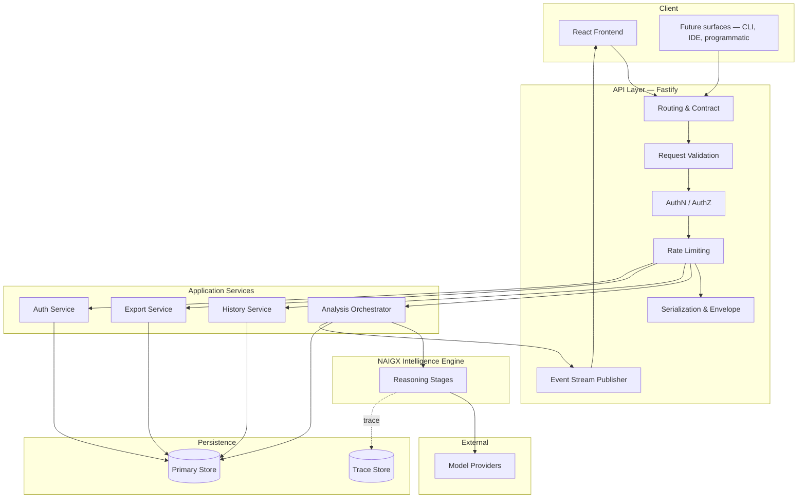
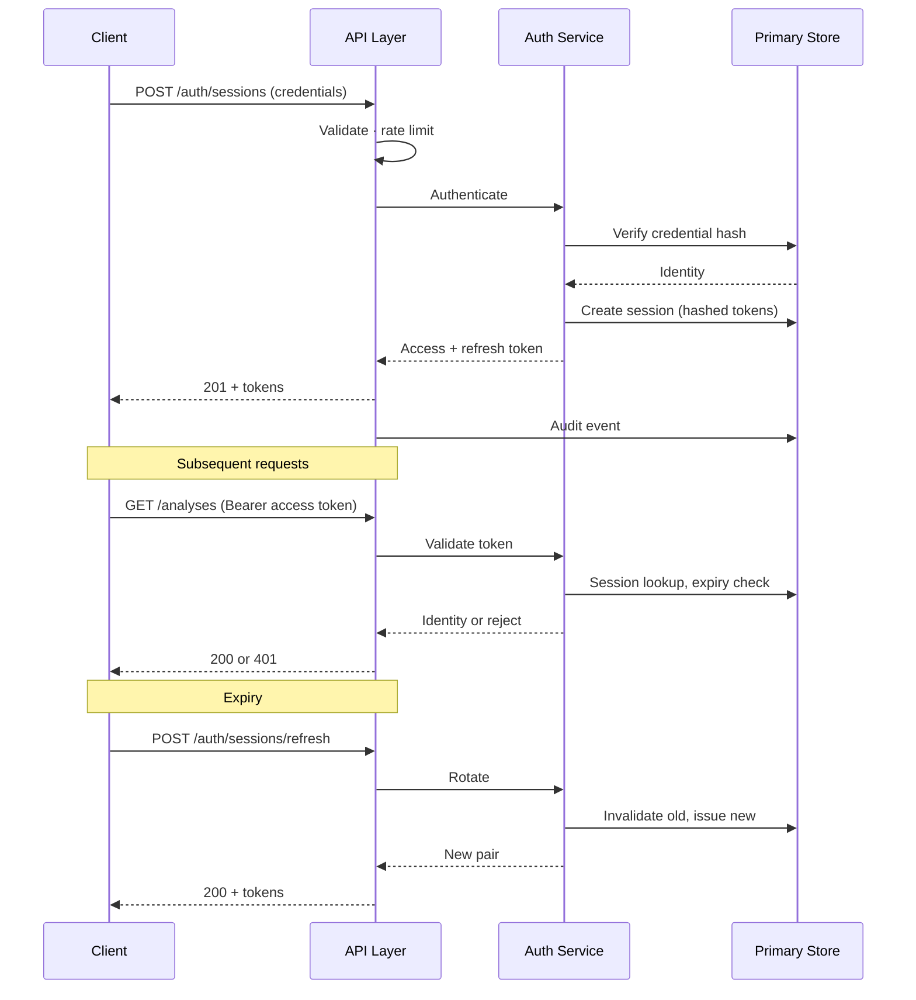
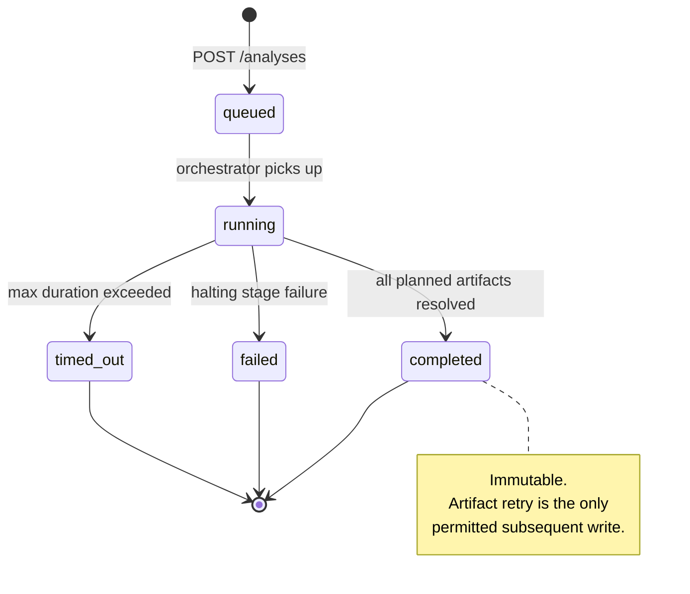
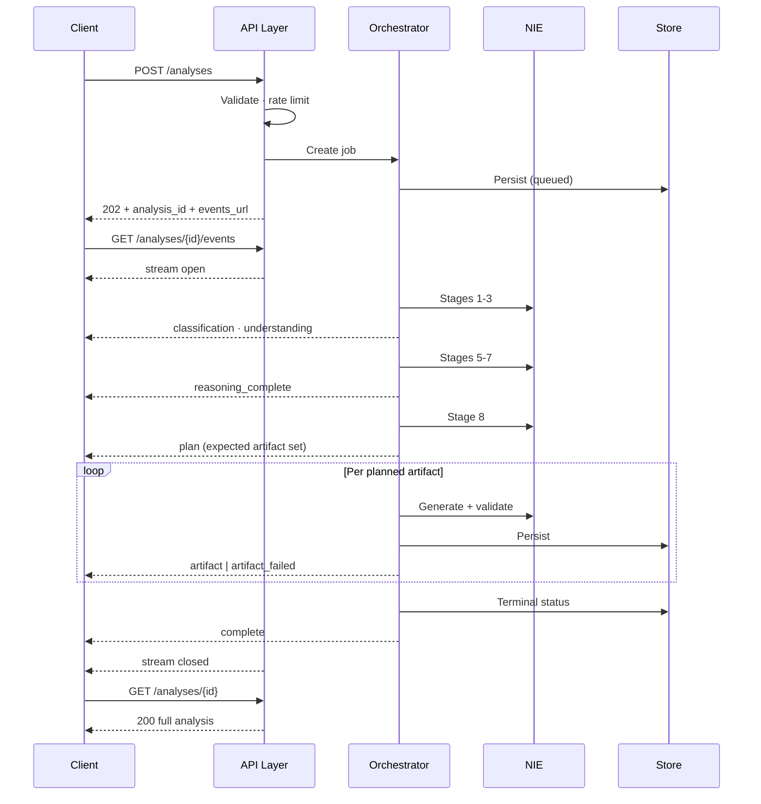
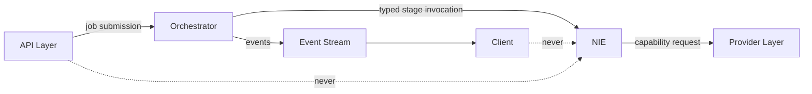
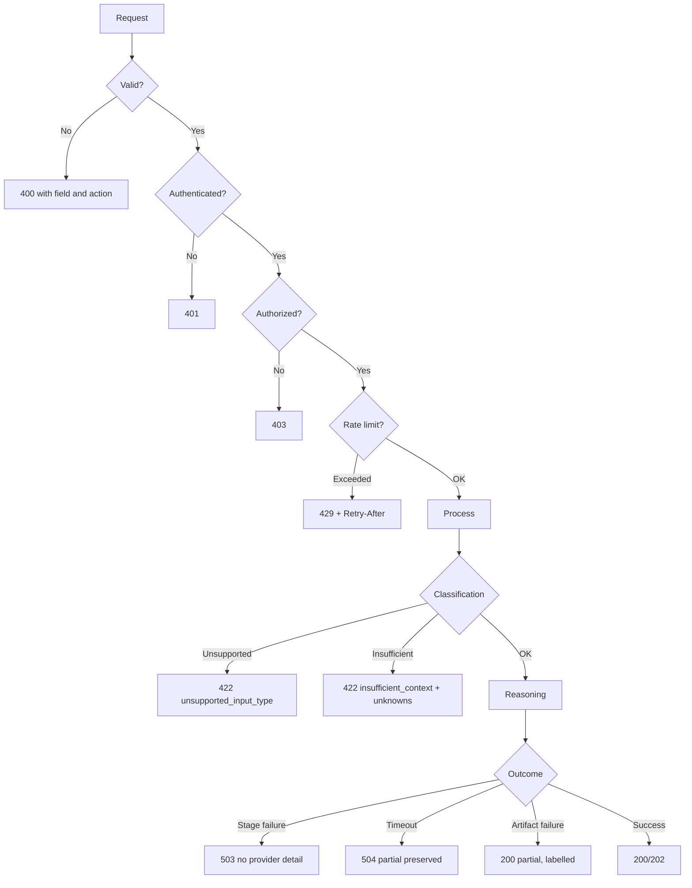

# NAIGX — API Design Specification

**Authoritative API contract for Version 1.0.**

| Field | Value |
|---|---|
| Product | NAIGX — Automation Intelligence Platform |
| Core engine | NAIGX Intelligence Engine (NIE) |
| Document type | API Design Specification (canonical) |
| Sources of truth | Executive Summary v1.1 · Product Vision v1.1 · PRD v1.0 · MVP Scope v1.0 · System Architecture v1.0 · AI Architecture v1.0 · Database Design v1.0 |
| Function | Defines every API contract between client, backend, and NIE |
| Base path | `/api/v1` |
| Version | 1.0 |
| Last updated | 2026-08-11 |

---

## How this document is used

This is the contract. It contains no framework configuration, no OpenAPI schema, and no implementation — those are generated from this document, not substitutes for it.

**Three rules govern API change:**

1. **The contract is public within the system.** Any change visible to a client is a versioned change (§4). Internal refactoring that alters a response shape is a breaking change, regardless of intent.
2. **Predictability outranks convenience.** A resource that behaves like its siblings is worth more than one optimized for a single caller. Special cases accumulate; consistency compounds.
3. **The Product Vision governs.** No endpoint may execute, deploy, or connect to a user-owned platform (`TC-008`). No endpoint may expose provider identity (`AI-006`). These are contract-level prohibitions, not implementation details.

---

## 1. API Philosophy

Seven principles. Each states what it forbids.

---

### AP-1 — API First

**All product capability is exposed through the API. The web client is one consumer, not a privileged one** (`TC-003`, `SA AP-5`).

The client may not reach capability by any other path — no server-rendered behavior bypassing the contract, no client-only logic that constitutes a product feature. This is what makes future surfaces (CLI, IDE extension, programmatic access) additive rather than architectural.

**Forbids:** capability reachable only through the web client; endpoints designed around a specific UI layout; response shapes that encode presentation decisions.

---

### AP-2 — Resource Oriented

**URLs name things; methods name actions.** An analysis is a resource. Its artifacts, exports, and events are sub-resources. Creating an analysis is `POST /analyses`, not `POST /run-analysis`.

**Forbids:** verbs in paths; RPC-shaped endpoints where a resource operation would serve; endpoints named after a workflow step rather than the thing operated on.

**The one deliberate exception:** `POST /analyses/{id}/artifacts/{type}/retry` (§7.8). Retry is genuinely an action on a sub-resource with no resource identity of its own. Forcing it into resource shape would produce a worse contract than admitting the exception.

---

### AP-3 — RESTful with honest semantics

Methods mean what they mean: `GET` is safe and idempotent, `PUT` is idempotent, `POST` is not, `DELETE` removes.

**Forbids:** `GET` with side effects; `POST` used for retrieval because a request body is convenient; `DELETE` that soft-deletes while the client believes otherwise (`DB DP-7` — user content is hard-deleted, and the API says so).

---

### AP-4 — Versioned from the first release

The base path carries `v1` from day one (§4). Versioning added later requires every existing client to change; versioning present from the start costs one path segment.

**Forbids:** unversioned endpoints; version negotiation via header only; breaking changes within a version.

---

### AP-5 — Predictable

Every response follows one envelope (§10.1). Every error follows one shape (§9.1). Every collection paginates identically. Every timestamp is ISO 8601 UTC. Every identifier is a UUID.

**Rationale:** a client that has integrated one endpoint should be able to predict the shape of the next. Predictability is what allows client code to be written once and reused, and it is the property most often sacrificed for a small per-endpoint convenience.

**Forbids:** per-endpoint response shapes; bare arrays as top-level responses; mixed identifier formats; local timestamps.

---

### AP-6 — Stateless

Every request carries its own authentication and context (`TC-004`, `SA AP-3`). No server-held session state beyond the session record itself; no request depends on a prior request's server-side residue.

**Forbids:** conversational state on the server; endpoints whose behavior depends on invocation order; sticky-session requirements outside the SSE channel (§12.2).

---

### AP-7 — Consistent

Field names, error codes, pagination parameters, and status semantics are uniform across the surface. `created_at` is never `createdAt` in one place and `creation_date` in another.

**Convention:** `snake_case` fields, plural collection nouns, UUID identifiers, ISO 8601 UTC timestamps, enumerated values in `lower_snake_case`.

---

## 2. API Architecture

### 2.1 Layers



### 2.2 Layer responsibilities

| Layer | Owns | Never |
|---|---|---|
| **Client** | Presentation, input capture, stream consumption | Reasoning; provider calls; authoritative validation |
| **API layer** | HTTP contract, validation, authn/authz, rate limiting, envelope, streaming | Reasoning; direct provider invocation; artifact composition decisions |
| **Application services** | Job lifecycle, retrieval, export rendering, identity | Reasoning content decisions |
| **NIE** | All reasoning (`AI §3`) | HTTP awareness; persistence; identity |
| **Persistence** | Durable state | Business logic |
| **Providers** | Model capability | Anything reaching a client identifiably (`AI-006`) |

### 2.3 The boundary the API enforces

**Clients never address the NIE.** There is no endpoint that invokes a reasoning stage, retrieves a prompt fragment, or exposes a stage trace. The NIE is reachable only through the Analysis Orchestrator, and only as a complete analysis.

| Prohibition | Rationale |
|---|---|
| No stage-level invocation endpoint | `AI §3.3` — stages 1–8 are halting and sequential; partial invocation produces meaningless output |
| No prompt fragment content endpoint | Fragment content is operator configuration, not product surface (`MVP §6.2`) |
| No trace endpoint | Traces contain full business content with operator-only access (`DB §8.4`) |
| No provider identity in any response | `AI-006`, verified by `AC-025` |
| No execution, deployment, or platform-connection endpoint | `TC-008` — enforced at the contract, not just the implementation |

---

## 3. Authentication

### 3.1 Model

Session-based with opaque tokens. Not JWT.

| Property | Choice | Rationale |
|---|---|---|
| Token type | Opaque, server-validated | Immediate revocation. A stateless JWT cannot be revoked before expiry, which is unacceptable when a session grants access to confidential business content. |
| Storage | Hashed in `SESSION` (`DB §4.1`) | Token theft from the database yields nothing usable |
| Transport | `Authorization: Bearer <token>` | Standard; works for all future surfaces |
| Refresh | Separate refresh token, longer-lived, single-use rotation | Limits access-token lifetime without forcing frequent re-authentication |

### 3.2 Authentication flow



### 3.3 Authentication boundaries

| Boundary | Rule |
|---|---|
| **Anonymous permitted** | One full analysis without authentication (`FR-004`). Analysis creation, retrieval, and event stream are reachable with an anonymous token. |
| **Authentication required** | Export, history, settings, feedback, account operations |
| **Prompt timing** | Only at the point of use. Never before a first analysis (`FR-004`, `UX-001`). |
| **Anonymous claim** | On registration, an anonymous token may be presented to transfer ownership (`DB §10.3`). Audited. |
| **Authorization** | Server-side ownership check on every access to a user-owned resource (`NFR-026`). Never from a client-supplied owner identifier. |

### 3.4 Anonymous access tokens

| Property | Detail |
|---|---|
| Issued | On anonymous analysis creation |
| Scope | Exactly one analysis. Grants read and event-stream access to that analysis only. |
| Lifetime | Short, fixed. Unclaimed analyses expire (`DBQ-6`). |
| Capability | Cannot export, cannot list, cannot delete an account |
| Transport | Same `Bearer` header; the API distinguishes by token class |

### 3.5 API keys — v1.0 status

**Not implemented in v1.0.** No programmatic access surface (`MVP §10`).

The contract reserves `/auth/api-keys` and the `Bearer` scheme accommodates a key token class without change. This is documented so that adding keys later is additive rather than a scheme change.

### 3.6 Future OAuth and enterprise SSO

| Addition | Version | Contract impact |
|---|---|---|
| OAuth provider login | v2.0 | New endpoints under `/auth/oauth/*`; session issuance unchanged |
| Enterprise SSO (SAML/OIDC) | v3.0 | New endpoints under `/auth/sso/*`; session issuance unchanged |
| Organization-scoped sessions | v3.0 | Session gains an organization claim; existing sessions remain valid |

**The property that makes this work:** authentication *method* is separable from session *issuance*. Every method terminates in the same session record, so the rest of the API never learns how a user authenticated.

---

## 4. API Versioning Strategy

### 4.1 Scheme

| Aspect | Choice |
|---|---|
| Location | URL path — `/api/v1` |
| Granularity | Whole API, not per-resource |
| Rationale | Path versioning is visible in logs, caches, and client code. Header versioning is invisible at every debugging surface where it matters. |
| Per-resource versioning | Rejected — produces combinatorial client complexity for marginal flexibility |

### 4.2 What constitutes a breaking change

| Breaking | Non-breaking |
|---|---|
| Removing or renaming a field | Adding an optional field |
| Changing a field's type or format | Adding an enumerated value **to a response** |
| Adding a required request field | Adding an optional request parameter |
| Changing an error code's meaning | Adding a new error code |
| Removing an endpoint | Adding an endpoint |
| Tightening validation | Relaxing validation |
| Changing status code semantics | Adding a new status for a new condition |

**The subtle case:** adding an enumerated value to a *response* is non-breaking only if clients are documented to tolerate unknown values. §10.6 states this requirement explicitly, which is what makes the guarantee real.

### 4.3 Deprecation

| Stage | Behavior |
|---|---|
| **Announced** | Documented; `Deprecation` and `Sunset` headers on affected responses |
| **Warning period** | Minimum one full version cycle; deprecated endpoints fully functional |
| **Sunset** | Removed only in a new major version; never within `v1` |
| **Client notice** | `Warning` header carries a machine-readable notice and a documentation link |

### 4.4 Compatibility guarantee

**Within `v1`, no breaking change ships.** A client written against `v1` at launch works against `v1` at any later point.

Where a change would break the contract, it goes to `v2` with `v1` maintained through a stated overlap period. This is a real cost, accepted deliberately: an API that breaks its own version teaches clients to distrust the version number, at which point versioning provides nothing.

### 4.5 Migration

| Element | Approach |
|---|---|
| Overlap | `v1` and `v2` served concurrently for a stated period |
| Migration guide | Field-by-field mapping published before `v2` is available |
| No forced cutover | Clients migrate on their schedule within the overlap |
| Data compatibility | Resources created under `v1` remain retrievable under `v2` (`DB §15.3` — additive only) |

---

## 5. Resource Definitions

| Resource | Path | Purpose | Auth | Mutability |
|---|---|---|---|---|
| **Sessions** | `/auth/sessions` | Authentication lifecycle | Mixed | Create, refresh, delete |
| **Users** | `/users/me` | Account management | Required | Read, delete |
| **Settings** | `/users/me/settings` | Minimal preferences (`FR-071`) | Required | Read, update |
| **Analyses** | `/analyses` | The central resource | Anonymous or authenticated | Create, read, delete |
| **Analysis events** | `/analyses/{id}/events` | Progressive result stream (`FR-041`) | Owner | Read (stream) |
| **Artifacts** | `/analyses/{id}/artifacts` | Generated outputs | Owner | Read; retry sub-action |
| **Exports** | `/analyses/{id}/exports` | Document generation (`FR-050`) | Required | Create, read |
| **Feedback** | `/analyses/{id}/feedback` | Quality signal (`FR-101`) | Required | Create, replace |
| **Health** | `/health` | Liveness and readiness | None | Read |
| **System info** | `/system` | API version and capabilities | None | Read |
| **Metrics** | `/internal/metrics` | Operational telemetry | Operator | Read |
| **Provider status** | `/internal/providers` | Provider health (**operator only**) | Operator | Read |
| **Prompt versions** | `/internal/prompt-versions` | Fragment version registry (**operator only**) | Operator | Read |

### 5.1 Resources deliberately absent

| Absent | Why |
|---|---|
| `/reasoning`, `/stages` | Clients never address the NIE (§2.3) |
| `/prompts` (public) | Fragment content is operator configuration, not product surface |
| `/traces` | Operator-only, content-bearing (`DB §8.4`) |
| `/providers` (public) | Provider identity never reaches a client (`AI-006`) |
| `/platforms`, `/integrations`, `/connections` | `TC-008`. No endpoint may connect to a user-owned platform. |
| `/organizations`, `/teams` | v3.0 (`MVP §6.1`) |

### 5.2 Internal resource namespace

`/internal/*` resources require operator authorization and are excluded from the public contract and from `v1` compatibility guarantees. They exist in this document so their boundary is explicit — not so clients may use them.

---

## 6. Endpoint Specifications

Conventions: all paths are relative to `/api/v1`. All responses use the §10.1 envelope. All errors use the §9.1 shape. Every response carries `X-Request-Id` and `X-Correlation-Id`.

---

### 6.1 Authentication

---

#### API-001 — Create session (login)

| | |
|---|---|
| **Method / URL** | `POST /auth/sessions` |
| **Purpose** | Authenticate and issue tokens |
| **Auth** | None |
| **Input** | `email`, `password`, optional `anonymous_token` for claim |
| **Output** | `access_token`, `refresh_token`, `expires_at`, `user` summary |
| **Validation** | `email` well-formed; `password` present; both required |
| **Errors** | `validation_failed` 400 · `invalid_credentials` 401 · `rate_limited` 429 |
| **Success** | `201 Created` |
| **Dependencies** | `FR-070`; Auth Service |
| **Acceptance** | Invalid credentials return an identical response shape and timing profile regardless of whether the email exists. Successful login writes an audit event. Presented `anonymous_token` transfers analysis ownership and is audited. |

---

#### API-002 — Refresh session

| | |
|---|---|
| **Method / URL** | `POST /auth/sessions/refresh` |
| **Purpose** | Exchange a refresh token for a new pair |
| **Auth** | Refresh token |
| **Input** | `refresh_token` |
| **Output** | New `access_token`, `refresh_token`, `expires_at` |
| **Validation** | Token valid, unexpired, unused |
| **Errors** | `invalid_token` 401 · `token_reused` 401 · `rate_limited` 429 |
| **Success** | `200 OK` |
| **Dependencies** | API-001 |
| **Acceptance** | Refresh tokens are single-use; the old token is invalidated on rotation. **Reuse of a consumed refresh token invalidates the entire session family** and writes a security audit event — reuse indicates theft. |

---

#### API-003 — Delete session (logout)

| | |
|---|---|
| **Method / URL** | `DELETE /auth/sessions/current` |
| **Purpose** | Revoke the active session |
| **Auth** | Required |
| **Input** | None |
| **Output** | None |
| **Errors** | `unauthenticated` 401 |
| **Success** | `204 No Content` |
| **Acceptance** | Both access and refresh tokens are invalidated immediately. A subsequent request with either returns 401. Idempotent — logging out twice is not an error. |

---

#### API-004 — Register

| | |
|---|---|
| **Method / URL** | `POST /users` |
| **Purpose** | Create an account |
| **Auth** | None |
| **Input** | `email`, `password`, optional `anonymous_token` |
| **Output** | `user` summary, `access_token`, `refresh_token` |
| **Validation** | `email` well-formed and unused; `password` meets policy |
| **Errors** | `validation_failed` 400 · `email_in_use` 409 · `rate_limited` 429 |
| **Success** | `201 Created` |
| **Dependencies** | `FR-070`, `FR-004` |
| **Acceptance** | `USER_SETTINGS` created with defaults. `training_consent` defaults to **false** (`NFR-030`). Presented `anonymous_token` transfers ownership and is audited. |

---

### 6.2 Account

---

#### API-010 — Get current user

| | |
|---|---|
| **Method / URL** | `GET /users/me` |
| **Purpose** | Retrieve account summary |
| **Auth** | Required |
| **Output** | `user_id`, `email`, `created_at`, `training_consent` |
| **Errors** | `unauthenticated` 401 |
| **Success** | `200 OK` |
| **Acceptance** | Never returns `credential_hash` or any session material. |

---

#### API-011 — Delete account

| | |
|---|---|
| **Method / URL** | `DELETE /users/me` |
| **Purpose** | Permanently delete the account and all data (`FR-073`) |
| **Auth** | Required |
| **Input** | `confirmation` — explicit affirmative acknowledgement |
| **Output** | `deletion_id`, `trace_purge_window` |
| **Validation** | `confirmation` must be present and explicit |
| **Errors** | `validation_failed` 400 · `unauthenticated` 401 |
| **Success** | `202 Accepted` |
| **Dependencies** | `FR-073`, `DB §5.3`, `DB §5.4` |
| **Acceptance** | Primary-store cascade completes synchronously — the user's request is honored immediately. Trace purge is enqueued with a **stated completion window** returned in the response. Audit events are retained with the user reference **nullified**, not cascaded (`DB §4.6`). Sessions invalidated. |

**Why 202 rather than 204.** Deletion spans two stores with different consistency characteristics. Returning 204 would claim completeness the system cannot yet guarantee. 202 with a stated window is honest, and honesty here is not a technicality — it is the difference between a kept and a broken deletion promise.

---

#### API-012 — Get settings · API-013 — Update settings

| | |
|---|---|
| **Method / URL** | `GET` / `PUT /users/me/settings` |
| **Purpose** | Read and update minimal preferences |
| **Auth** | Required |
| **Input (PUT)** | `default_export_format` |
| **Output** | Complete settings object |
| **Validation** | Enumerated values only |
| **Errors** | `validation_failed` 400 · `unauthenticated` 401 |
| **Success** | `200 OK` |
| **Dependencies** | `FR-071` |
| **Acceptance** | `PUT` is idempotent and replaces the full object. **No setting may alter reasoning behavior** (`FR-071`) — a settings field that affects analysis output is a contract violation. |

---

#### API-014 — Export user data

| | |
|---|---|
| **Method / URL** | `POST /users/me/data-exports` |
| **Purpose** | Self-service data export (`FR-072`) |
| **Auth** | Required |
| **Output** | `data_export_id`, `status` |
| **Errors** | `unauthenticated` 401 · `rate_limited` 429 |
| **Success** | `202 Accepted` |
| **Priority** | P1 |
| **Acceptance** | Includes all analyses in machine-readable form. Completes without operator intervention. Excludes credential material entirely. |

---

### 6.3 Analyses

---

#### API-020 — Create analysis

| | |
|---|---|
| **Method / URL** | `POST /analyses` |
| **Purpose** | Submit input and begin reasoning |
| **Auth** | Optional — anonymous permitted (`FR-004`) |
| **Input** | `content` (string), optional `source_type`, optional `classification_override` |
| **Output** | `analysis_id`, `status`, `events_url`, and `anonymous_token` when unauthenticated |
| **Validation** | `content` length 50–50,000 (`FR-002`); no input type selection accepted at creation (`FR-001`) |
| **Errors** | `validation_failed` 400 · `content_too_short` 400 · `content_too_long` 400 · `rate_limited` 429 · `service_unavailable` 503 |
| **Success** | `202 Accepted` |
| **Dependencies** | `FR-001`, `FR-002`, `FR-004`, `FR-005`; Orchestrator |
| **Acceptance** | Returns before reasoning completes. Validation errors name the constraint and the corrective action (`FR-005`) — never "invalid input". Anonymous creation returns a single-analysis token. `classification_override` is accepted but **not required**; the API never demands a type (`UX-002`). |

**Design note.** `classification_override` exists to support re-submission after a user correction (`FR-014`), not to invite type selection on first submission. The client must not surface it as a creation-time control.

---

#### API-021 — Get analysis

| | |
|---|---|
| **Method / URL** | `GET /analyses/{analysis_id}` |
| **Purpose** | Retrieve a complete analysis |
| **Auth** | Owner — authenticated user or anonymous token |
| **Output** | Full analysis: status, classification (with override), understanding, artifacts, confidence, provenance, unknowns, plan entries with omission reasons, degradation flags |
| **Errors** | `unauthenticated` 401 · `forbidden` 403 · `not_found` 404 |
| **Success** | `200 OK` |
| **Dependencies** | `FR-060`, `FR-040`, `FR-042`–`FR-045` |
| **Acceptance** | **Reproduces the stored record exactly; never regenerates** (`FR-060`). Every recommendation includes rationale, context references, confidence band, and — below `high` — confidence factors. Provenance labels present on every context-derived claim. Omitted artifacts are distinguishable from failed ones (`FR-091`). **Contains no stage traces, prompt fragments, or provider identity.** |

---

#### API-022 — List analyses

| | |
|---|---|
| **Method / URL** | `GET /analyses` |
| **Purpose** | History listing (`FR-061`) |
| **Auth** | Required |
| **Input** | `cursor`, `limit` (default 20, max 100), `classification` filter, `q` search (P1) |
| **Output** | Paginated summaries: `analysis_id`, `derived_title`, `classification`, `created_at`, `status`, `confidence_band` |
| **Errors** | `unauthenticated` 401 · `invalid_cursor` 400 |
| **Success** | `200 OK` |
| **Dependencies** | `FR-061`, `FR-062` |
| **Acceptance** | Reverse-chronological. Summaries only — **never full artifact content**, which keeps the listing query off content-bearing tables (`DB §14.1`). Empty state distinguishable from filtered-empty. |

---

#### API-023 — Delete analysis

| | |
|---|---|
| **Method / URL** | `DELETE /analyses/{analysis_id}` |
| **Purpose** | Permanent deletion (`FR-063`) |
| **Auth** | Owner |
| **Input** | `confirmation` |
| **Output** | `trace_purge_window` |
| **Errors** | `validation_failed` 400 · `forbidden` 403 · `not_found` 404 |
| **Success** | `202 Accepted` |
| **Dependencies** | `FR-063`, `DB §5.4` |
| **Acceptance** | Primary-store cascade is synchronous and irreversible. Trace purge enqueued with a stated window. Subsequent `GET` returns 404. **No soft delete** — the API's `DELETE` means what `DB DP-7` says it means. |

---

#### API-024 — Bulk delete analyses

| | |
|---|---|
| **Method / URL** | `DELETE /analyses` |
| **Purpose** | Delete all history (`FR-063`) |
| **Auth** | Required |
| **Input** | `confirmation` |
| **Output** | `deleted_count`, `trace_purge_window` |
| **Errors** | `validation_failed` 400 · `unauthenticated` 401 |
| **Success** | `202 Accepted` |
| **Acceptance** | Deletes only the authenticated user's analyses. Count returned. Audited. |

---

#### API-025 — Analysis event stream

| | |
|---|---|
| **Method / URL** | `GET /analyses/{analysis_id}/events` |
| **Purpose** | Progressive result delivery (`FR-041`) |
| **Auth** | Owner |
| **Protocol** | Server-Sent Events |
| **Output** | Ordered events — see §7.4 |
| **Errors** | `unauthenticated` 401 · `forbidden` 403 · `not_found` 404 |
| **Success** | `200 OK` with `text/event-stream` |
| **Dependencies** | `FR-041`; `SA AD-04` |
| **Acceptance** | First substantive event within the `NFR-001` target. Events carry monotonic sequence numbers for gap detection. Stream closes on terminal status. **Reconnection with `Last-Event-ID` resumes without duplication.** Stream failure never fails the analysis — API-026 provides polling fallback. |

---

#### API-026 — Analysis status

| | |
|---|---|
| **Method / URL** | `GET /analyses/{analysis_id}/status` |
| **Purpose** | Lightweight polling fallback |
| **Auth** | Owner |
| **Output** | `status`, `stage`, `artifacts_completed`, `artifacts_expected`, `updated_at` |
| **Errors** | As API-021 |
| **Success** | `200 OK` |
| **Dependencies** | `SA AR-06` — SSE reliability varies across proxies |
| **Acceptance** | Cheap enough to poll at a few-second interval without meaningful load. **Never returns artifact content** — that is API-021's role. |

**Why this exists.** SSE is unreliable across corporate proxies and some mobile networks. A client that cannot maintain a stream must still be able to complete the journey, and `SA AR-06` names this as a real risk. This endpoint is the mitigation.

---

### 6.4 Artifacts

---

#### API-030 — List artifacts

| | |
|---|---|
| **Method / URL** | `GET /analyses/{analysis_id}/artifacts` |
| **Purpose** | Artifact set with plan metadata |
| **Auth** | Owner |
| **Output** | Per artifact: `artifact_type`, `outcome` (generated \| failed \| omitted), `depth_level`, `inclusion_reason` or `omission_reason`, content for generated |
| **Errors** | As API-021 |
| **Success** | `200 OK` |
| **Dependencies** | `FR-017`, `FR-091`; `DB §4.4` |
| **Acceptance** | **All three outcomes represented distinctly.** An omitted artifact carries its omission reason; a failed artifact is labelled failed. A client must be able to render "not applicable" differently from "we tried and failed" without inference. |

---

#### API-031 — Get artifact

| | |
|---|---|
| **Method / URL** | `GET /analyses/{analysis_id}/artifacts/{artifact_type}` |
| **Purpose** | Single artifact retrieval |
| **Auth** | Owner |
| **Output** | Artifact content, provenance, confidence, schema version |
| **Errors** | `not_found` 404 for omitted or never-planned types |
| **Success** | `200 OK` |
| **Acceptance** | Content conforms to the referenced schema version. Mermaid artifacts return valid diagram source (`FR-031`). |

---

#### API-032 — Retry artifact

| | |
|---|---|
| **Method / URL** | `POST /analyses/{analysis_id}/artifacts/{artifact_type}/retry` |
| **Purpose** | Regenerate a failed artifact without re-running the analysis (`FR-091`) |
| **Auth** | Owner |
| **Output** | `status`, `events_url` |
| **Validation** | Artifact must currently be in `failed` state |
| **Errors** | `invalid_state` 409 if not failed · `not_found` 404 |
| **Success** | `202 Accepted` |
| **Dependencies** | `FR-091`; `AI §3.2` Stage 9 isolation |
| **Acceptance** | Reuses stored reasoning state; does **not** re-run stages 1–8. Success replaces the failed artifact within the same analysis. **This is the sole permitted mutation to a terminal analysis**, and it is permitted because it completes rather than alters the record (`DB DP-3`). |

---

### 6.5 Exports

---

#### API-040 — Create export

| | |
|---|---|
| **Method / URL** | `POST /analyses/{analysis_id}/exports` |
| **Purpose** | Generate a distributable document (`FR-050`) |
| **Auth** | **Required** — not available anonymously |
| **Input** | `format` (`markdown` \| `pdf`), optional `artifact_types` selection |
| **Output** | `export_id`, `download_url`, `expires_at` |
| **Validation** | Analysis must be terminal; format enumerated |
| **Errors** | `invalid_state` 409 · `forbidden` 403 · `validation_failed` 400 |
| **Success** | `201 Created` |
| **Dependencies** | `FR-050`–`FR-052`; `DB §4.4` |
| **Acceptance** | Contains all requested artifacts with rationale, provenance, and confidence intact (`AC-006`). Diagrams render in PDF; Mermaid source included in Markdown. Partial exports state which artifacts were omitted. **Presentation-ready without reformatting** (`AC-008`). Records an `EXPORT` row — the `M-4` instrument. Includes the professional-review disclaimer (`FR-051`), never marketing content. |

---

#### API-041 — Download export

| | |
|---|---|
| **Method / URL** | `GET /analyses/{analysis_id}/exports/{export_id}/content` |
| **Purpose** | Retrieve the generated document |
| **Auth** | Owner |
| **Output** | Document with appropriate content type and disposition |
| **Errors** | `not_found` 404 · `expired` 410 |
| **Success** | `200 OK` |
| **Acceptance** | Generated on demand from immutable artifacts — **files are not stored** (`DB §4.4`). Download links are time-bounded and owner-scoped. |

---

### 6.6 Feedback

---

#### API-050 — Submit feedback

| | |
|---|---|
| **Method / URL** | `PUT /analyses/{analysis_id}/feedback` |
| **Purpose** | Quality signal (`FR-101`), source of `M-7` |
| **Auth** | Required |
| **Input** | `helpful` (bool), optional `detail` |
| **Output** | Feedback record |
| **Errors** | `forbidden` 403 · `not_found` 404 |
| **Success** | `200 OK` |
| **Acceptance** | `PUT` because feedback is replaceable — a user may revise their own assessment (`DB §4.6`). Never required to proceed anywhere in the API. |

---

### 6.7 System

---

#### API-060 — Health

| | |
|---|---|
| **Method / URL** | `GET /health` |
| **Purpose** | Liveness and readiness |
| **Auth** | None |
| **Input** | `?check=liveness\|readiness` |
| **Output** | `status`, per-dependency status for readiness |
| **Success** | `200 OK` healthy · `503` not ready |
| **Dependencies** | `SA §12.6` |
| **Acceptance** | Readiness includes database reachability, **provider reachability**, and template loadability — an instance that cannot reason must not receive traffic. Liveness never depends on external services. **No internal detail, version, or provider name exposed** on an unauthenticated endpoint. |

---

#### API-061 — System information

| | |
|---|---|
| **Method / URL** | `GET /system` |
| **Purpose** | API version and capability discovery |
| **Auth** | None |
| **Output** | `api_version`, `supported_input_types`, `supported_export_formats`, `content_limits` |
| **Success** | `200 OK` |
| **Acceptance** | Allows a client to discover limits rather than hard-code them. **Never exposes provider, model, or fragment information.** |

---

### 6.8 Internal (operator only)

| ID | Method / URL | Purpose | Auth |
|---|---|---|---|
| API-070 | `GET /internal/metrics` | Operational metrics in a standard scrape format | Operator |
| API-071 | `GET /internal/providers` | Provider health, latency, error rate, cost (`AI §13.2`) | Operator |
| API-072 | `GET /internal/prompt-versions` | Active fragment version registry (`AI-013`) | Operator |
| API-073 | `GET /internal/analyses/{id}/trace` | Reasoning trace for diagnosis (`FR-100`) | Operator |

**Acceptance for all internal endpoints:** unreachable without operator authorization; excluded from the public contract and from `v1` compatibility guarantees; **every access to API-073 is itself audited** — it is the highest-privilege read in the system (`DB §8.4`).

---

## 7. Analysis API

### 7.1 Lifecycle



| Status | Meaning | Client behavior |
|---|---|---|
| `queued` | Accepted, not started | Subscribe to events |
| `running` | Stages executing | Render streamed artifacts |
| `completed` | Terminal, results available — **may include failed artifacts** | Render, export, retry failures |
| `failed` | Terminal, halting stage failure | Show reason, offer resubmit |
| `timed_out` | Terminal, partial results preserved (`FR-094`) | Render partial, offer retry |

**`completed` does not mean "everything succeeded."** It means the pipeline reached its end. The `degradation_flag` and per-artifact outcomes carry the detail. Conflating these would misreport completion rate (`M-1`) and mislead clients.

### 7.2 Full flow



### 7.3 Why creation is asynchronous

| Reason | Detail |
|---|---|
| Duration | 15–120 seconds exceeds reasonable synchronous request handling |
| Partial failure | Artifact-level failure requires per-artifact delivery (`FR-091`) |
| First-artifact latency | `M-2` is measured separately from completion; only streaming makes it meaningful |
| Client resilience | A dropped connection must not lose work |

### 7.4 Event contract

| Event | Payload | Emitted |
|---|---|---|
| `classification` | Type, confidence, candidates, low-confidence flag | After Stage 1 |
| `understanding` | Intent summary, context counts by provenance, sufficiency, unknowns | After Stage 3 |
| `insufficient_context` | Missing elements, what would resolve them | If Stage 3 assesses insufficient (`AI §5.4`) |
| `reasoning_complete` | Architecture summary, recommendation count | After Stage 7 |
| `plan` | Expected artifact types, omissions with reasons | After Stage 8 |
| `artifact` | Type, content, provenance, confidence | Per generated artifact |
| `artifact_failed` | Type, failure reason, retry availability | Per failed artifact |
| `complete` | Terminal status, degradation flag, summary counts | On terminal |
| `error` | Error code, message, stage | On halting failure |

**Contract guarantees:**

| Guarantee | Rationale |
|---|---|
| Monotonic sequence numbers on every event | Gap detection |
| `plan` precedes any `artifact` event | The client knows what to expect before results arrive — no jumping layout |
| `Last-Event-ID` reconnection resumes without duplication | Network interruption must not corrupt client state |
| Terminal event always emitted before close | A closed stream without a terminal event is a client-detectable fault |
| **No stage-internal reasoning content** | §8.2 |

### 7.5 Classification correction

Per `FR-014`, classification is displayed and correctable. The contract deliberately does **not** mutate the original analysis:

| Step | Behavior |
|---|---|
| 1 | Client submits `POST /analyses` with `classification_override` and the same content |
| 2 | A new analysis is created with the type fixed |
| 3 | The override event is recorded for the `M-6` signal (`DB §4.2`) |
| 4 | The original analysis remains retrievable |

**Why not an update endpoint.** `DB DP-3` makes analyses immutable, and re-running reasoning under a different frame produces a genuinely different analysis. An endpoint that mutated the original would destroy both the record of what the system originally concluded and the accuracy signal.

### 7.6 Retry semantics

| Scope | Endpoint | Behavior |
|---|---|---|
| Single failed artifact | API-032 | Reuses stored reasoning; no stage 1–8 re-run |
| Whole analysis | API-020 with the same content | New analysis; original preserved |

**There is no whole-analysis retry endpoint.** Re-running produces a new analysis under possibly-different fragment versions — which is a new record by definition (`DB §9.3`), not a retry of an old one.

### 7.7 Timeout behavior

| Aspect | Contract |
|---|---|
| Maximum duration | Enforced server-side (`FR-094`) |
| On timeout | Completed artifacts preserved and retrievable; status `timed_out` |
| Client notification | `complete` event with the timeout flag |
| Incomplete artifacts | Marked as not generated, distinguishable from failed and from omitted |

### 7.8 Anonymous constraints

| Permitted | Not permitted |
|---|---|
| Create one analysis | Create a second |
| Retrieve it | List analyses |
| Subscribe to events | Export |
| Retry a failed artifact | Submit feedback |
| — | Delete an account |

Exceeding the single-analysis limit returns `anonymous_limit_reached` 403 with guidance to register — not a generic rate-limit error, because the corrective action is different.

---

## 8. AI Integration API

### 8.1 The boundary

**The NIE has no HTTP surface.** It is an in-process module (`SA §3.4`) reached only by the Analysis Orchestrator through a typed interface. This section documents that internal contract; it is not exposed to any client.



### 8.2 What is deliberately not exposed

| Withheld | Reason |
|---|---|
| Stage-level invocation | Stages 1–8 are halting and sequential (`AI §3.3`); partial invocation yields meaningless output |
| Prompt fragments and composition | Operator configuration, not product surface (`MVP §6.2`) |
| Raw provider requests and responses | Content-bearing; trace store only (`DB §7.2`) |
| Provider and model identity | `AI-006`, verified by `AC-025` |
| Intermediate stage output | The client receives *conclusions with rationale*, not reasoning transcripts |
| Confidence factor internals | Bands and named factors are exposed; raw weights are not |
| Stage traces | Operator-only (API-073) |

**The distinction that matters.** `PV §3.5` requires that every recommendation be explained. It does not require exposing the reasoning transcript — and conflating the two would produce worse explanation, not better. `FR-042` asks for rationale a user can act on and defend; a stage dump is neither.

### 8.3 Internal interface

| Stage group | Invocation | Returns |
|---|---|---|
| Understanding (1–4) | Sequential, halting | Classification, intent, context set with provenance, knowledge set |
| Reasoning (5–7) | Sequential, halting | Reasoning plan, architecture model, recommendations |
| Planning (8) | Deterministic | Artifact plan with inclusion and omission reasons |
| Generation (9–10) | Per artifact, isolated | Validated artifacts or per-artifact failure |
| Finalization (11–12) | Deterministic | Confidence bands with factors, assembled response |

| Property | Contract |
|---|---|
| Stateless | Every invocation carries full context (`SA AP-3`) |
| No persistence | The NIE never writes; the orchestrator persists (`SA §3.4`) |
| No identity | The NIE receives no user or session information |
| Trace emission | Every stage emits asynchronously; trace failure never fails a stage |
| Failure granularity | Halting for 1–8; per-artifact for 9 (`AIP-8`) |

### 8.4 Provider layer

Only the provider adapter names a provider (`AI-001`). The API layer never invokes a provider directly, and no provider error reaches a client in identifiable form (`FR-093`).

| Provider condition | Client-visible result |
|---|---|
| Transient failure, retry succeeds | Nothing — invisible |
| Persistent failure, one provider | Nothing if failover succeeds |
| Persistent failure, all providers | `service_unavailable` 503, no provider named |
| Rate limit at provider | `service_unavailable` 503 — **never** the provider's own rate-limit signal, which would leak identity |

---

## 9. Error Handling

### 9.1 Standard error shape

Every error, without exception:

```
{
  "error": {
    "code": "content_too_short",
    "message": "Input must be at least 50 characters to analyze.",
    "action": "Add more detail about the process you want to automate.",
    "field": "content",
    "details": { "minimum": 50, "provided": 23 }
  },
  "meta": {
    "request_id": "...",
    "correlation_id": "...",
    "api_version": "v1",
    "timestamp": "2026-08-11T09:14:22Z"
  }
}
```

| Field | Purpose | Required |
|---|---|---|
| `code` | Stable machine-readable identifier | Yes |
| `message` | Human-readable statement of what happened | Yes |
| `action` | **What the user can do about it** | Yes where an action exists |
| `field` | Offending field for validation errors | Validation only |
| `details` | Structured context — limits, actual values | Optional |

**`action` is required, not optional.** `FR-090` requires that every error state a corrective step. A message without an action leaves the user stuck, and "invalid input" is explicitly named as unacceptable (`FR-005`).

### 9.2 Error taxonomy

| Class | Status | Codes | Retriable |
|---|---|---|---|
| **Validation** | 400 | `validation_failed`, `content_too_short`, `content_too_long`, `unsupported_file_type`, `file_too_large` | After correction |
| **Authentication** | 401 | `unauthenticated`, `invalid_credentials`, `invalid_token`, `token_expired`, `token_reused` | After re-auth |
| **Authorization** | 403 | `forbidden`, `anonymous_limit_reached`, `operator_only` | No |
| **Not found** | 404 | `not_found` | No |
| **Conflict** | 409 | `email_in_use`, `invalid_state` | Depends |
| **Gone** | 410 | `expired` | No |
| **Unsupported input** | 422 | `unsupported_input_type`, `insufficient_context` | After revision |
| **Rate limit** | 429 | `rate_limited` | After `Retry-After` |
| **Server** | 500 | `internal_error` | Yes, with backoff |
| **Unavailable** | 503 | `service_unavailable` | Yes, with backoff |
| **Timeout** | 504 | `analysis_timeout` | Yes |

### 9.3 Two domain errors that are not failures

| Code | Status | Meaning |
|---|---|---|
| `unsupported_input_type` | 422 | Classification determined the input is outside scope (`FR-092`). The system worked correctly. |
| `insufficient_context` | 422 | Stage 3 determined that any analysis would be substantially invented (`AI §5.4`). Refusal is a quality behavior (`AI §11.7`). |

**Both are 422, not 400 or 500.** The request was well-formed and processed correctly; the *content* cannot be analyzed. Both responses name what is missing and what would resolve it — `insufficient_context` in particular returns the specific unknowns, because `PV §5` identifies this as a defining product moment. Returning a generic error here would waste the most valuable thing the system determined.

### 9.4 Error flow



### 9.5 Error hygiene

| Rule | Source |
|---|---|
| No stack traces, internal identifiers, or framework detail | `FR-090` |
| **No provider names in any error** | `AI-006`, `FR-093` |
| Authentication failures uniform in shape and timing | Prevents account enumeration |
| Full detail to the trace and log, never to the client | `SA §11.2` |
| `correlation_id` in every error so a user can reference an incident | `NFR-080` |

---

## 10. Response Standards

### 10.1 Success envelope

```
{
  "data": { ... },
  "meta": {
    "request_id": "...",
    "correlation_id": "...",
    "api_version": "v1",
    "timestamp": "2026-08-11T09:14:22Z"
  }
}
```

| Rule | Rationale |
|---|---|
| `data` always an object, never a bare array | Allows adding fields alongside a collection without a breaking change |
| `meta` on every response including errors | Uniform diagnostic path |
| No presentation fields | `AP-1` — the API serves any client |

### 10.2 Collections

```
{
  "data": {
    "items": [ ... ],
    "pagination": {
      "next_cursor": "...",
      "has_more": true,
      "limit": 20
    }
  },
  "meta": { ... }
}
```

**Cursor pagination, not offset.** History is reverse-chronological and receives new items at the head; offset pagination would skip or duplicate rows as new analyses are created mid-traversal. Cursors also match the `(user_id, created_at DESC)` index directly (`DB §14.1`).

| Parameter | Default | Max |
|---|---|---|
| `limit` | 20 | 100 |
| `cursor` | — | Opaque; clients must not construct or parse it |

### 10.3 Identifiers and timestamps

| Element | Format |
|---|---|
| Resource identifiers | UUID |
| Timestamps | ISO 8601, UTC, `Z` suffix — always |
| Durations | Milliseconds, integer |
| Enumerations | `lower_snake_case` |
| Monetary values | Never in client-facing responses |

**No local timezones, ever.** Timezone handling is a presentation concern; a UTC-only contract removes an entire class of client bugs.

### 10.4 Correlation

| Header | Direction | Purpose |
|---|---|---|
| `X-Request-Id` | Response | Identifies one HTTP request |
| `X-Correlation-Id` | Request and response | Spans a full analysis across many requests (`NFR-080`) |

A client may supply `X-Correlation-Id`; if absent the server generates one. This is what allows a user to reference "my analysis had a problem" with an identifier that ties creation, streaming, retrieval, and export into a single traceable sequence.

### 10.5 Status code usage

| Code | Used for |
|---|---|
| 200 | Successful read or update |
| 201 | Resource created and immediately available |
| 202 | Accepted for asynchronous processing — analysis creation, deletion, export |
| 204 | Successful with no body — logout |

### 10.6 Client tolerance requirement

**Clients must ignore unknown fields and tolerate unknown enumerated values.**

This is a contract obligation on the client, stated so that §4.2's non-breaking-change guarantee is real. Without it, adding a classification type or an artifact type would break every existing client, and the API could never evolve within a version.

---

## 11. Security

### 11.1 Authentication and authorization

| Control | Implementation |
|---|---|
| Transport | TLS 1.2+ enforced; HSTS (`NFR-020`) |
| Tokens | Opaque, hashed at rest, server-validated |
| Refresh rotation | Single-use; **reuse invalidates the session family** |
| Authorization | Server-side ownership check on every user-owned resource (`NFR-026`) |
| Never trust client identity claims | Ownership derived from the session, never from a request parameter |
| Anonymous scope | Single analysis; no listing, export, or account access |

### 11.2 Rate limiting

| Scope | Basis | Rationale |
|---|---|---|
| Analysis creation, authenticated | Per account | Cost control (`R-13`) |
| Analysis creation, anonymous | Per IP, stricter | Abuse surface |
| Authentication attempts | Per IP and per account | Credential stuffing |
| Export generation | Per account | Rendering cost |
| Read endpoints | Generous per-account | Not a meaningful abuse vector |

`429` responses carry `Retry-After`. Limits are stated in `/system` so clients can behave well rather than discover limits by hitting them.

### 11.3 Input validation

| Rule | Source |
|---|---|
| All input untrusted; server-side validation authoritative | `NFR-024` |
| Client-side validation is advisory only | `SA §4.2` |
| Schema validation at the boundary before any processing | `SA §10.3` |
| Content limits enforced before any provider cost is incurred | `FR-002` |
| No content echoed into a rendering context unescaped | `NFR-027` |

### 11.4 Prompt injection

The API's contribution to `AI §11.6` is structural:

| Control | Detail |
|---|---|
| Content is data | No API parameter allows a client to influence reasoning instructions |
| No fragment or template parameter | `MVP §6.2` — users cannot author reasoning |
| No stage or routing control | Would grant influence over how reasoning is performed |
| Output validated before response | Schema conformance bounds achievable effect (`FR-039`) |
| **No capability to abuse** | The decisive control: no endpoint executes, connects, or acts (`TC-008`) |

**The bounding argument at the API layer:** because no endpoint does anything except produce a document for the requester, the worst outcome of a successful injection is a degraded document returned to the attacker.

### 11.5 Sensitive data filtering

| Never in any client-facing response | Source |
|---|---|
| Credential hashes, token material | `NFR-022` |
| Provider or model identity | `AI-006` |
| Prompt fragments or composed requests | `DB §7.2` |
| Stage traces | `DB §8.4` |
| Internal identifiers, stack traces, framework detail | `FR-090` |
| Another user's data under any circumstance | `NFR-026` |

### 11.6 Audit logging

| Audited | Detail |
|---|---|
| Authentication events and failures | `SA §10.7` |
| Analysis creation, retrieval, deletion | Resource-scoped |
| Export generation | `M-4` and access record |
| Account deletion and anonymous claim | Ownership transitions |
| **Operator trace access (API-073)** | Highest-privilege read in the system |

Audit records carry `correlation_id` and contain **no business content** (`NFR-081`).

### 11.7 Secrets

| Rule | Source |
|---|---|
| Provider keys server-side only; never in a response | `NFR-023` |
| No endpoint returns, sets, or references a secret value | — |
| Secrets injected at runtime from a managed store | `SA §10.4` |
| Never logged, never traced | `NFR-081` |

---

## 12. Performance

### 12.1 Latency targets

| Class | Target | Source |
|---|---|---|
| Read endpoints (`GET`) | ≤200ms p95 | `NFR-003` |
| History listing | ≤1s p95 | `NFR-004` |
| Analysis creation (`202` return) | ≤500ms p95 | Acceptance, not completion |
| First analysis event | ≤15s p50, ≤40s p95 | `NFR-001`, `M-2` |
| Full analysis | ≤60s p50, ≤120s p95 | `NFR-002`, `M-3` |
| Export generation | ≤10s p95 | `NFR-005` |

**Creation latency is measured to `202`, not to completion.** Conflating them would make the acceptance path appear slow and hide the metric that actually matters (`M-2`).

### 12.2 Streaming

| Aspect | Contract |
|---|---|
| Protocol | Server-Sent Events |
| Rationale | Unidirectional server-to-client fits exactly; WebSocket would add bidirectional complexity for no benefit |
| Reconnection | `Last-Event-ID`; resumes without duplication |
| Fallback | API-026 polling when streams are unavailable (`SA AR-06`) |
| Affinity | Session affinity for the stream only; all other endpoints are affinity-free (`SA §9.4`) |
| Keep-alive | Periodic comments prevent proxy idle timeouts |

### 12.3 Caching

| Resource | Policy | Rationale |
|---|---|---|
| Completed analyses | Long-lived, private, `ETag` | Immutable (`DB DP-3`) — safely cacheable indefinitely |
| Artifacts | Same | Immutable |
| History listing | No cache | Changes with every new analysis |
| `/system` | Short public cache | Rarely changes |
| `/health` | Never cached | Defeats the purpose |
| Exports | No cache | Time-bounded, owner-scoped |

**Immutability is a performance asset.** Because a completed analysis can never change, its representation is cacheable without invalidation logic — a direct benefit of `DB DP-3`.

### 12.4 Compression, concurrency, retry

| Aspect | Contract |
|---|---|
| Compression | Standard content encoding on responses above a size threshold; disabled on the event stream |
| Concurrency | Per-account concurrent analysis limit; exceeding returns 429 with `Retry-After` |
| Client retry | Backoff required on 429, 500, 503. **Never retry 4xx other than 429** — the request will not succeed unchanged. |
| Idempotency | `GET`, `PUT`, `DELETE` idempotent. `POST /analyses` is not; duplicate submission creates a distinct analysis by design. |
| Timeouts | Analysis maximum enforced server-side (`FR-094`); read endpoints bounded well below client defaults |

---

## 13. Observability

### 13.1 Per-request

| Recorded | Purpose |
|---|---|
| `request_id`, `correlation_id` | Correlation across services |
| Method, path template, status, duration | Latency and error rate |
| Authenticated identity where present | Attribution |
| Rate limit outcome | Abuse detection |
| **Never: request body content** | `NFR-081` |

### 13.2 Metrics exposed

| Family | Metrics |
|---|---|
| Traffic | Request rate by endpoint and status |
| Latency | Percentiles by endpoint |
| Analysis | Creation rate, completion rate (`M-1`), first-artifact latency (`M-2`), full latency (`M-3`) |
| Export | Export rate (`M-4`) |
| Quality | Classification override rate (`M-6`), validation failure rate (`NFR-084`), flag rate (`M-7`) |
| Stream | Active streams, reconnection rate, fallback-to-polling rate |
| Provider | Latency, error rate, cost per analysis (operator only) |

### 13.3 Health endpoints

| Check | Verifies | Behavior on failure |
|---|---|---|
| Liveness | Process responsive | Restart |
| Readiness | Database, provider reachability, template loadability | Removed from routing |

Readiness includes provider reachability specifically so that an instance unable to reason does not accept analyses it cannot perform.

### 13.4 What observability must never do

| Rule | Rationale |
|---|---|
| Never block a request path | Telemetry failure degrades silently (`SA §3.10`) |
| Never log business content | `NFR-081` |
| Never send content to third-party analytics | `NFR-035` |
| Never expose internal metrics on a public endpoint | `/internal/*` is operator-only |

---

## 14. Future Expansion

Every addition below is additive. **No change breaks a `v1` client.**

### 14.1 Version 2

| Addition | Contract impact |
|---|---|
| **User context / memory** | Optional `use_context` parameter on `POST /analyses`; new `/users/me/context` resource. Absent parameter preserves v1 behavior exactly. |
| **Knowledge graph** | None — internal to Stage 4 (`AI §14.2`) |
| **Learning feedback** | Extends `/feedback` with optional structured outcome fields |
| **OAuth login** | New `/auth/oauth/*`; session issuance unchanged (§3.6) |
| **Parallel mixed-input paths** | Analysis gains an optional `secondary_classification` field. Clients tolerating unknown fields (§10.6) are unaffected. |
| **Read-only platform integration** | New `/integrations` resource. **Read-only enforced at the contract** — no write or execute operation may be defined. |

### 14.2 Version 3

| Addition | Contract impact |
|---|---|
| **Organizations** | New `/organizations` resource; analyses gain optional `organization_id`. Personal analyses continue to work unchanged. |
| **Team collaboration** | New sharing sub-resources; ownership semantics unchanged |
| **RBAC** | Permission enforcement at existing endpoints; single-role clients see identical behavior |
| **Enterprise SSO** | New `/auth/sso/*`; session issuance unchanged |
| **API keys** | Reserved namespace activated (§3.5); `Bearer` scheme accommodates a key token class |
| **Agentic analysis** | New event types on the existing stream. Clients tolerating unknown events are unaffected. **Agentic execution is permanently excluded** (`PV §3.6`). |
| **Estate analysis** | New resource over a wider input scope. **Analysis only, never operation** (`PV §3.1`). |

### 14.3 The permanent contract prohibition

**No future version may define an endpoint that executes, deploys, schedules, or connects to a user-owned automation platform** (`TC-008`, `PV §3.1`).

This is stated in the API specification, not only in the Product Vision, because the API is where such an endpoint would first appear. A proposed endpoint of this shape is not a feature request — it is a Vision amendment, and follows `PV` Appendix A.

---

## 15. API Decision Summary

| # | Decision | Reason | Benefits | Trade-offs | Future impact |
|---|---|---|---|---|---|
| AD-01 | **Path versioning from v1** | Visible in logs, caches, client code | Evolution without breakage; unambiguous | One path segment | Every future version is additive |
| AD-02 | **Asynchronous analysis with SSE** | 15–120s duration; per-artifact failure | Progressive delivery; `M-2` measurable | Stream complexity; proxy variability | Migrates to broker-backed pub/sub without contract change |
| AD-03 | **Polling fallback alongside SSE** | `SA AR-06` — streams fail across proxies | Journey completes without a stream | Two delivery paths | Any future client works regardless of network |
| AD-04 | **Opaque session tokens, not JWT** | Immediate revocation matters for confidential content | Revocable; no client-side claim parsing | Session lookup per request | Accommodates OAuth and SSO without scheme change |
| AD-05 | **Refresh reuse invalidates the family** | Reuse indicates theft | Token theft is contained and detected | Legitimate race conditions can force re-auth | Standard as surfaces multiply |
| AD-06 | **Cursor pagination** | History receives items at the head | No skipped or duplicated rows | Cursors are opaque and not seekable | Scales to any history size |
| AD-07 | **Uniform envelope on every response** | `AP-5` predictability | Client code written once; fields addable | Slight verbosity | Non-breaking evolution is possible at all |
| AD-08 | **`action` required on errors** | `FR-090`, `FR-005` | Users are never stuck | Every error needs authoring | Error quality is a contract property |
| AD-09 | **422 for unsupported and insufficient input** | These are correct outcomes, not failures | Clients distinguish refusal from error | Non-obvious status choice | Refusal quality remains visible as a first-class result |
| AD-10 | **Classification correction creates a new analysis** | `DB DP-3` immutability; `M-6` signal | History preserved; accuracy measurable | Two records for one user intent | Immutability holds at every version |
| AD-11 | **Artifact retry is the only mutation to a terminal analysis** | Completes rather than alters the record | `FR-091` retry without full re-run | One documented exception to immutability | Narrowly scoped and stable |
| AD-12 | **No reasoning internals exposed** | `PV §3.5` requires explanation, not transcripts | Explanation stays actionable; traces stay private | Clients cannot render stage detail | Internal reasoning evolves freely |
| AD-13 | **No provider identity in any response** | `AI-006` | Provider substitution invisible to clients | Errors are less specific | Providers change without client impact |
| AD-14 | **Client tolerance of unknown fields required** | Makes §4.2's guarantee real | New types and events ship without a version bump | Obligation on client authors | Every v2/v3 addition is non-breaking |
| AD-15 | **202 with a stated window for deletion** | Cross-store deletion cannot be synchronous | Honest about what is complete | Less tidy than 204 | Deletion promise remains truthful at scale |
| AD-16 | **No execution or connection endpoint, ever** | `TC-008`, `PV §3.1` | The prohibition is enforced at the contract | No platform-connected convenience | Permanent. Such an endpoint signals a Vision violation. |

---

## Appendix A — Endpoint Index

| ID | Method | Path | Auth | Priority |
|---|---|---|---|---|
| API-001 | POST | `/auth/sessions` | None | P0 |
| API-002 | POST | `/auth/sessions/refresh` | Refresh | P0 |
| API-003 | DELETE | `/auth/sessions/current` | Required | P0 |
| API-004 | POST | `/users` | None | P0 |
| API-010 | GET | `/users/me` | Required | P0 |
| API-011 | DELETE | `/users/me` | Required | P0 |
| API-012 | GET | `/users/me/settings` | Required | P1 |
| API-013 | PUT | `/users/me/settings` | Required | P1 |
| API-014 | POST | `/users/me/data-exports` | Required | P1 |
| API-020 | POST | `/analyses` | Optional | P0 |
| API-021 | GET | `/analyses/{id}` | Owner | P0 |
| API-022 | GET | `/analyses` | Required | P0 |
| API-023 | DELETE | `/analyses/{id}` | Owner | P0 |
| API-024 | DELETE | `/analyses` | Required | P1 |
| API-025 | GET | `/analyses/{id}/events` | Owner | P0 |
| API-026 | GET | `/analyses/{id}/status` | Owner | P0 |
| API-030 | GET | `/analyses/{id}/artifacts` | Owner | P0 |
| API-031 | GET | `/analyses/{id}/artifacts/{type}` | Owner | P0 |
| API-032 | POST | `/analyses/{id}/artifacts/{type}/retry` | Owner | P0 |
| API-040 | POST | `/analyses/{id}/exports` | Required | P0 |
| API-041 | GET | `/analyses/{id}/exports/{id}/content` | Owner | P0 |
| API-050 | PUT | `/analyses/{id}/feedback` | Required | P1 |
| API-060 | GET | `/health` | None | P0 |
| API-061 | GET | `/system` | None | P1 |
| API-070 | GET | `/internal/metrics` | Operator | P0 |
| API-071 | GET | `/internal/providers` | Operator | P1 |
| API-072 | GET | `/internal/prompt-versions` | Operator | P1 |
| API-073 | GET | `/internal/analyses/{id}/trace` | Operator | P0 |

**28 endpoints.** 24 public, 4 internal.

---

## Appendix B — Open API Questions

| # | Question | Decide by | Constraint on the answer |
|---|---|---|---|
| APIQ-1 | SSE versus polling as primary delivery | `MVP` Sprint 3 | Must meet `NFR-001`; polling fallback required regardless (`SA AQ-2`) |
| APIQ-2 | Export download — direct response versus signed time-bounded URL | Sprint 4 | Must remain owner-scoped and non-enumerable |
| APIQ-3 | Rate limit values per endpoint class | Sprint 5 | Must bound cost (`R-13`) without impeding legitimate consultant workloads |
| APIQ-4 | Anonymous token lifetime and single-analysis enforcement mechanism | Sprint 5 | Must align with the `DBQ-6` expiry period |
| APIQ-5 | Whether `/system` exposes supported input types before classification is stable | Sprint 5 | Must not become a client-side type selector (`UX-002`) |
| APIQ-6 | Operator authentication mechanism for `/internal/*` | Sprint 5 | Must be separable from user auth; trace access must be independently audited |
| APIQ-7 | Trace purge completion window stated in deletion responses | Before launch | Must match the published data policy (`DBQ-2`, `DBQ-7`) |

---

## Appendix C — Provenance

This document specifies the API contract of a pre-implementation product built by a single operator. It contains no requirements, no delivery dates, and no claims of customers, revenue, or team.

**Document hierarchy.** Product Vision governs the PRD. The PRD governs requirements. MVP Scope governs sequence. System Architecture governs platform structure. AI Architecture governs the intelligence layer. Database Design governs data structure. This document governs API contracts. Where this document appears to define behavior, it is defective — behavior belongs in the PRD.

| Version | Date | Change |
|---|---|---|
| 1.0 | 2026-08-11 | Initial API Design Specification. Derived from Executive Summary v1.1, Product Vision v1.1, PRD v1.0, MVP Scope v1.0, System Architecture v1.0, AI Architecture v1.0, Database Design v1.0. |