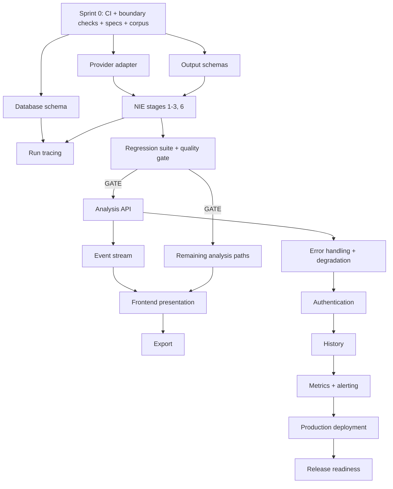
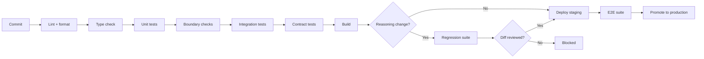

# NAIGX — Engineering Roadmap

**Execution plan for Version 1.0.**

| Field | Value |
|---|---|
| Product | NAIGX — Automation Intelligence Platform |
| Core engine | NAIGX Intelligence Engine (NIE) |
| Document type | Engineering Roadmap (canonical) |
| Sources of truth | Executive Summary v1.1 · Product Vision v1.1 · PRD v1.0 · MVP Scope v1.0 · System Architecture v1.0 · AI Architecture v1.0 · Database Design v1.0 · API Design v1.0 |
| Function | Translates approved architecture into a build sequence |
| Version | 1.0 |
| Last updated | 2026-08-11 |

---

## How this document is used

The product documents define **what**. The architecture documents define **how it is designed**. This document defines **how it gets built, in what order, and how you know a sprint is finished**.

It introduces no requirements, no architecture, and no scope. Where it names work, the definition lives in a requirement or design ID.

**Three rules:**

1. **MVP Scope governs sequence.** Where this roadmap details a sprint, `MVP §7` defines its boundary. A conflict means this document is defective.
2. **Sprints are ordered, not scheduled.** No dates. A single operator's velocity is unobserved, and dates invented for a planning document become commitments nobody agreed to.
3. **Exit criteria are binary.** A sprint is done or it is not. Partial completion carries forward as explicit debt, recorded in Appendix B.

---

## 0. Reconciling two valid sequencing instincts

A conventional build order — infrastructure, then auth, then domain, then UI — is correct for most products. **It is wrong for this one**, and the reason is worth stating before the plan, because the instinct will resurface every sprint.

| Conventional order | Why it fails here |
|---|---|
| Auth and database first | Neither carries hypothesis risk. Building them first defers the only question that can kill the product. |
| Frontend late, after the API stabilizes | Correct, and retained. |
| Domain logic in the middle | The domain logic **is** the experiment (`MVP §3`). It goes first. |

`MVP §7` states the rule directly: **if the product is going to fail, it should fail in Sprint 2, not Sprint 5.** Reasoning quality is the single unknown that no amount of engineering effort resolves. Everything else has a known solution shape.

### The vertical-slice question

"Vertical slices over horizontal layers" is a real principle and it is honored here — but a slice must be defined by *what it proves*, not by whether it has a UI.

| Sprint | The slice | Proves |
|---|---|---|
| 1 | Text in → reasoning → structured output (no UI, no auth, no persistence beyond the run) | The pipeline produces schema-valid, grounded output |
| 2 | Same slice, full artifact set, evaluated against the rubric | **The reasoning is good enough** |
| 3 | Four input paths → presented results in a browser | A practitioner can read and evaluate it |
| 4 | Results → exported document | The handoff moment works |
| 5 | Everything → persisted, measured, operable | The experiment can run |

Sprint 1's slice is thin and ugly. It is still vertical: input enters one end, evaluable output leaves the other. **A slice without a UI is still a slice.** What would not be a slice is building the provider adapter, then the schema layer, then the stages, with nothing runnable until all three exist.

### What this costs

Auth arriving in Sprint 5 means Sprints 1–4 run without user accounts. Accepted deliberately: `MVP §4.5` (single user first) and `DB DP-8` (explicit ownership) mean adding an owner column and an authorization check to already-designed entities is mechanical. Building auth first would not have made it easier — it would only have delayed Sprint 2.

---

## 1. Engineering Philosophy

### EP-1 — Build the risky thing first

Sequence by uncertainty, not by dependency convenience. Work with a known solution shape can wait; work that might not work cannot.

**In practice:** the NIE precedes infrastructure. The quality gate precedes presentation. Anything that would be wasted if the hypothesis fails is scheduled after the hypothesis is tested.

### EP-2 — Every sprint produces something runnable

Not necessarily something shippable. Something that can be executed, observed, and judged.

A sprint ending with "the adapter layer is complete" produces nothing to judge. A sprint ending with "a business requirement produces a schema-valid architecture you can read" produces evidence.

### EP-3 — Protect boundaries mechanically, not by discipline

`SA §7.3` defines eight CI checks. **They are built in Sprint 0, before there is anything to enforce them against.**

A solo operator has no review partner. Boundaries maintained by intention erode under time pressure, and the two most commercially consequential — provider independence and the execution prohibition — erode invisibly. Adding the checks later means auditing accumulated violations instead of preventing them.

### EP-4 — Avoid premature optimization, build unavoidable structure early

Two categories, distinguished by retrofit cost:

| Build early | Defer |
|---|---|
| Provider adapter (`FR-016`) | Caching |
| Provenance in the data model (`FR-013`) | Horizontal scaling |
| Run tracing (`FR-100`) | Queue and workers |
| CI boundary checks (`SA` App. A) | Performance tuning beyond targets |
| Schema validation (`FR-039`) | Archiving |

**The test:** is it expensive to add later, or merely useful now? Only the first justifies early cost (`MVP §4.6`).

### EP-5 — Cut scope, never quality

When a sprint overruns, remove a P1 feature entirely per the `MVP §5.3` cut order. Never ship a P0 feature at reduced quality.

Sprint boundaries are planning conveniences. Output quality is the experiment.

### EP-6 — Demonstrate to someone who isn't you

At least once per sprint from Sprint 2 onward, show output to a practitioner who did not build it. Solo development produces blindness to output quality faster than to functional defects, because the author knows what the output *means* and a reader does not.

---

## 2. Definition of Done

### 2.1 Task level

A task is done when **all** hold:

| # | Criterion |
|---|---|
| 1 | Implements its requirement ID; acceptance criteria verified, not assumed |
| 2 | Unit tests written and passing for the logic introduced |
| 3 | Integration test where it crosses a boundary |
| 4 | All CI quality gates pass (§8.3) |
| 5 | No architectural boundary violated (`SA` App. A) |
| 6 | Errors handled per `API §9`; every error states an action |
| 7 | Instrumented — logging and metrics where §13 requires |
| 8 | Self-reviewed against the Definition of Done as a checklist, not from memory |
| 9 | Deviation from any design document recorded, not silently absorbed |

### 2.2 Sprint level

| # | Criterion |
|---|---|
| 1 | All sprint deliverables meet task-level Done |
| 2 | Exit criteria demonstrably met — demonstrated, not asserted |
| 3 | Full test suite green; regression suite green from Sprint 2 |
| 4 | Deployed to the environment the sprint targets |
| 5 | Demonstrable end-to-end within its slice |
| 6 | No open severity-1 or severity-2 defects |
| 7 | Incomplete work carried forward explicitly (Appendix B), never quietly |

### 2.3 Release level

`PRD §14.1` and `MVP §9` apply in full, plus the qualitative gate:

> **Would a competent automation practitioner, shown a generated analysis without knowing its origin, consider it professional work?** (`PRD §14.3`)

If no, v1.0 does not ship regardless of checklist completion.

### 2.4 The special case — reasoning work

Reasoning changes have a stricter Done, because a passing test suite says nothing about whether the reasoning is good:

| # | Additional criterion |
|---|---|
| 1 | Regression suite passes against the golden corpus (`NFR-043`) |
| 2 | Output diffs against the prior fragment version reviewed by a human |
| 3 | Fragment version incremented; composition recorded (`AI-013`) |
| 4 | `regression_pass_reference` recorded before activation (`DB §4.5`) |
| 5 | Sampled output assessed against the quality rubric |
| 6 | Rollback verified (`AI-014`) |

---

## 3. MVP Milestones

Milestones are verifiable states, independent of sprint boundaries. Each is true or false.

| # | Milestone | Verified when | Sprint |
|---|---|---|---|
| M-01 | **Project foundation** | Repository, CI pipeline, quality gates, and all eight boundary checks operational | 0 |
| M-02 | **Specification gaps closed** | `PRD O-1`–`O-3`, `O-5` resolved in writing; golden corpus committed | 0 |
| M-03 | **Backend foundation** | API skeleton; stateless handling; health endpoints; structured logging | 1 |
| M-04 | **Provider independence** | Second-provider test passing without touching reasoning logic (`AI-005`) | 1 |
| M-05 | **NIE pipeline operational** | All twelve stages execute in sequence with typed handoff (`FR-010`) | 1–2 |
| M-06 | **Traceability** | Any analysis diagnosable from its trace without re-running (`FR-100`) | 1 |
| M-07 | **Structured generation** | 100% of artifacts schema-valid before presentation (`FR-039`) | 2 |
| M-08 | **Reasoning quality gate** | Sampled output passes the rubric (`M-8`, `M-9`) | 2 |
| M-09 | **Regression safety** | Fragment changes gated by a passing regression run (`NFR-043`) | 2 |
| M-10 | **Classification accuracy** | ≥95% on the golden corpus (`M-6`) | 2–3 |
| M-11 | **All analysis paths** | Four input types produce their specified artifact sets | 3 |
| M-12 | **Frontend foundation** | Results presentation with hierarchy, layered depth, streaming | 3 |
| M-13 | **Export system** | Markdown and PDF presentation-ready without reformatting | 4 |
| M-14 | **Degradation** | Partial failure yields labelled partial results across all tested failure modes | 4 |
| M-15 | **Authentication and history** | Analyses persist and retrieve exactly; deletion permanent and verified | 5 |
| M-16 | **Instrumentation** | All `PRD §3.2` metrics reporting | 5 |
| M-17 | **Accessibility** | WCAG 2.1 AA verified on primary flows | 5 |
| M-18 | **Security** | Review complete; no unresolved high-severity findings | 5 |
| M-19 | **Deployment** | Production deploy with monitoring, alerting, verified rollback | 5 |
| M-20 | **Performance** | `NFR-001`, `NFR-002` met under representative load | 5 |
| M-21 | **Beta readiness** | `PRD §14.1` and `§15` satisfied; qualitative gate passed | 6 |

**M-08 is the milestone that matters.** Every other milestone is engineering work with a known solution shape. M-08 can fail in a way no amount of effort resolves, and every milestone after it is wasted if it does.

---

## 4. Sprint Plan

Six sprints plus Sprint 0. Ordered, not scheduled.

---

### Sprint 0 — Foundation and preconditions

**Goal.** Make it impossible to build the wrong thing, and close the specification gaps that would otherwise be resolved badly under implementation pressure.

#### Deliverables

| Area | Deliverable | Reference |
|---|---|---|
| **Specification** | Reasoning quality rubric with inter-reviewer agreement | `PRD O-1`, `AIQ-1` |
| **Specification** | Complexity factor set and weights | `PRD O-2`, `DBQ-4` |
| **Specification** | Risk severity and likelihood scales | `PRD O-3`, `DBQ-3` |
| **Specification** | Trace retention period | `PRD O-5`, `DBQ-2` |
| **Specification** | Golden corpus — ≥10 inputs per type, with negative, insufficient, and contradiction cases | `AI §12.2` |
| **Repository** | Monorepo structure matching `SA §1.3` module boundaries |  |
| **CI** | Lint, format, type check, test, build |  |
| **CI** | **All eight boundary checks** | `SA` App. A |
| **Environment** | Local development with stubbed provider; no network required for NIE work |  |
| **Environment** | Managed database provisioned; migration tooling |  |
| **Workflow** | Branching, commit convention, PR template with the Definition of Done |  |

#### Dependencies
None. This is the entry point.

#### Risks

| Risk | Mitigation |
|---|---|
| The rubric is hard to write and tempting to defer | It blocks M-08 and the release gate. Sprint 2 cannot be evaluated without it. Deferring it means Sprint 2 has no pass condition. |
| Golden corpus assembled carelessly | It is the baseline for every future reasoning change. A weak corpus makes every subsequent regression test meaningless. |
| Boundary checks feel premature with no code to check | Adding them later means auditing violations instead of preventing them (`EP-3`) |

#### Exit criteria

- [ ] Four open specification items resolved **in writing**
- [ ] Golden corpus committed with expected classification, artifact set, and confidence band per case
- [ ] CI pipeline green on an empty repository, including all eight boundary checks
- [ ] A developer can run the stack locally with a stubbed provider

---

### Sprint 1 — NIE spine

**Goal.** Get a business requirement through the pipeline to a schema-valid, grounded architecture. **No UI. No auth. No history.**

#### Deliverables

| Area | Deliverable | Reference |
|---|---|---|
| **Backend** | Fastify skeleton; stateless handling; envelope and error shape | `API §10`, `§9` |
| **Backend** | Health endpoints including provider reachability | `API-060` |
| **Backend** | Structured logging with correlation IDs | `NFR-080` |
| **Data** | Identity, analysis, reasoning, and configuration domain schema | `DB §4` |
| **Data** | Trace store with tiered retention structure | `DB §8.3` |
| **Provider** | Capability interface, adapter, retry, normalization, cost accounting | `AI §10` |
| **Provider** | **Second adapter with passing automated test** | `AI-005` |
| **NIE** | Stages 1–3: classification, intent, context extraction with provenance | `FR-011`–`FR-013` |
| **NIE** | Stage 6: architecture analysis | `FR-030` |
| **NIE** | Versioned fragment composition and resolution | `AI §6`, `FR-019` |
| **NIE** | Output schemas and deterministic validation | `FR-039` |
| **Observability** | Run tracing across all implemented stages | `FR-100` |
| **Interface** | Minimal harness — text in, raw structured output. Deliberately unstyled. |  |

#### Dependencies
Sprint 0. The golden corpus is required to exercise stages 1–3 meaningfully.

#### Risks

| Risk | Mitigation |
|---|---|
| Provider-specific logic leaks into reasoning while moving fast | CI check from Sprint 0 fails the build |
| Provenance treated as a display concern and deferred | It cannot be retrofitted (`DD-05`). Every analysis produced without it is unusable for quality review. |
| Second adapter treated as optional | `SA AR-43` — an untested abstraction is an assumption. The test is a Sprint 1 deliverable, not a nice-to-have. |
| Structured generation less reliable than assumed | Measured this sprint via validation failure rate, not discovered in Sprint 4 |

#### Exit criteria

- [ ] A business requirement input produces a schema-valid architecture with full provenance
- [ ] Every architecture component traces to a context element (`FR-030`)
- [ ] Any run is diagnosable end-to-end from its trace
- [ ] Second-provider test passes without touching reasoning code
- [ ] Fragment versions resolved at runtime and recorded per run

---

### Sprint 2 — Quality gate

**Goal.** Determine whether the reasoning is good enough to continue. **This is the decision sprint.**

#### Deliverables

| Area | Deliverable | Reference |
|---|---|---|
| **NIE** | Stages 5, 7, 8: reasoning planning, recommendation generation, artifact planning | `FR-017`, `FR-034` |
| **NIE** | Stage 4: knowledge assembly with currency labelling | `AI §3.2` |
| **NIE** | Stage 11: confidence evaluation from measured factors | `FR-018`, `AI §8` |
| **Artifacts** | Risk analysis, complexity scoring, platform recommendation, Mermaid diagram | `FR-031`–`FR-034` |
| **Quality** | Regression suite operational against the golden corpus | `FR-024`, `NFR-043` |
| **Quality** | Fragment version gate — activation requires a recorded passing run | `DB §4.5` |
| **Quality** | **First formal quality review against the Sprint 0 rubric** | `M-8`, `M-9` |

#### Dependencies
Sprint 1 pipeline. Sprint 0 rubric, complexity factors, and risk scales — `RISK_ITEM` and `COMPLEXITY_ASSESSMENT` are literally unbuildable without them (`DBQ-3`, `DBQ-4`).

#### Risks

| Risk | Mitigation |
|---|---|
| **Output is plausible but architecturally unsound** | The reason this sprint exists. Formal review, external viability check. |
| Reasoning iteration takes longer than planned | Expected and acceptable. This is the work. Later sprints are simpler. |
| Temptation to proceed on "good enough" output | The stop condition below. Formal, not judgment-in-the-moment. |
| Confidence factor weights are guesses | They are. Sprint 2 establishes a starting point; calibration follows real data (`AI §8.5`) |

#### The stop condition

**If reviewed output does not meet the rubric, no Sprint 3 work begins.** The response is iteration on reasoning fragments.

Building presentation, export, and history on top of reasoning that does not meet standard is the single most expensive mistake available in this plan. It converts a two-week reasoning problem into a two-month rewrite, and it produces a v1.0 that tests the wrong product.

#### Exit criteria

- [ ] All P0 artifacts generating and schema-valid
- [ ] Regression suite stable across repeated runs (`FR-024`)
- [ ] Classification ≥95% on the golden corpus
- [ ] Platform recommendations vary with requirement; ≥1 rejected alternative named (`FR-034`)
- [ ] At least one golden case produces a "do not automate" conclusion (`AC-013`)
- [ ] At least one produces an `insufficient_context` refusal (`AI §5.4`)
- [ ] **Quality review passed**, or iteration underway with zero downstream work started

---

### Sprint 3 — Paths and presentation

**Goal.** Complete the four-input claim and make output evaluable by a real practitioner in a browser.

#### Deliverables

| Area | Deliverable | Reference |
|---|---|---|
| **NIE** | Existing workflow path | `FR-021` |
| **NIE** | Job description path | `FR-022` |
| **NIE** | Technical assessment path (P1) | `FR-023` |
| **API** | Analysis creation, retrieval, status | `API-020`, `API-021`, `API-026` |
| **API** | Event stream with sequence numbers and resumption | `API-025`, `FR-041` |
| **Frontend** | Input surface — single field, no type selector | `FR-001`, `UX-002` |
| **Frontend** | Results presentation with hierarchy and layered depth | `FR-040` |
| **Frontend** | Rationale, provenance, and confidence display | `FR-042`–`FR-045` |
| **Frontend** | Unknowns and insufficiency disclosure | `FR-044` |
| **Frontend** | Progressive rendering from the event stream | `FR-041` |

#### Dependencies
Sprint 2 quality gate **passed**. Sprint 2 orchestration for path-specific artifact plans.

#### Risks

| Risk | Mitigation |
|---|---|
| New paths degrade existing quality | Regression suite covers all four types from this sprint |
| SSE unreliable across proxies | Polling fallback (`API-026`) built in the same sprint, not later (`SA AR-06`) |
| Provenance display conveyed by colour alone | Accessibility requirement designed in, not audited in Sprint 5 (`NFR-063`) |
| First-artifact latency misses target | Measured this sprint; streaming exists specifically to make `M-2` achievable |

#### Exit criteria

- [ ] All four paths produce presented results a practitioner can evaluate unaided
- [ ] First artifact visible within the `NFR-001` target
- [ ] Every recommendation displays rationale, provenance, and confidence
- [ ] Stream resumption works after a forced disconnect
- [ ] Polling fallback completes the journey with streaming disabled

---

### Sprint 4 — Handoff surface

**Goal.** Build the moment where the hypothesis is actually tested — the user showing output to someone else.

#### Deliverables

| Area | Deliverable | Reference |
|---|---|---|
| **Export** | Markdown and PDF generation | `API-040`, `FR-050` |
| **Export** | Provenance and confidence fidelity through export | `AC-006` |
| **Export** | Metadata and review disclaimer | `FR-051` |
| **Frontend** | Copy to clipboard per artifact | `FR-053` |
| **API** | Input validation with corrective messages | `FR-005`, `API §9.1` |
| **API** | Classification visibility and correction flow | `FR-014`, `API §7.5` |
| **API** | Unsupported input and insufficient context — 422 handling | `API §9.3` |
| **Backend** | Graceful degradation across all failure modes | `FR-091` |
| **Backend** | Artifact retry | `API-032` |
| **Backend** | Timeout handling with partial preservation | `FR-094` |
| **Frontend** | Input persistence across failure | `FR-006` |

#### Dependencies
Sprint 3 presentation and API.

#### Risks

| Risk | Mitigation |
|---|---|
| PDF rendering of Mermaid proves difficult | `APIQ-2` and `SA AQ-3` decided this sprint; Markdown export is the fallback that satisfies `FR-050` minimally |
| Export requires manual cleanup | Tested by producing a document and reviewing it as a recipient would (`AC-008`) |
| Degradation paths designed last and shallow | `PV §6` — trust is designed in the failure cases. These are the sprint's primary deliverable, not its tail. |

#### Exit criteria

- [ ] A complete analysis exports as a third-party-presentable document, no reformatting
- [ ] Provenance and confidence survive export
- [ ] Every failure mode yields labelled partial results, never silent omission
- [ ] Every error message states a corrective action
- [ ] Failed artifacts retry without re-running stages 1–8

---

### Sprint 5 — Persistence, identity, instrumentation

**Goal.** Make the experiment measurable and the product operable.

#### Deliverables

| Area | Deliverable | Reference |
|---|---|---|
| **Auth** | Registration, session, refresh rotation | `API-001`–`API-004` |
| **Auth** | Anonymous analysis with claim-on-signup | `FR-004`, `API §3.4` |
| **History** | Persist, list, retrieve, delete | `FR-060`–`FR-063` |
| **History** | Cascade deletion with cross-store trace purge | `DB §5.4` |
| **Account** | Settings, account deletion, data export | `API-011`–`API-014` |
| **Feedback** | Quality signal capture | `API-050`, `FR-101` |
| **Observability** | All `PRD §3.2` metrics instrumented | `FR-102` |
| **Observability** | Alerting per `NFR-082`, `NFR-085` |  |
| **Security** | Rate limiting, review against `PRD §9.3` | `AC-026` |
| **Accessibility** | WCAG 2.1 AA conformance pass | `NFR-060`–`NFR-065` |
| **Ops** | Production deploy, monitoring, verified rollback | `TM-17` |
| **Docs** | Data policy published, retention windows stated | `NFR-031`, `DBQ-7` |

#### Dependencies
All prior sprints. Auth is last because nothing before it required identity.

#### Risks

| Risk | Mitigation |
|---|---|
| Deletion completeness assumed rather than verified | Test creates a user with full analysis set, deletes, confirms zero residual references in both stores (`DB §12.2`) |
| Accessibility retrofit expensive | Sprint 3 designed provenance and confidence without colour dependence, specifically to avoid this |
| Backup/deletion tension undisclosed | `DBQ-7` — window stated in the published policy. Silence is a broken promise. |
| Metrics instrumented but not verified | Each metric confirmed reporting a real value before exit, not merely wired |

#### Exit criteria

- [ ] Full journey traversable: landing → input → classification → reasoning → results → export → history
- [ ] Anonymous first analysis completes without an account
- [ ] Deletion verified complete across both stores by automated test
- [ ] All `PRD §3.2` metrics reporting real values
- [ ] WCAG 2.1 AA verified; no colour-only encoding
- [ ] Security review complete, no unresolved high-severity findings
- [ ] Production deploy with rollback verified

---

### Sprint 6 — Hardening and release readiness

**Goal.** Satisfy `PRD §14.1` and `§15` in full, including the evidential criteria that cannot be rushed.

#### Deliverables

| Area | Deliverable | Reference |
|---|---|---|
| **Quality** | ≥20 analyses per input type manually reviewed against the rubric | `PRD §14.1` |
| **Quality** | ≥5 architectures reviewed by someone other than the author | `PRD §14.1` |
| **Testing** | Full E2E suite across all primary journeys |  |
| **Testing** | Vision-conformance verification `AC-030`–`AC-037` | `PRD §15.3` |
| **Performance** | Load testing against `NFR-001`, `NFR-002` |  |
| **Performance** | Cost per analysis within ceiling | `TV-4` |
| **Ops** | Runbook: deployment, rollback, incident response |  |
| **Ops** | Alert response documented per alert | `AI §13` |
| **Polish** | Defect resolution; UX refinement within scope |  |

#### Dependencies
Sprint 5 complete and deployed.

#### Risks

| Risk | Mitigation |
|---|---|
| Manual quality review compressed under release pressure | It is the evidential criterion. `EP-5` — cut scope, not this. |
| Vision-conformance treated as a formality | `AC-030`–`AC-037` are release-blocking. A failure blocks regardless of functional completeness (`MVP §9.2`). |
| External reviewers unavailable | Identify and arrange them during Sprint 4, not Sprint 6 |

#### Exit criteria

- [ ] All `PRD §15.1`–`§15.3` acceptance criteria pass
- [ ] Manual quality review complete with results recorded
- [ ] External viability review complete
- [ ] Performance and cost targets met under representative load
- [ ] No open severity-1 or severity-2 defects
- [ ] **Qualitative gate passed** (`PRD §14.3`)

---

### Sprint capacity policy

If a sprint overruns, cut a P1 feature entirely per the `MVP §5.3` order:

`FR-064` → `FR-052` → `FR-062` → `FR-003` → `FR-038` → `FR-035` → `FR-037` → `FR-036` → `FR-023`

**Cutting past `FR-023` removes an input path**, which changes what the MVP claims. That is a scope amendment (`MVP` App. B), not a sprint decision.

---

## 5. Technical Dependencies

### 5.1 Dependency graph

### 5.2 Hard dependencies

| Dependency | Justification |
|---|---|
| **Boundary checks before code** | Retrofitting means auditing violations rather than preventing them (`EP-3`) |
| **Complexity factors and risk scales before their entities** | `RISK_ITEM` and `COMPLEXITY_ASSESSMENT` cannot be built against undefined scales (`DBQ-3`, `DBQ-4`) |
| **Golden corpus before reasoning work** | Without a baseline, no reasoning change is evaluable |
| **Provider adapter before NIE stages** | Reasoning written against a concrete provider requires rewriting to abstract (`AI-001`) |
| **Schemas before generation** | The same schema drives generation guidance and validation; they cannot disagree (`AI §9.3`) |
| **Provenance before any stored analysis** | Cannot be retrofitted; analyses produced without it are unusable for review (`DD-05`) |
| **Tracing before quality review** | The review protocol requires attribution (`FR-100`) |
| **Quality gate before downstream work** | The stop condition. Everything after M-08 is wasted if M-08 fails. |
| **API before frontend** | `AP-1` — the client is a consumer of a defined contract, not a co-designed surface |
| **Event stream before progressive rendering** | Rendering cannot precede delivery |
| **Auth before history** | Ownership requires identity (`DB DP-8`) |
| **History before return-rate measurement** | `M-5` requires something to return to |
| **Everything before release evidence** | `PRD §14.1` evidential criteria require a complete product to assess |

### 5.3 Deliberate non-dependencies

| Commonly assumed | Actually independent |
|---|---|
| Auth before any API work | Anonymous analysis works without identity (`FR-004`) |
| Full database schema before any NIE work | The NIE never touches the database (`SA §3.4`); it is testable with a stub |
| Frontend before backend validation | Client validation is advisory only (`NFR-024`) |
| Complete artifact set before presentation | Artifacts are independent (`AI §9.3`); presentation renders whatever exists |
| Auth before deployment | Sprints 1–4 deploy without it |

**Recognizing non-dependencies is what makes the inverted order possible.** Each assumed dependency above, if accepted, would force auth and infrastructure earlier and push the quality gate later.

---

## 6. Testing Strategy

### 6.1 Layers

| Layer | Scope | Runs | Owns |
|---|---|---|---|
| **Unit** | Pure functions, deterministic stages, validation, confidence computation | Every commit | Correctness of logic |
| **Integration** | Boundary crossings — API↔orchestrator, orchestrator↔NIE, services↔persistence | Every commit | Contract adherence |
| **Contract** | API request/response against `API §6` | Every commit | Client compatibility |
| **Regression (AI)** | Golden corpus through the full pipeline | Every reasoning change | Reasoning stability |
| **E2E** | Full journeys through the browser | Pre-merge to main | The journey works |
| **Performance** | Latency and cost under load | Pre-release, scheduled | `NFR-001`, `NFR-002`, `TV-4` |
| **Manual QA** | Exploratory; quality review | Per sprint; comprehensively pre-release | What automation cannot judge |

### 6.2 What the deterministic stages buy

Five of twelve NIE stages require no model (`AI §3.3`). This has a direct testing consequence: **artifact planning, validation, confidence evaluation, response assembly, and reasoning planning are all unit-testable with no provider, no network, and no cost.**

A substantial share of pipeline behavior is therefore covered by fast deterministic tests. This is a designed benefit of `AIP-7`, not an accident.

### 6.3 Golden AI test cases

| Property | Requirement |
|---|---|
| Coverage | ≥10 per input type |
| Special cases | ≥1 "do not automate"; ≥1 insufficient-context refusal; ≥1 contradiction; near-boundary classification cases |
| Expectations | Classification, artifact set, confidence band — asserted deterministically |
| Non-deterministic content | Compared to baseline; material divergence flagged for human review, not auto-failed |
| **Stability** | **Frozen.** Changing a golden case is a deliberate recorded decision. A suite that drifts to match output measures nothing. |

### 6.4 Regression discipline

| Rule | Rationale |
|---|---|
| Every fragment, stage, generator, provider, or model version change triggers it | `NFR-043` |
| Passing run recorded before fragment activation | `DB §4.5` — the gate is a data constraint, not process discipline |
| Repeated runs on identical input must be materially consistent | `FR-024` |
| Human reviews the diff even on a pass | An automated pass confirms structure, not quality |

**`AIQ-5` remains open:** live providers versus recorded responses. Recorded is affordable on every change but blind to model drift (`SA AR-41`); live catches drift but costs per commit. Likely resolution is a split — recorded on every change, live on a schedule — decided in Sprint 2.

### 6.5 Vision-conformance testing

`PRD §15.3` — eight criteria verifying the product against its constitution rather than its specification:

| Check | Method |
|---|---|
| `AC-030` No execution surface | CI boundary check + code audit |
| `AC-031` Produces negative conclusions | Golden corpus assertion |
| `AC-032` No platform favoritism | Recommendation distribution across the corpus |
| `AC-033` No unexplained conclusions | Schema constraint (`DD-04`) + audit |
| `AC-034` No unauthorized action | Manual audit of all mutating endpoints |
| `AC-035` No withheld reasoning | Manual review |
| `AC-036` No engagement mechanics | Design review |
| `AC-037` Depth proportional to complexity | Query: artifact-set size against complexity score |

**These are release-blocking.** A vision-conformance failure blocks regardless of functional completeness.

### 6.6 Coverage philosophy

No global coverage percentage target. Coverage percentage measures lines executed, not behavior verified, and optimizing it produces tests written to raise a number.

Instead, mandatory coverage of specific classes:

| Must be covered | Why |
|---|---|
| All deterministic NIE stages | Cheap, fast, high-value |
| All validation classes | The gate between generation and the user |
| All error paths in `API §9.2` | Trust is designed in the failure cases |
| All degradation paths | `FR-091` |
| Deletion cascade completeness | `FR-073` is a promise |
| Every acceptance criterion in `PRD §15` | They define release |

---

## 7. Development Workflow

### 7.1 Branching

**Trunk-based with short-lived branches.**

| Element | Convention |
|---|---|
| `main` | Always deployable; protected; CI-gated |
| Feature branches | Short-lived; merged within days, not weeks |
| Release tags | `v1.0.0-alpha.N`, `v1.0.0-beta.N`, `v1.0.0` |

**Why not GitFlow.** A solo operator with no parallel release streams gains nothing from long-lived develop and release branches, and pays for them in merge overhead. Trunk-based keeps the integration cost continuous rather than deferred.

### 7.2 Commits

Conventional Commits, with additional types for this project's specific concerns:

| Type | Use |
|---|---|
| `feat`, `fix`, `refactor`, `test`, `docs`, `chore` | Standard |
| **`prompt`** | Fragment version change — **triggers mandatory regression review** |
| **`schema`** | Artifact schema or database schema change |
| **`arch`** | Change touching an architectural boundary — warrants extra scrutiny |

The three custom types exist because these changes carry risk a standard type would obscure. A `feat` commit that quietly alters a reasoning fragment is exactly the change that should be visible in history.

### 7.3 Pull requests and review

Solo development still uses PRs.

| Practice | Rationale |
|---|---|
| PR per logical change, even self-merged | Creates a reviewable diff and a decision record |
| Template carries the Definition of Done as a checklist | Self-review from a checklist catches what memory does not |
| **Delay between opening and merging** | Reviewing your own code immediately after writing it is not review. A gap restores enough distance to see it. |
| Reasoning changes require an output diff in the PR body | `AI §12.4` |
| Design deviations documented in the PR | Prevents silent architectural drift |

### 7.4 Release strategy

| Element | Approach |
|---|---|
| Versioning | Semantic — `MAJOR.MINOR.PATCH` |
| API versioning | Independent (`API §4`); `v1` stable regardless of product version |
| Tagging | Every deploy to staging or production is tagged |
| Changelog | Generated from conventional commits; curated before release |
| Rollback | Every release rollback-verified before promotion (`SA §9.3`) |
| **Fragment rollback** | **Independent of code deploy** (`AI-014`) — a reasoning regression must be reversible in minutes |

---

## 8. CI/CD

### 8.1 Pipeline

### 8.2 Boundary checks

The eight checks from `SA` Appendix A, built in Sprint 0:

| # | Check | Enforces |
|---|---|---|
| 1 | No provider name or SDK import outside `provider/adapters/` | `AI-001` |
| 2 | No database, HTTP, or framework import inside the NIE | `SA AD-02` |
| 3 | No outbound HTTP client outside the provider adapter | `TC-008` |
| 4 | Dependency direction inward only | `SA AP-1` |
| 5 | Every artifact type has a registered schema | `FR-039` |
| 6 | Every pipeline stage emits a trace event | `FR-100` |
| 7 | Regression suite passes before a fragment change merges | `NFR-043` |
| 8 | Second-provider test passes | `AI-005` |

**Checks 1 and 3 are the commercially load-bearing ones.** Check 1 protects provider independence, the hedge against `R-10`. Check 3 protects the execution prohibition, on which neutrality and the entire injection threat model depend (`AI §11.6`).

### 8.3 Quality gates

| Gate | Blocks | Bypassable |
|---|---|---|
| Lint, format, type check | Merge | No |
| Unit and integration tests | Merge | No |
| Boundary checks | Merge | **No — not even temporarily** |
| Contract tests | Merge | No |
| Regression suite (reasoning changes) | Merge | No |
| E2E suite | Production promotion | No |
| Performance | Release | Documented exception only |

**No bypass mechanism exists for boundary checks.** A check that can be skipped under pressure will be skipped under pressure, and the boundaries it protects are the ones that erode invisibly.

### 8.4 Deployment

| Environment | Trigger | Data |
|---|---|---|
| Staging | Merge to `main` | Synthetic and golden corpus only — **never production data** (`SA §9.2`) |
| Production | Manual promotion from a verified staging build | Live |

---

## 9. Risk Management

### 9.1 Implementation risks

| ID | Risk | Impact | Likelihood | Mitigation | Owner sprint |
|---|---|---|---|---|---|
| ER-01 | **Reasoning quality fails the gate** | Critical | Medium | Sprint 2 stop condition; iteration before any downstream work | 2 |
| ER-02 | Structured generation unreliable at rate | High | Medium | Schema validation with bounded regeneration; failure rate as leading indicator | 1–2 |
| ER-03 | Prompt regression ships silently | High | High | Versioned fragments; mandatory regression gate; runtime rollback; `prompt` commit type | 2+ |
| ER-04 | Provider dependency leaks into reasoning | High | Medium | CI check 1 from Sprint 0; second-provider test | 0–1 |
| ER-05 | Provenance chain breaks before export | High | Medium | Domain-model provenance (`DD-05`); verified by `AC-006` | 1, 4 |
| ER-06 | Model drift degrades quality invisibly | High | High | Model version recorded per run; regression detects; segment metrics by version | 2+ |
| ER-07 | Provider outage or pricing change | High | Medium | Adapter boundary; per-stage routing; verified failover | 1 |
| ER-08 | Latency exceeds tolerance | High | Medium | Progressive streaming; first-artifact measured separately | 3 |
| ER-09 | Cost per analysis uneconomic | High | Medium | Recorded per run from Sprint 1; orchestration limits unnecessary generation | 1+ |
| ER-10 | Database migration breaks stored analyses | Critical | Low | Additive-only rule (`DB §15.3`); no migration alters stored content | All |
| ER-11 | Breaking API change ships | High | Low | Contract tests; `v1` compatibility guarantee (`API §4.4`) | 3+ |
| ER-12 | SSE unreliable in production networks | Medium | Medium | Polling fallback built alongside, not after | 3 |
| ER-13 | Deletion incompleteness | Critical | Low | Automated cross-store verification test | 5 |
| ER-14 | Accessibility retrofit expensive | Medium | Medium | Designed in Sprint 3; audited Sprint 5 | 3, 5 |
| ER-15 | **Solo capacity exceeded; quality degrades** | Critical | High | Strict P0/P1 discipline; `EP-5`; cut scope not quality | All |
| ER-16 | Scope creeps into `MVP §6.2` excluded territory | Critical | Medium | Vision-conformance gates `AC-030`–`AC-037`; boundary check 3 | All |

### 9.2 The three that actually matter

| Risk | Why it dominates |
|---|---|
| **ER-01** | The only risk that invalidates the product rather than delaying it. Everything in Sprints 0–2 exists to surface it early. |
| **ER-03** | Highest likelihood on the list. Reasoning quality has no compile error — a regression ships silently and is discovered through user complaints unless the gate holds. |
| **ER-15** | The constraint that shapes every other decision. Mitigated only by cutting scope, and only if the discipline holds when a sprint runs long. |

---

## 10. Release Strategy

### 10.1 Stages

| Stage | Audience | Purpose | Gate |
|---|---|---|---|
| **Internal builds** | Operator only | Continuous verification | CI green |
| **Alpha** | Operator + 2–3 trusted practitioners | Reasoning quality feedback on real inputs | Sprint 3 exit |
| **Private beta** | 10–20 invited practitioners across target segments | Hypothesis signal; quality at real-world input variety | Sprint 5 exit |
| **Public beta** | Open, rate-limited | Volume for `M-5` return rate; load validation | Sprint 6 exit |
| **Version 1.0** | General | Declared stable | `PRD §14.1` + `§15` + qualitative gate |

### 10.2 Alpha specifics

| Property | Detail |
|---|---|
| Timing | After Sprint 3 — results are presentable but export and history do not yet exist |
| Purpose | **Reasoning quality only.** Not usability, not features. |
| Cohort | Practitioners who will be blunt about output quality |
| What is collected | Whether output is architecturally sound; whether it could be defended to a client |
| Explicitly not collected | Feature requests. Alpha is not a scoping exercise. |

### 10.3 Private beta specifics

| Property | Detail |
|---|---|
| Cohort | Weighted toward consultants and job seekers (`MVP §4`) |
| Purpose | First real hypothesis signal — export rate, return rate, flag rate |
| Duration | Long enough for `M-5` (30-day return window) to mean something |
| Kill criteria active | `MVP §3.3` thresholds evaluated at this stage |

**This is where the hypothesis is first genuinely tested.** Alpha tests whether output is good; private beta tests whether good output is *used*. They are different questions and the second is the one that matters commercially.

### 10.4 Release principles

| Principle | Rationale |
|---|---|
| No stage skipped for speed | Each answers a different question |
| Beta means beta | Communicated honestly; no implied stability that does not exist |
| Data policy published before any external user | `NFR-031` |
| Rollback verified before every promotion | Untested rollback is an assumption |
| **v1.0 declared only when the qualitative gate passes** | `PRD §14.3` overrides checklist completion |

---

## 11. Success Metrics

### 11.1 Engineering KPIs

| # | Metric | Target | Signals |
|---|---|---|---|
| EK-01 | Build success rate on `main` | ≥95% | Trunk health |
| EK-02 | CI pipeline duration | ≤10 min excluding regression | Feedback speed |
| EK-03 | Deployment frequency | ≥1 per sprint to staging | Integration health |
| EK-04 | Boundary check violations reaching `main` | **0** | Architectural integrity |
| EK-05 | Regression suite pass rate before merge | 100% | Reasoning safety |
| EK-06 | Severity-1 defect resolution | ≤1 working day | Responsiveness |
| EK-07 | Severity-2 defect resolution | ≤1 sprint | Debt control |
| EK-08 | Rollback success rate | 100% when exercised | Deployment safety |
| EK-09 | Schema validation failure rate | ≤2% at generation | **Leading quality indicator** |
| EK-10 | Sprint exit criteria met without carry-forward | ≥80% | Estimation honesty |

### 11.2 Product metrics tracked during build

Instrumented in Sprint 5, meaningful from private beta (`PRD §3.2`): completion rate `M-1`, first-artifact latency `M-2`, full latency `M-3`, export rate `M-4`, return rate `M-5`, classification accuracy `M-6`, flag rate `M-7`.

### 11.3 Metrics deliberately not tracked

| Not tracked | Why |
|---|---|
| Lines of code, commit count | Measures activity, not progress |
| Velocity or story points | Meaningless for a single operator with unobserved velocity |
| Test coverage percentage | Measures lines executed, not behavior verified (§6.6) |
| Feature count | `MVP §4.1` — depth over breadth |

**EK-09 is the metric to watch most closely.** Schema validation failure rate rises before user-visible quality degrades, making it the earliest warning of a bad fragment release (`AI §13.2`).

---

## 12. Future Roadmap

Direction only. **Nothing here is committed, and nothing expands v1.0 scope.**

### 12.1 Version 1.1 — Consolidation

Act on what v1.0 measured. Reasoning iteration against real feedback; the P1 features deferred in `MVP §5.3` that usage proves necessary; correction of whatever the metrics reveal was wrong.

Deliberately not an expansion release. The most common post-MVP failure is treating first usage as permission to broaden rather than as data to act on.

*Gated on:* v1.0 hypothesis signals. If falsified per `MVP §3.3`, v1.1 is a reconsideration, not a release.

### 12.2 Version 2.0 — Contextual reasoning

`PV §8` Stage 2. User context enters Stage 4 as a retrieval source; the knowledge substrate replaces the curated set; learning feedback informs fragment iteration.

**Engineering consequence:** additive. The NIE remains stateless per invocation — context is supplied as input, never held (`AI §14.2`). Distributed job execution (`SA §13.1`) becomes worthwhile at this volume.

*The constraint:* context must improve reasoning and must never become lock-in.

### 12.3 Version 3.0 — Enterprise

`PV §8` Stage 3–4. Organizations, collaboration, RBAC, SSO, estate-level analysis.

**Engineering consequence:** ownership extends from user to organization without restructuring (`DB §14.3`); authorization extends at the API layer where it is already centralized; the NIE extracts as a service using an interface that already exists.

*The constraint:* estate work remains analysis, never operation. `PV §3.1` does not relax at scale.

---

## Appendix A — Sprint Summary

| Sprint | Goal | Key milestone | Stop condition |
|---|---|---|---|
| 0 | Foundation and specification gaps | M-01, M-02 | Specs unresolved → cannot start Sprint 1 |
| 1 | NIE spine | M-03–M-06 | — |
| 2 | **Quality gate** | M-07–M-09 | **Rubric fail → no Sprint 3** |
| 3 | Paths and presentation | M-10–M-12 | — |
| 4 | Handoff surface | M-13, M-14 | — |
| 5 | Persistence, identity, instrumentation | M-15–M-20 | — |
| 6 | Hardening and release | M-21 | Qualitative gate fail → no release |

---

## Appendix B — Carry-Forward Register

Incomplete sprint work is recorded here, never absorbed silently (`§2.2`, criterion 7).

| Sprint | Item | Reason | Carried to | Impact |
|---|---|---|---|---|
| — | — | — | — | — |

**Rules:** an item may be carried forward once. A second carry-forward is a scope decision requiring an `MVP` amendment, not a sprint note. Carrying a P0 item forward from Sprint 5 blocks release.

---

## Appendix C — Open Engineering Decisions

Inherited from prior documents, with the sprint that must resolve each.

| # | Decision | Sprint | Blocks |
|---|---|---|---|
| 1 | Reasoning quality rubric (`PRD O-1`) | 0 | M-08, release gate |
| 2 | Complexity factors and weights (`PRD O-2`) | 0 | `COMPLEXITY_ASSESSMENT`, `FR-033` |
| 3 | Risk severity and likelihood scales (`PRD O-3`) | 0 | `RISK_ITEM`, `FR-032` |
| 4 | Trace retention period (`PRD O-5`) | 0 | Data policy publication |
| 5 | Trace store technology (`SA AQ-1`, `DBQ-1`) | 1 | Trace implementation |
| 6 | Fragment content storage location (`AIQ-5`, `DBQ-5`) | 1 | Rollback mechanism |
| 7 | Confidence factor weights (`AIQ-4`) | 2 | Stage 11 |
| 8 | Regression against live vs. recorded providers (`AIQ-5`, `SA AQ-6`) | 2 | Regression suite design |
| 9 | Depth-level granularity (`AIQ-7`) | 2 | `AC-037` testability |
| 10 | SSE vs. polling as primary (`APIQ-1`, `SA AQ-2`) | 3 | Delivery architecture |
| 11 | PDF rendering approach (`APIQ-2`, `SA AQ-3`) | 4 | Export implementation |
| 12 | Platform knowledge source and cadence (`AIQ-8`, `PRD O-4`) | 3 | `FR-035` quality |
| 13 | Rate limit values (`APIQ-3`) | 5 | Cost control |
| 14 | Anonymous token lifetime (`APIQ-4`, `DBQ-6`) | 5 | Anonymous flow |
| 15 | Operator auth for `/internal/*` (`APIQ-6`) | 5 | Trace access |
| 16 | Backup retention vs. deletion promise (`DBQ-7`) | 5 | Data policy |
| 17 | Partition granularity (`DBQ-9`) | 5 | Trace expiry mechanism |

**Four items block Sprint 1.** Items 1–4 must close in Sprint 0 or the build cannot proceed correctly — items 2 and 3 are hard implementation blockers, and item 1 leaves Sprint 2 without a pass condition.

---

## Appendix D — Provenance

This document plans implementation for a pre-build product developed by a single operator. It contains no delivery dates, no capacity forecasts, and no claims of customers, revenue, or team.

**Document hierarchy.** Product Vision governs the PRD. The PRD governs requirements. MVP Scope governs sequence and inclusion. System, AI, Database, and API architecture govern design. This document governs execution order. Where this document conflicts with MVP Scope on sequence, MVP Scope prevails and this document is defective.

| Version | Date | Change |
|---|---|---|
| 1.0 | 2026-08-11 | Initial Engineering Roadmap. Derived from all eight preceding canonical documents. |