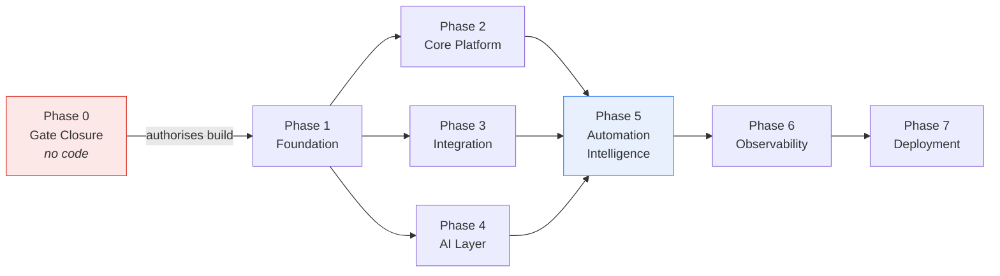
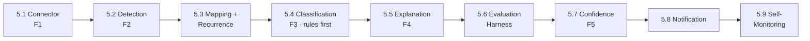

# Development Roadmap

**Product:** NAIGX
**Scope:** Version 1 (MVP) implementation
**File:** `docs/Development-Roadmap.md`
**Status:** Living Document — execution roadmap
**Source of Truth:** `docs/Product-Vision.md` · `docs/PRD-v1.md` · `docs/Technical-Architecture.md` · `research/06-Market-Insights.md`
**Last Updated:** 2026-08-09

> This is an execution document. It sequences the work required to build Version 1 as defined in `docs/PRD-v1.md`. It does not revisit product strategy, and it introduces no capability the PRD does not already contain.
>
> Effort is expressed in bands for a solo developer. There are no sprints, dates, or velocity assumptions.

---

## How to Read This Roadmap

**Three scoping notes**, each reconciling the requested phase structure with the source documents. They are stated here rather than buried, because each one keeps V1 small.

| Where | Reconciliation |
|---|---|
| **Phase 2 — "User management"** | The PRD puts multi-tenancy, team accounts, roles, and permissions out of scope (`NFR-SC1`). Phase 2 delivers *single-operator account management*, not a user management system. The ownership seam from `Technical-Architecture.md` §10 is left open; the feature is not built |
| **Phase 3 — "OAuth" and "Webhook handling"** | V1's target platform authenticates by API token, and the architecture makes polling the baseline detection path with webhooks as an optimization only. Phase 3 therefore builds the **contract seams** for both — the connector declares its auth mode and optional webhook capability — without implementing flows no V1 platform needs |
| **Phase 4 — "Context retrieval"** | The architecture explicitly rejects retrieval infrastructure in V1 (§7.3). Phase 4 delivers **deterministic context assembly**: bounded, reproducible, no embedding store or vector search |

**One sequencing note.** `NFR-R1` (never fail silently) makes self-monitoring a product component, not instrumentation. It is therefore built in **Phase 5** alongside the diagnostic pipeline. Phase 6 covers operational logging, audit trail, and error-handling hardening — not the product's ability to report its own blindness.

**Cross-cutting execution principle — build the walking skeleton early.** Once Phase 3 is functional, drive one real failure end-to-end through every layer before completing any module to depth. A thin working path surfaces integration problems while they are still cheap; a set of finished modules that have never met each other does not.

---

## Phase Dependency Map

Phases 2, 3, and 4 are independent of one another and may be built in any order after Phase 1. **Phase 5 is the product**; everything before it is scaffolding, and everything after it is hardening.

| Phase | Effort band (solo) | Nature |
|---|---|---|
| 0 — Gate Closure | 1–2 weeks | Research, not code. **Blocking** |
| 1 — Project Foundation | 2–4 days | Scaffolding |
| 2 — Core Platform | 4–6 days | Scaffolding |
| 3 — Integration Platform | 1.5–2 weeks | Framework |
| 4 — AI Layer | 1–1.5 weeks | Framework |
| 5 — Automation Intelligence | 3–4 weeks | **The product** |
| 6 — Observability | 4–6 days | Hardening |
| 7 — Deployment | 3–5 days | Release |

---

# Phase 0 — Gate Closure

> **Added, not requested.** `docs/PRD-v1.md` states plainly: *"This document defines what would be built and how its success would be judged. It does not authorize the build. Closing the competitive gate does."* A roadmap that begins at Phase 1 would contradict its own source of truth. This phase contains no application code.

### Objective

Close the two blocking gates before any implementation begins: confirm the problem is not already well-solved, and confirm the target platform exposes enough run detail to explain failures.

### Deliverables

- `research/05-Competitor-Research.md` populated for the automation-reliability category, covering the native execution-history and error-handling capabilities of the platforms the corpus names
- A written verdict on **Risk R1 / Assumption A1**: is failure diagnosis already adequately solved by the tools operators already run?
- A throwaway technical spike against the target platform confirming that run detail is sufficient to determine cause — resolving **Risk R4 / Assumption A2**
- A documented go / no-go decision with reasoning

### Definition of Done

- [ ] Competitor research is written and committed
- [ ] R1/A1 has an explicit verdict, not an assumption
- [ ] A spike has retrieved real failure detail from a real platform instance and the result is recorded
- [ ] A2 is answered: sufficient, insufficient, or partially sufficient with named limits
- [ ] A go / no-go decision is recorded in writing

### Dependencies

None. This phase blocks everything else.

### Expected outcome

Either a justified decision to build V1, or a justified decision not to — the second being a legitimate and inexpensive success.

### Success criteria

| Criterion | Target |
|---|---|
| Competitive gate closed | Yes |
| Feasibility of run-detail access | Verified against a live instance |
| Decision recorded with reasoning | Yes |
| Cost of a "no-go" outcome | Under two weeks, no application code written |

---

# Phase 1 — Project Foundation

### Objective

Establish a working repository, both application shells, and the shared conventions everything after this phase depends on.

### Deliverables

**Repository validation**
- Confirm the existing structure (`frontend/`, `backend/`, `integrations/`, `automations/`, `prompts/`, `docs/`, `research/`) matches the architecture's module boundaries; document any deviation
- Root README updated to describe the project and point to the document set

**Frontend initialization**
- TypeScript + React + Vite application that builds and runs
- Base routing shell with placeholder views

**Backend initialization**
- TypeScript + Node + Fastify service that starts and responds to a health check
- Database connectivity established and verified
- Migration mechanism in place (no schema content yet)

**Environment configuration**
- Typed, validated configuration loaded from environment with fail-fast startup on missing required values
- `.env.example` covering every required variable
- Clear separation of local, test, and production configuration

**Shared coding standards**
- Linting and formatting configured identically across both applications
- TypeScript strict mode enabled in both
- Test runner configured with one passing example test per application
- Commit conventions documented
- Basic CI running lint, typecheck, and tests on push

### Definition of Done

- [ ] Both applications start from a clean clone following README instructions only
- [ ] Backend health check returns successfully and confirms database connectivity
- [ ] Startup fails loudly and clearly when required configuration is absent
- [ ] Lint, typecheck, and tests pass in CI
- [ ] No secret values are committed; `.env.example` is complete

### Dependencies

Phase 0 go decision.

### Expected outcome

A repository a developer can clone, configure, and run in under fifteen minutes.

### Success criteria

| Criterion | Target |
|---|---|
| Time from clone to running locally | < 15 minutes |
| CI passing on main | Yes |
| Undocumented setup steps | Zero |

---

# Phase 2 — Core Platform

### Objective

Deliver the single-operator application shell: authenticated access, account management, and the navigational frame the diagnostic views will occupy.

> **Scope guard.** One operator, one account (`NFR-SC1`). No roles, no permissions, no invitations, no organisations. Data ownership is modelled explicitly so multi-tenancy remains an addition later — the seam is left, the feature is not built.

### Deliverables

**Authentication**
- Local account authentication with securely hashed credentials
- Session establishment, renewal, and termination
- All application routes protected by default; unauthenticated access denied rather than degraded

**User management (single operator)**
- Initial account provisioning on first run
- Credential change
- Account-scoped ownership applied to all stored records

**Dashboard layout**
- Application shell containing the primary content region and a persistent system-status indicator
- Empty and loading states designed deliberately — an empty failure list is a meaningful state in this product, not a placeholder

**Navigation**
- Routes for: active failures, failure detail, connections, blind spots, settings
- Views are structural placeholders at this phase; content arrives in Phase 5

**Settings**
- Account settings
- Notification preference selection
- Placeholder for connection management, populated in Phase 5

### Definition of Done

- [ ] An operator can sign in, remain signed in, and sign out
- [ ] Every route requires authentication; none leaks data when unauthenticated
- [ ] Credentials are stored hashed with an accepted algorithm
- [ ] The shell renders all five routes with intentional empty states
- [ ] Every persisted record carries account ownership
- [ ] The system-status indicator exists in the shell, ready to be driven in Phase 5

### Dependencies

Phase 1.

### Expected outcome

A running, authenticated application with a complete navigational frame and no diagnostic capability yet.

### Success criteria

| Criterion | Target |
|---|---|
| Unauthenticated access to protected data | Impossible |
| Routes reachable and rendering | 5 of 5 |
| Roles, permissions, or multi-user features built | Zero — by design |

---

# Phase 3 — Integration Platform

### Objective

Build the integration framework — connector contract, normalization boundary, redaction gate, and synchronization — without binding any of it to a specific platform.

> **This phase produces the framework, not the connector.** The V1 platform connector is implemented in Phase 5. Building the framework first is what keeps the normalization boundary honest.

### Deliverables

**Connector framework**
- Connector contract covering the six capabilities in `Technical-Architecture.md` §8.1: authenticate, enumerate workflows, retrieve run outcomes, retrieve run detail, retrieve workflow definition, report health and scope
- Registration mechanism allowing connectors to be added without core modification
- **No write capability expressible in the contract** — the absence is structural
- A stub connector producing synthetic data, enabling Phases 4–5 to proceed without a live platform

**OAuth support (seam)**
- Connectors declare their authentication mode
- Credential storage handles token-based and OAuth-issued credentials behind one interface
- Full OAuth authorization flow implementation deferred until a platform requires it — recorded, not built

**API abstraction**
- Shared client behaviour for outbound platform calls: timeouts, retry with backoff, rate-limit awareness, error normalization
- Platform-specific request shapes remain inside connectors

**Normalization boundary**
- Canonical failure event defined as the single vocabulary above the connector
- Per-connector mapping contract translating platform errors into canonical form
- Enforcement that no platform-specific concept crosses upward

**Redaction gate**
- Detection and masking of credentials, tokens, and personal or financial data
- Positioned before persistence and before inference
- Fail-closed behaviour: content that cannot be confidently redacted is withheld
- **Built now, before any payload is ever persisted**, so no unredacted path exists at any point in the project's history

**Webhook handling (seam)**
- Connectors may declare optional webhook support
- Receipt path defined; polling remains the reconciling backstop under all conditions
- Not implemented for V1's platform, which does not require it

**Synchronization framework**
- Durable background job execution on the Postgres-backed queue
- Incremental retrieval with progress tracking and resumption
- Deliberate overlap window on resume
- Duplicate-tolerant, at-least-once handling
- Observation gap detection and recording (`FR-11`)

### Definition of Done

- [ ] A connector can be registered and exercised through the contract alone
- [ ] The contract offers no way to express a write, trigger, or delete
- [ ] The stub connector produces synthetic runs end-to-end into canonical events
- [ ] No module above normalization references a platform-specific concept
- [ ] Redaction runs before every persistence and inference path, verified by test
- [ ] Redaction fails closed when uncertain
- [ ] Synchronization resumes correctly after forced interruption, losing nothing
- [ ] An induced observation gap is recorded and retrievable

### Dependencies

Phase 1. Independent of Phases 2 and 4.

### Expected outcome

A platform-agnostic integration framework proven against a stub, ready to accept a real connector.

### Success criteria

| Criterion | Target |
|---|---|
| Platform-specific code above the normalization boundary | Zero |
| Detection loss across forced interruption | Zero |
| Persistence paths bypassing redaction | Zero |
| Write capability anywhere in the contract | None |

---

# Phase 4 — AI Layer

### Objective

Build the provider-agnostic inference layer: the port, versioned prompts, deterministic context assembly, and a request pipeline that never lets unvalidated output reach an operator.

### Deliverables

**Provider abstraction**
- Narrow provider port exposing only structured generation from a prompt and bounded context
- One provider adapter implementing it
- Provider and model selected by configuration
- **No provider SDK imported outside its adapter** — enforced by lint rule where possible
- Provider unavailability treated as an expected state, degrading to `Unclassified` with a stated reason

**Prompt management**
- Versioned prompt artifacts stored in `prompts/`, not inline in code
- Each prompt declares its expected output shape
- Each prompt carries a version identifier recorded with every output it produces
- Promotion process requiring re-measurement before a changed prompt reaches operators

**Context retrieval — deterministic assembly**
- Context assembled from three known sources only: the redacted canonical failure event, the relevant workflow definition excerpt, and recurrence history
- Bounded and reproducible: identical input yields identical context
- **No embedding store, vector search, or similarity retrieval** (`Technical-Architecture.md` §7.3)

**AI request pipeline**
- Single path for all inference: assemble context → select versioned prompt → invoke provider → validate → return
- Timeout, retry, and cost/token accounting
- Prompt version and provider recorded with every result

**Response handling**
- Structural validation against the prompt's declared shape
- Content constraint enforcement: no remediation advice (`FR-19`), no unredacted values, required references present (`FR-17`)
- Validation failure degrades to `Unclassified` rather than surfacing free text (`FR-15`)

### Definition of Done

- [ ] Provider is swappable by configuration with no core change
- [ ] No provider SDK appears outside its adapter
- [ ] All prompts are versioned files; none are inline strings
- [ ] Identical inputs produce identical assembled context
- [ ] Malformed provider output degrades to `Unclassified` and never reaches an operator surface
- [ ] Provider outage produces a stated degraded result, not a blank or fabricated one
- [ ] Every result records its prompt version and provider

### Dependencies

Phase 1. Independent of Phases 2 and 3.

### Expected outcome

An inference layer that is provider-agnostic, reproducible, and incapable of presenting unvalidated output.

### Success criteria

| Criterion | Target |
|---|---|
| Provider swap effort | Configuration only |
| Context reproducibility | 100% |
| Unvalidated output reaching an operator surface | Impossible |
| Retrieval infrastructure introduced | None — by design |

---

# Phase 5 — Automation Intelligence

### Objective

Implement the five V1 features defined in `docs/PRD-v1.md` §9. **This phase is the product.**

### Build order

Order matters here — the evaluation harness must precede confidence disclosure, because confidence is derived from measurement rather than asserted (`FR-21`).

### Deliverables

**5.1 — Platform connection (F1)**
- Connector for the V1 platform implementing the Phase 3 contract, read-only
- Connection management UI: connect, view status, disconnect
- Partial-access disclosure — what is and is not observable (`FR-4`)
- Disconnect revokes access and purges retained content (`NFR-S5`)

**5.2 — Failure detection (F2)**
- Scheduled ingestion of run outcomes through the connector
- Every failed run recorded with workflow, timestamp, and failing step
- Consolidated active-failure view (`FR-8`)
- Acknowledge and resolve actions (`FR-9`)
- Observation gaps visible in the interface (`FR-11`)

**5.3 — Normalization mapping and recurrence**
- Platform-specific mapping into the canonical failure event
- Stable failure identity derived from workflow, step, cause, and error signature
- New-versus-recurring status with occurrence history (`FR-23`)

**5.4 — Failure classification (F3)**
- Deterministic rules covering the six baseline categories in `FR-14`
- AI-assisted classification for cases rules cannot resolve
- `Unclassified` preferred over a low-confidence guess (`FR-15`)
- Category set defined independently of platform (`FR-13`)

**5.5 — Plain-language explanation (F4)**
- Explanation generated per classified failure through the Phase 4 pipeline
- References the specific step and relevant data (`FR-17`)
- States uncertainty plainly (`FR-18`)
- Contains no remediation advice (`FR-19`)
- Readable without reading code (`NFR-U1`)

**5.6 — Evaluation harness**
- Seeded failure set built from failure types named in the corpus — expired credentials, rate limiting, upstream unavailability, malformed payloads, timeouts, misconfiguration — **not invented**
- Full-pipeline execution against the set
- Measurement of classification accuracy, false-confidence rate, unclassified rate, and detection completeness
- Results persisted as the source for displayed confidence

**5.7 — Confidence and blind-spot disclosure (F5)**
- Confidence signal on every explanation, derived from measured accuracy (`FR-21`)
- In-product blind-spot list (`FR-22`)
- Per-category accuracy visible to the operator (`FR-24`)
- Categories below threshold reported as blind spots rather than shown as low-confidence guesses

**5.8 — Notification**
- New-failure notification through at least one operator-chosen path (`FR-10`)
- Duplicate suppression for known recurring failures, with the record preserved
- Notifications carry no sensitive content

**5.9 — Self-monitoring**
- Observation state: `observing`, `degraded`, `blind`
- Detection of stale ingestion, lapsed credentials, connector failure
- Reporting path independent of the diagnostic pipeline
- An empty failure list never displayed as healthy while observation has stopped (`NFR-R2`)

### Definition of Done

- [ ] An operator connects the platform read-only and sees confirmation
- [ ] Every failed run appears without operator action
- [ ] Every failure carries a category or an explicit `Unclassified`
- [ ] Every classified failure has a plain-language explanation naming step and data
- [ ] Every explanation carries a measurement-derived confidence signal
- [ ] Blind spots are visible in-product
- [ ] Recurrence status is shown per failure
- [ ] Notifications reach the operator without polling the interface
- [ ] Halting the platform connection produces a visible degraded state within one detection cycle
- [ ] Evaluation harness runs on demand and reports all four metrics
- [ ] PRD accuracy targets are met (see Success criteria)
- [ ] No write operation is issued to the platform under any code path
- [ ] No feature requires the operator to write code (`FR-25`)
- [ ] The system is useful on first connection with no prior configuration (`FR-26`)

### Dependencies

Phases 2, 3, and 4 complete.

### Expected outcome

A working product: connect a platform, learn what broke, understand why, and know how far to trust the answer.

### Success criteria

| Criterion | Target | Source |
|---|---|---|
| Detection completeness | 100% | `PRD` §12 |
| Classification accuracy on seeded set | ≥ 85% | `PRD` §12 |
| **False-confidence rate** | **≤ 2%** | `PRD` §12 — primary metric |
| Unclassified rate | ≤ 20%, honestly reported | `PRD` §12 |
| Time to first value | < 15 minutes | `PRD` §12 |
| Time to understanding | < 2 minutes | `PRD` §12 |
| Failure visible after occurrence | < 5 minutes | `NFR-P1` |
| Explanation generation | < 30 seconds | `NFR-P3` |

---

# Phase 6 — Observability

### Objective

Make the system's own operation legible and accountable — operational logging, monitoring, error handling, and the audit trail.

> Self-monitoring shipped in Phase 5 because it is a product capability. This phase covers the operational and accountability layer around it.

### Deliverables

**Logging**
- Structured, machine-readable logs across both applications
- Correlation identifiers linking a failure from ingestion through explanation to display
- Guaranteed exclusion of secrets and unredacted payload content (`NFR-S3`)
- Configurable levels with sensible production defaults

**Monitoring**
- Health endpoint reporting application, database, queue, and connector status
- Job execution metrics: success, failure, duration, backlog depth
- Inference metrics: latency, failure rate, token and cost accounting
- Ingestion freshness as an explicit signal — the primary early warning for `NFR-R1`

**Error handling**
- Consistent error taxonomy separating expected degradation from genuine faults
- Every external call boundary handles timeout, rate limiting, and unavailability explicitly
- Unhandled errors surface as visible degraded states, never as silence (`NFR-R2`)
- Operator-facing error text is plain-language, consistent with `NFR-U1`

**Audit trail**
- Maintained separately from operational logs (`Technical-Architecture.md` §9)
- Records connection lifecycle, credential use, data access, AI invocations with prompt version, and retention or purge actions
- Append-only and queryable
- Answers the question a regulated operator asks first: what data was sent to an external provider, and when

### Definition of Done

- [ ] A single failure is traceable end-to-end through logs by correlation identifier
- [ ] No secret or unredacted payload content appears in any log, verified by test
- [ ] Health endpoint reports all four subsystems accurately
- [ ] Ingestion freshness is monitored and alerts when stale
- [ ] Every external boundary has explicit failure handling
- [ ] Audit trail records all five event classes and is queryable
- [ ] Retention and purge actions are audited

### Dependencies

Phase 5.

### Expected outcome

A system that can be operated, diagnosed, and accounted for — meeting the standard it applies to the platforms it watches.

### Success criteria

| Criterion | Target |
|---|---|
| End-to-end traceability of a failure | 100% |
| Secrets or unredacted data in logs | Zero |
| Silent failure modes remaining | Zero |
| Audited external data transmissions | 100% |

---

# Phase 7 — Deployment

### Objective

Make V1 runnable by someone other than its author, and documented well enough to be evaluated — or abandoned — cleanly.

### Deliverables

**Production build**
- Optimised builds for both applications
- Container images
- Single-command startup via Compose
- Reproducible builds from a clean clone

**Environment setup**
- Documented required configuration with a complete example
- Fail-fast startup validation on missing or malformed configuration
- Documented database migration procedure
- Documented backup and restore procedure for the datastore

**Deployment**
- Deployment to a single target environment
- Startup verification checklist
- Documented rollback procedure
- Documented teardown procedure — `G7` requires abandonment to be as clean as deployment

**Documentation**
- README: what NAIGX is, what V1 does, what it explicitly does not do
- Setup and configuration guide
- Operator guide covering connection, interpretation of confidence, and blind spots
- **Honest limitations page**: measured accuracy, known blind spots, and the fact that V1 explains but does not fix (Vision Principle 8)
- Evaluation results published — measured, not asserted
- Architecture and decision records linked from the README

### Definition of Done

- [ ] A clean clone deploys following documentation alone, with no undocumented steps
- [ ] Misconfiguration fails at startup with an actionable message
- [ ] Rollback and teardown are documented and tested
- [ ] Operator guide is comprehensible to a non-programmer
- [ ] Limitations and measured accuracy are published, not just internal
- [ ] Every document set link resolves

### Dependencies

Phase 6.

### Expected outcome

A deployable, documented V1 that a reader can run, evaluate, and trace back to the market evidence that justified it.

### Success criteria

| Criterion | Target |
|---|---|
| Deployment from documentation alone | Succeeds |
| Undocumented steps | Zero |
| Published accuracy matches measured accuracy | Exactly |
| Time to teardown | < 10 minutes |

---

# MVP Completion Checklist

Version 1 is complete when every box below is checked. Nothing else is required, and nothing here is optional.

### Gates

- [ ] Competitor research written; R1/A1 has an explicit verdict
- [ ] Platform run-detail feasibility verified against a live instance (A2)
- [ ] Go decision recorded in writing

### Foundation

- [ ] Both applications build, run, and pass CI from a clean clone
- [ ] Configuration is validated at startup and fails fast when incomplete
- [ ] Coding standards, linting, typecheck, and tests enforced in CI
- [ ] No secrets committed

### Core platform

- [ ] Single-operator authentication working; all routes protected
- [ ] Every stored record carries account ownership (seam left, feature unbuilt)
- [ ] Application shell renders all five routes with deliberate empty states

### Integration framework

- [ ] Connector contract implemented with **no expressible write capability**
- [ ] Normalization boundary enforced — zero platform-specific concepts above it
- [ ] Redaction gate precedes every persistence and inference path
- [ ] Redaction fails closed when uncertain
- [ ] Synchronization resumes after interruption without loss
- [ ] Observation gaps recorded and visible

### AI layer

- [ ] Provider swappable by configuration; no SDK outside its adapter
- [ ] All prompts versioned in `prompts/`; version recorded with every output
- [ ] Context assembly deterministic and reproducible
- [ ] Invalid or malformed output degrades to `Unclassified` and never reaches an operator
- [ ] Provider outage produces a stated degraded result

### Product capabilities

- [ ] **F1** — read-only connection with partial-access disclosure and clean disconnect
- [ ] **F2** — all failed runs detected without operator action; consolidated view; acknowledge and resolve
- [ ] **F3** — every failure categorised or explicitly `Unclassified`; six baseline categories covered
- [ ] **F4** — plain-language explanation naming step and data; no remediation advice
- [ ] **F5** — measurement-derived confidence; blind spots published in-product; recurrence shown
- [ ] Notification reaches the operator through at least one path
- [ ] Self-monitoring reports `observing` / `degraded` / `blind` independently of the pipeline
- [ ] No write operation reaches the platform under any code path
- [ ] No operator action requires writing code

### Measured quality

- [ ] Evaluation harness runs on demand against the seeded set
- [ ] Detection completeness — **100%**
- [ ] Classification accuracy — **≥ 85%**
- [ ] False-confidence rate — **≤ 2%**
- [ ] Unclassified rate — **≤ 20%**, honestly reported
- [ ] Failure visible within 5 minutes; explanation generated within 30 seconds

### Observability

- [ ] End-to-end traceability by correlation identifier
- [ ] No secrets or unredacted payloads in logs, verified by test
- [ ] Health endpoint covers application, database, queue, connector
- [ ] Ingestion freshness monitored and alerting
- [ ] Audit trail append-only, queryable, covering all five event classes

### Release

- [ ] Deploys from documentation alone with zero undocumented steps
- [ ] Rollback and teardown documented and tested
- [ ] Operator guide comprehensible to a non-programmer
- [ ] Limitations and measured accuracy published
- [ ] Every V1 capability traceable to a PRD requirement and a corpus record

---

## Out of Scope for Version 1

Restated so it is not rediscovered mid-build. All are deferred per `docs/PRD-v1.md` §8 and §15.

Second platform · suggested fixes · any write or remediation action · documentation generation · schema and field mapping · reporting, dashboards, attribution · multi-tenancy and multi-client separation · team accounts, roles, permissions · historical analytics · operator-authored classification rules · mobile experience · retrieval or vector search · OAuth flow implementation · webhook-primary ingestion.

---

*This is a living document. Phase 0 may terminate the project, and that outcome is a success of the process rather than a failure of it. Should V1 be abandoned per `G7`, the connector contract, normalization boundary, and evaluation harness are the assets worth carrying forward.*
