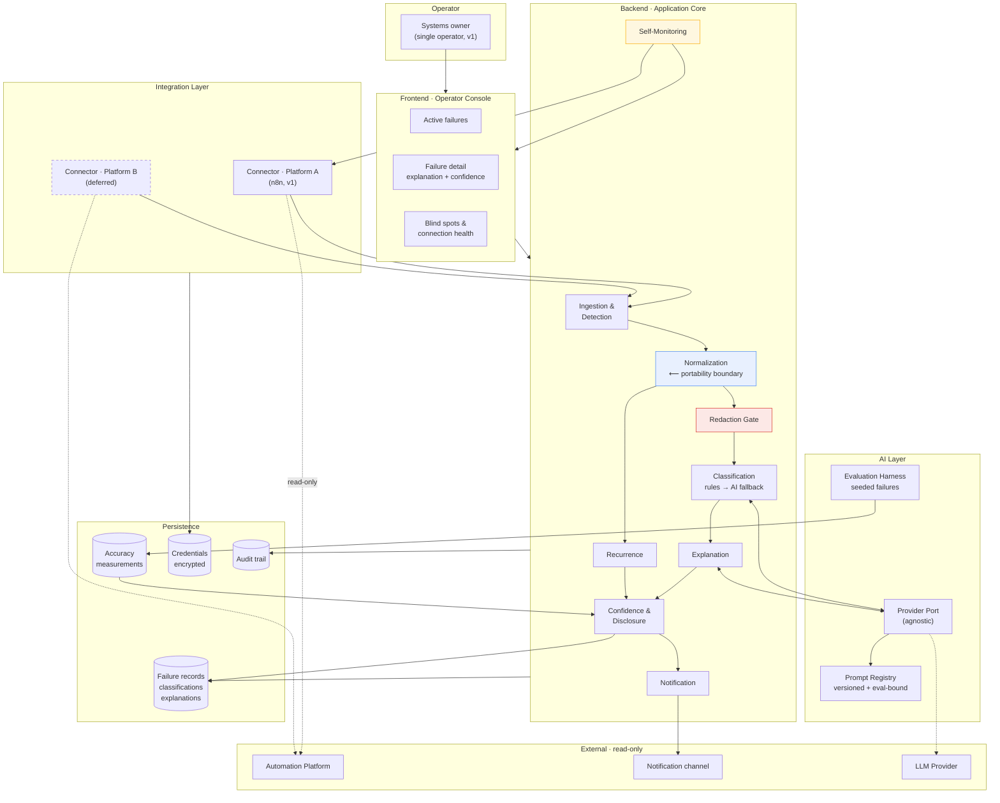
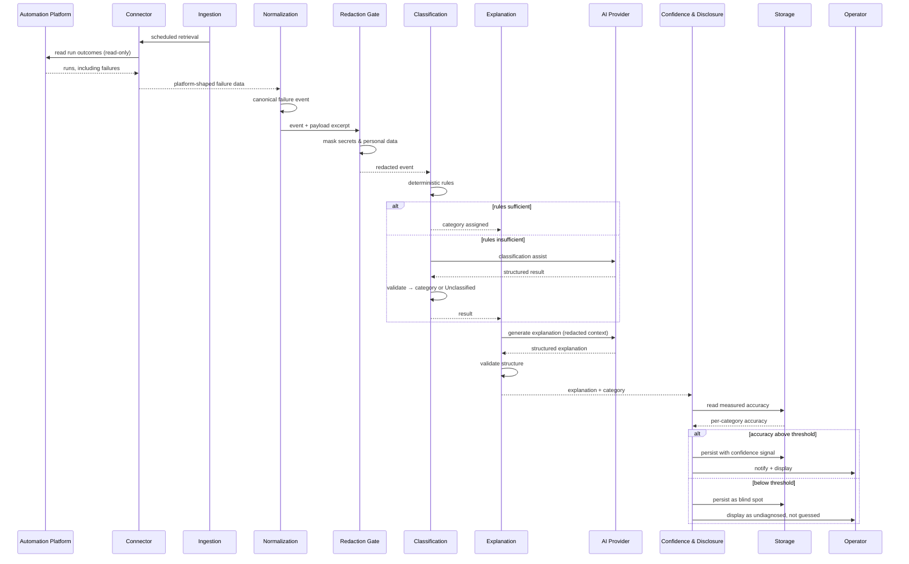

# Technical Architecture

**Product:** NAIGX
**Scope:** Version 1 (MVP)
**File:** `docs/Technical-Architecture.md`
**Status:** Living Document — high-level architecture, not an implementation guide
**Source of Truth:** `docs/Product-Vision.md` · `docs/PRD-v1.md` · `research/06-Market-Insights.md`
**Last Updated:** 2026-08-09

> This document defines how NAIGX v1 is structured and why. It contains no code, no database schema, and no API endpoint specifications. It describes boundaries, responsibilities, and the reasoning behind them.
>
> Per `docs/PRD-v1.md`, Version 1 is scoped as a **falsifiable prototype**, not a product commitment. The architecture below is designed to be cheap to build, cheap to extend, and — critically — cheap to abandon.

---

## 1. Architecture Overview

### What the architecture has to do

NAIGX v1 does one thing: **observe an automation platform read-only, detect failed runs, classify why they failed, explain each failure in plain language, and disclose how much that explanation can be trusted.**

Three requirements from the PRD dominate every structural decision. They are not equally weighted with the rest — they are the constraints the architecture exists to satisfy.

| Constraint | Source | Architectural consequence |
|---|---|---|
| **Never fail silently** | `NFR-R1` — a monitoring tool that stops monitoring without saying so is the product's worst failure mode | Self-monitoring is a first-class component, not instrumentation added later. The system must be able to report its own blindness |
| **The failure taxonomy must be platform-independent** | `NFR-SC2` — the Horizon 2 precondition | A hard normalization boundary: platform knowledge stops at the connector. Nothing above it knows what n8n is |
| **Reversibility over scale** | `G7` — V1 must be abandonable in weeks, not quarters | Single deployable unit, minimum infrastructure, no distributed systems, no premature abstraction |

### Design philosophy

**A modular monolith, not a distributed system.** V1 serves one operator watching one platform. Every argument for service decomposition — independent scaling, team autonomy, failure isolation across domains — is absent at this stage, while every cost of it is present. Modularity is enforced by internal boundaries, not by network hops.

**Deterministic before probabilistic.** Where a failure cause can be identified by rule, it is identified by rule. The AI layer handles what rules cannot. This is not conservatism about AI; it follows directly from the PRD's primary metric being **false-confidence rate (≤ 2%)** rather than raw accuracy. Deterministic paths do not hallucinate.

**Redaction before persistence, redaction before inference.** Payloads in the target market contain customer records (`JD-005`), member data (`JD-003`), and financial transactions (`JD-004`). Redaction is positioned as a gate every payload must pass *before* it reaches storage or a model provider — never as a display-time filter.

**Additive extension.** Adding a platform, an AI provider, or a notification path must be an addition, never a modification of the core. This is what makes Horizon 2 a feature rather than a rewrite.

**Boundaries are the deliverable.** The specific technologies in §4 are V1 choices and are expected to be replaceable. The module boundaries in §5 are the durable part of this document.

---

## 2. System Architecture

Eight layers. Each has one responsibility and a defined relationship to those adjacent to it.

### Frontend — Operator Console

**Responsibility.** Present what the system knows to a single operator, and nothing more.

The console is deliberately thin: it holds no diagnostic logic and makes no judgments. It renders the active-failure view, individual failure detail with its explanation and confidence signal, the system's declared blind spots, and connection health. Per `FR-25` and `NFR-U1`, every surface is comprehensible to a technically-literate non-programmer — the operator profile in 3/5 corpus records.

It is read-only with respect to connected platforms. The only state it mutates is NAIGX's own: acknowledging or resolving a failure, and managing the platform connection.

### Backend — Application Core

**Responsibility.** Own the diagnostic pipeline and all domain logic.

The core orchestrates the path from a raw platform run to an operator-facing explanation. It is the only layer that coordinates across modules; modules do not call each other opportunistically. It exposes the console's data needs and nothing beyond them.

### Database — Persistence

**Responsibility.** Durably hold failure records, classifications, explanations, accuracy measurements, recurrence history, and connection metadata.

Two non-obvious duties belong here:

- **Retention enforcement.** Payload-derived content carries a lifetime (`NFR-S4`) and is purged on expiry and on disconnect (`NFR-S5`). Retention is a storage-layer responsibility, not an application afterthought.
- **The accuracy record.** Measured per-category accuracy is persisted, because confidence shown to the operator must be *derived from it* (`FR-21`), not asserted by a model.

### AI Layer — Inference

**Responsibility.** Generate explanations, and assist classification where deterministic rules are insufficient.

The layer is provider-agnostic by contract (§7). It receives only redacted, normalized input. It produces structured output that is validated before it can become an operator-facing claim; output that fails validation degrades to `Unclassified` rather than being shown as prose (`FR-15`, `FR-18`).

The AI layer never reaches a connected platform directly. It sees the normalized failure record, nothing else.

### Integration Layer — Connectors

**Responsibility.** Speak each external platform's language, and translate it into NAIGX's.

This is the most architecturally significant layer in v1. It is the **only** place platform-specific knowledge is permitted to exist. A connector reads runs and workflow definitions, reports its own health, and emits normalized events. It holds read-only credentials and possesses no write capability at all (`FR-2`) — the absence of write paths is structural, not a policy check.

### Authentication — Access Control

**Responsibility.** Establish that the operator is who they claim, and hold platform credentials safely.

V1 has exactly one operator (`NFR-SC1`), so this layer is intentionally minimal: local account authentication for console access, and encrypted storage for connected-platform credentials with a clear separation between the two concerns. It is *sized* for one operator but *shaped* so that identity is an explicit concept rather than an assumption baked into every module (§10).

### Background Jobs — Scheduled Work

**Responsibility.** Perform all work not triggered by an operator.

Five recurring jobs constitute the system's actual behaviour:

| Job | Purpose | Requirement |
|---|---|---|
| Ingestion | Poll the connected platform for new run outcomes | `FR-6` |
| Diagnosis | Normalize, fingerprint, redact, classify, explain | `FR-12`–`FR-18` |
| Retention | Purge expired payload content | `NFR-S4` |
| Evaluation | Run the seeded-failure set and update accuracy measurements | `G6`, `FR-21` |
| Heartbeat | Confirm the system is observing, and raise a degraded state when it is not | `NFR-R1` |

### Logging & Monitoring — Self-Observability

**Responsibility.** Know whether NAIGX itself is working, and say so.

This layer carries unusual weight here. For a product whose purpose is telling an operator that something broke, silent self-failure is not a reliability defect — it is a total product failure. The system maintains an explicit observation state (`observing` / `degraded` / `blind`), surfaces it in the console, and treats an empty failure list with a stale heartbeat as an alarm rather than as good news (`NFR-R2`).

An audit trail of connection lifecycle events, data access, and AI invocations is maintained separately from operational logs (§9).

---

## 3. High-Level Architecture Diagram

**Three elements carry the design:**

- **Normalization (blue)** is the portability boundary. Nothing to its right knows which platform produced the event.
- **The redaction gate (red)** is mandatory transit. No payload-derived content reaches persistence or the AI provider without passing it.
- **Self-monitoring (amber)** observes the connector and reports directly to the console, bypassing the diagnostic pipeline — so a pipeline failure cannot suppress the report that the pipeline has failed.

---

## 4. Technology Stack

Selections are justified against V1's constraints — small, reversible, single-operator — not against future scale. Module boundaries (§5) are designed so each of these is replaceable.

| Technology | Purpose | Why it was selected |
|---|---|---|
| **TypeScript** | Primary language, frontend and backend | One language across the stack minimises context-switching for a solo builder. The target platform's ecosystem is Node-native, so connector work stays in-language. Corroborated by the corpus: `JD-004` names TypeScript as its core testing language, and the repository is already configured for Node |
| **Node.js** | Runtime | Follows from TypeScript; strongest ecosystem alignment with the v1 target platform |
| **React + Vite** | Operator console | The console is a small internal read-only view. Server-side rendering would add deployment complexity for no user-facing gain, working against `G7` reversibility. Vite keeps the build trivial and disposable |
| **Fastify** | HTTP layer | Minimal surface, first-class request/response validation, low ceremony. Validation at the boundary supports the "never present unvalidated output" rule |
| **PostgreSQL** | Primary datastore | Relational modelling fits failure records, classifications, and accuracy measurements, which are highly relational. Native JSON support absorbs heterogeneous normalized payload excerpts without schema churn as connectors are added. Single-node Postgres comfortably exceeds `NFR-P2` (200 workflows / 10k runs per day). *SQLite was considered and is viable for a truly minimal v1; Postgres was chosen because JSON handling and concurrency headroom avoid a migration at Horizon 2* |
| **Postgres-backed job queue** | Background jobs | Deliberately avoids introducing Redis. One fewer piece of infrastructure to run, back up, and abandon — a direct expression of `G7`. Job durability matters because a lost job means a missed failure, which `NFR-R3` classifies as a serious defect |
| **Provider-agnostic LLM client** | AI layer access | Required by §7. No provider SDK is permitted outside the provider adapter. Default provider is configuration, not architecture — the corpus names Claude in 2/5 records (`JD-002`, `JD-004`), making it the evidence-supported default choice |
| **Schema validation library** | Structured output validation | Model output must be validated before it can become an operator-facing claim. Validation failure degrades to `Unclassified` (`FR-15`) rather than surfacing free text |
| **Structured logging** | Operational visibility | Machine-readable logs are a precondition for the system diagnosing its own failures — the same discipline it applies to the platforms it watches |
| **Docker + Compose** | Packaging and local run | Reproducible single-command environment. The v1 target platform is commonly self-hosted, so the audience already runs containers. Also makes the whole system disposable, per `G7` |
| **Vitest** | Testing | Fast, TypeScript-native. Distinct from — and complementary to — the evaluation harness, which measures diagnostic accuracy rather than code correctness |

### Deliberately not in the V1 stack

| Excluded | Reason |
|---|---|
| Vector database / embedding store | V1 context is small, bounded, and deterministically assembled (§7). Retrieval infrastructure would be premature |
| Redis or a dedicated queue broker | Postgres-backed queuing meets v1 needs with less infrastructure |
| Kubernetes or orchestration | One deployable unit, one operator |
| Message bus / event streaming | Internal boundaries are sufficient at this scale; revisit at multi-platform (§12) |
| External identity provider | One operator (`NFR-SC1`); an IdP adds integration cost with no v1 benefit |
| Managed secret store | Encrypted-at-rest storage with separated key management is sufficient for v1; a managed store is a Horizon 2 upgrade (§12) |

---

## 5. Core Modules

Eleven modules. Each has a single purpose and communicates through defined boundaries rather than reaching into its neighbours.

### 5.1 Connector Module

**Purpose.** Encapsulate all knowledge of a specific external platform.

**Responsibilities**
- Authenticate to one platform using read-only credentials
- Retrieve run outcomes and workflow definitions
- Report its own connection health and access scope
- Declare what it can and cannot observe under partial access (`FR-4`)
- Emit platform-shaped data to Normalization — and nothing else

**Constraint.** Possesses no write capability. Absence of write paths is structural (`FR-2`).

### 5.2 Ingestion & Detection Module

**Purpose.** Ensure every failed run on a connected platform is seen.

**Responsibilities**
- Drive scheduled retrieval through the active connector
- Track progress so work resumes correctly after interruption
- Detect and record observation gaps rather than skipping them (`FR-11`)
- Guarantee at-least-once handling — a missed detection is a defect (`NFR-R3`)

### 5.3 Normalization Module — *the portability boundary*

**Purpose.** Convert platform-shaped run data into a canonical failure event.

**Responsibilities**
- Translate each platform's error representation into NAIGX's own vocabulary
- Establish which workflow, which step, and which moment
- Guarantee that no platform-specific concept crosses upward

**Why it matters.** This module is what makes `NFR-SC2` achievable. Every module above it is written once and works for every future platform. Adding a platform means writing a connector and a normalization mapping — not touching classification, explanation, or disclosure.

### 5.4 Redaction Module — *mandatory gate*

**Purpose.** Ensure payload-derived content is safe before it goes anywhere.

**Responsibilities**
- Detect and mask credentials, tokens, and personal or financial data
- Apply before persistence and before any model invocation (`NFR-S2`, `NFR-S3`)
- Fail closed: content that cannot be confidently redacted is withheld rather than passed through

**Position.** Every path from Normalization to storage or inference transits this module. It cannot be bypassed by configuration.

### 5.5 Classification Module

**Purpose.** Assign a cause category to each canonical failure event.

**Responsibilities**
- Apply deterministic rules first, covering the baseline categories in `FR-14`: authentication/credential, rate limiting, upstream unavailability, data shape/validation, timeout, configuration
- Escalate to the AI layer only where rules are insufficient
- Emit `Unclassified` in preference to a low-confidence guess (`FR-15`)
- Maintain the category set independently of any platform (`FR-13`)

**Rationale for the hybrid order.** Rules are cheaper, faster, reproducible, and cannot hallucinate. Given that false confidence is the primary risk metric, the probabilistic path is used where it adds capability, not by default.

### 5.6 Recurrence Module

**Purpose.** Determine whether a failure has been seen before.

**Responsibilities**
- Derive a stable identity for each failure from workflow, step, cause, and error signature
- Match new failures against history
- Supply new-vs-recurring status and occurrence history (`FR-23`)

**Value.** Distinguishing a one-off from a chronic break is what separates fixing from re-fixing — the operational distinction behind `JD-005`'s "ensure systems scale."

### 5.7 Explanation Module

**Purpose.** Produce the plain-language account of what happened and why.

**Responsibilities**
- Assemble context deterministically (§7) from the redacted event, workflow definition excerpt, and recurrence history
- Request generation through the AI provider port
- Validate structure before acceptance
- Enforce that explanations reference the specific step and data (`FR-17`), express uncertainty plainly (`FR-18`), and contain **no remediation advice** in v1 (`FR-19`)

### 5.8 Confidence & Disclosure Module

**Purpose.** Decide how much of what the system believes may be shown, and how.

**Responsibilities**
- Attach a confidence signal derived from *measured* per-category accuracy (`FR-21`)
- Suppress categories whose measured accuracy falls below threshold, reporting them as blind spots rather than as low-confidence guesses
- Maintain and expose the in-product blind-spot list (`FR-22`)
- Surface per-category accuracy to the operator (`FR-24`)

**Architecturally notable.** This module makes the Evaluation Harness a **runtime dependency**, not a testing convenience. Confidence cannot be displayed without measurements to derive it from.

### 5.9 Evaluation Harness

**Purpose.** Measure diagnostic accuracy against deliberately seeded failures.

**Responsibilities**
- Maintain a seeded failure set drawn from failure types named in the corpus, not invented
- Execute the full diagnostic pipeline against it
- Record per-category accuracy, unclassified rate, and false-confidence rate
- Gate prompt and rule changes: no change reaches operators without re-measurement (§7)

### 5.10 Notification Module

**Purpose.** Reach the operator without requiring them to watch a screen.

**Responsibilities**
- Deliver new-failure notifications through at least one operator-chosen path (`FR-10`)
- Suppress duplicate notification of a recurring known failure while preserving its record
- Carry no sensitive content — notifications transit the redaction gate like everything else

### 5.11 Self-Monitoring Module

**Purpose.** Know whether NAIGX is actually working, and say so.

**Responsibilities**
- Maintain observation state: `observing`, `degraded`, or `blind`
- Detect stale ingestion, lapsed credentials, and connector failure
- Surface degraded state directly to the console, on a path independent of the diagnostic pipeline
- Ensure an empty failure list is never displayed as healthy when observation has stopped (`NFR-R2`)

**Why it bypasses the pipeline.** A component that reports pipeline failure must not depend on the pipeline. This is the architectural expression of `NFR-R1`.

---

## 6. Data Flow

### Primary flow — platform run to operator explanation

### Flow characteristics worth noting

**Every path is one-directional and read-only toward the platform.** No flow in the system terminates in a write to a connected system. This is why the connector holds no write capability at all.

**Redaction is unconditional transit.** There is no path from Normalization to storage or inference that does not pass the gate. Because context assembly for the AI layer draws only from already-redacted records, redaction cannot be skipped by a future feature that assembles context differently.

**Confidence gates display, not generation.** The system generates its best explanation, then decides whether it has earned the right to show it as confident. Separating these means a category's measured accuracy can change — through re-evaluation — without changing how explanations are produced.

**The self-monitoring flow is independent.** It runs beside the primary flow and reports directly to the console. A stall anywhere in the diagnostic pipeline surfaces as a degraded state rather than as an absence of failures.

---

## 7. AI Architecture

Provider-agnostic by contract. No provider SDK appears anywhere outside the provider adapter.

### 7.1 LLM provider abstraction

A **provider port** defines the narrow capability the system depends on: structured generation from a prompt and a bounded context, returning output conforming to a declared shape.

| Rule | Rationale |
|---|---|
| Provider SDKs exist only inside adapters | A provider change is an adapter addition, never a core modification |
| Model and provider selection are configuration | Neither is an architectural commitment |
| The port exposes only capabilities the system actually uses | A wide port re-couples the system to whichever provider has the richest features |
| Provider failure is an expected state | Unavailability degrades to `Unclassified` with a visible reason, never a blank or fabricated explanation |

The default provider is a configuration choice. The corpus names Claude in 2/5 records (`JD-002`, `JD-004`), making it the evidence-supported default — but nothing in the architecture depends on it.

### 7.2 Prompt management

Prompts are **versioned artifacts, not inline strings**, held in the repository's `prompts/` directory and treated as reviewable, testable assets.

| Practice | Reason |
|---|---|
| Every prompt carries a version identifier | An explanation must be attributable to the prompt that produced it |
| Every prompt is bound to an evaluation set | Prompt quality is measured, not assumed |
| Prompt changes require re-measurement before promotion | Directly protects the ≤ 2% false-confidence target |
| Prompts declare their expected output shape | Enables validation, and makes unvalidated output impossible to display |

This makes prompt changes behave like schema changes: versioned, tested, and gated.

### 7.3 Context retrieval

**V1 uses deterministic context assembly. There is no retrieval system, no embedding store, and no vector search.**

Context for any inference is assembled from three known sources: the redacted canonical failure event, the relevant excerpt of the workflow definition, and the recurrence history for that failure identity.

This is a deliberate rejection of retrieval infrastructure at this stage:

- The relevant context for "why did this run fail" is **known, bounded, and directly addressable**. There is nothing to search for.
- Retrieval introduces a second failure mode — retrieving the wrong context — into a product whose primary risk metric is confidently wrong output.
- Deterministic assembly is reproducible, which the evaluation harness requires to attribute accuracy changes to prompt or rule changes rather than to retrieval variance.

Retrieval is revisited only when context demonstrably outgrows deterministic assembly (§12).

### 7.4 Response generation

Every model response passes three stages before it can reach an operator:

| Stage | Behaviour on failure |
|---|---|
| **Structural validation** — does output match the declared shape? | Degrade to `Unclassified` |
| **Content constraints** — no remediation advice (`FR-19`), no unredacted values, step and data referenced (`FR-17`) | Reject and degrade |
| **Confidence gating** — is measured accuracy for this category above threshold? | Present as a blind spot, not as a guess |

**The governing rule:** raw model output never becomes an operator-facing claim. Everything the operator reads has been validated, constrained, and confidence-gated. For a product whose output is an explanation, this pipeline *is* the product.

---

## 8. Integration Architecture

### 8.1 Connector model

Every external platform is reached through a connector implementing a common contract. The contract is intentionally narrow — the smallest surface that supports v1's diagnostic need:

| Capability | Purpose |
|---|---|
| Authenticate | Establish read-only access |
| Enumerate workflows | Know what exists and what is observable |
| Retrieve run outcomes | The detection input |
| Retrieve run detail | The diagnostic input |
| Retrieve workflow definition | Explanation context |
| Report health & scope | Feed self-monitoring and partial-access disclosure |

**No write capability appears in the contract.** A connector cannot trigger, modify, or delete, because the contract offers no way to express it.

### 8.2 Authentication and OAuth

Connectors declare their authentication mode rather than assuming one. Platforms differ — some issue API tokens, others require OAuth authorization flows — and the credential-handling layer accommodates both behind a common interface.

Two rules hold regardless of mode: **least-privilege, read-only scopes are requested** (`NFR-S1`), and **credentials are never visible outside the credential layer** — not in prompts, notifications, logs, or explanations (`NFR-S3`).

### 8.3 API adapters and normalization

Each connector pairs with a normalization mapping that translates its platform's error vocabulary into NAIGX's canonical form. The adapter knows the platform; the mapping knows the translation; nothing above knows either.

Adding a platform is therefore **strictly additive**: one connector, one mapping, zero changes to classification, explanation, or disclosure. This is the concrete mechanism by which `NFR-SC2` is satisfied and Horizon 2 remains a feature rather than a rewrite.

### 8.4 Webhooks versus polling

**Polling is the baseline detection mechanism in v1. Webhooks, where a platform supports them, are an optimization — never the sole detection path.**

The reasoning follows directly from `NFR-R3` and the 100% detection-completeness target: a webhook that is never delivered produces silence, and silence is indistinguishable from health. Polling with progress tracking can detect its own gaps; webhook delivery cannot detect its own absence.

Where webhooks are available they reduce detection latency toward `NFR-P1`, with polling continuing as the reconciling backstop.

### 8.5 Background synchronization

Synchronization is incremental, resumable, and gap-aware:

- Progress is tracked so retrieval resumes correctly after interruption
- A deliberate overlap window on resume trades a small amount of duplicate work for the guarantee that nothing falls between cycles
- Duplicate handling is expected, since at-least-once delivery is preferred to at-most-once
- **Gaps are recorded and surfaced** (`FR-11`) — an interval the system could not observe is data, not absence

---

## 9. Security Principles

### Authentication

V1 authenticates a single operator (`NFR-SC1`) against a local account. No external identity provider is integrated, because one operator does not justify the integration cost. Identity remains an explicit concept in the system rather than an implicit assumption, so introducing federated identity later is an addition (§10).

### Authorization

V1 has one role with full access to its own data, so authorization is trivial *within* NAIGX. It is not trivial *outward*: authorization toward connected platforms is deliberately minimal — read-only, least-privilege, and structurally incapable of escalation because no write capability exists to escalate into.

### Secret management

| Principle | Application |
|---|---|
| Encrypted at rest | Platform credentials and provider keys are never stored in plaintext |
| Key separation | Encryption keys are managed separately from the data they protect |
| Never in transit to inference | Secrets cannot appear in prompts — the redaction gate sits upstream of every model call |
| Never in output | Excluded from explanations, notifications, logs, and audit records (`NFR-S3`) |
| Revocable | Disconnection revokes access and purges associated retained content (`NFR-S5`) |

### Audit logging

An audit trail is maintained **separately from operational logs**, recording connection lifecycle events, credential use, data access, AI invocations with prompt version, and retention or purge actions.

Its purpose is accountability rather than debugging — particularly the record of what data was sent to an external model provider and when, which is the question an operator in a regulated environment (`JD-002`, `JD-004`) will ask first.

### Data privacy

The architecture assumes payloads contain personal and financial data, because the corpus shows they do — customer records (`JD-005`), member data (`JD-003`), financial transactions (`JD-004`).

| Control | Behaviour |
|---|---|
| Redaction before persistence | Unredacted payload content is never stored (`NFR-S2`) |
| Redaction before inference | Unredacted content never reaches an external provider |
| Minimal retention | Payload-derived content is kept only as long as needed to explain a failure (`NFR-S4`) |
| Purge on disconnect | Removing a connection removes its retained content (`NFR-S5`) |
| Fail closed | Content that cannot be confidently redacted is withheld, not passed through |

---

## 10. Scalability Principles

V1 targets one operator and one platform. The goal is not to scale — it is to ensure that scaling later does not require a redesign. Four seams are left open:

### The connector seam

Platform-specific knowledge is confined to connectors and normalization mappings. Supporting many platforms concurrently requires adding connectors, not restructuring the pipeline. **This is the single most important scalability property in v1**, because it is what Horizon 2 depends on.

### The tenancy seam

V1 serves one operator, and multi-tenancy is explicitly out of scope per the PRD. The architecture therefore **leaves the seam without building the feature**: data ownership is an explicit concept rather than an implicit global assumption. Introducing multiple accounts later becomes an extension of an existing concept rather than a retrofit into code that assumed there was only ever one.

This is a deliberate boundary. Ownership is modelled; isolation, roles, and permissions are not built.

### The provider seam

The AI provider port keeps model and provider selection as configuration. Changing provider, running providers in parallel for evaluation, or routing categories to different models are all additions behind an existing boundary.

### The processing seam

Diagnostic work runs as durable background jobs rather than inline. Work is already decomposed into independently schedulable units, so increasing throughput becomes a question of running more workers rather than restructuring the pipeline.

### What is deliberately not designed for

Horizontal database scaling, multi-region deployment, real-time streaming ingestion, and high-availability topology. All are absent by choice: `G7` states V1 must be cheap to abandon, and infrastructure built for scale that may never be needed directly contradicts that.

---

## 11. Design Principles

These govern development beyond v1.

**1. Modular by boundary, not by deployment.**
Modules are separated by responsibility and explicit interfaces. Network separation is a scaling decision to be made when evidence demands it, not a starting assumption.

**2. Platform knowledge stops at the connector.**
If a module above normalization needs to know which platform produced an event, the boundary has been violated and portability is lost.

**3. Provider-agnostic by contract.**
No provider SDK outside its adapter. A provider change must never reach the core.

**4. Deterministic before probabilistic.**
Rules first; inference where rules cannot reach. Probabilistic components are used for capability, not convenience.

**5. Fail loudly, degrade visibly.**
Graceful degradation means remaining useful while *stating* what is unavailable. Silent degradation is the one failure mode this product cannot have (`NFR-R1`).

**6. Redaction-first.**
Sensitive data is removed at the earliest possible point, not filtered at the latest. Redaction is a gate, never a view.

**7. Never present unvalidated output.**
Everything an operator reads has been structurally validated, content-constrained, and confidence-gated.

**8. Measured, not asserted.**
Confidence derives from evaluation. Any claim the system makes about its own reliability must trace to a measurement.

**9. Extension is additive.**
New platforms, providers, categories, and notification paths are added without modifying the core. Extension requiring core modification indicates a missing boundary.

**10. Observable by default.**
Every component reports its own health. A component that cannot say whether it is working is unfinished.

**11. Traceable to evidence.**
Every capability traces to a PRD requirement, and every requirement to a corpus record. Untraceable components should not exist.

**12. Reversible.**
Prefer choices that are cheap to undo. V1 exists to be proven wrong efficiently.

---

## 12. Future Architecture Considerations

Deferred deliberately. None is committed; each requires the evidence gate defined in `docs/PRD-v1.md` §15.

| Consideration | Trigger | Notes |
|---|---|---|
| **Concurrent multi-platform operation** | Horizon 2 — second connector | The connector seam already supports it. Expect scheduling and rate-limit coordination across platforms to need attention |
| **Webhook-primary ingestion** | Detection latency pressure | Only viable with polling retained as a reconciling backstop — webhooks cannot detect their own absence |
| **Internal event bus** | Multiple platforms and consumers | Current in-process boundaries suffice at v1 scale. Premature now, natural later |
| **Multi-tenancy** | Persona C (agency integrator) validated | Ownership seam exists; isolation, roles, and permissions do not |
| **Retrieval / vector search** | Context demonstrably outgrows deterministic assembly | Adds a second failure mode to a product whose primary risk is confidently wrong output. Requires a strong trigger |
| **Write path and remediation** | Evidence for autonomous action appears — currently **0/5 records** | The largest architectural change contemplated. Requires approval flow, rollback, and blast-radius controls. Not a connector extension; a different security posture |
| **MCP packaging** | A capability worth distributing exists | `JD-004` names MCP integrations. A distribution decision, not a capability |
| **Managed secret store** | Deployment beyond single-operator self-host | Encrypted-at-rest storage is sufficient for v1 |
| **Historical analytics store** | Trend reporting demand (Horizon 3) | V1 recurrence is a flag, not an analytics surface. Separating analytical from operational storage becomes relevant only then |
| **Provider routing / model tiering** | Cost or accuracy pressure per category | The provider port already permits it |
| **Self-hosted or local inference** | Data-residency requirements from regulated users (`JD-002`, `JD-004`) | The provider port makes this an adapter, but latency and quality trade-offs need measuring |
| **High availability** | Real operational dependence | Directly contradicts `G7` today. Revisit only when abandonment is no longer the likely outcome |

---

## Appendix — Traceability

| Architectural decision | Traces to |
|---|---|
| Modular monolith, minimal infrastructure | `G7` reversibility |
| Self-monitoring as a first-class component on an independent path | `NFR-R1`, `NFR-R2` |
| Normalization as a hard portability boundary | `NFR-SC2`, Vision Horizon 2 |
| Redaction gate before persistence and inference | `NFR-S2`–`NFR-S5`; payload sensitivity in `JD-002`–`JD-005` |
| Deterministic rules before AI classification | `FR-15`; false-confidence rate as primary metric |
| Confidence derived from measured accuracy | `FR-21`, `G6` |
| Evaluation harness as a runtime dependency | `FR-21`, `FR-24` |
| No write capability in the connector contract | `FR-2`; 0/5 records requesting autonomy |
| Polling primary, webhooks optimizing | `FR-11`, `NFR-R3` |
| Provider-agnostic port, no SDK in core | Vision Principle 6 (portability) |
| No retrieval infrastructure in v1 | `G7`; bounded deterministic context |
| Tenancy seam left open, feature unbuilt | `NFR-SC1`; Persona C deferred |

---

*This is a living document. The technology choices in §4 are v1 decisions expected to be revisited; the boundaries in §5 and the principles in §11 are the durable part. If Version 1 is abandoned per `G7`, the connector, normalization, and evaluation patterns are the assets worth carrying forward.*
