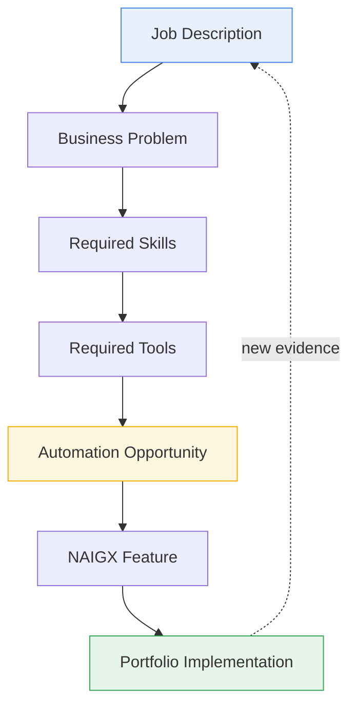
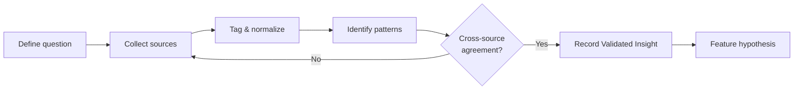
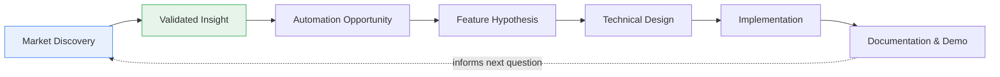

# Market Discovery

**File:** `research/00-Market-Discovery.md`
**Status:** Canonical — Living Document
**Applies To:** All research under `research/`
**Last Updated:** 2026-08-08

> This is the foundation document for NAIGX. Every feature in this repository must be traceable back to evidence gathered through the process defined here. If a feature cannot be traced, it does not get built.

---

## Purpose

NAIGX is built from evidence, not imagination.

This document defines **how market evidence is gathered, validated, and converted into product decisions**. It exists to prevent the most common failure mode in solo-built projects: building an impressive system that solves a problem nobody has.

It answers three questions for every feature in this repository:

1. What real-world business problem does this address?
2. What evidence proves that problem exists?
3. How was that evidence turned into this implementation?

---

## Project Context

NAIGX is currently a **market-driven portfolio project built by a solo developer**. This shapes the research methodology significantly and is stated here explicitly so the constraints are never ambiguous.

| Available | Not Available |
|---|---|
| Public job descriptions | Customer interviews |
| Public tool documentation and changelogs | Internal usage data |
| Public community discussions | Support tickets or sales calls |
| Public product reviews | A product or research team |
| Public pricing and integration catalogs | Peer review workflows |
| Hands-on tool evaluation (free tiers) | Production telemetry |

> ⚠️ **Constraint, not excuse**
> Limited access to primary research does not remove the evidence requirement. It changes *which* sources are used and requires agreement across independent sources before an insight is considered valid.

---

## Research Philosophy

The central idea: **job descriptions are market signals.**

When a company writes a job posting, it publicly documents a problem it is paying to solve, the skills it believes are required, and the tools it already runs. Aggregated across many postings, this reveals real operational pain with far less bias than asking people what they want.

NAIGX uses that signal as the entry point to its entire product pipeline.

### Stage Definitions

| Stage | Question Answered | Output |
|---|---|---|
| **Job Description** | What are companies paying to have done? | Raw postings, tagged and stored |
| **Business Problem** | What underlying problem creates this role? | Problem statement in plain language |
| **Required Skills** | What work does a human currently perform? | Skill inventory per problem |
| **Required Tools** | What software stack is already in place? | Tool frequency data |
| **Automation Opportunity** | Which parts are repetitive, rule-based, or data-bound? | Opportunity assessment |
| **NAIGX Feature** | What capability would address it? | Feature hypothesis |
| **Portfolio Implementation** | How is it built and demonstrated? | Working code + documentation |

> 💡 **Rule**
> A stage cannot be skipped. A feature that appears without a documented problem, skill, and tool trail is an assumption, and assumptions are not built.

---

## Research Principles

1. **Evidence over intuition.** Internal belief is a hypothesis, never a justification.
2. **Falsifiability.** Every hypothesis is written so it can be proven wrong.
3. **Independence over volume.** Without interviews, credibility comes from patterns appearing across genuinely independent sources — not from repeated exposure to the same source.
4. **Traceability.** Every insight records its sources, collection date, and method.
5. **Bias awareness.** Job postings over-represent larger and tech-forward companies. This skew is documented, not ignored.
6. **Problems, not solutions.** Research documents describe the problem space. Solutions belong in downstream design documents.
7. **Recency matters.** Tool landscapes shift quickly. Evidence older than 12 months is flagged as stale.

---

## Research Methodology

### Method

### Collection

| Method | Description | Applied At |
|---|---|---|
| Job posting analysis | Systematic collection and tagging of postings for operations, RevOps, automation, and internal-tooling roles | Stages 1–4 |
| Tool documentation review | Reading public docs, API references, and changelogs of tools appearing in postings | Stage 4 |
| Community observation | Reading unprompted discussion of workflow pain in public forums and communities | Stages 2, 5 |
| Review mining | Public product reviews, especially critical ones, which surface real friction | Stages 2, 5 |
| Hands-on evaluation | Direct use of free tiers to verify claimed capabilities and integration limits | Stages 4–5 |
| Competitive mapping | Tracking what adjacent tools already do, to avoid rebuilding solved problems | Stage 6 |

### Validation Threshold

An observation is not actionable until it clears this bar:

| Level | Criteria | Actionable |
|---|---|---|
| 🔴 **Hypothesis** | Appears in a single source, or originates from internal reasoning | No |
| 🟡 **Emerging Signal** | Appears in 3–5 independent sources of a **single** source type | Not yet — broaden source types |
| 🟢 **Validated Insight** | Appears in **5+ independent sources across at least 2 source types**, within the last 12 months | Yes |

> 📌 **Why the bar is set here**
> This threshold is deliberately calibrated for the current early portfolio stage — high enough to prevent assumption-driven development, low enough to remain practical for a solo builder. The requirement for **two or more source types** is the part that carries the weight: five job postings alone describe what companies are hiring for, but five postings *plus* corroborating community or review evidence describes a problem that persists after the role is filled. As the corpus grows, this threshold should be raised.

---

## Sources of Evidence

| Category | Examples | Strength | Known Bias |
|---|---|---|---|
| Job postings | Public boards, company career pages | Reveals paid-for problems and actual tool stacks | Skews toward larger, hiring, tech-forward companies |
| Tool documentation | Public docs, API references, changelogs | Authoritative on capabilities and limits | Vendor-authored; describes intent, not reality |
| Public communities | Forums, subreddits, public Discord/Slack, HN | Unprompted and unfiltered pain | Skews toward technical and vocal users |
| Product reviews | G2, Capterra, app marketplaces | Direct friction reports | Review incentives distort sentiment |
| Hands-on evaluation | Free-tier usage of integration and automation tools | Verified firsthand | Limited to free-tier scope |
| Industry reporting | Published analyst and survey data | Macro trend context | Secondary; often vendor-sponsored |

### Source Hygiene

Every recorded piece of evidence must include:

- Source name and link
- Date published (or observed, if undated)
- Date collected
- Collection method
- Relevant excerpt or summary

Undated and unsourced claims are not permitted in `research/`.

---

## Deliverables

All research artifacts live under `research/` and are version-controlled alongside the code they justify.

| Artifact | Purpose |
|---|---|
| **Research Brief** | States the question being investigated and the method chosen |
| **Job Description Corpus** | Collected, tagged postings — the raw input to the pipeline |
| **Problem Statements** | Plain-language descriptions of business problems derived from postings |
| **Skill & Tool Inventory** | Frequency data on skills and tools appearing across the corpus |
| **Automation Opportunity Assessment** | Analysis of which workflow segments are automatable and why |
| **Validated Insight Record** | A confirmed problem with its full evidence trail and confidence level |
| **Competitive Landscape Map** | Living reference on what adjacent tools already solve |
| **Research Log** | Chronological record of research activity and decisions |

---

## Evidence-Based Product Development Process

Each transition has a gate:

| Transition | Gate |
|---|---|
| Insight → Opportunity | Insight meets the 🟢 Validated threshold |
| Opportunity → Feature Hypothesis | Automation is technically feasible and not already well-solved by an existing tool |
| Feature Hypothesis → Technical Design | Feature maps to a documented problem statement |
| Design → Implementation | Design references the originating insight by ID |
| Implementation → Documentation | Feature docs link back to the evidence trail |

> 💡 **The link is bidirectional.** Research documents link forward to the features they produced; feature documents link back to the research that justified them.

---

## Success Criteria

Market Discovery is working when:

- [ ] Every feature in the repository links to a Validated Insight Record.
- [ ] Every Validated Insight Record links to its underlying sources.
- [ ] Insights consistently draw on more than one source type, not job postings alone.
- [ ] The Competitive Landscape Map prevents at least some features from being built — evidence that it is being used honestly.
- [ ] A reader unfamiliar with the project can follow any feature backward to the market problem it solves.
- [ ] Stale evidence (>12 months) is flagged rather than silently relied upon.

---

## Definition of Done

A market discovery cycle is **Done** when:

1. The research question is documented in a Research Brief.
2. Evidence has been collected from at least two source types.
3. Findings meet the 🟢 Validated Insight threshold, or are explicitly recorded as 🟡 Emerging with a note on what further evidence is needed.
4. Each insight is recorded with a complete, dated source trail.
5. The Competitive Landscape Map has been checked to confirm the problem is not already well-solved.
6. Known biases and gaps in the evidence are stated in the document itself.
7. No product features, UI concepts, or technical solutions appear in the research document.
8. The artifact is committed to `research/` with a descriptive commit message.

> ⚠️ **Scope reminder**
> Research documents describe the problem space. The moment a document starts proposing an interface, a schema, or an architecture, it has left research and belongs in a design document instead.

---

## Next Steps

1. Define the initial research questions targeting operations, RevOps, and internal-tooling roles.
2. Establish the job description corpus structure and tagging schema.
3. Build the first Skill & Tool Inventory from that corpus.
4. Publish the first Validated Insight Record as a template for all future entries.
5. Create the Competitive Landscape Map covering the integration and automation category.
6. Set a recurring cadence for refreshing the corpus so evidence does not go stale.

---

## Guiding Principle

NAIGX is not built to showcase technology.

NAIGX is built to solve real business problems.

Every feature, integration, dashboard, workflow, and AI capability must be traceable back to evidence collected during Market Discovery.

If a feature cannot be connected to a validated business problem, it should not be built.

---

*This is a living document. It defines how NAIGX makes decisions and should be revised as the research process matures.*