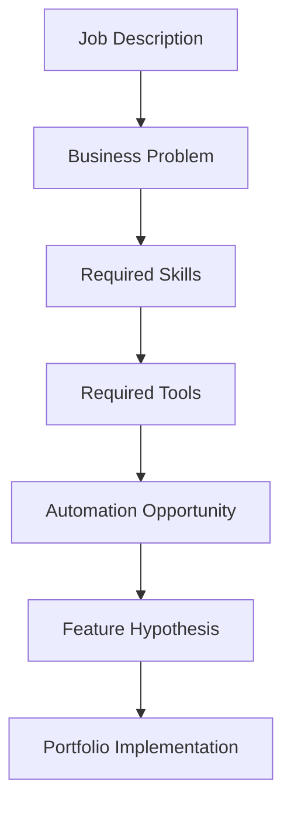

# Job Description Matrix

> **Status:** Living document · **Owner:** NAIGX Research · **Last updated:** `YYYY-MM-DD`

---

## Purpose

This document is the central research database for every job description analyzed during the NAIGX project.

Job postings are one of the few public artifacts where companies state, in writing, what work they cannot currently get done. Each posting is a signed admission of an unmet operational need — the tools already in use, the skills missing from the team, and the outcomes being paid for. Read individually, a posting is anecdote. Read in aggregate and structured consistently, postings become market intelligence.

The purpose of this document is to convert unstructured job postings into a structured, queryable dataset that guides NAIGX product decisions and portfolio priorities.

This document exists to answer questions such as:

| Question | What the answer drives |
| --- | --- |
| What business problems appear most frequently? | Core product positioning |
| Which software tools are most in demand? | Native integration roadmap |
| Which AI skills are becoming standard? | Feature baseline vs. differentiator |
| Which automation platforms are companies hiring for? | Build vs. connect strategy |
| Which integrations should NAIGX support first? | Sequencing of connector work |
| Which portfolio projects provide the highest ROI? | Where to spend build time |

It is deliberately a *living* document. Entries accumulate, the dashboard is recalculated, and conclusions are expected to shift as the sample grows. No decision should be made on a sample too small to support it.

---

## How This Document Is Used

Every job description contributes to NAIGX product development through four channels:

**1. Demand evidence.** A posting is a data point that a specific business problem is painful enough to pay a salary to solve. Frequency across postings is the primary demand signal used to rank features.

**2. Integration prioritization.** Tools, platforms, and APIs named in postings form the integration backlog. A tool mentioned repeatedly across independent companies moves ahead of a tool mentioned once, regardless of how interesting it is to build.

**3. Feature hypothesis generation.** Each posting produces at least one candidate feature hypothesis — a statement of what NAIGX could do to make part of the advertised role unnecessary or dramatically faster. Hypotheses accumulate; the ones that recur independently are the strongest.

**4. Portfolio direction.** Each posting suggests a demonstrable artifact — a workflow, dashboard, integration, or automation — that proves capability against a real, documented market need. Portfolio work is selected by priority score, not preference.

**Working rules:**

- One record per posting. Never merge two postings into one record.
- Record what the posting *says*, not what it probably means. Inference belongs in Product Insights, not in Technical Requirements.
- Preserve the original vocabulary. If a posting says "AI-driven reporting," capture that phrase before normalizing it.
- Archive the original posting text or a screenshot. Listings expire; the record must survive.
- Recalculate the Summary Dashboard on a fixed cadence, not opportunistically.

---

## Research Workflow

Every posting moves through seven stages. A record is not complete until all seven have been filled.



| Stage | Question answered | Output |
| --- | --- | --- |
| **1. Job Description** | What did the company actually publish? | Raw posting captured and archived with metadata |
| **2. Business Problem** | Why does this role exist? | The underlying operational gap, stated in business terms rather than task terms |
| **3. Required Skills** | What capability is being purchased? | Normalized skill list separating hard technical skills from process and domain skills |
| **4. Required Tools** | What stack does the work live inside? | Software, AI tools, automation platforms, APIs, and reporting surfaces |
| **5. Automation Opportunity** | Which parts of this role are rules-based, repetitive, or high-volume? | Specific tasks that a system could perform partly or fully |
| **6. Feature Hypothesis** | What could NAIGX build to address this? | A falsifiable statement of a capability and the outcome it produces |
| **7. Portfolio Implementation** | What artifact proves it? | A concrete, buildable deliverable with scope and effort estimate |

**Stage notes:**

- Stage 2 is the most commonly rushed and the most important. "Needs a data analyst" is a task. "Cannot see revenue by channel without three days of manual consolidation" is a business problem. Only the second is useful.
- Stage 5 should distinguish *full automation* (the task disappears) from *augmentation* (the task gets faster but still needs a human). These have very different product implications.
- Stage 6 must be falsifiable. A hypothesis that cannot be wrong is not a hypothesis.
- Stage 7 should be scoped to something completable, not aspirational.

---

## Summary Dashboard

> Recalculate on a fixed cadence. Do not update piecemeal — inconsistent refresh dates make trends unreadable.

**Last recalculated:** `YYYY-MM-DD` · **Sample size:** `N` · **Collection window:** `YYYY-MM-DD → YYYY-MM-DD`

### Coverage

| Metric | Value |
| --- | --- |
| Total Jobs Reviewed | `—` |
| Records Fully Validated | `—` |
| Records Pending Analysis | `—` |
| Distinct Companies | `—` |
| Distinct Industries | `—` |

### Industries

| Industry | Count | % of Sample | Notes |
| --- | --- | --- | --- |
| `—` | `—` | `—` | `—` |
| `—` | `—` | `—` | `—` |
| `—` | `—` | `—` | `—` |

### Most Requested Software

| Rank | Software | Mentions | % of Sample | Category |
| --- | --- | --- | --- | --- |
| 1 | `—` | `—` | `—` | `—` |
| 2 | `—` | `—` | `—` | `—` |
| 3 | `—` | `—` | `—` | `—` |

### Most Requested AI Platforms

| Rank | Platform | Mentions | % of Sample | Typical Use Case |
| --- | --- | --- | --- | --- |
| 1 | `—` | `—` | `—` | `—` |
| 2 | `—` | `—` | `—` | `—` |
| 3 | `—` | `—` | `—` | `—` |

### Most Requested Automation Platforms

| Rank | Platform | Mentions | % of Sample | Typical Use Case |
| --- | --- | --- | --- | --- |
| 1 | `—` | `—` | `—` | `—` |
| 2 | `—` | `—` | `—` | `—` |
| 3 | `—` | `—` | `—` | `—` |

### Most Requested APIs / Integrations

| Rank | API / Integration | Mentions | % of Sample | Direction (read / write / both) |
| --- | --- | --- | --- | --- |
| 1 | `—` | `—` | `—` | `—` |
| 2 | `—` | `—` | `—` | `—` |
| 3 | `—` | `—` | `—` | `—` |

### Most Requested Skills

| Rank | Skill | Mentions | % of Sample | Type (technical / process / domain) |
| --- | --- | --- | --- | --- |
| 1 | `—` | `—` | `—` | `—` |
| 2 | `—` | `—` | `—` | `—` |
| 3 | `—` | `—` | `—` | `—` |

### Highest Demand Business Problems

| Rank | Business Problem | Frequency | Avg. Business Impact | Candidate NAIGX Feature |
| --- | --- | --- | --- | --- |
| 1 | `—` | `—` | `—` | `—` |
| 2 | `—` | `—` | `—` | `—` |
| 3 | `—` | `—` | `—` | `—` |

### Highest Demand Workflows

| Rank | Workflow | Frequency | Automation Potential (full / partial / none) | Priority Score |
| --- | --- | --- | --- | --- |
| 1 | `—` | `—` | `—` | `—` |
| 2 | `—` | `—` | `—` | `—` |
| 3 | `—` | `—` | `—` | `—` |

---

## Job Description Record Template

> Copy this block for every posting. Do not delete unused fields — record `Not stated` so that gaps in the data remain visible and countable.

---

### `JD-000` — `Company` — `Job Title`

#### General Information

| Field | Value |
| --- | --- |
| Job ID | `JD-000` |
| Company | `—` |
| Job Title | `—` |
| Industry | `—` |
| Employment Type | `Full-time / Part-time / Contract / Freelance / Internship` |
| Location | `City, Country` + `On-site / Hybrid / Remote` |
| Salary | `Range + currency + period`, or `Not stated` |
| Source | `Job board / company site / referral / other` |
| Date Collected | `YYYY-MM-DD` |
| Link to Original Posting | `URL` |
| Archive Reference | `Path to saved copy or screenshot` |

---

#### Business Analysis

**Business Problems**

What operational gap caused this role to be opened? State in business terms, not task terms.

| # | Business Problem | Evidence from Posting |
| --- | --- | --- |
| 1 | `—` | `—` |
| 2 | `—` | `—` |

**Business Goals**

What outcome is the company trying to reach? Include stated targets and metrics where given.

- `—`
- `—`

**Current Pain Points**

Friction the posting reveals, whether stated directly or implied by the responsibilities listed.

| Pain Point | Stated or Inferred | Frequency / Volume (if given) |
| --- | --- | --- |
| `—` | `—` | `—` |
| `—` | `—` | `—` |

---

#### Technical Requirements

**Required Skills**

| Skill | Type (technical / process / domain) | Level (required / preferred) |
| --- | --- | --- |
| `—` | `—` | `—` |
| `—` | `—` | `—` |

**Required Software**

| Software | Category | Level (required / preferred) |
| --- | --- | --- |
| `—` | `—` | `—` |

**Required AI Tools**

| AI Tool / Platform | Stated Use Case | Level (required / preferred) |
| --- | --- | --- |
| `—` | `—` | `—` |

**Required Automation Platforms**

| Platform | Stated Use Case | Level (required / preferred) |
| --- | --- | --- |
| `—` | `—` | `—` |

**APIs / Integrations Mentioned**

| API / System | Direction (read / write / both) | Stated Purpose |
| --- | --- | --- |
| `—` | `—` | `—` |

**Reporting / Analytics Requirements**

| Requirement | Audience | Cadence | Delivery Format |
| --- | --- | --- | --- |
| `—` | `—` | `—` | `—` |

---

#### Product Insights

**Automation Opportunities**

| # | Task | Automation Potential (full / partial / none) | Rationale |
| --- | --- | --- | --- |
| 1 | `—` | `—` | `—` |

**AI Opportunities**

| # | Task | AI Role (generate / classify / extract / summarize / decide) | Rationale |
| --- | --- | --- | --- |
| 1 | `—` | `—` | `—` |

**Potential NAIGX Feature**

State as a falsifiable hypothesis.

> If NAIGX provided `—`, then `—` would be able to `—`, reducing `—`.

| Field | Value |
| --- | --- |
| Feature Name | `—` |
| Problem It Solves | `—` |
| Dependencies / Prerequisites | `—` |
| Related Existing Hypotheses | `JD-000`, `JD-000` |

**Portfolio Opportunity**

| Field | Value |
| --- | --- |
| Deliverable | `—` |
| Scope | `—` |
| Estimated Effort | `—` |
| What It Proves | `—` |
| Reusable Assets Produced | `—` |

**Scoring**

| Dimension | Score (1–5) | Justification |
| --- | --- | --- |
| Difficulty | `—` | `—` |
| Business Impact | `—` | `—` |
| Priority Score | `—` | `—` |

Scoring reference:

| Score | Difficulty | Business Impact | Priority |
| --- | --- | --- | --- |
| 1 | Trivial — hours, known tools | Marginal — convenience only | Backlog, revisit later |
| 2 | Low — days, minor unknowns | Small — one team benefits | Low |
| 3 | Moderate — weeks, some unknowns | Meaningful — measurable time or cost saved | Medium |
| 4 | High — significant unknowns or dependencies | Large — affects a core process | High |
| 5 | Very high — new capability required | Critical — addresses the stated reason the role exists | Build next |

> Priority is a judgment, not a formula. Difficulty and Business Impact inform it; recurrence across multiple records should raise it. Record the reasoning in the justification column.

---

#### Personal Notes

Free-form. Use for anything that does not fit the structure above: doubts about the data, patterns noticed, questions to investigate, language worth reusing, or reasons a record may be misleading.

```
—
```

---

## Records

### `JD-001` — `Not stated (recruiter contact: Sammy@somewhere.com)` — `Marketing Automation Lead (HubSpot Expert)`

#### General Information

| Field | Value |
| --- | --- |
| Job ID | `JD-001` |
| Company | `Not stated` — posting is unbranded; applications route through a third-party contact (`Sammy@somewhere.com`), suggesting a recruiter/agency rather than the hiring company directly |
| Job Title | Marketing Automation Lead (HubSpot Expert) |
| Industry | Information Technology |
| Employment Type | `Not stated` |
| Location | Remote — aligned to CET / UTC+2 (EU business hours) |
| Salary | `Not stated` — posting asks the *candidate* to state expected monthly salary in USD rather than disclosing a range |
| Source | `Not stated` — posting text supplied directly, no board or URL given |
| Date Collected | 2026-08-08 |
| Link to Original Posting | `Not stated` |
| Archive Reference | Posting text captured verbatim in NAIGX research conversation, 2026-08-08 — recommend saving a standalone copy, since no live URL exists to archive against |

---

#### Business Analysis

**Business Problems**

| # | Business Problem | Evidence from Posting |
| --- | --- | --- |
| 1 | GTM organization lacks an owned, well-architected data backbone — HubSpot is being run without a dedicated owner for data model and system design | "we are looking for a Marketing Automation Expert that can build the backbone of data for our GTM organization" |
| 2 | Demand-gen systems are not reliably delivering a consistent experience across touchpoints | "ensure that our demand gen systems are working flawlessly to provide next-level customer experiences across every touchpoint" |
| 3 | No clear visibility into true demand source / attribution | "UTM/attribution modeling. Knows how to track where demand actually comes from" |
| 4 | Leadership and marketing are bottlenecked on a central data team for reporting | "Basic SQL or data querying. Able to pull their own reports without waiting on a data team" |
| 5 | Data hygiene and lead routing are unmanaged or inconsistent | "Comfortable with data hygiene and lead routing logic" |

**Business Goals**

- Stand up marketing automation/CRM systems that run "flawlessly" across every customer touchpoint
- Give leadership self-serve, visualized reporting to make informed decisions
- Establish data and automation flows that span Product, Engineering, Sales, and Leadership, not just Marketing

**Current Pain Points**

| Pain Point | Stated or Inferred | Frequency / Volume (if given) |
| --- | --- | --- |
| Reporting requires waiting on a data team | Stated | Not stated |
| Automations break and require calm, methodical debugging | Stated | Not stated |
| Workflows are being built without being mapped/documented first | Inferred (from "map and document complex workflows before building them") | Not stated |
| Funnel-stage definitions (MQL/SQL/pipeline) may be inconsistent across teams | Inferred | Not stated |

---

#### Technical Requirements

**Required Skills**

| Skill | Type (technical / process / domain) | Level (required / preferred) |
| --- | --- | --- |
| HubSpot data model & system design ownership | technical | required |
| SQL / data querying | technical | required |
| Webhook/API literacy (non-coding) | technical | required |
| UTM/attribution modeling | technical | required |
| Reporting & data visualization | technical | required |
| Workflow mapping & documentation | process | required |
| Data hygiene & lead routing logic | process | required |
| Funnel stage knowledge (MQL/SQL/pipeline) | domain | required |
| Automation debugging under pressure | technical | required |
| Paid media fundamentals (agency briefing / budget mgmt) | domain | required |
| Email nurture strategy (segmentation, sequencing, personalization) | domain | required |
| Webinar / content syndication ops | domain | preferred |
| PLG / developer-tools marketing experience | domain | preferred |
| Product usage data familiarity | technical | preferred |
| Community-led / open-source GTM exposure | domain | preferred |

**Required Software**

| Software | Category | Level (required / preferred) |
| --- | --- | --- |
| HubSpot | Marketing Automation / CRM | required |

**Required AI Tools**

| AI Tool / Platform | Stated Use Case | Level (required / preferred) |
| --- | --- | --- |
| `—` | Not stated | `—` |

**Required Automation Platforms**

| Platform | Stated Use Case | Level (required / preferred) |
| --- | --- | --- |
| `—` | Not stated by name — only described generically as "data and automation flows across the organization" | `—` |

**APIs / Integrations Mentioned**

| API / System | Direction (read / write / both) | Stated Purpose |
| --- | --- | --- |
| Generic webhooks/APIs | both | "understands how systems talk to each other" — no specific system named |
| Amplitude (nice to have) | read | Product usage data feeding into marketing automation |
| "Database" (nice to have, as named in posting) | read | Product usage data — ambiguous term, unclear if a specific product or used generically |

**Reporting / Analytics Requirements**

| Requirement | Audience | Cadence | Delivery Format |
| --- | --- | --- | --- |
| Demand/pipeline visibility for decision-making | Leadership | Not stated | Not stated (implied visualization/dashboard) |
| Self-serve SQL pulls | Marketing Automation Lead (self-service) | Not stated | Not stated |

---

#### Product Insights

**Automation Opportunities**

| # | Task | Automation Potential (full / partial / none) | Rationale |
| --- | --- | --- | --- |
| 1 | UTM/attribution tagging and rollup reporting | full | Rules-based tagging plus automated dashboarding once conventions are set |
| 2 | Lead routing execution | partial | Rules can run automatically, but hygiene exceptions still need human judgment |
| 3 | Leadership reporting pack assembly | partial | SQL pulls and chart generation can be templated; narrative framing still benefits from a human |
| 4 | Pre-build workflow mapping/documentation | partial | AI can draft a flow diagram from a description, but validation against real systems needs a human |

**AI Opportunities**

| # | Task | AI Role (generate / classify / extract / summarize / decide) | Rationale |
| --- | --- | --- | --- |
| 1 | Diagnosing broken HubSpot automations | extract / decide | Reading workflow config + run history to isolate a failure point is a diagnostic-reasoning task explicitly named as a required human skill ("debug a broken automation without panicking") |
| 2 | Attribution/UTM analysis | classify / extract | Mapping inconsistent UTM tagging to real demand sources is pattern classification |
| 3 | Leadership report generation | summarize | Converting SQL output into a leadership-ready narrative and visualization |
| 4 | Lead routing rule audit | decide | Recommending routing logic changes based on observed data hygiene issues |

**Potential NAIGX Feature**

> If NAIGX provided an AI copilot that reads a HubSpot workflow's configuration and recent run history, then a Marketing Automation Lead would be able to diagnose and explain a broken automation in minutes instead of manually tracing each step, reducing time-to-resolution on demand-gen system outages.

| Field | Value |
| --- | --- |
| Feature Name | HubSpot Automation Debugger / Workflow Diagnostic Copilot |
| Problem It Solves | "Can debug a broken automation without panicking" is stated as a hiring requirement — evidence that this diagnostic work is currently manual and skill-gated |
| Dependencies / Prerequisites | HubSpot API/webhook read access; access to workflow history or run logs |
| Related Existing Hypotheses | None yet — JD-001 is the first record in this matrix |

**Portfolio Opportunity**

| Field | Value |
| --- | --- |
| Deliverable | Demo tool that ingests a HubSpot workflow's config plus recent run history and outputs a plain-English root-cause diagnosis with a suggested fix |
| Scope | Single-workflow diagnostic; mock HubSpot data acceptable if no live sandbox is available; output a readable report artifact |
| Estimated Effort | Days for a functional prototype; weeks for a polished version wired to a real HubSpot sandbox |
| What It Proves | NAIGX can operationalize a skill explicitly named in a live job posting as hard to hire for |
| Reusable Assets Produced | HubSpot API client wrapper, workflow/run-log parser, diagnostic-report template |

**Scoring**

| Dimension | Score (1–5) | Justification |
| --- | --- | --- |
| Difficulty | 3 | Requires HubSpot API familiarity and enough sandbox/log examples to generalize; integration work, not a new capability |
| Business Impact | 3 | Addresses a named skill gap, but this is a single record — impact is speculative until recurrence is observed |
| Priority Score | 3 (Medium) | Single-record evidence only; revisit once 2–3 more HubSpot/RevOps postings are collected to test recurrence |

---

#### Personal Notes

```
- This posting asks applicants to send expected salary, reasons for leaving the last three roles, and an
  "unrestricted, public, non-expiring" Google Drive video introduction to a generic address
  (Sammy@somewhere.com — note the placeholder-looking domain). Requesting job-history justification and an
  openly public video link before any interview is a pattern more associated with data-harvesting/scam
  postings than a genuine first-stage screen. Flagging for awareness, not scoring as a market signal.
- Salary asymmetry: the posting requires the candidate's number but discloses none of its own. Worth watching
  whether this is common across the sample or specific to this listing.
- No automation platform (e.g. Zapier, Make, n8n) is named despite "automation flows across the organization"
  language — worth checking in future records whether HubSpot-native workflows alone typically satisfy this,
  or whether a connector platform is usually named alongside HubSpot.
- Sample size is 1. Per this document's own guidance, no dashboard recalculation or ranking should be drawn
  from a single record — Summary Dashboard intentionally left untouched until more records exist.
```

---

### `JD-002` — `Not stated (identified internally as Req #20684; certified woman-owned small business, mission-critical aviation services)` — `AI Automation Engineer`

#### General Information

| Field | Value |
| --- | --- |
| Job ID | `JD-002` |
| Company | `Not stated` — posting withholds the company name; described only as "a certified woman-owned small business providing end-to-end mission-critical aviation services, including aircraft leasing, ISR configuration, program management, and logistics support for government and commercial clients worldwide" |
| Job Title | AI Automation Engineer (posting header also uses "AI Data Engineer" once when describing the sought role — inconsistent internally, see Personal Notes) |
| Industry | Aerospace / Aviation (government and commercial, incl. ISR/defense-adjacent logistics) |
| Employment Type | `Not stated` — no Full-time/Part-time/Contract label given, though "Mon–Fri, 9:00 AM–5:00 PM PST" hours and a monthly pay range imply a standard ongoing engagement |
| Location | Location of Search: Philippines, South Africa, Latin America · Work Location: Remote |
| Salary | $4,000–$5,000/month (USD implied, not stated explicitly), "varies based on skill set and experience level" |
| Source | `Not stated` — posting text supplied directly, no board or URL given |
| Date Collected | 2026-08-08 |
| Link to Original Posting | `Not stated` |
| Archive Reference | Posting text captured verbatim in NAIGX research conversation, 2026-08-08 — recommend saving a standalone copy, since no live URL exists to archive against |

---

#### Business Analysis

**Business Problems**

| # | Business Problem | Evidence from Posting |
| --- | --- | --- |
| 1 | Company has no dedicated internal owner for AI infrastructure or strategy — AI adoption is ad hoc rather than centrally driven | "help build and scale their internal AI infrastructure" / "serve as the organization's technical lead for artificial intelligence initiatives" / "Opportunity to shape the company's long-term AI roadmap" |
| 2 | Cross-departmental administrative and operational workflows are manual, repetitive, and consuming staff time | "Automate business processes including: Scheduling, Data entry, Travel coordination, Administrative workflows, Operational reporting" |
| 3 | No single point of contact exists for AI/automation questions or troubleshooting across teams | "Serve as the organization's primary point of contact for AI and automation initiatives" / "Provide guidance and support to internal teams on AI best practices" |
| 4 | Existing AI platforms/assistants are not being systematically maintained or optimized | "Help evolve and optimize existing AI platforms and internal AI assistants" / "Troubleshoot AI-related issues and optimize existing solutions" |
| 5 | AI workflows and technical solutions are undocumented, creating risk of tribal knowledge | "Document AI workflows, processes, and technical solutions" |

**Business Goals**

- Build and scale an internal AI infrastructure/ecosystem owned by a single technical lead
- Automate manual administrative processes (scheduling, data entry, travel coordination, reporting) across multiple departments
- Increase operational efficiency and reduce manual work as a measurable outcome ("Reduction in manual administrative processes" is listed as a success metric)
- Drive broader "digital transformation" across the organization, not just a single department
- Maintain and expand internal AI assistants built on Claude (Claude for Work/Cowork)

**Current Pain Points**

| Pain Point | Stated or Inferred | Frequency / Volume (if given) |
| --- | --- | --- |
| Repetitive manual tasks across scheduling, data entry, travel coordination, and reporting | Stated | Not stated |
| No formal AI governance/best-practices guidance for internal teams | Inferred (from "Provide guidance and support to internal teams on AI best practices") | Not stated |
| AI initiatives currently lack a single accountable owner | Inferred (from "primary point of contact" and "technical lead" framing) | Not stated |
| Executive/admin support tasks (personal scheduling, travel) are being handled without dedicated support | Stated ("Personal Assistance" section) | Occasional ("Assist with occasional personal administrative tasks") |

---

#### Technical Requirements

**Required Skills**

| Skill | Type (technical / process / domain) | Level (required / preferred) |
| --- | --- | --- |
| AI Engineering / Data Engineering / Software Engineering experience (2–5 yrs) | technical | required |
| Hands-on experience building AI workflows/assistants/automations with Claude (Claude for Work/Cowork) | technical | required |
| Workflow automation solution building | technical | required |
| Understanding of AI concepts and modern AI tools | technical | required |
| API and system integration experience | technical | required |
| Data management and analytical skills | technical | required |
| Developing scalable technical solutions | technical | required |
| Problem-solving and troubleshooting | process | required |
| Written and verbal English communication | domain | required |
| Independent management of multiple technical initiatives | process | required |
| AI assistants / LLM experience | technical | preferred |
| Workflow automation platform experience | technical | preferred |
| Multi-system/API integration experience | technical | preferred |
| Cloud-based AI services familiarity | technical | preferred |
| Building internal productivity tools | technical | preferred |
| Scripting/programming (Python, JavaScript, or SQL) | technical | preferred |
| Operational/administrative process automation support | process | preferred |
| Government, aviation, logistics, or regulated-industry background | domain | preferred |

**Required Software**

| Software | Category | Level (required / preferred) |
| --- | --- | --- |
| Microsoft Office Suite | Productivity | preferred (listed under "Technology & Tools") |
| Google Workspace | Productivity | preferred (listed under "Technology & Tools") |

**Required AI Tools**

| AI Tool / Platform | Stated Use Case | Level (required / preferred) |
| --- | --- | --- |
| Claude / Claude Cowork | Building AI workflows, assistants, and automations; maintaining internal AI assistants | required |
| ChatGPT | Listed under "Technology & Tools" as preferred, no specific use case stated | preferred |
| Large Language Models (LLMs), general | Underpins AI assistants and automation solutions | preferred |
| Cloud-based AI services (unnamed) | Not stated beyond "familiarity" | preferred |

**Required Automation Platforms**

| Platform | Stated Use Case | Level (required / preferred) |
| --- | --- | --- |
| Workflow automation tools (unnamed) | Automating scheduling, data entry, travel coordination, admin workflows, and operational reporting | preferred — listed generically under "Technology & Tools," no specific platform (e.g. Zapier/Make/n8n) named |

**APIs / Integrations Mentioned**

| API / System | Direction (read / write / both) | Stated Purpose |
| --- | --- | --- |
| Generic APIs / system integrations (unnamed) | both | "Experience working with APIs and system integrations"; "Experience integrating multiple business systems and APIs" |
| Data engineering / ETL tools (unnamed) | both | Listed under "Technology & Tools," no specific tool named |

**Reporting / Analytics Requirements**

| Requirement | Audience | Cadence | Delivery Format |
| --- | --- | --- | --- |
| Operational reporting automation | Not stated (internal business functions, implied) | Not stated | Not stated |

---

#### Product Insights

**Automation Opportunities**

| # | Task | Automation Potential (full / partial / none) | Rationale |
| --- | --- | --- | --- |
| 1 | Scheduling (business and personal) | full | Rules-based calendar coordination is a well-established automation target, explicitly named twice in the posting |
| 2 | Data entry | full | Repetitive, structured-input task explicitly named as an automation target |
| 3 | Travel coordination | partial | Booking logistics can be automated, but exceptions (preferences, disruptions) still need human judgment, especially for the "personal assistance" variant |
| 4 | Operational reporting | partial | Data aggregation/formatting can be automated; interpretation and distribution to stakeholders likely still needs review |
| 5 | Administrative workflows (general) | partial | Too broadly defined in the posting to guarantee full automation across all cases |

**AI Opportunities**

| # | Task | AI Role (generate / classify / extract / summarize / decide) | Rationale |
| --- | --- | --- | --- |
| 1 | Internal AI assistant maintenance/optimization | decide / generate | "Help evolve and optimize existing AI platforms and internal AI assistants" implies ongoing tuning of prompts, tools, and assistant behavior |
| 2 | Operational reporting | extract / summarize | Converting raw operational data into reporting output is a summarization task |
| 3 | Troubleshooting AI-related issues | classify / decide | Diagnosing failures in AI-powered workflows before they can be fixed |
| 4 | Documentation of AI workflows and processes | summarize / generate | "Document AI workflows, processes, and technical solutions" is a generation task well-suited to AI-assisted drafting |

**Potential NAIGX Feature**

> If NAIGX provided a Claude-based internal-assistant scaffolding kit (prebuilt patterns for scheduling, data entry, and operational-reporting assistants, with built-in documentation generation), then a solo AI Automation Engineer would be able to stand up and document department-level automations in days instead of building each one from scratch, reducing the time-to-value for single-owner AI infrastructure initiatives.

| Field | Value |
| --- | --- |
| Feature Name | Claude Cowork Assistant Starter Kit (Scheduling / Data-Entry / Reporting templates) |
| Problem It Solves | Posting explicitly requires hands-on Claude/Claude Cowork experience for building workflows and assistants, with one engineer solely responsible for infrastructure, maintenance, troubleshooting, and documentation — evidence that this is currently a from-scratch, single-owner effort |
| Dependencies / Prerequisites | Claude for Work/Cowork access; API/system integration credentials for target business systems (unnamed in posting); a documentation template format |
| Related Existing Hypotheses | None yet — no recurrence observed across JD-001 and JD-002 (different tool ecosystems: HubSpot vs. Claude Cowork) |

**Portfolio Opportunity**

| Field | Value |
| --- | --- |
| Deliverable | A small library of Claude-based automation templates (e.g., meeting-scheduling assistant, structured data-entry assistant, operational-report generator) packaged with auto-generated documentation for each |
| Scope | 2–3 template assistants with mock data/business systems; auto-generated docs as the differentiator, since documentation is explicitly named as a required deliverable in this role |
| Estimated Effort | Days for one template end-to-end; a week or two for a 2–3 template library with consistent documentation output |
| What It Proves | NAIGX can operationalize the exact tool stack (Claude/Claude Cowork) and task set named as this role's core responsibilities |
| Reusable Assets Produced | Claude Cowork assistant templates, a documentation-generation pattern reusable across future automation records |

**Scoring**

| Dimension | Score (1–5) | Justification |
| --- | --- | --- |
| Difficulty | 2 | Templates use Claude/Claude Cowork directly with mock data; no novel integration required for a first version |
| Business Impact | 3 | Addresses a named, specific tool requirement (Claude Cowork) with clear stated tasks, but based on a single posting — recurrence unconfirmed |
| Priority Score | 3 (Medium) | Single-record evidence; revisit once more Claude/Cowork-specific postings are collected to test recurrence against JD-001's HubSpot-centric pattern |

---

#### Personal Notes

```
- The posting is internally inconsistent about the role's own name: the header and most of the body say
  "AI Automation Engineer," but the "About the Company" paragraph says "They are seeking an AI Data Engineer."
  Recorded the discrepancy rather than silently picking one.
- Company identity is deliberately withheld beyond a generic description and an internal requisition number
  (20684). No company name, board, or URL was provided — flagged as Not stated throughout rather than guessed.
- This is the first posting in the matrix naming Claude/Claude Cowork specifically as a required tool, which is
  directly relevant to NAIGX's own toolchain — worth watching closely for recurrence across future records, as
  it would be a strong, low-effort integration signal.
- "Personal Assistance" duties (personal scheduling, travel, confidentiality) sit oddly alongside a formal
  "technical lead for AI initiatives" role — likely reflects a small/founder-led organization where one hire
  covers both executive support and technical ownership. Worth checking if this pattern recurs in similarly
  small companies.
- No specific automation platform (Zapier/Make/n8n), cloud provider, or ETL tool is named despite being
  listed as tool categories — unusually vague compared to JD-001, which at least named HubSpot as the core
  system. This posting reads as earlier-stage / less mature in its AI tooling than JD-001.
- Sample size is 2. Per this document's own guidance, dashboard recalculation should wait for a larger,
  more diverse sample before drawing trend conclusions — Summary Dashboard intentionally left untouched.
```

---

### `JD-003` — `Not stated (posting reference 52037504280; marketing/media agency serving fitness & wellness clients)` — `Senior Digital & Automations Developer`

#### General Information

| Field | Value |
| --- | --- |
| Job ID | `JD-003` |
| Company | `Not stated` — posting refers to the employer only as "Client" and "company"; the agency framing is inferred from "various client CRMs," "client campaigns," "our client portal," and the preferred qualification "experience working with multiple client CRMs in an agency environment" |
| Job Title | Senior Digital & Automations Developer |
| Industry | Media (as labeled in the posting) — client base is fitness & wellness, inferred from the named client CRMs (Mindbody, Mariana Tek, ClubReady) and "familiarity with the wellness and fitness industry is a plus" |
| Employment Type | Full-time ("Remote (Full-time, exclusive)" — "exclusive" indicates no concurrent employment permitted) |
| Location | Remote — PST or MST overlap required |
| Salary | $1,200–$2,200 USD per month, "depending on experience" |
| Source | `Not stated` — posting text supplied directly, no board or URL given; the trailing number in the title (`52037504280`) appears to be a posting/requisition reference |
| Date Collected | 2026-08-08 |
| Link to Original Posting | `Not stated` |
| Archive Reference | Posting text captured verbatim in NAIGX research conversation, 2026-08-08 — recommend saving a standalone copy, since no live URL exists to archive against |

---

#### Business Analysis

**Business Problems**

| # | Business Problem | Evidence from Posting |
| --- | --- | --- |
| 1 | Agency's own CRM is disconnected from the CRMs its clients run on, so data does not move between the two without manual work | "Build and maintain API integrations to connect CRM platforms to third-party tools, ensuring seamless and efficient data flow" / "Connect and maintain integrations between HubSpot and various client CRMs, including Mindbody, Mariana Tek, ClubReady, and similar platforms" |
| 2 | Every client arrives on a different vertical-specific CRM, so integration work is rebuilt per client instead of reused | Three distinct fitness/wellness CRMs named plus "and similar platforms"; preferred qualification "experience working with multiple client CRMs in an agency environment" |
| 3 | Internal operations and client-facing processes are manual enough to justify a dedicated automation hire | "Create and manage AI automations to streamline internal operations and enhance client processes" |
| 4 | CRM data quality and segmentation are not reliable enough to support campaign execution | "including accurate data entry, effective segmentation, and workflow setup to support client campaigns and internal processes" |
| 5 | Paid media execution across Meta and Google lacks technical/automation support | "Support automation and technical workflows across Meta and Google Ads ecosystems" |
| 6 | System failures cause downtime that the current team cannot resolve quickly | "troubleshoot technical issues and implement effective solutions, ensuring minimal downtime and optimal system performance" |
| 7 | The client portal is under-featured and not yet proven at scale | "Support the development of new features for our client portal, focusing on functionality, scalability, and user engagement" |
| 8 | Technical capability is spread thin — one hire is expected to cover front-end, back-end, database, integration, QA, and DevOps | "possess a skillset more closely aligned with a full-stack developer. Front-End Development, Back-End Architecture, Database Management, System Integration, Quality Assurance & DevOps & Deployment" |

**Business Goals**

- Achieve "seamless and efficient data flow" between HubSpot and each client's CRM
- Streamline internal operations and improve client processes through AI automations
- Keep systems at "minimal downtime and optimal system performance"
- Maintain web assets (WordPress and Next.js) that are "user-friendly, optimized, and aligned with company's branding"
- Grow the client portal along three named axes: functionality, scalability, and user engagement
- Keep projects "aligned with company's goals and timely completion," supported by regular status updates
- No numeric targets or metrics are stated anywhere in the posting

**Current Pain Points**

| Pain Point | Stated or Inferred | Frequency / Volume (if given) |
| --- | --- | --- |
| Integrations between HubSpot and client CRMs break or need ongoing upkeep | Stated ("maintain integrations"; "Assist with API setups, integrations, and troubleshooting") | Not stated |
| Inaccurate CRM data entry and weak segmentation | Stated | Not stated |
| Technical issues currently cause downtime | Stated | Not stated |
| Project status is not visible without someone actively reporting it | Inferred (from "Provide regular updates on projects, ensuring alignment with company's goals") | "Regular" — cadence not defined |
| Client onboarding requires bespoke integration work per CRM | Inferred (from three named CRMs plus "and similar platforms") | Not stated |
| Team lacks a single person able to work across the full stack | Inferred (from the breadth of the "Role Overview" skill list vs. a 2-year minimum experience bar) | Not stated |
| Ads work is handled without technical/automation tooling | Inferred (from "Support automation and technical workflows across Meta and Google Ads ecosystems") | Not stated |

---

#### Technical Requirements

**Required Skills**

| Skill | Type (technical / process / domain) | Level (required / preferred) |
| --- | --- | --- |
| API integration build and maintenance | technical | required |
| Full-stack development (front-end, back-end architecture) | technical | required |
| Database management | technical | required |
| System integration | technical | required |
| Quality assurance | technical | required |
| DevOps & deployment | technical | required |
| Web design and development | technical | required |
| CRM workflow, segmentation, and reporting configuration (HubSpot) | technical | required |
| AI automation creation and management | technical | required |
| Automation building with best-practice/efficiency focus | technical | required |
| Technical troubleshooting, independently and with a team | process | required |
| Excellent written and verbal English communication | process | required |
| Proactive status reporting and remote task management | process | required |
| Remote work capability with US time-zone alignment | process | required |
| Minimum 2 years experience | domain | required |
| Basic scripting or automation experience | technical | preferred |
| Working with multiple client CRMs in an agency environment | domain | preferred |
| Wellness and fitness industry familiarity | domain | preferred |
| Prior experience supporting a CTO or technical lead | domain | preferred |

**Required Software**

| Software | Category | Level (required / preferred) |
| --- | --- | --- |
| HubSpot | CRM / Marketing Automation | required |
| Mindbody | Client CRM (fitness & wellness) — integration target | required |
| Mariana Tek | Client CRM (fitness & wellness) — integration target | required |
| ClubReady | Client CRM (fitness & wellness) — integration target | required |
| Meta Ads | Advertising platform | required |
| Google Ads | Advertising platform | required |
| WordPress | CMS / Web | required |
| Next.js | Web framework | required (posting writes it as "Net.js" in the proficiency line and "Next.js" in the responsibilities — see Personal Notes) |
| BaseDash | Database interface / admin tooling | required |

**Required AI Tools**

| AI Tool / Platform | Stated Use Case | Level (required / preferred) |
| --- | --- | --- |
| `Not stated` | "Create and manage AI automations to streamline internal operations and enhance client processes" — the capability is required but no AI tool, model, or vendor is named anywhere in the posting | required (capability), tool unspecified |

**Required Automation Platforms**

| Platform | Stated Use Case | Level (required / preferred) |
| --- | --- | --- |
| Zapier | "Proficiency in creating automations with tools like Zapier, with a focus on best practices and efficiency"; also listed again in the explicit proficiency line | required |
| Make | "Basic scripting or automation experience using tools such as Zapier, Make, or similar" | preferred |
| Unnamed "similar" automation tools | Same line as Make — category left open | preferred |

**APIs / Integrations Mentioned**

| API / System | Direction (read / write / both) | Stated Purpose |
| --- | --- | --- |
| HubSpot API | both | Hub of the integration model — connected outward to client CRMs and third-party tools |
| Mindbody API | both | "Connect and maintain integrations between HubSpot and various client CRMs" |
| Mariana Tek API | both | Same as above |
| ClubReady API | both | Same as above |
| Meta Ads | both | "Support automation and technical workflows across Meta and Google Ads ecosystems"; also named as an API integration target alongside HubSpot |
| Google Ads | both | "Support automation and technical workflows across Meta and Google Ads ecosystems" |
| Unnamed third-party tools | both | "connect CRM platforms to third-party tools, ensuring seamless and efficient data flow" |

**Reporting / Analytics Requirements**

| Requirement | Audience | Cadence | Delivery Format |
| --- | --- | --- | --- |
| HubSpot reporting (named as part of required CRM knowledge) | Not stated | Not stated | Not stated |
| Project status updates | Not stated (internal — implied leadership or a CTO/technical lead, given the preferred qualification) | "Regular" — not defined | Not stated |

---

#### Product Insights

**Automation Opportunities**

| # | Task | Automation Potential (full / partial / none) | Rationale |
| --- | --- | --- | --- |
| 1 | Contact/member data sync between HubSpot and client CRMs (Mindbody, Mariana Tek, ClubReady) | full | Deterministic record mapping once field mappings are agreed; this is the posting's most-repeated responsibility |
| 2 | CRM data entry | full | "Accurate data entry" is explicitly named as a problem; structured-input work with a defined target schema |
| 3 | Pushing CRM segments into Meta/Google Ads audiences | full | Both sides expose audience APIs and the posting frames ads work as "technical or automation" rather than creative |
| 4 | Integration health monitoring and failure alerting | full | Failures are detectable programmatically; the posting's goal of "minimal downtime" depends on detection speed |
| 5 | Per-client integration setup during onboarding | partial | Repeatable scaffolding is automatable, but each client's field/schema differences still need human confirmation |
| 6 | Segmentation and workflow setup in HubSpot | partial | Rules execute automatically once defined; the definition itself follows campaign strategy set by a human |
| 7 | Project status updates | partial | Status can be assembled from system activity; alignment commentary and priority calls remain human |
| 8 | Technical troubleshooting / root-cause resolution | partial | Detection and triage automate well; fixes vary case by case |
| 9 | Web asset updates (WordPress, Next.js) and client portal feature development | none | Design judgment and feature-level engineering are not rules-based work |

**AI Opportunities**

| # | Task | AI Role (generate / classify / extract / summarize / decide) | Rationale |
| --- | --- | --- | --- |
| 1 | Mapping fields between HubSpot and an unfamiliar client CRM schema | extract / decide | Each new client CRM presents a different schema for the same underlying concepts (member, booking, membership status); inferring the correspondence is exactly the repetitive judgment work implied by "and similar platforms" |
| 2 | Diagnosing failed API integrations | classify / decide | "Assist with API setups, integrations, and troubleshooting" — reading error responses and payloads to isolate a cause is diagnostic reasoning |
| 3 | Proposing HubSpot segments from CRM data patterns | classify | "Effective segmentation" is named as a problem; grouping records by behavioral signals is a classification task |
| 4 | Drafting regular project status updates | summarize | Converting integration/deployment activity into a written update matches the stated "proactive approach to providing updates" |
| 5 | Generating integration documentation for each client connector | generate / summarize | Not stated as a requirement, but implied by an agency maintaining many similar-but-different connectors — flagged as inference, not evidence |

**Potential NAIGX Feature**

State as a falsifiable hypothesis.

> If NAIGX provided a multi-CRM connector hub with AI-assisted field mapping — a HubSpot-centered integration layer that inspects an unfamiliar client CRM's schema, proposes a field mapping, and monitors the resulting sync — then an agency onboarding a new fitness/wellness client would be able to stand up a working two-way integration in hours instead of building a bespoke connector per client, reducing per-client integration build time and the downtime caused by silently broken syncs.

| Field | Value |
| --- | --- |
| Feature Name | Multi-CRM Connector Hub with AI-Assisted Field Mapping |
| Problem It Solves | The posting names three distinct client CRMs plus "and similar platforms" and asks one hire to connect and maintain all of them against HubSpot — direct evidence that per-client integration work is recurring, manual, and currently unstandardized |
| Dependencies / Prerequisites | HubSpot API access; API access to each client CRM (Mindbody, Mariana Tek, ClubReady — availability and partner-approval requirements unverified); a schema-inspection layer; sync monitoring and alerting |
| Related Existing Hypotheses | `JD-001` — HubSpot as the system of record and the first record to name automation debugging as a hire-worthy skill; this record repeats both signals. `JD-002` — generic "integrating multiple business systems and APIs" requirement, same underlying problem with no named tools |

**Portfolio Opportunity**

| Field | Value |
| --- | --- |
| Deliverable | A working HubSpot ↔ fitness-CRM connector demo: schema inspection, AI-proposed field mapping presented for human approval, two-way sync, and an integration health dashboard showing sync status and failures |
| Scope | One client CRM end-to-end (or a mock CRM with a realistic member/booking/membership schema if API access is gated), plus a second mock schema to prove the mapping step generalizes rather than being hardcoded |
| Estimated Effort | Days for the mapping and sync prototype against mock schemas; weeks if live API access to a real fitness CRM must be obtained and certified |
| What It Proves | NAIGX can absorb the "connect HubSpot to whatever CRM this client happens to use" problem that agencies currently solve by hiring — and that the mapping step, not the transport, is where the leverage is |
| Reusable Assets Produced | HubSpot API client wrapper (shared with `JD-001`'s deliverable), schema-inspection module, AI field-mapping prompt/eval pair, sync-health monitoring component |

**Scoring**

| Dimension | Score (1–5) | Justification |
| --- | --- | --- |
| Difficulty | 4 | Multiple third-party APIs, each with its own auth model and likely partner-approval gating; two-way sync introduces conflict-resolution and idempotency problems that a one-way demo can hide |
| Business Impact | 4 | Addresses the posting's single most-repeated responsibility, and the underlying "connect our CRM to their systems" problem now appears in all three records collected so far |
| Priority Score | 4 (High) | HubSpot is named in 2 of 3 records and cross-system integration in 3 of 3 — the first recurrence signal in this matrix. Per this document's rules, recurrence raises priority; the sample is still too small to treat as settled |

---

#### Personal Notes

```
- First record to answer the open question logged in JD-001's notes: whether a connector platform is typically
  named alongside HubSpot. Here it is — Zapier (required) and Make (preferred), explicitly. Worth revisiting
  JD-001's assumption that HubSpot-native workflows alone might satisfy "automation flows."
- HubSpot now appears in 2 of 3 records (JD-001, JD-003), and cross-system API integration in 3 of 3. This is
  the first recurrence in the matrix. Noting it, not acting on it — 3 records is far below the ~20 this
  document sets as the threshold where ranking stops being noise.
- Third record in a row where AI/automation capability is requested. JD-001 named no AI tool, JD-002 named
  Claude specifically, JD-003 requires "AI automations" but names no AI tool at all. The pattern to watch is
  whether "AI automation" is being used as a generic label for workflow automation rather than as LLM work.
- The posting has several transcription errors that were preserved rather than silently corrected: "Net.js"
  (Next.js, spelled correctly earlier in the same posting), "Client is looking for a candidates," and an
  uncapitalized "proficiency in Zapier,BaseDash..." line. Reads like a lightly-edited internal req rather
  than a polished public listing.
- Compensation asymmetry is stark. $1,200–$2,200/month for full-stack development, database management,
  DevOps, QA, multi-CRM API integration, HubSpot administration, two ad platforms, AI automation, WordPress,
  Next.js, and client portal feature work — against JD-002's $4,000–$5,000/month for a narrower AI automation
  scope. Both target offshore talent markets. Either the scope here is aspirational (per this document's own
  "postings are aspirational" limitation) or the role is significantly under-scoped against its pay band.
  Do not read the tool list as a confirmed current stack.
- "Remote (Full-time, exclusive)" — the exclusivity clause is unusual enough to note; it suggests prior
  experience with contractors splitting time across employers.
- BaseDash is the first niche tool named in this matrix that is not a household platform. Listed as a
  required proficiency with no stated use case, which is odd for a tool of that size — possibly reflects an
  existing internal setup the hire is expected to inherit rather than a considered requirement.
- Industry is labeled "Media" in the posting, but every named client CRM is fitness/wellness. Recorded the
  posting's own label with the inferred client vertical alongside it, rather than overriding.
- Company identity is withheld; the posting refers to the employer in the third person as "Client," which
  suggests it was published by a recruiter or staffing intermediary rather than the agency itself.
- Sample size is 3. Summary Dashboard intentionally left untouched, consistent with JD-001 and JD-002.
```

---

### `JD-004` — `Not stated (posting reference 60627930777; fintech / stablecoin payments platform, self-described "AI-native")` — `Senior QA Automation Engineer (Fintech / AI-Native Platform)`

#### General Information

| Field | Value |
| --- | --- |
| Job ID | `JD-004` |
| Company | `Not stated` — posting describes the employer only in the first person: "We are building next-generation financial infrastructure at the intersection of fintech, stablecoin-powered payments, and AI-driven software development" |
| Job Title | Senior QA Automation Engineer (Fintech / AI-Native Platform) — the posting header uses the shorter "QA Automation Engineer" |
| Industry | Finance (as labeled in the posting) — specifically fintech / digital wallets / stablecoin payment infrastructure |
| Employment Type | Full-Time |
| Location | Remote ("Remote-first culture"). No time-zone or region requirement is stated |
| Salary | `Not stated` — "Competitive and based on experience/location," no range given |
| Source | `Not stated` — posting text supplied directly, no board or URL given; the trailing number in the header (`60627930777`) appears to be a posting/requisition reference, matching the format seen in `JD-003` |
| Date Collected | 2026-08-08 |
| Link to Original Posting | `Not stated` |
| Archive Reference | Posting text captured verbatim in NAIGX research conversation, 2026-08-08 — recommend saving a standalone copy, since no live URL exists to archive against |

---

#### Business Analysis

**Business Problems**

| # | Business Problem | Evidence from Posting |
| --- | --- | --- |
| 1 | No one owns automated quality across the platform — QA architecture must be established, not maintained | "seeking a Senior QA Automation Engineer to lead and scale automated quality assurance across our mobile applications, backend services, APIs, event-driven infrastructure, and real-time systems" / "Help shape long-term QA automation strategy" |
| 2 | Correctness of money movement is unverified at the level a financial system demands | "Ensure accuracy and reliability of payment flows, wallet functionality, transaction histories, and ledger-related systems" / "Help establish quality standards appropriate for financial-grade infrastructure and high-trust applications" |
| 3 | Distributed, event-driven architecture produces failure modes that current testing does not cover | "Validate event-driven systems, asynchronous workflows, and distributed infrastructure behaviors" / "Build strategies for testing reliability, fault tolerance, retries, idempotency, and edge-case handling in financial systems" |
| 4 | Systems are insufficiently observable and testable to support confident releases | "Collaborate with engineering teams to improve observability, testability, and release quality" |
| 5 | Quality standards and release criteria are not formally defined | "Partner closely with engineering and product teams to define quality standards and release criteria" |
| 6 | Mobile and backend are tested in isolation rather than as one system | "Experience testing mobile applications and backend services simultaneously" listed under Required Experience |
| 7 | AI-accelerated development has outpaced the organization's ability to verify what it ships | Inferred — "We leverage modern development tooling, automation, and AI-assisted workflows to accelerate how we build, test, and ship products at scale" combined with "excited not only about automation testing, but about redefining what quality engineering looks like in an AI-accelerated future." The posting frames acceleration as the context for the hire, not the solution to it |

**Business Goals**

- Establish scalable automated testing frameworks spanning mobile, backend, and API systems
- Guarantee reliability, scalability, and correctness of critical financial systems
- Establish automated validation pipelines for critical transaction and payment workflows
- Raise observability, testability, and release quality across engineering teams
- Define quality standards and release criteria appropriate for financial-grade, high-trust applications
- Embed AI into day-to-day development and QA workflows, including AI-generated test coverage, regression detection, and automation optimization
- No numeric targets, SLAs, coverage thresholds, or defect-rate metrics are stated anywhere in the posting

**Current Pain Points**

| Pain Point | Stated or Inferred | Frequency / Volume (if given) |
| --- | --- | --- |
| Insufficient observability and testability of existing systems | Stated | Not stated |
| No formal release criteria or quality standards | Stated (framed as work to be done, implying absence) | Not stated |
| Edge cases in retries, idempotency, and fault tolerance are untested | Stated | Not stated |
| Transaction and payment workflows lack automated validation pipelines | Stated ("Establish automated validation pipelines" — establish, not maintain) | Not stated |
| Real-time behaviors (streaming, presence, live state sync) are hard to verify | Inferred (from the breadth of real-time surfaces listed as testing targets) | Not stated |
| QA cannot keep pace with AI-accelerated shipping | Inferred (see Business Problem 7) | Not stated |
| Testing burden spans an unusually wide surface for one hire — mobile, backend, API, event infrastructure, real-time, blockchain flows | Inferred (from scope breadth vs. single-role framing) | Not stated |

---

#### Technical Requirements

**Required Skills**

| Skill | Type (technical / process / domain) | Level (required / preferred) |
| --- | --- | --- |
| QA engineering with automation focus (7+ years) | technical | required |
| Automation framework/test architecture design | technical | required |
| JavaScript / TypeScript testing environments (deep expertise) | technical | required |
| API contract testing | technical | required |
| End-to-end automation framework development | technical | required |
| Integration and regression testing | technical | required |
| Testing distributed systems, event-driven architectures, or serverless platforms | technical | required |
| CI/CD pipelines and automated deployment validation | technical | required |
| Simultaneous mobile and backend service testing | technical | required |
| Test strategy for reliability, fault tolerance, retries, idempotency, edge cases | technical | required |
| AI-assisted engineering and debugging workflows | technical | required |
| Strong English communication in senior engineering environments | process | required |
| Independent operation in a fast-paced environment / autonomy | process | required |
| Systems-thinking mindset | process | required |
| High ownership and accountability | process | required |
| Cross-functional collaboration and architecture participation | process | required |
| Mobile E2E testing frameworks (Maestro, Detox) | technical | preferred (see Personal Notes — also appears in the Tech Stack) |
| Fintech, neobanking, digital wallets, payment infrastructure, or transaction-heavy systems | domain | preferred |
| Blockchain transactions, stablecoins, crypto infrastructure, or Web3 | domain | preferred |
| AWS serverless architectures and real-time systems familiarity | technical | preferred |
| Startup / high-growth product environments | domain | preferred |

**Required Software**

| Software | Category | Level (required / preferred) |
| --- | --- | --- |
| TypeScript | Language | required |
| JavaScript | Language | required |
| Jest | Test framework | required |
| PactumJS | API testing framework | required ("PactumJS or similar API testing frameworks") |
| Maestro | Mobile E2E testing | preferred ("Maestro (preferred) or Detox") — listed in the Tech Stack |
| Detox | Mobile E2E testing | preferred — listed in the Tech Stack |
| AWS Lambda | Serverless compute | required (named as a test target) |
| AWS API Gateway | API layer | required (named as a test target) |
| Amazon DynamoDB (incl. DynamoDB Streams) | Database / change streams | required (named as a test target) |
| Amazon Kinesis | Event streaming | required (named as a test target) |
| Amazon EventBridge | Event bus | required (named as a test target) |
| Amazon Cognito | Identity / auth | required (named as a test target) |
| Amazon S3 / CloudFront | Storage / CDN | Tech Stack only — no stated testing responsibility |
| React Native | Mobile framework | Tech Stack only — the application under test |
| Expo | Mobile tooling | Tech Stack only — the application under test |
| Tamagui | UI library | Tech Stack only — the application under test |
| Zustand | State management | Tech Stack only — the application under test |
| TanStack Query | Data fetching | Tech Stack only — the application under test |
| Sentry | Error monitoring | Tech Stack (QA & Tooling) — no stated use case |
| Better Stack | Observability / uptime | Tech Stack (QA & Tooling) — no stated use case |
| RudderStack | Customer data pipeline | Tech Stack (QA & Tooling) — no stated use case |
| Amplitude | Product analytics | Tech Stack (QA & Tooling) — no stated use case |

**Required AI Tools**

| AI Tool / Platform | Stated Use Case | Level (required / preferred) |
| --- | --- | --- |
| Claude | "Utilize AI tools such as Claude, Cursor, MCP integrations, and AI-assisted IDE workflows to accelerate testing and debugging" | required |
| Cursor | Same line — AI-assisted IDE workflow | required |
| MCP integrations | Same line — named as part of the day-to-day AI toolchain; no specific servers or integrations identified | required |
| AI-assisted IDE workflows (general) | Accelerating testing and debugging; exploring AI-generated test coverage, regression detection, and automation optimization | required |

**Required Automation Platforms**

| Platform | Stated Use Case | Level (required / preferred) |
| --- | --- | --- |
| `Not stated` | No business-process automation platform (Zapier, Make, n8n, or similar) is named or implied — this is a software-engineering role, and its automation work is test automation, recorded under Required Software. CI/CD pipelines are required but no specific CI tool is named | `—` |

**APIs / Integrations Mentioned**

| API / System | Direction (read / write / both) | Stated Purpose |
| --- | --- | --- |
| REST APIs | both | "Implement API, integration, regression, and contract testing across REST, GraphQL, SSE streaming, and WebSocket-based systems" |
| GraphQL | both | Same as above |
| SSE (server-sent events) streaming | read | Real-time streaming updates under test |
| WebSockets | both | Real-time messaging, presence, and live state synchronization under test |
| AWS service APIs (Lambda, API Gateway, DynamoDB Streams, Kinesis, EventBridge, Cognito) | both | Serverless and event-driven infrastructure named as direct test targets |
| Blockchain / stablecoin transaction flows | both | Listed as a platform challenge area; no specific chain, protocol, or provider named |
| MCP integrations | both | Named as part of the AI tooling layer; no specific servers named |

**Reporting / Analytics Requirements**

| Requirement | Audience | Cadence | Delivery Format |
| --- | --- | --- | --- |
| Improved observability across systems | Engineering teams | Not stated | Not stated (Sentry and Better Stack are in the stack but no reporting duty is attached to them) |
| Quality standards and release criteria | Engineering and product teams | Per release (implied) | Not stated |
| Regression detection | Not stated | Not stated | Not stated (named as an AI exploration area, not a defined report) |

---

#### Product Insights

**Automation Opportunities**

| # | Task | Automation Potential (full / partial / none) | Rationale |
| --- | --- | --- | --- |
| 1 | Regression suite execution on every change | full | The core purpose of the CI/CD pipelines the role is required to understand; deterministic and repeatable by definition |
| 2 | API contract validation against REST/GraphQL schemas | full | Schemas are machine-readable; contract drift is detectable without human judgment |
| 3 | Test data setup for payment, wallet, and ledger scenarios | full | Fixture generation is deterministic once the domain model is defined, and is prerequisite to every other test |
| 4 | Flaky test detection and quarantine | full | Identifiable statistically from run history; a prerequisite for trusting an automated release gate |
| 5 | Release gating against defined quality criteria | full | Mechanical once criteria exist — but the criteria themselves must be defined by a human first (see row 9) |
| 6 | Fault-injection and retry/idempotency scenario testing | partial | Scenario execution automates cleanly; deciding which failure modes matter in a financial system is a design judgment |
| 7 | Ledger and transaction-history correctness assertions | partial | Invariant checks (balances reconcile, no double-spend) automate well; defining the correct invariants does not |
| 8 | Real-time state validation across SSE and WebSocket surfaces | partial | Assertions can be automated, but timing, ordering, and presence semantics are notoriously environment-dependent |
| 9 | Defining quality standards, release criteria, and QA strategy | none | Explicitly collaborative and judgment-based; the posting frames these as work to be shaped, not executed |
| 10 | Architecture and planning participation | none | Human collaboration by definition |

**AI Opportunities**

| # | Task | AI Role (generate / classify / extract / summarize / decide) | Rationale |
| --- | --- | --- | --- |
| 1 | Generating test coverage for new or under-tested code paths | generate | Explicitly stated as an exploration area: "Explore AI-generated test coverage, regression detection, and automation optimization opportunities" |
| 2 | Regression detection across builds | classify / decide | Explicitly stated; distinguishing a real regression from environmental noise is a classification problem, which is also what makes flaky suites expensive |
| 3 | Debugging failures in distributed, event-driven systems | extract / decide | Explicitly stated ("accelerate testing and debugging"); correlating a failure across Lambda, Kinesis, EventBridge, and DynamoDB Streams is trace-reading, not code-reading |
| 4 | Automation optimization (suite runtime, redundant coverage) | decide | Explicitly stated as an exploration area |
| 5 | Contract drift detection between services | classify | Inferred from the required contract-testing responsibility across REST and GraphQL; comparing schema versions to flag breaking changes is a classification task |
| 6 | Deriving edge cases for financial invariants (retries, idempotency, double-spend) | generate | Inferred — the posting requires "strategies for testing... edge-case handling in financial systems," and enumerating edge cases from a specification is generative work. Flagged as inference; the posting does not name AI for this |

**Potential NAIGX Feature**

State as a falsifiable hypothesis.

> If NAIGX provided an MCP server that reads a service's API schemas and event-source configuration and generates maintained contract, idempotency, and regression test suites in the team's own framework, then a QA automation engineer working inside Claude or Cursor would be able to bring a newly shipped service under test coverage in minutes instead of hand-writing each suite, reducing the coverage gap that opens when AI-accelerated development outpaces test authoring.

| Field | Value |
| --- | --- |
| Feature Name | QA Coverage MCP Server (schema-driven contract & idempotency test generation) |
| Problem It Solves | The posting names Claude, Cursor, and MCP integrations as the standing toolchain, and separately names "AI-generated test coverage, regression detection, and automation optimization" as things the team wants to explore but has not built. That is an explicitly stated, unfilled gap sitting directly on NAIGX's own delivery surface |
| Dependencies / Prerequisites | MCP server implementation; API schema ingestion (OpenAPI/GraphQL introspection); AWS event-source configuration parsing; target framework emitters for Jest and PactumJS; an evaluation harness proving generated tests actually run and catch seeded defects — the trust bar is higher in financial systems than the generation itself |
| Related Existing Hypotheses | `JD-002` — second record to name Claude as a required tool, and the first to name MCP. All four records to date want AI applied to failure diagnosis: `JD-001` (HubSpot automation debugging), `JD-002` (troubleshooting AI-related issues), `JD-003` (API integration troubleshooting), `JD-004` (debugging distributed systems) |

**Portfolio Opportunity**

| Field | Value |
| --- | --- |
| Deliverable | An MCP server, usable from Claude or Cursor, that ingests an OpenAPI or GraphQL schema plus an event-source definition and emits runnable Jest/PactumJS contract and idempotency tests, together with a coverage-gap report naming untested paths |
| Scope | One sample event-driven service with a payment-like domain (wallet balance, transaction, retry semantics); generation for contract and idempotency cases only; a seeded-defect suite proving the generated tests fail when they should. Real AWS infrastructure is not required — a local event-source stub is sufficient for a first version |
| Estimated Effort | Days for schema-to-contract-test generation over a mock service; weeks to add idempotency/retry cases and the seeded-defect evaluation that makes the output trustworthy |
| What It Proves | NAIGX can ship an MCP-native capability into the exact toolchain (Claude + Cursor + MCP) that a senior fintech engineering org states it already runs on — and can address the coverage gap that its own AI acceleration created |
| Reusable Assets Produced | MCP server scaffold reusable across all future NAIGX integrations, schema-ingestion module, test-emitter pattern, seeded-defect evaluation harness for validating generated code |

**Scoring**

| Dimension | Score (1–5) | Justification |
| --- | --- | --- |
| Difficulty | 4 | Generation is the easy half. Proving generated tests are trustworthy enough to gate financial releases requires an evaluation harness, and idempotency/event-ordering semantics resist naive generation |
| Business Impact | 4 | Addresses a gap the posting states it has not yet filled, in a domain where a missed defect moves money incorrectly. Impact is bounded only by whether the generated tests earn trust |
| Priority Score | 4 (High) | Strongest toolchain alignment in the matrix so far — Claude in 2 of 4 records, MCP named directly, and AI-assisted failure diagnosis wanted in 4 of 4. Held at 4 rather than 5 because a 4-record sample cannot support a "build next" call, and because this is a different bet from `JD-003`'s connector hub rather than a continuation of it |

---

#### Personal Notes

```
- First genuine recurrence cluster in the matrix: every record so far wants AI applied to diagnosing system
  failures — JD-001 (broken HubSpot automations), JD-002 (troubleshooting AI-related issues), JD-003 (API
  integration troubleshooting), JD-004 (debugging distributed systems). Four of four, across marketing ops,
  aviation logistics, media/agency, and fintech. That is cross-industry recurrence, which this document's own
  Success Metrics section treats as stronger evidence than within-industry repetition. Still only 4 records.
- Claude now appears in 2 of 4 records (JD-002, JD-004) and this is the first record to name MCP. Directly
  relevant to NAIGX's own delivery surface — continuing to watch, as flagged in JD-002's notes.
- Amplitude appears for the second time (JD-001 as a nice-to-have, JD-004 in the tech stack). Unexpected, given
  the two records are in unrelated industries. Not yet meaningful, but noted.
- Methodological concern that will distort the Summary Dashboard if left unaddressed: this posting names
  roughly 30 specific tools, while JD-002 named almost none and described tool *categories* instead. Raw
  mention-counting will therefore rank tools by the engineering maturity of the companies posting, not by
  market demand. Recommend the dashboard eventually record "% of records naming any specific tool in category X"
  alongside raw counts. Flagging here rather than editing the dashboard, which is out of scope for a record.
- Maestro is ambiguous: the posting says "Maestro (preferred) or Detox," lists both under Preferred Experience,
  but also lists "Maestro / Detox" in the Tech Stack — implying at least one is already in use. Recorded as
  preferred per the Appendix convention ("where ambiguous, mark as preferred and note the ambiguity").
- All four records to date withhold the company name. This makes the "Company independence" success metric
  (distinct companies ÷ total records) uncomputable for the entire sample. If postings continue arriving
  without attribution, that metric needs either a proxy or explicit retirement — otherwise the matrix cannot
  detect whether two records came from the same employer.
- The header reference format (60627930777) matches JD-003's (52037504280), which suggests both came from the
  same board or aggregator. Per this document's known limitations, sourcing concentration biases the sample —
  worth tracking which records share a suspected origin.
- Compensation is the third of four records with no usable number ("competitive and based on experience/
  location"). Salary analysis across this matrix is not going to be viable at current data quality.
- Highest experience bar in the sample (7+ years) and the only posting written in the employer's own voice
  rather than a recruiter's third person. Reads as a genuine direct-from-company listing, unlike JD-001 and
  JD-003.
- The "AI-accelerated future" framing is worth isolating as its own signal: this is the first posting where the
  hire exists at least partly because AI made the rest of engineering faster than QA could keep up. If that
  recurs, it is a distinct market — companies buying verification capacity to offset AI-driven generation
  capacity — and a more specific thesis than "companies want AI."
- Sample size is 4. Summary Dashboard intentionally left untouched, consistent with JD-001 through JD-003.
```

---

### `JD-005` — `Shoe Zero (end client; posting placed by an unnamed recruiting intermediary)` — `Automation & Systems Integration Specialist`

#### General Information

| Field | Value |
| --- | --- |
| Job ID | `JD-005` |
| Company | Shoe Zero — named in the posting header ("Automation Specialist \| Shoe Zero - 15646"). The posting body is written by an intermediary who refers to "my client," so Shoe Zero is the end employer and the recruiter is unnamed |
| Job Title | Automation & Systems Integration Specialist (the header uses the shorter "Automation Specialist") |
| Industry | Information Technology (as labeled in the posting) — the actual business appears to be e-commerce / DTC retail, inferred from Shopify as the core system plus fulfillment, ads attribution, and the company name |
| Employment Type | `Not stated` — no Full-time/Part-time/Contract label given |
| Location | Remote — open to candidates located in Latin America (LATAM) and the Philippines. No time-zone overlap requirement stated |
| Salary | $1,500–$2,500 per month, "commensurate with experience" (currency not stated explicitly; USD implied) — the posting *also* asks the candidate to state expected salary despite publishing a range |
| Source | `Not stated` — posting text supplied directly, no board or URL given; the trailing number in the header (`15646`) appears to be a posting reference, shorter than the format seen in `JD-003` and `JD-004` |
| Date Collected | 2026-08-08 |
| Link to Original Posting | `Not stated` |
| Archive Reference | Posting text captured verbatim in NAIGX research conversation, 2026-08-08 — recommend saving a standalone copy, since no live URL exists to archive against |

---

#### Business Analysis

**Business Problems**

| # | Business Problem | Evidence from Posting |
| --- | --- | --- |
| 1 | Storefront and CRM are disconnected, so customer and lead data does not arrive clean or complete | "Integrate Shopify with CRM (HubSpot, Close, Zoho, Salesforce, etc.) for clean lead/customer data flow" |
| 2 | The business cannot trace ad spend through to revenue — no closed-loop reporting exists | "Proven builds integrating Shopify + CRM + Email/SMS + Ads attribution into closed-loop reporting" |
| 3 | Existing automations fail without anyone knowing — there is no error handling or monitoring layer | "Implement strong error handling, monitoring, and documentation for workflows" / evaluation criterion "how they handled API errors or scaling issues" |
| 4 | Automations that work today are not expected to survive growth | "ensure systems scale as the business grows" / "Build scalable, reliable workflows" stated as the Core Focus |
| 5 | Workflows are undocumented, leaving the business dependent on whoever built them | "documentation for workflows" named as a core responsibility |
| 6 | Manual handoffs persist across fulfillment, analytics, ads attribution, and marketing | "Automate workflows across fulfillment, analytics, ads attribution, and marketing platforms" |
| 7 | No one currently owns automation as a discipline — the role must both design and implement | Evaluation criterion: "Execution ability: can they both design and implement?" |

**Business Goals**

- Build "scalable, reliable workflows to connect Shopify, CRM, marketing, and analytics tools" (stated as the Core Focus)
- Achieve clean lead/customer data flow between the storefront and whichever CRM is in use
- Reach closed-loop reporting spanning Shopify, CRM, Email/SMS, and ads attribution
- Make automations observable and debuggable rather than silently failing
- Keep automation infrastructure viable as the business grows
- No numeric targets, volumes, revenue figures, or reliability thresholds are stated anywhere in the posting

**Current Pain Points**

| Pain Point | Stated or Inferred | Frequency / Volume (if given) |
| --- | --- | --- |
| API errors and failures in existing automations | Stated (elevated to an evaluation criterion, not just a responsibility) | Not stated |
| Scaling problems in existing automations | Stated (also an evaluation criterion) | Not stated |
| Lead/customer data arriving unclean between Shopify and CRM | Stated ("for clean lead/customer data flow" — the goal implies the current state) | Not stated |
| Attribution cannot be closed back to revenue | Stated | Not stated |
| Workflows lack monitoring, so failures are discovered late | Stated | Not stated |
| Undocumented workflows create key-person dependency | Inferred (from documentation being named as a standing responsibility) | Not stated |
| CRM is not settled — four different CRMs are named as possibilities | Inferred (from "HubSpot, Close, Zoho, Salesforce, etc." — either the client runs several, or the recruiter is describing a skill class rather than the actual stack) | Not stated |

---

#### Technical Requirements

**Required Skills**

| Skill | Type (technical / process / domain) | Level (required / preferred) |
| --- | --- | --- |
| Hands-on automation building (3+ years) with Make.com and/or n8n | technical | required |
| API proficiency | technical | required |
| Webhook proficiency | technical | required |
| JSON and data manipulation | technical | required |
| Integrating Shopify + CRM + Email/SMS + Ads attribution into closed-loop reporting | technical | required |
| Debugging automations | technical | required |
| Optimizing and scaling automations | technical | required |
| Error handling design | technical | required |
| Workflow monitoring | technical | required |
| Workflow documentation | process | required |
| Both design and implementation ability (not one or the other) | process | required |
| Demonstrable portfolio of real automation builds | process | required (stated as an evaluation criterion) |
| GA4 server-side tagging and attribution feeds | technical | preferred |
| AI automation familiarity | technical | preferred |
| ETL pipeline background | technical | preferred |
| RPA background | technical | preferred |
| Workflow monitoring tooling background | technical | preferred |

**Required Software**

| Software | Category | Level (required / preferred) |
| --- | --- | --- |
| Shopify | E-commerce platform — the hub of the integration model | required |
| HubSpot | CRM — integration target | required (one of four named CRMs; see Personal Notes) |
| Close | CRM — integration target | required (one of four named) |
| Zoho | CRM — integration target | required (one of four named) |
| Salesforce | CRM — integration target | required (one of four named) |
| Google Analytics 4 (GA4) | Analytics / server-side tagging | preferred (Bonus Points) |
| Email/SMS platforms (unnamed) | Marketing messaging | required as a category — no specific vendor named |
| Ads attribution platforms (unnamed) | Advertising measurement | required as a category — no specific vendor named |
| Fulfillment systems (unnamed) | Operations | required as a category — no specific vendor named |

**Required AI Tools**

| AI Tool / Platform | Stated Use Case | Level (required / preferred) |
| --- | --- | --- |
| OpenAI | `Not stated` — named only as an example of "AI automation" familiarity under Bonus Points, with no task attached | preferred |
| LangChain | `Not stated` — named in the same parenthetical, with no task attached | preferred |

**Required Automation Platforms**

| Platform | Stated Use Case | Level (required / preferred) |
| --- | --- | --- |
| Make.com | "Build and maintain workflows in Make.com and n8n"; 3+ years hands-on experience required with Make.com and/or n8n | required |
| n8n | Same as above — named as a co-equal primary platform | required |
| Zapier | "Build and maintain workflows in Make.com and n8n (Zapier optional)" — explicitly demoted to optional | preferred (posting says "optional") |
| RPA tools (unnamed) | Listed under Bonus Points as background experience, no platform named | preferred |
| ETL pipeline tools (unnamed) | Listed under Bonus Points as background experience, no platform named | preferred |

**APIs / Integrations Mentioned**

| API / System | Direction (read / write / both) | Stated Purpose |
| --- | --- | --- |
| Shopify API | both | Core system connected outward to CRM, marketing, analytics, and fulfillment |
| CRM APIs (HubSpot, Close, Zoho, Salesforce) | both | "clean lead/customer data flow" from Shopify into CRM |
| Webhooks (generic) | both | Named as a required proficiency alongside APIs and JSON |
| Email/SMS platform APIs (unnamed) | both | Component of the closed-loop reporting build |
| Ads attribution APIs (unnamed) | both | Component of the closed-loop reporting build |
| GA4 server-side tagging / attribution feeds | both | Bonus — server-side event collection feeding attribution |
| Fulfillment system APIs (unnamed) | both | "Automate workflows across fulfillment..." |

**Reporting / Analytics Requirements**

| Requirement | Audience | Cadence | Delivery Format |
| --- | --- | --- | --- |
| Closed-loop reporting across Shopify, CRM, Email/SMS, and ads attribution | Not stated (implied marketing/leadership) | Not stated | Not stated |
| Workflow monitoring | Not stated (implied the automation owner) | Continuous (implied by "monitoring") | Not stated |
| Ads attribution feeds | Not stated | Not stated | Not stated (GA4 server-side tagging named as the preferred mechanism) |

---

#### Product Insights

**Automation Opportunities**

| # | Task | Automation Potential (full / partial / none) | Rationale |
| --- | --- | --- | --- |
| 1 | Shopify → CRM customer and lead sync | full | Deterministic record transfer once field mappings exist; named as the first responsibility |
| 2 | Closed-loop report assembly across Shopify, CRM, Email/SMS, and ads | full | Once the joins are defined, assembly and refresh are mechanical — the difficulty is upstream identity resolution, not the reporting step |
| 3 | Fulfillment status propagation between systems | full | Event-driven, rules-based state changes with no judgment required |
| 4 | Workflow failure detection and alerting | full | Run outcomes are machine-readable on both Make.com and n8n; this is the gap the posting most insistently describes |
| 5 | Workflow documentation generation | full | Workflow definitions are structured data — documentation can be derived from them rather than written by hand, and the posting names documentation as recurring work |
| 6 | Failure triage and root-cause identification | partial | Classification of common failure classes automates well; novel or cross-system failures still need a human |
| 7 | Ads attribution stitching across sessions and channels | partial | Identity resolution across anonymous and known states is genuinely hard and error-prone; GA4 server-side tagging improves collection but does not settle attribution logic |
| 8 | Data normalization across four different CRM schemas | partial | Mapping automates once established; deciding what a field *means* in each CRM does not |
| 9 | Re-architecting workflows to survive growth | none | "Ensure systems scale as the business grows" is a design judgment about future load, not a rules-based task |
| 10 | Choosing between Make.com, n8n, and Zapier for a given workflow | none | Platform selection weighs cost, team skill, and failure characteristics — explicitly the "design" half of the design-and-implement requirement |

**AI Opportunities**

| # | Task | AI Role (generate / classify / extract / summarize / decide) | Rationale |
| --- | --- | --- | --- |
| 1 | Classifying workflow run failures by cause (auth, rate limit, schema change, bad data, timeout) | classify | The posting elevates "how they handled API errors" to an evaluation criterion — evidence that failure handling is the expensive part of the job, and failure classes are learnable from run payloads |
| 2 | Root-cause explanation and suggested fix from an error payload | extract / decide | Reading a failed run's payload and error to isolate the break is diagnostic reasoning, stated as "Troubleshoot automation issues" |
| 3 | Generating workflow documentation from workflow definitions | generate / summarize | Documentation is a stated deliverable and workflow definitions are structured input — a well-shaped generation task |
| 4 | Detecting upstream API or schema drift before it breaks a workflow | classify | Inferred from the combination of "strong error handling" and "ensure systems scale"; drift is a leading cause of silent automation failure. Flagged as inference — the posting does not name drift specifically |
| 5 | Mapping Shopify customer records onto an unfamiliar CRM's schema | extract / decide | Four CRMs are named as possible targets; inferring field correspondence for each is the same task identified in `JD-003` |
| 6 | Summarizing closed-loop performance for non-technical stakeholders | summarize | Inferred — closed-loop reporting is stated but its audience and format are not. Flagged as inference |

**Potential NAIGX Feature**

State as a falsifiable hypothesis.

> If NAIGX provided a reliability layer for Make.com and n8n that watches execution history, classifies failures by cause, explains the root break in plain language, and keeps workflow documentation generated from the live workflow definitions, then an automation specialist owning dozens of client workflows would be able to detect and diagnose a broken automation before the business notices it, reducing silent-failure dwell time and the key-person dependency that undocumented workflows create.

| Field | Value |
| --- | --- |
| Feature Name | Automation Reliability Layer (failure triage, monitoring, and generated documentation for Make.com / n8n) |
| Problem It Solves | This posting names error handling, monitoring, documentation, troubleshooting, and scaling as five separate responsibilities and then repeats two of them as hiring *evaluation criteria*. The work being purchased is keeping automations alive, not building them |
| Dependencies / Prerequisites | Make.com and n8n execution/API access sufficient to read run history and workflow definitions (feasibility not yet verified against either platform's API surface); a failure-classification taxonomy; a documentation template; alert delivery |
| Related Existing Hypotheses | `JD-001` — "can debug a broken automation without panicking" named as a hiring requirement. `JD-003` — "troubleshoot technical issues... ensuring minimal downtime," plus the same per-CRM field-mapping problem. `JD-004` — AI-assisted debugging of distributed systems. This is the first hypothesis in the matrix to reach the 3-record recurrence bar this document sets as its strongest available validation |

**Portfolio Opportunity**

| Field | Value |
| --- | --- |
| Deliverable | A workflow reliability dashboard that ingests Make.com and/or n8n execution history, classifies failed runs by cause, produces a plain-English root-cause explanation per failure, and auto-generates per-workflow documentation from the workflow definition |
| Scope | One platform end-to-end (n8n is the more accessible starting point if self-hostable; Make.com added second to prove the classifier is not platform-specific). A small set of deliberately broken workflows — expired auth, rate limit, changed upstream schema, malformed payload — as the evaluation set |
| Estimated Effort | Days for ingestion plus failure classification over seeded failures on one platform; weeks to add the second platform and generated documentation |
| What It Proves | NAIGX can address the recurring "automations break and nobody knows" problem that three independent records in this matrix pay salaries to solve — and can do it across platforms rather than for one vendor |
| Reusable Assets Produced | Failure-classification taxonomy and prompt/eval pair, execution-history ingestion adapters, documentation generator (shared with `JD-002`'s documentation deliverable), seeded-failure evaluation set |

**Scoring**

| Dimension | Score (1–5) | Justification |
| --- | --- | --- |
| Difficulty | 3 | Both platforms expose workflow definitions and run history, so ingestion is integration work rather than new capability. The real difficulty is a failure taxonomy that generalizes across platforms instead of overfitting to seeded examples |
| Business Impact | 4 | Affects a core process — the posting treats failure handling as the primary thing being bought — but no volume, downtime cost, or revenue impact is stated anywhere, so the size of the pain is asserted rather than measured |
| Priority Score | 5 (Build next) | First hypothesis to clear this document's own recurrence bar: automation failure diagnosis appears in `JD-001`, `JD-003`, `JD-004`, and `JD-005` — four of five records, across four industries. Per the stated prioritization rules, recurrence raises priority, and moderate difficulty with large impact is where work should start. Caveat recorded honestly: "independent" cannot be fully verified, since three of the five records withhold the employer's identity |

---

#### Personal Notes

```
- First record in the matrix with a named employer (Shoe Zero). This partially relieves the company-independence
  problem flagged in JD-004's notes, but only partially — the posting is written by an unnamed intermediary
  ("I will present this to my client"), so the recruiter remains unidentified even though the end client is not.
- Important refinement to a suspicion recorded in JD-001. That record flagged the "unrestricted, public,
  non-expiring video introduction" request as a possible data-harvesting or scam pattern. JD-005 makes the same
  request in almost identical language — but alongside a named end client, a published salary range, and
  detailed coaching on lighting and posture. The more likely explanation is now that this is standard practice
  among offshore recruiting intermediaries rather than a scam signal. Keeping JD-001's note as written, since
  it was correctly labeled as a flag rather than a conclusion, and recording the correction here instead.
- HubSpot now appears in 3 of 5 records (JD-001, JD-003, JD-005). It is the most-mentioned named tool in the
  matrix. In JD-005 it is listed first among four interchangeable CRMs, which is weaker evidence than JD-001's
  dedicated-owner framing — worth weighting mentions by centrality, not just counting them.
- Automation failure diagnosis now appears in 4 of 5 records and is the basis of this record's hypothesis. This
  is the first theme to clear the 3+ independent-record bar the Success Metrics section calls "the strongest
  validation available here," which is why this record carries the matrix's first Priority 5.
- JD-003 and JD-005 are near-structural twins: connect a commercial hub (HubSpot / Shopify) to a rotating set
  of client systems, own the integrations, fix them when they break, work remotely from LATAM or the
  Philippines, $1,200-$2,500/month, placed through an intermediary. Two records is not a segment, but if this
  shape recurs it identifies a specific buyer: offshore integration ownership for SMB and DTC operations.
- Make.com is now in 2 of 5 records (JD-003 preferred, JD-005 required) and Zapier in 2 of 5 (JD-003 required,
  JD-005 explicitly "optional"). First appearance of n8n, and the first posting to treat Make and n8n as
  primary with Zapier demoted — a possible signal about where mid-market automation work is moving, on a
  sample far too small to assert it.
- OpenAI and LangChain are named with no use case attached, under Bonus Points. Inverse of JD-003, which
  required "AI automations" while naming no tool. Across the sample, AI is named as either a capability
  without tools or tools without a capability - JD-002 and JD-004 are the only records that connect a specific
  AI tool to a specific task.
- Industry labeling problem recurs. The posting is filed under "Information Technology" while the business is
  plainly e-commerce/DTC retail - the same mismatch as JD-003 ("Media" for a fitness/wellness agency). The
  labels appear to describe the job board's taxonomy, not the employer. Recorded both, as in JD-003. Any
  industry-spread metric built on the posting labels will be wrong.
- Salary asymmetry noted in JD-001 recurs in a milder form: this posting publishes a range AND asks the
  candidate for their expected number. Two of five records now ask candidates to bid against an unstated or
  partially stated band.
- Sample size is 5. Summary Dashboard still intentionally untouched - but at 5 records there are now enough
  cross-record patterns (HubSpot 3/5, failure diagnosis 4/5, the industry-label defect, the unverifiable
  company-independence metric) that a first dashboard pass is worth scheduling deliberately, on a fixed
  cadence as this document requires, rather than being triggered by the next record that happens to arrive.
```

---

## Validation Checklist

A record is not counted in the Summary Dashboard until every box is checked.

**Capture**

- [ ] Original posting archived (text or screenshot), independent of the live URL
- [ ] Job ID assigned and unique
- [ ] All General Information fields completed or marked `Not stated`
- [ ] Date Collected recorded

**Analysis**

- [ ] At least one business problem stated in business terms, not task terms
- [ ] Each business problem traceable to specific evidence in the posting
- [ ] Business goals recorded, including any stated metrics
- [ ] Pain points marked as stated or inferred

**Technical**

- [ ] Skills captured and classified as technical, process, or domain
- [ ] Software, AI tools, and automation platforms recorded separately, not merged
- [ ] Tool names normalized against the naming convention, with original phrasing preserved
- [ ] APIs and integrations listed with direction and purpose
- [ ] Reporting requirements captured with audience and cadence
- [ ] Required vs. preferred distinction recorded for each item

**Product**

- [ ] Automation opportunities classified as full, partial, or none
- [ ] AI opportunities distinguished from general automation
- [ ] At least one feature hypothesis written in falsifiable form
- [ ] Hypothesis cross-referenced against existing records for recurrence
- [ ] Portfolio deliverable scoped to something completable
- [ ] Difficulty, Business Impact, and Priority scored with written justification

**Integration**

- [ ] Summary Dashboard counters updated
- [ ] Cross-references added to related records
- [ ] Record marked complete with reviewer and date

**Reviewer:** `—` · **Completed:** `YYYY-MM-DD`

---

## Success Metrics

This document earns its place only if it changes decisions. The following measures indicate whether it is doing so.

### Signal quality

| Metric | Definition | Why it matters |
| --- | --- | --- |
| Sample size | Total validated records | Below roughly 20 records, ranking is noise |
| Industry spread | Distinct industries as % of sample | A single-industry sample produces single-industry conclusions |
| Company independence | Distinct companies ÷ total records | Multiple postings from one company inflate demand signals |
| Recurrence rate | % of feature hypotheses appearing in 3+ independent records | Recurrence is the strongest validation available here |
| Data completeness | % of fields recorded vs. marked `Not stated` | Reveals whether gaps are in the market or in the research |

### Decision impact

| Metric | Definition |
| --- | --- |
| Roadmap traceability | % of planned NAIGX features traceable to at least one record |
| Integration coverage | % of top-ranked tools with shipped or planned connectors |
| Portfolio alignment | % of portfolio projects mapped to a business problem with impact ≥ 4 |
| Prioritization accuracy | Retrospective comparison of predicted vs. observed impact of shipped features |

### How prioritization actually works

1. **Frequency establishes demand.** A problem appearing across many independent companies is real. A problem appearing once may be a single company's idiosyncrasy.
2. **Impact scores separate the significant from the merely common.** High frequency with low impact indicates a nuisance, not an opportunity.
3. **Difficulty converts opportunity into sequencing.** High impact and low difficulty is where work should start; high impact and high difficulty is where it should be planned.
4. **Integration demand orders connector work.** Tools appear in the roadmap in order of independent mention count, not in order of technical interest.
5. **Portfolio follows priority.** Build the artifacts that demonstrate the highest-priority capabilities, so that evidence of demand and evidence of capability point at the same thing.

### Known limitations

Record these alongside conclusions so the dataset is not over-read:

- Job postings describe *hiring* demand, not total demand. Problems solved internally, or tolerated silently, never appear.
- Postings are aspirational. Listed tools are sometimes wish lists rather than current stack.
- Collection is biased by where postings are sourced. Two job boards produce two different markets.
- Salary and location data are frequently absent or misleading.
- Recurrence within one industry is weaker evidence than recurrence across several.

---

## Appendix: Conventions

**Job ID format:** `JD-###`, assigned sequentially and never reused.

**Tool naming:** Use the vendor's official product name. Record the posting's original phrasing in Personal Notes where it differs, so that variant terminology remains searchable.

**Required vs. preferred:** Follow the posting's own framing. Where ambiguous, mark as preferred and note the ambiguity.

**Stated vs. inferred:** Anything not explicitly written in the posting is inferred and must be labeled as such. This distinction is what keeps the dataset trustworthy as it grows.

**Dates:** ISO 8601 (`YYYY-MM-DD`) throughout.