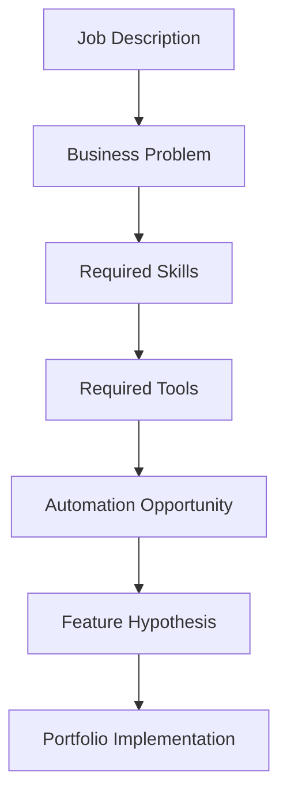

# Job Description Matrix

> **Status:** Living document · **Owner:** NAIGX Research · **Last updated:** `YYYY-MM-DD`

---

## Purpose

This document is the central research database for every job description analyzed during the NAIGX project.

Job postings are one of the few public artifacts where companies state, in writing, what work they cannot currently get done. Each posting is a signed admission of an unmet operational need — the tools already in use, the skills missing from the team, and the outcomes being paid for. Read individually, a posting is anecdote. Read in aggregate and structured consistently, postings become market intelligence.

The purpose of this document is to convert unstructured job postings into a structured, queryable dataset that guides NAIGX product decisions and portfolio priorities.

This document exists to answer questions such as:

| Question | What the answer drives |
| --- | --- |
| What business problems appear most frequently? | Core product positioning |
| Which software tools are most in demand? | Native integration roadmap |
| Which AI skills are becoming standard? | Feature baseline vs. differentiator |
| Which automation platforms are companies hiring for? | Build vs. connect strategy |
| Which integrations should NAIGX support first? | Sequencing of connector work |
| Which portfolio projects provide the highest ROI? | Where to spend build time |

It is deliberately a *living* document. Entries accumulate, the dashboard is recalculated, and conclusions are expected to shift as the sample grows. No decision should be made on a sample too small to support it.

---

## How This Document Is Used

Every job description contributes to NAIGX product development through four channels:

**1. Demand evidence.** A posting is a data point that a specific business problem is painful enough to pay a salary to solve. Frequency across postings is the primary demand signal used to rank features.

**2. Integration prioritization.** Tools, platforms, and APIs named in postings form the integration backlog. A tool mentioned repeatedly across independent companies moves ahead of a tool mentioned once, regardless of how interesting it is to build.

**3. Feature hypothesis generation.** Each posting produces at least one candidate feature hypothesis — a statement of what NAIGX could do to make part of the advertised role unnecessary or dramatically faster. Hypotheses accumulate; the ones that recur independently are the strongest.

**4. Portfolio direction.** Each posting suggests a demonstrable artifact — a workflow, dashboard, integration, or automation — that proves capability against a real, documented market need. Portfolio work is selected by priority score, not preference.

**Working rules:**

- One record per posting. Never merge two postings into one record.
- Record what the posting *says*, not what it probably means. Inference belongs in Product Insights, not in Technical Requirements.
- Preserve the original vocabulary. If a posting says "AI-driven reporting," capture that phrase before normalizing it.
- Archive the original posting text or a screenshot. Listings expire; the record must survive.
- Recalculate the Summary Dashboard on a fixed cadence, not opportunistically.

---

## Research Workflow

Every posting moves through seven stages. A record is not complete until all seven have been filled.



| Stage | Question answered | Output |
| --- | --- | --- |
| **1. Job Description** | What did the company actually publish? | Raw posting captured and archived with metadata |
| **2. Business Problem** | Why does this role exist? | The underlying operational gap, stated in business terms rather than task terms |
| **3. Required Skills** | What capability is being purchased? | Normalized skill list separating hard technical skills from process and domain skills |
| **4. Required Tools** | What stack does the work live inside? | Software, AI tools, automation platforms, APIs, and reporting surfaces |
| **5. Automation Opportunity** | Which parts of this role are rules-based, repetitive, or high-volume? | Specific tasks that a system could perform partly or fully |
| **6. Feature Hypothesis** | What could NAIGX build to address this? | A falsifiable statement of a capability and the outcome it produces |
| **7. Portfolio Implementation** | What artifact proves it? | A concrete, buildable deliverable with scope and effort estimate |

**Stage notes:**

- Stage 2 is the most commonly rushed and the most important. "Needs a data analyst" is a task. "Cannot see revenue by channel without three days of manual consolidation" is a business problem. Only the second is useful.
- Stage 5 should distinguish *full automation* (the task disappears) from *augmentation* (the task gets faster but still needs a human). These have very different product implications.
- Stage 6 must be falsifiable. A hypothesis that cannot be wrong is not a hypothesis.
- Stage 7 should be scoped to something completable, not aspirational.

---

## Summary Dashboard

> Recalculate on a fixed cadence. Do not update piecemeal — inconsistent refresh dates make trends unreadable.

**Last recalculated:** `YYYY-MM-DD` · **Sample size:** `N` · **Collection window:** `YYYY-MM-DD → YYYY-MM-DD`

### Coverage

| Metric | Value |
| --- | --- |
| Total Jobs Reviewed | `—` |
| Records Fully Validated | `—` |
| Records Pending Analysis | `—` |
| Distinct Companies | `—` |
| Distinct Industries | `—` |

### Industries

| Industry | Count | % of Sample | Notes |
| --- | --- | --- | --- |
| `—` | `—` | `—` | `—` |
| `—` | `—` | `—` | `—` |
| `—` | `—` | `—` | `—` |

### Most Requested Software

| Rank | Software | Mentions | % of Sample | Category |
| --- | --- | --- | --- | --- |
| 1 | `—` | `—` | `—` | `—` |
| 2 | `—` | `—` | `—` | `—` |
| 3 | `—` | `—` | `—` | `—` |

### Most Requested AI Platforms

| Rank | Platform | Mentions | % of Sample | Typical Use Case |
| --- | --- | --- | --- | --- |
| 1 | `—` | `—` | `—` | `—` |
| 2 | `—` | `—` | `—` | `—` |
| 3 | `—` | `—` | `—` | `—` |

### Most Requested Automation Platforms

| Rank | Platform | Mentions | % of Sample | Typical Use Case |
| --- | --- | --- | --- | --- |
| 1 | `—` | `—` | `—` | `—` |
| 2 | `—` | `—` | `—` | `—` |
| 3 | `—` | `—` | `—` | `—` |

### Most Requested APIs / Integrations

| Rank | API / Integration | Mentions | % of Sample | Direction (read / write / both) |
| --- | --- | --- | --- | --- |
| 1 | `—` | `—` | `—` | `—` |
| 2 | `—` | `—` | `—` | `—` |
| 3 | `—` | `—` | `—` | `—` |

### Most Requested Skills

| Rank | Skill | Mentions | % of Sample | Type (technical / process / domain) |
| --- | --- | --- | --- | --- |
| 1 | `—` | `—` | `—` | `—` |
| 2 | `—` | `—` | `—` | `—` |
| 3 | `—` | `—` | `—` | `—` |

### Highest Demand Business Problems

| Rank | Business Problem | Frequency | Avg. Business Impact | Candidate NAIGX Feature |
| --- | --- | --- | --- | --- |
| 1 | `—` | `—` | `—` | `—` |
| 2 | `—` | `—` | `—` | `—` |
| 3 | `—` | `—` | `—` | `—` |

### Highest Demand Workflows

| Rank | Workflow | Frequency | Automation Potential (full / partial / none) | Priority Score |
| --- | --- | --- | --- | --- |
| 1 | `—` | `—` | `—` | `—` |
| 2 | `—` | `—` | `—` | `—` |
| 3 | `—` | `—` | `—` | `—` |

---

## Job Description Record Template

> Copy this block for every posting. Do not delete unused fields — record `Not stated` so that gaps in the data remain visible and countable.

---

### `JD-000` — `Company` — `Job Title`

#### General Information

| Field | Value |
| --- | --- |
| Job ID | `JD-000` |
| Company | `—` |
| Job Title | `—` |
| Industry | `—` |
| Employment Type | `Full-time / Part-time / Contract / Freelance / Internship` |
| Location | `City, Country` + `On-site / Hybrid / Remote` |
| Salary | `Range + currency + period`, or `Not stated` |
| Source | `Job board / company site / referral / other` |
| Date Collected | `YYYY-MM-DD` |
| Link to Original Posting | `URL` |
| Archive Reference | `Path to saved copy or screenshot` |

---

#### Business Analysis

**Business Problems**

What operational gap caused this role to be opened? State in business terms, not task terms.

| # | Business Problem | Evidence from Posting |
| --- | --- | --- |
| 1 | `—` | `—` |
| 2 | `—` | `—` |

**Business Goals**

What outcome is the company trying to reach? Include stated targets and metrics where given.

- `—`
- `—`

**Current Pain Points**

Friction the posting reveals, whether stated directly or implied by the responsibilities listed.

| Pain Point | Stated or Inferred | Frequency / Volume (if given) |
| --- | --- | --- |
| `—` | `—` | `—` |
| `—` | `—` | `—` |

---

#### Technical Requirements

**Required Skills**

| Skill | Type (technical / process / domain) | Level (required / preferred) |
| --- | --- | --- |
| `—` | `—` | `—` |
| `—` | `—` | `—` |

**Required Software**

| Software | Category | Level (required / preferred) |
| --- | --- | --- |
| `—` | `—` | `—` |

**Required AI Tools**

| AI Tool / Platform | Stated Use Case | Level (required / preferred) |
| --- | --- | --- |
| `—` | `—` | `—` |

**Required Automation Platforms**

| Platform | Stated Use Case | Level (required / preferred) |
| --- | --- | --- |
| `—` | `—` | `—` |

**APIs / Integrations Mentioned**

| API / System | Direction (read / write / both) | Stated Purpose |
| --- | --- | --- |
| `—` | `—` | `—` |

**Reporting / Analytics Requirements**

| Requirement | Audience | Cadence | Delivery Format |
| --- | --- | --- | --- |
| `—` | `—` | `—` | `—` |

---

#### Product Insights

**Automation Opportunities**

| # | Task | Automation Potential (full / partial / none) | Rationale |
| --- | --- | --- | --- |
| 1 | `—` | `—` | `—` |

**AI Opportunities**

| # | Task | AI Role (generate / classify / extract / summarize / decide) | Rationale |
| --- | --- | --- | --- |
| 1 | `—` | `—` | `—` |

**Potential NAIGX Feature**

State as a falsifiable hypothesis.

> If NAIGX provided `—`, then `—` would be able to `—`, reducing `—`.

| Field | Value |
| --- | --- |
| Feature Name | `—` |
| Problem It Solves | `—` |
| Dependencies / Prerequisites | `—` |
| Related Existing Hypotheses | `JD-000`, `JD-000` |

**Portfolio Opportunity**

| Field | Value |
| --- | --- |
| Deliverable | `—` |
| Scope | `—` |
| Estimated Effort | `—` |
| What It Proves | `—` |
| Reusable Assets Produced | `—` |

**Scoring**

| Dimension | Score (1–5) | Justification |
| --- | --- | --- |
| Difficulty | `—` | `—` |
| Business Impact | `—` | `—` |
| Priority Score | `—` | `—` |

Scoring reference:

| Score | Difficulty | Business Impact | Priority |
| --- | --- | --- | --- |
| 1 | Trivial — hours, known tools | Marginal — convenience only | Backlog, revisit later |
| 2 | Low — days, minor unknowns | Small — one team benefits | Low |
| 3 | Moderate — weeks, some unknowns | Meaningful — measurable time or cost saved | Medium |
| 4 | High — significant unknowns or dependencies | Large — affects a core process | High |
| 5 | Very high — new capability required | Critical — addresses the stated reason the role exists | Build next |

> Priority is a judgment, not a formula. Difficulty and Business Impact inform it; recurrence across multiple records should raise it. Record the reasoning in the justification column.

---

#### Personal Notes

Free-form. Use for anything that does not fit the structure above: doubts about the data, patterns noticed, questions to investigate, language worth reusing, or reasons a record may be misleading.

```
—
```

---

## Validation Checklist

A record is not counted in the Summary Dashboard until every box is checked.

**Capture**

- [ ] Original posting archived (text or screenshot), independent of the live URL
- [ ] Job ID assigned and unique
- [ ] All General Information fields completed or marked `Not stated`
- [ ] Date Collected recorded

**Analysis**

- [ ] At least one business problem stated in business terms, not task terms
- [ ] Each business problem traceable to specific evidence in the posting
- [ ] Business goals recorded, including any stated metrics
- [ ] Pain points marked as stated or inferred

**Technical**

- [ ] Skills captured and classified as technical, process, or domain
- [ ] Software, AI tools, and automation platforms recorded separately, not merged
- [ ] Tool names normalized against the naming convention, with original phrasing preserved
- [ ] APIs and integrations listed with direction and purpose
- [ ] Reporting requirements captured with audience and cadence
- [ ] Required vs. preferred distinction recorded for each item

**Product**

- [ ] Automation opportunities classified as full, partial, or none
- [ ] AI opportunities distinguished from general automation
- [ ] At least one feature hypothesis written in falsifiable form
- [ ] Hypothesis cross-referenced against existing records for recurrence
- [ ] Portfolio deliverable scoped to something completable
- [ ] Difficulty, Business Impact, and Priority scored with written justification

**Integration**

- [ ] Summary Dashboard counters updated
- [ ] Cross-references added to related records
- [ ] Record marked complete with reviewer and date

**Reviewer:** `—` · **Completed:** `YYYY-MM-DD`

---

## Success Metrics

This document earns its place only if it changes decisions. The following measures indicate whether it is doing so.

### Signal quality

| Metric | Definition | Why it matters |
| --- | --- | --- |
| Sample size | Total validated records | Below roughly 20 records, ranking is noise |
| Industry spread | Distinct industries as % of sample | A single-industry sample produces single-industry conclusions |
| Company independence | Distinct companies ÷ total records | Multiple postings from one company inflate demand signals |
| Recurrence rate | % of feature hypotheses appearing in 3+ independent records | Recurrence is the strongest validation available here |
| Data completeness | % of fields recorded vs. marked `Not stated` | Reveals whether gaps are in the market or in the research |

### Decision impact

| Metric | Definition |
| --- | --- |
| Roadmap traceability | % of planned NAIGX features traceable to at least one record |
| Integration coverage | % of top-ranked tools with shipped or planned connectors |
| Portfolio alignment | % of portfolio projects mapped to a business problem with impact ≥ 4 |
| Prioritization accuracy | Retrospective comparison of predicted vs. observed impact of shipped features |

### How prioritization actually works

1. **Frequency establishes demand.** A problem appearing across many independent companies is real. A problem appearing once may be a single company's idiosyncrasy.
2. **Impact scores separate the significant from the merely common.** High frequency with low impact indicates a nuisance, not an opportunity.
3. **Difficulty converts opportunity into sequencing.** High impact and low difficulty is where work should start; high impact and high difficulty is where it should be planned.
4. **Integration demand orders connector work.** Tools appear in the roadmap in order of independent mention count, not in order of technical interest.
5. **Portfolio follows priority.** Build the artifacts that demonstrate the highest-priority capabilities, so that evidence of demand and evidence of capability point at the same thing.

### Known limitations

Record these alongside conclusions so the dataset is not over-read:

- Job postings describe *hiring* demand, not total demand. Problems solved internally, or tolerated silently, never appear.
- Postings are aspirational. Listed tools are sometimes wish lists rather than current stack.
- Collection is biased by where postings are sourced. Two job boards produce two different markets.
- Salary and location data are frequently absent or misleading.
- Recurrence within one industry is weaker evidence than recurrence across several.

---

## Appendix: Conventions

**Job ID format:** `JD-###`, assigned sequentially and never reused.

**Tool naming:** Use the vendor's official product name. Record the posting's original phrasing in Personal Notes where it differs, so that variant terminology remains searchable.

**Required vs. preferred:** Follow the posting's own framing. Where ambiguous, mark as preferred and note the ambiguity.

**Stated vs. inferred:** Anything not explicitly written in the posting is inferred and must be labeled as such. This distinction is what keeps the dataset trustworthy as it grows.

**Dates:** ISO 8601 (`YYYY-MM-DD`) throughout.