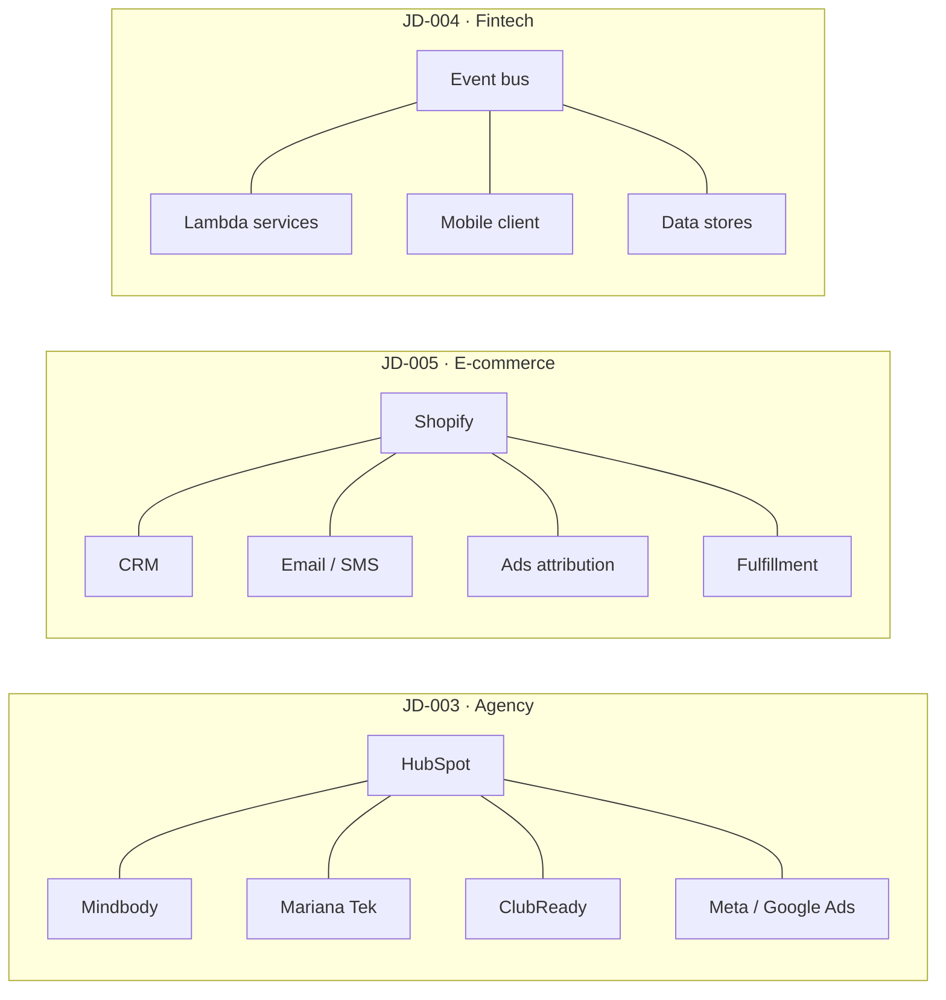
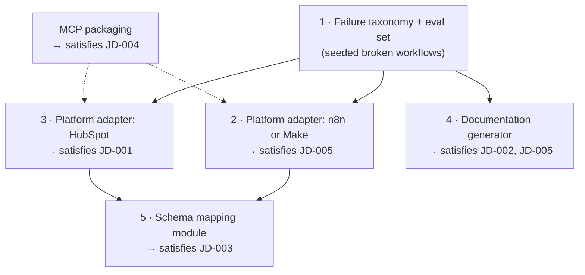

# Market Insights

**File:** `research/06-Market-Insights.md`
**Status:** Living Document — First Synthesis Pass
**Source Corpus:** `research/01-Job-Description-Matrix.md`, records `JD-001` → `JD-005`
**Sample Size:** 5 job postings · 1 source type
**Collection Window:** 2026-08-08 (single-day collection)
**Last Updated:** 2026-08-09

> This document synthesizes patterns across the five job descriptions currently in the Job Description Matrix. It does not summarize postings individually — each record already exists in full in `01-Job-Description-Matrix.md`. Every claim below cites the record IDs that support it.

---

## ⚠️ Read This First: Nothing Here Is Validated

`00-Market-Discovery.md` defines the validation threshold this project operates under:

| Level | Criteria | Actionable |
|---|---|---|
| 🔴 **Hypothesis** | Single source, or internal reasoning | No |
| 🟡 **Emerging Signal** | 3–5 independent sources of a **single** source type | Not yet — broaden source types |
| 🟢 **Validated Insight** | **5+ independent sources across at least 2 source types**, within 12 months | Yes |

This corpus consists of **five job postings — one source type**. Under the project's own canonical rules, **the maximum achievable level in this document is 🟡 Emerging Signal.** No finding here clears the bar for action.

Two further constraints weaken even the 🟡 labels:

1. **Independence is unverifiable.** Four of five records withhold the employer's identity. Research Principle 3 ("Independence over volume") cannot be satisfied by a corpus that cannot prove its sources are distinct.
2. **The matrix sets its own higher bar.** `01-Job-Description-Matrix.md` states that "below roughly 20 records, ranking is noise." At n=5, every frequency count below is directional, not quantitative.

Every finding is labeled with its level. Read the labels as the finding, not as decoration.

---

## Executive Summary

Five postings, five industries, five different job titles. They describe the same job.

Every record in the corpus hires **one person to own the connections between systems that were never designed to work together** — and then to keep those connections alive. The titles differ (Marketing Automation Lead, AI Automation Engineer, Digital & Automations Developer, QA Automation Engineer, Automation & Systems Integration Specialist) and the stacks share almost nothing, but the underlying purchase is identical in all five.

Three patterns hold across the entire corpus:

**1. Integration ownership is the product being bought (5/5).** Every posting centers on moving data correctly between systems — HubSpot to client CRMs (`JD-003`), Shopify to CRM to ads (`JD-005`), unnamed business systems to internal AI assistants (`JD-002`), services across an event bus (`JD-004`), or a GTM stack to itself (`JD-001`).

**2. The expensive part is not building the integration — it is operating it (4/5).** Postings ask for debugging, monitoring, error handling, observability, and scaling far more insistently than for initial construction. `JD-005` elevates failure handling from a responsibility to a *hiring evaluation criterion*. `JD-001` names "can debug a broken automation without panicking" as a qualification. This is the corpus's strongest and most surprising signal.

**3. Every posting is hiring the *first* owner of the discipline (5/5).** Language is uniformly foundational — "build the backbone" (`JD-001`), "primary point of contact" (`JD-002`), "lead and scale" (`JD-004`), "can they both design and implement?" (`JD-005`). None of these companies is replacing someone. The work is currently unowned.

The strategic implication for NAIGX is a repositioning, not a feature: the corpus does not describe a market that needs another way to *connect* tools. It describes a market that already connected its tools and cannot tell when those connections break.

---

## Recurring Business Problems

Ranked by frequency across the corpus. Frequency is the count of records in which the problem is stated or clearly implied.

| # | Business Problem | Records | Freq. | Level |
|---|---|---|---|---|
| 1 | Data does not move correctly between systems; integration work is unowned | `JD-001` `JD-002` `JD-003` `JD-004` `JD-005` | 5/5 | 🟡 |
| 2 | No single accountable owner for automation/integration as a discipline | `JD-001` `JD-002` `JD-003` `JD-004` `JD-005` | 5/5 | 🟡 |
| 3 | Systems fail and the failure is not detected, diagnosed, or explained quickly | `JD-001` `JD-002` `JD-003` `JD-004` `JD-005` | 5/5 | 🟡 |
| 4 | Reporting and operational visibility require manual assembly | `JD-001` `JD-002` `JD-003` `JD-005` | 4/5 | 🟡 |
| 5 | Automations are not expected to survive growth without redesign | `JD-001` `JD-003` `JD-004` `JD-005` | 4/5 | 🟡 |
| 6 | Systems are undocumented, creating key-person dependency | `JD-001` `JD-002` `JD-005` | 3/5 | 🟡 |
| 7 | Data quality/hygiene is unmanaged at the point of entry | `JD-001` `JD-003` `JD-005` | 3/5 | 🟡 |
| 8 | Spend cannot be traced to revenue (attribution is broken) | `JD-001` `JD-005` | 2/5 | 🔴 |
| 9 | The same integration must be rebuilt for each new client/target system | `JD-003` `JD-005` | 2/5 | 🔴 |

### A definitional correction

The matrix's own Personal Notes contain an inconsistency worth resolving rather than inheriting. `JD-004`'s notes claim failure diagnosis appears in "four of four" records; `JD-005`'s notes claim "four of five," omitting `JD-002`. Both were counting different things.

Resolved here:

| Reading | Count | Records |
|---|---|---|
| **Diagnosing system failures** (broad) | 5/5 | All — `JD-002` states "Troubleshoot AI-related issues and optimize existing solutions" |
| **Diagnosing *automation/integration workflow* failures** (narrow) | 4/5 | `JD-001` `JD-003` `JD-004` `JD-005` — `JD-002`'s troubleshooting object is AI assistants, not workflows |

Both readings are recorded because they support different product conclusions. The broad reading justifies a general diagnostic capability; the narrow reading justifies a workflow-specific one. The corpus does not yet distinguish which is the better bet.

### Why problem #3 is the corpus's central finding

The evidence is unusually direct, and it appears in postings with nothing else in common:

| Record | Evidence | Framing |
|---|---|---|
| `JD-001` | "Can debug a broken automation without panicking" | Listed as a **hiring qualification** |
| `JD-002` | "Troubleshoot AI-related issues and optimize existing solutions" | Core responsibility |
| `JD-003` | "Troubleshoot technical issues… ensuring minimal downtime and optimal system performance" | Core responsibility |
| `JD-004` | "Improve observability, testability, and release quality"; AI used to "accelerate testing and debugging" | Core responsibility + stated AI use case |
| `JD-005` | "Strong error handling, monitoring, and documentation"; "how they handled API errors or scaling issues" | Responsibility **and evaluation criterion** |

Two of five postings promote failure handling out of the responsibilities list and into the *selection* criteria. That is a stronger signal than a responsibility bullet: it indicates the companies believe this specific capability is the scarce one.

---

## Common Technical Requirements

Normalized across records. "Required" reflects each posting's own framing.

| Requirement | Records | Freq. | Depth Requested | Level |
|---|---|---|---|---|
| API / webhook integration | `JD-001` `JD-002` `JD-003` `JD-004` `JD-005` | 5/5 | Required in all five | 🟡 |
| Troubleshooting & debugging | `JD-001` `JD-002` `JD-003` `JD-004` `JD-005` | 5/5 | Required in all five | 🟡 |
| Remote work / async operation | `JD-001` `JD-002` `JD-003` `JD-004` `JD-005` | 5/5 | Required in all five | 🟡 |
| Autonomy / independent ownership | `JD-002` `JD-003` `JD-004` `JD-005` | 4/5 | Required | 🟡 |
| Written & verbal English proficiency | `JD-002` `JD-003` `JD-004` `JD-005` | 4/5 | Explicitly required | 🟡 |
| Workflow/automation construction | `JD-001` `JD-002` `JD-003` `JD-005` | 4/5 | Required | 🟡 |
| Data manipulation / transformation | `JD-001` `JD-002` `JD-004` `JD-005` | 4/5 | Required | 🟡 |
| Documentation as a deliverable | `JD-001` `JD-002` `JD-005` | 3/5 | Required | 🟡 |
| Reporting / analytics construction | `JD-001` `JD-002` `JD-003` `JD-005` | 4/5 | Required | 🟡 |
| Deep software engineering (full-stack or test architecture) | `JD-003` `JD-004` | 2/5 | Required | 🔴 |
| Light scripting only | `JD-002` `JD-003` `JD-005` | 3/5 | **Preferred, not required** | 🟡 |
| SQL / direct data querying | `JD-001` `JD-002` | 2/5 | Required (`JD-001`), preferred (`JD-002`) | 🔴 |

### The most useful finding in this section

**Deep programming ability is not what most of this market is buying.** Three of five records (`JD-002`, `JD-003`, `JD-005`) list scripting as *preferred* while listing API literacy, webhooks, JSON, and platform proficiency as *required*. Only `JD-004` (a senior QA engineering role) demands deep language expertise as a hard requirement.

The capability actually being purchased in the majority of the corpus is **systems literacy** — understanding how systems talk to each other, why a payload failed, and where data is wrong — not software construction. `JD-001` states this almost explicitly: it wants someone who "understands how systems talk to each other" and specifies the requirement as non-coding.

This matters for NAIGX product design: the user in 4/5 of these records is a technically-literate operator, not a software engineer. A capability that requires writing code to use would not serve the majority of this corpus.

---

## Frequently Requested Software & Platforms

### ⚠️ Why raw mention counts are misleading here

`JD-004` names roughly 30 specific products. `JD-002` names almost none, describing tool *categories* instead ("workflow automation tools," "data engineering/ETL tools," "cloud-based AI services"). Ranking tools by raw mentions therefore ranks them by **the engineering maturity of the company that posted**, not by market demand.

Both metrics are reported below. The category metric is the more honest one at this sample size.

### Named tools by record count

| Tool | Records | Freq. | Category | Level |
|---|---|---|---|---|
| **HubSpot** | `JD-001` `JD-003` `JD-005` | 3/5 | CRM / Marketing Automation | 🟡 |
| Claude | `JD-002` `JD-004` | 2/5 | AI / LLM | 🔴 |
| Make.com | `JD-003` `JD-005` | 2/5 | Automation platform | 🔴 |
| Zapier | `JD-003` `JD-005` | 2/5 | Automation platform | 🔴 |
| Amplitude | `JD-001` `JD-004` | 2/5 | Product analytics | 🔴 |
| Everything else | 1 record each | 1/5 | — | 🔴 |

Single-mention tools include: Salesforce, Zoho, Close, Shopify, Mindbody, Mariana Tek, ClubReady, n8n, WordPress, Next.js, BaseDash, Meta Ads, Google Ads, GA4, OpenAI, LangChain, Cursor, MCP, ChatGPT, Jest, PactumJS, Maestro, Detox, the AWS serverless suite, React Native, Expo, Sentry, Better Stack, RudderStack, Microsoft Office, Google Workspace.

**HubSpot is the only tool appearing in a majority of records** — and its centrality varies: it is the system of record in `JD-001` and `JD-003`, but merely first among four interchangeable CRMs in `JD-005`. Mentions should be weighted by centrality, not counted flat.

### Category coverage — the better metric

"Did this record name *any* specific product in this category?"

| Category | Records naming a product | Coverage | Notes |
|---|---|---|---|
| CRM / system of record | `JD-001` `JD-003` `JD-005` | 3/5 | Absent from both engineering-led records |
| AI / LLM tool | `JD-002` `JD-004` `JD-005` | 3/5 | But only 2/5 attach a task — see AI Trends |
| Automation platform | `JD-003` `JD-005` | 2/5 | `JD-002` wanted one and named none |
| Analytics / observability | `JD-001` `JD-004` `JD-005` | 3/5 | Three unrelated purposes; not a coherent category yet |
| Advertising / attribution | `JD-003` `JD-005` | 2/5 | Both marketing-side records |

### Interpretation

The corpus is **stack-fragmented but problem-uniform**. Thirty-plus distinct products across five postings, with only one product appearing in a majority — yet the business problems converge tightly. This is the strongest available argument that NAIGX should invest in **capabilities that are portable across stacks** rather than in deep single-vendor integrations. A capability tied to HubSpot serves at most 3/5 of this corpus; a capability tied to failure diagnosis serves 5/5.

---

## AI & Automation Trends

### Trend 1 — AI is requested more often than it is specified (🟡, 4/5)

| Record | AI capability requested? | AI tool named? | Tool tied to a task? |
|---|---|---|---|
| `JD-001` | ❌ No AI mention at all | — | — |
| `JD-002` | ✅ Core to the role | ✅ Claude, ChatGPT | ✅ Yes |
| `JD-003` | ✅ "Create and manage AI automations" | ❌ None named | ❌ No |
| `JD-004` | ✅ Core to the role | ✅ Claude, Cursor, MCP | ✅ Yes |
| `JD-005` | ✅ Bonus qualification | ✅ OpenAI, LangChain | ❌ No use case attached |

Four of five records want AI. Three name a tool. **Only two connect a specific tool to a specific task** — and both are the records with the most technically mature postings overall (`JD-002`, `JD-004`).

`JD-003` and `JD-005` are inverse failures of specificity: `JD-003` requires "AI automations" while naming no tool; `JD-005` names OpenAI and LangChain while attaching no task. Both patterns suggest AI is functioning partly as **keyword signaling** rather than a specified requirement. At n=5 this is an observation, not a conclusion — but it is a caution against reading AI mention counts as AI demand.

### Trend 2 — The AI work requested is diagnostic and generative-support, never autonomous (🟡, 4/5)

Aggregating every AI opportunity identified across the matrix, the requested roles cluster narrowly:

| AI role | Instances across corpus | Example |
|---|---|---|
| Diagnose / classify failures | `JD-001` `JD-002` `JD-003` `JD-004` `JD-005` | Root-cause a failed workflow run |
| Generate artifacts (tests, docs, coverage) | `JD-002` `JD-004` `JD-005` | Generate test coverage (`JD-004`, stated) |
| Summarize for humans | `JD-001` `JD-002` `JD-003` | Leadership reporting narrative |
| Map / extract across schemas | `JD-003` `JD-005` | Field mapping to an unfamiliar CRM |
| **Decide and act autonomously in production** | **0 records** | — |

**No record in the corpus asks for autonomous AI decision-making.** Every stated AI use case terminates in a human reading, approving, or acting on the output. For a product positioned as an "AI Operating System," this is a direct design constraint: the evidence supports AI as an *explanatory and drafting* layer, not an *executive* one.

### Trend 3 — Automation work has shifted from building to operating (🟡, 4/5)

Every record that names automation also names maintaining it:

| Record | Build language | Operate language |
|---|---|---|
| `JD-001` | "build the backbone of data" | "debug a broken automation without panicking" |
| `JD-003` | "Build and maintain API integrations" | "minimal downtime and optimal system performance" |
| `JD-004` | "Design, build, and maintain… frameworks" | "observability, testability, and release quality" |
| `JD-005` | "Build and maintain workflows" | "error handling, monitoring, documentation… scale as the business grows" |

The verb "maintain" appears alongside "build" in three of four. `JD-005` is the clearest case: five of its seven responsibilities concern operating existing automations rather than creating new ones.

### Trend 4 — Possible stratification among automation platforms (🔴, 2/5)

`JD-005` requires Make.com and n8n while explicitly demoting Zapier to "optional." `JD-003` requires Zapier and lists Make as preferred. This is the only direct comparison available and points weakly toward Make/n8n for more technical integration work, with Zapier positioned as the lighter-weight option. **Two records cannot support a platform trend.** Recorded to be tested, not relied upon.

### Trend 5 — AI acceleration as a source of downstream QA demand (🔴, 1/5)

`JD-004` is the only record where the hire appears to exist partly *because* AI made the rest of engineering faster: the posting frames acceleration as the context for the role ("redefining what quality engineering looks like in an AI-accelerated future") rather than as its solution. If this recurs it describes a specific and unusual market — companies buying verification capacity to offset AI-driven generation capacity. **One record. Pure hypothesis.** Flagged because it would be a distinctive thesis if confirmed, not because it is currently supported.

---

## Integration Patterns

### Pattern A — Hub-and-spoke topology (🟡, 4/5)

Four of five records describe a single system of record at the center, with spokes to peripheral tools. The hub differs; the shape does not.

`JD-004` is the same topology expressed in infrastructure rather than SaaS — an event bus is a hub with spokes. `JD-002` is the exception: it describes integration work without naming a hub, consistent with the matrix's assessment that it is the least mature posting in the corpus.

### Pattern B — The N-th target problem (🔴, 2/5)

`JD-003` names three client CRMs plus "and similar platforms." `JD-005` names four CRMs plus "etc." In both cases the integration is *conceptually identical* each time and *mechanically different* each time, because each target exposes a different schema for the same entities.

This is the cleanest automation opportunity in the corpus — the repeated work is schema correspondence, which is inference, not construction — but it appears in only two records, both of which are agency/intermediary contexts. **It may be a property of agency business models rather than a general market pattern.** That distinction is untestable at n=5.

### Pattern C — Integrations are bidirectional, not read-only (🟡, 5/5)

Nearly every integration recorded across the matrix is marked read+write. The corpus is describing **synchronization**, not reporting extraction. This materially raises the difficulty profile: bidirectional sync introduces conflict resolution, idempotency, and ordering problems that a read-only integration never encounters — problems `JD-004` names explicitly ("retries, idempotency, and edge-case handling") and `JD-005` implies through "error handling" and "scale."

### Pattern D — Closed-loop measurement remains unsolved (🔴, 2/5)

`JD-001` requires UTM/attribution modeling and states that leadership cannot see "where demand actually comes from." `JD-005` requires "closed-loop reporting" spanning storefront, CRM, messaging, and ads, with GA4 server-side tagging as a preferred mechanism. Both are marketing-side records; both describe the same unsolved join between spend and revenue.

---

## Market Opportunities

Opportunities are ranked by corpus frequency, then by whether the underlying work is inference-based (automatable) or judgment-based (not).

| # | Opportunity | Supporting records | Freq. | Nature of work | Level |
|---|---|---|---|---|---|
| 1 | **Failure detection, classification, and root-cause explanation for automations and integrations** | `JD-001` `JD-003` `JD-004` `JD-005` (+`JD-002` broadly) | 4–5/5 | Pattern classification over run history — inference-based | 🟡 |
| 2 | **Documentation generated from live system definitions** | `JD-001` `JD-002` `JD-005` | 3/5 | Transformation of structured input — inference-based | 🟡 |
| 3 | **Operational reporting assembly** | `JD-001` `JD-002` `JD-003` `JD-005` | 4/5 | Aggregation + summarization — partly inference-based | 🟡 |
| 4 | **Schema/field mapping to unfamiliar target systems** | `JD-003` `JD-005` | 2/5 | Correspondence inference — inference-based | 🔴 |
| 5 | **Data hygiene enforcement at point of entry** | `JD-001` `JD-003` `JD-005` | 3/5 | Rule execution + exception judgment — mixed | 🟡 |
| 6 | **Closed-loop attribution** | `JD-001` `JD-005` | 2/5 | Identity resolution — hard, error-prone | 🔴 |
| 7 | Architecture, platform selection, quality standards | `JD-004` `JD-005` | 2/5 | **Judgment-based — explicitly not automatable** | 🔴 |

### The gate that has not been cleared

`00-Market-Discovery.md` requires that "the Competitive Landscape Map has been checked to confirm the problem is not already well-solved" before an opportunity advances.

**`research/05-Competitor-Research.md` is currently empty.** That gate is unmet for every opportunity above.

This matters most for Opportunity #1. Make.com and n8n both ship execution history and error-handling primitives, and third-party workflow monitoring tools exist. The corpus proves companies are *paying salaries* for this work — it does not prove existing tooling fails to address it. **Competitor research is the blocking prerequisite before any build decision**, and it is a more urgent next step than collecting more postings.

---

## Portfolio Opportunities

Each matrix record proposes a deliverable. Read together, they share components — which changes the correct build order.

| Source | Proposed deliverable | Matrix priority |
|---|---|---|
| `JD-001` | HubSpot workflow diagnostic copilot | 3 (Medium) |
| `JD-002` | Claude assistant starter kit + generated documentation | 3 (Medium) |
| `JD-003` | Multi-CRM connector hub with AI-assisted field mapping | 4 (High) |
| `JD-004` | QA coverage MCP server (schema-driven test generation) | 4 (High) |
| `JD-005` | Automation reliability layer for Make.com / n8n | 5 (Build next) |

### Shared components across the five deliverables

| Component | Required by | Records |
|---|---|---|
| Failure classification taxonomy + evaluation set | 3 deliverables | `JD-001` `JD-003` `JD-005` |
| Documentation generator from structured definitions | 2 deliverables | `JD-002` `JD-005` |
| Schema inspection & field mapping | 2 deliverables | `JD-003` `JD-005` |
| Platform API client / ingestion adapters | 4 deliverables | `JD-001` `JD-003` `JD-004` `JD-005` |
| MCP server scaffold | 1 deliverable, reusable by all | `JD-004` |

### Sequencing recommendation

`JD-001`'s HubSpot diagnostic copilot and `JD-005`'s reliability layer are **the same capability applied to different platforms**. Building the failure taxonomy once, then adding platform adapters, serves both — and covers the corpus's highest-frequency problem.

**Build order rationale:** step 1 is the reusable asset and the hardest to get right (a taxonomy that generalizes rather than overfitting to seeded examples). Steps 2–3 each convert it into a record-satisfying deliverable at low marginal cost. Step 5 is deferred because the N-th target problem is 🔴 at 2/5. MCP packaging is a distribution decision, not a capability — it applies to whatever is built.

---

## Product Recommendations for NAIGX

> **Scope note.** `00-Market-Discovery.md` states that research documents describe the problem space and that interfaces, schemas, and architectures belong in design documents. This section was explicitly requested, so it is delivered — but deliberately confined to positioning and sequencing. No interface, schema, or architecture is proposed here.

### 1. Reposition from connection to reliability

NAIGX's stated mission is to connect existing tools rather than replace them. The corpus supports that choice and sharpens it: **the connections in these companies already exist. What is missing is the ability to tell when they break and why.**

Four of five records pay a salary for operating integrations; the same four already run the connective tooling (Make, n8n, Zapier, HubSpot workflows, event buses). NAIGX competing as another connector enters a crowded category against incumbents named throughout this corpus. NAIGX as the **reliability and legibility layer over connectors already in place** targets the problem the corpus actually describes.

### 2. Build capabilities that are portable across stacks, not deep into any single vendor

Thirty-plus distinct products across five postings; exactly one appears in a majority. A HubSpot-specific capability addresses at most 3/5 of this corpus. A failure-diagnosis capability addresses 5/5. **Portability is the higher-leverage investment at current sample composition** — and this conclusion should be re-tested as the corpus grows, since a larger sample may reveal genuine tool concentration that n=5 conceals.

### 3. Design for the technically-literate operator, not the software engineer

In 3/5 records, scripting is *preferred* while API and platform literacy are *required*. The person doing this work reads payloads and understands system behavior but is not primarily a programmer. A capability requiring code to operate would exclude the majority of the corpus's actual users.

### 4. Treat explanation as the deliverable, not action

Zero records request autonomous AI decision-making. Every stated AI use case ends with a human reading or approving the output. The defensible product claim supported by this evidence is *"NAIGX tells you what broke and why,"* not *"NAIGX fixes it."* Autonomy can be revisited when evidence for it appears; currently there is none.

### 5. Treat documentation generation as a bundled by-product, not a product

Three of five records name documentation as standing work, but no record hires *for* documentation. It is consistently a burden attached to another job. It is well-suited to generation from structured definitions and should ride along with the reliability capability rather than being positioned independently.

### 6. Do the competitor research before building anything

The strongest opportunity in this corpus (#1) has never been checked against existing tooling. Per the project's own gates, it cannot advance until it is. **This is the single highest-value next action in the research program** — higher than collecting additional postings, because it can invalidate the corpus's leading conclusion at low cost.

---

## Key Takeaways

1. **Five postings across five industries describe one job:** owning the connections between systems, and keeping them working. Titles and stacks diverge; the purchased capability does not. (5/5, 🟡)

2. **Operating automations is the scarce skill, not building them.** Two records promote failure handling into hiring *selection* criteria. This is the corpus's strongest and least expected signal. (4–5/5, 🟡)

3. **Every posting is hiring a first owner.** None replaces an incumbent. The discipline is unowned in all five organizations. (5/5, 🟡)

4. **AI is requested more often than it is specified.** Four want it, three name a tool, two connect a tool to a task. Treat AI mention counts as weak evidence of AI demand. (4/5, 🟡)

5. **Nobody is asking for autonomous AI.** Every AI use case in the corpus terminates in human review. (5/5 absence, 🟡)

6. **Stacks fragment; problems converge.** 30+ products, one appearing in a majority — but tightly clustered business problems. Favor portable capabilities over vendor-deep ones. (🟡)

7. **The corpus cannot yet support a decision.** One source type, n=5, four of five employers anonymous, and the competitor gate unmet. Under this project's own rules, nothing here is actionable. (Structural)

---

## Known Limitations & Bias

Recorded per the Definition of Done in `00-Market-Discovery.md`, item 6.

| # | Limitation | Effect on conclusions |
|---|---|---|
| 1 | **Single source type.** All evidence is job postings. | Caps every finding at 🟡. No 🟢 Validated Insight is possible until community, review, or documentation evidence corroborates. |
| 2 | **n=5.** The matrix itself sets ~20 records as the point where ranking stops being noise. | All frequency counts are directional only. A single additional record shifts every percentage by 20 points. |
| 3 | **Company independence unverifiable.** Only `JD-005` names an employer (Shoe Zero). | Research Principle 3 cannot be satisfied. Two records could share an employer undetected. |
| 4 | **Possible sourcing concentration.** `JD-003` and `JD-004` share a reference-number format; `JD-005` uses a shorter variant. | Suggests multiple records may originate from one board or aggregator, which would narrow the effective sample further. |
| 5 | **Recruiter intermediation.** At least 3/5 records (`JD-001`, `JD-003`, `JD-005`) are written by intermediaries. | Tool lists may be recruiter paraphrase rather than the employer's actual stack. Weakens all tool-frequency data specifically. |
| 6 | **`JD-001` authenticity flagged.** The matrix flags it as possibly non-genuine (though `JD-005` later weakened that reading). | Excluding it drops the corpus to n=4 and removes one of three HubSpot mentions. No conclusion above depends solely on `JD-001`. |
| 7 | **Industry labels are unusable as recorded.** `JD-003` is labeled "Media" (a fitness/wellness agency); `JD-005` is labeled "Information Technology" (e-commerce). | Labels describe the job board's taxonomy, not the business. Any industry-spread metric built on them will be wrong. |
| 8 | **Salary data is not analyzable.** Only 3/5 state a range; those mix offshore ($1,200–$2,500) and mid-tier ($4,000–$5,000) markets. | No compensation conclusions are drawn anywhere in this document. |
| 9 | **Postings are aspirational.** Named tools may be wish lists. `JD-003` in particular pairs an extremely broad stack with the corpus's lowest salary band. | Tool presence indicates interest, not confirmed production usage. |
| 10 | **Collection window is a single day.** All five records collected 2026-08-08. | No temporal trend can be inferred. "Trends" in this document are cross-sectional patterns, not movements over time. |
| 11 | **Competitor gate unmet.** `05-Competitor-Research.md` is empty. | No opportunity in this document has been checked against existing solutions. Opportunity #1 is the most exposed. |

---

## Next Steps

Ordered by value, not by convenience.

1. **Populate `05-Competitor-Research.md` for the automation-reliability category.** Blocking gate for the corpus's leading opportunity. Cheapest possible invalidation of the strongest conclusion.
2. **Add a second source type.** Community discussion and product reviews for Make.com, n8n, Zapier, and HubSpot workflows — specifically searching for failure, debugging, and monitoring complaints. This is what converts 🟡 → 🟢.
3. **Verify feasibility.** Confirm that Make.com and n8n expose execution history and workflow definitions sufficient to support the reliability capability. Recorded as unverified in `JD-005`.
4. **Grow the corpus toward 20 records,** deliberately sampling employers that publish their own postings, to repair the company-independence defect.
5. **Fix the industry taxonomy** in the matrix — record both the board label and the assessed vertical as a standing convention (already done ad hoc in `JD-003` and `JD-005`).
6. **Then, and only then, recalculate the Summary Dashboard** in `01-Job-Description-Matrix.md`, which remains deliberately untouched.

---

*This document is a living synthesis. It will be revised as the corpus grows and as source types broaden. Every conclusion above is provisional by design — the labels are the finding.*
